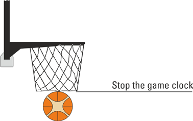
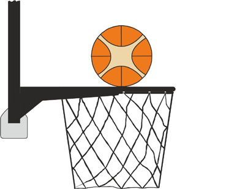
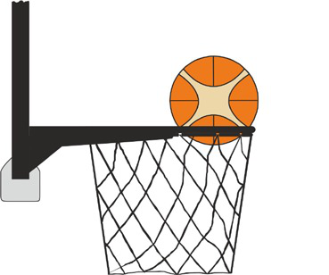
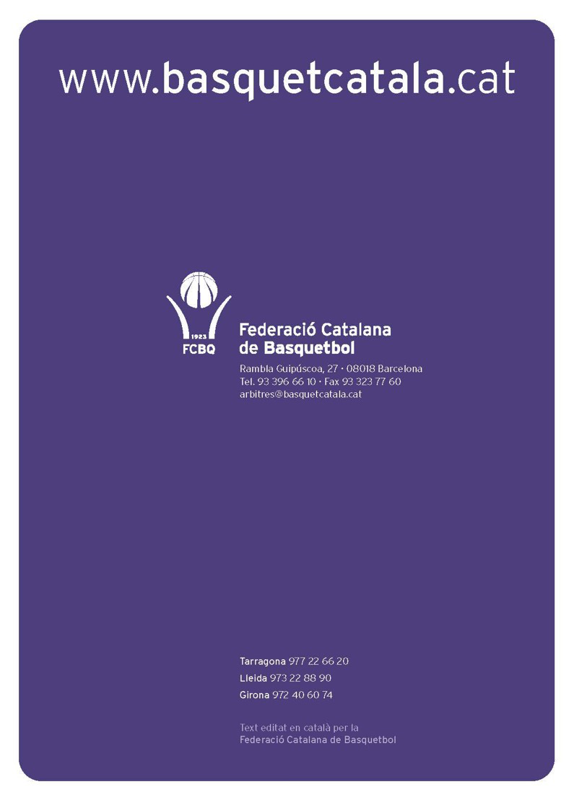

Les interpretacions que es presenten en aquest document són les Interpretacions Oficials FIBA de les Regles Oficials de Basquetbol 2024 i entren en vigor l’1 d’octubre de 2024. Aquest document substitueix a totes les Interpretacions Oficials FIBA publicades anteriorment.

Qualsevol referència que es faci en aquestes Interpretacions de les Regles Oficials de Basquetbol a un jugador, entrenador, àrbitre, etc. en gènere masculí s'aplica a tots els gèneres. S'ha d'entendre que això es fa només per raons pràctiques.

# Introducció

Les Regles Oficials de Basquetbol FIBA s'aproven pel Comitè Central de FIBA i es revisen periòdicament per la Comissió Tècnica de FIBA.

Les regles es mantenen de la manera més clara i entenedora possible, però expressen principis més que situacions de joc. No obstant això, no poden abastar la gran varietat de casos específics que poden ocórrer durant un partit de bàsquet.

L'objectiu d'aquest document és convertir els principis i conceptes de les Regles Oficials de Basquetbol FIBA en situacions pràctiques i específiques de la manera en què podrien ocórrer durant un partit de basquetbol.

Les interpretacions de les diverses situacions poden estimular les ments dels àrbitres i complementaran un estudi detallat de les regles.

Les Regles Oficials de Basquetbol FIBA continuaran sent el principal document que regula el bàsquet FIBA. No obstant això, els àrbitres tenen tot el poder i autoritat per adoptar decisions sobre qualsevol punt que no estigui recollit expressament en les Regles Oficials de Basquetbol FIBA o en aquestes Interpretacions Oficials FIBA.

Per a una millor consistència d'aquestes Interpretacions, "l’equip A" és l'equip que ataca (inicialment) i "l’equip B" és l'equip que defensa. A1-A5 i B1-B5 són jugadors; A6-A12 i B6-B12 són substituts.

# Article 4 Equips

### 4-1

**Situació:** Tots els jugadors de l'equip han de tenir totes les seves peces de roba de compressió de braços i cames, canelleres, cintes pel cabell i cintes adhesives del mateix color sòlid.

### 4-2

**Exemple:** A1 porta una cinta pel cabell blanca i A2 porta una cinta pel cabell vermella a la pista.

**Interpretació:** No es permet que A1 i A2 portin cintes pel cabell de diferents colors.

### 4-3

**Exemple:** A1 porta una cinta pel cabell blanca i A2 porta una canellera vermella a la pista.

**Interpretació:** No es permet que A1 porti una cinta pel cabell blanca i que A2 porti una canellera vermella.

### 4-4

**Situació:** No està permès utilitzar cinta pel cabell d’estil bufanda, tal i com els descrits en el següent diagrama.

*Figura 1:*

Exemples de cintes pel cap d’estil bufanda

### 4-5

**Exemple:** A1 porta una cinta pel cabell d’estil bufanda del mateix color sòlid que qualsevol altre equipament addicional dels seus companys d’equip. **Interpretació:** A1 no pot portar una cinta pel cabell d’estil bufanda. La cinta pel cabell no tindrà elements d’obertura / tancament al voltant del cap i no tindrà cap part que sobresurti de la seva superfície.

### 4-6

**Exemple:** A6 demana una substitució. Els àrbitres observen que A6 vesteix una samarreta amb mànigues que no és de compressió sota la samarreta de joc.

**Interpretació:** La substitució no es pot concedir. Només es poden dur peces de vestir de compressió sota l’uniforme de joc.

### 4-7

**Exemple:** A6 vesteix una peça de roba de compressió sota dels pantalons amb una llargària (a) Fins els genolls (b) Fins els turmells

**Interpretació:** Les peces de roba de compressió (escalfadors) són legals i es poden vestir amb qualsevol llargada. Tots els jugadors d’un equip han de portar totes les seves peces de roba de compressió, incloent samarretes interiors, escalfadors, canelleres, cintes pel cabell i cintes adhesives del mateix color sòlid.

### 4-8

**Exemple:** A6 vesteix una peça de roba de compressió (samarreta interior) sota la samarreta de joc amb una llargària (a) Fins les espatlles (b) Fins el coll

**Interpretació:** Les peces de roba de compressió (samarretes interiors) són legals i es poden vestir

(a) Amb qualsevol llargada fins les espatlles i més enllà d’elles.

(b) Fins la part més baixa del coll.

Tots els jugadors d’un equip han de portar totes les seves peces de roba de compressió, incloent samarretes interiors, escalfadors, canelleres, cintes pel cabell i cintes adhesives del mateix color sòlid.

# Article 5 Jugadors: Lesió i assistència

### 5-1

**Situació:** Si un jugador es lesiona, sembla estar lesionat o necessita rebre assistència i, com resultat, qualsevol persona amb permís per seure a la banqueta d'equip (entrenador, primer ajudant d'entrenador, substituts, jugadors eliminats o acompanyants membres de la delegació del mateix equip) entra a la pista, es considera que aquest jugador ha rebut tractament o assistència, hagi estat administrat o no aquest tractament o assistència.

### 5-2

**Exemple:** A1 sembla tenir el turmell lesionat i s'atura el partit. De l'equip A

(a)  el metge entra a la pista i tracta el turmell lesionat d’A1.

(b)  el metge entra a la pista però A1 ja s'ha recuperat.

(c)  l'entrenador entra a la pista per buscar al seu jugador lesionat.

(d)  el primer ajudant d'entrenador, un substitut o qualsevol altre acompanyant membre de la delegació entra a la pista però no tracten a A1.

**Interpretació:** En tots els casos, A1 va rebre un tractament i serà substituït.

### 5-3

**Exemple:** El fisioterapeuta de l’equip A entra a la pista i arregla un embenat solt d’A1.

**Interpretació:** A1 va rebre assistència i serà substituït.

### 5-4

**Exemple:** El metge de l’equip A entra a la pista per trobar una lent de contacte perduda d’A1.

**Interpretació:** A1 va rebre assistència i serà substituït.

### 5-5

**Situació:** Qualsevol persona amb permís per seure a la banqueta d'equip, mentre roman en l'àrea de banqueta del seu equip, pot proporcionar assistència a un jugador del seu propi equip. Si l'assistència no retarda el partit perquè pugui ser reiniciat immediatament, no es considera que aquest jugador hagi rebut assistència i no haurà de ser substituït.

### 5-6

**Exemple:** B1 fa falta a A1, durant la seva acció de tir, a prop de l'àrea de banqueta de l'equip A. La pilota no entra a la cistella. Mentre A1 està llançant 2 o 3 tirs lliures

(a)  El manager de l'equip A o A6, des de la seva àrea de banqueta d'equip, passen una tovallola, una ampolla d'aigua o una cinta pel cabell a qualsevol altre jugador a la pista de l'equip A.

(b)  El fisioterapeuta de l'equip A, des de la seva àrea de banqueta d'equip, arregla un embenat solt, posa esprai a la cama, dóna un massatge al coll, etc. d’un jugador a la pista de l'equip A.

**Interpretació:** En cap dels dos casos, el jugador de l'equip A han rebut una assistència que evita que el partit es reprengui immediatament. El jugador de l'equip A no haurà de ser substituït. A1 continuarà intentant el llançament dels 2 o 3 tirs lliures.

### 5-7

**Exemple:** B1 fa falta a A1, durant la seva acció de tir, a prop de l'àrea de banqueta de l'equip A. La pilota no entra a la cistella. Després de la falta, A1 cau a la pista i dins de l'àrea de banqueta del seu equip A6 l’ajuda a posar-se dret. A1 està a punt per jugar immediatament, com a màxim en menys d'aproximadament 15 segons.

**Interpretació:** A1 no ha rebut una assistència que retardi el partit perquè es pugui reprendre puntualment. A1 no haurà de ser substituït. A1 llançarà 2 o 3 tirs lliures.

### 5-8

**Exemple:** Es concedeixen 2 tirs lliures a A1. Mentre l'àrbitre comunica la falta a la taula d’auxiliars, A1 s’apropa davant de l'àrea de banqueta del seu equip a la part més allunyada de la pista i demana una tovallola o una ampolla d'aigua. Qualsevol persona des de l'àrea de banqueta del seu equip li passa a A1 una tovallola o una ampolla d'aigua. A1 seca les seves mans o pren un glop. A1 està a punt per jugar immediatament, com a màxim en menys d'aproximadament 15 segons.

**Interpretació:** A1 no ha rebut una assistència que retardi el partit perquè es pugui reprendre puntualment. A1 no haurà de ser substituït.A1 llançarà 2 tirs lliures.

### 5-9

**Exemple:** A1 aconsegueix una cistella. B1, qui serveix de fons, informa l'àrbitre que la pilota està mullada. L'àrbitre atura el partit. Una persona de l'àrea de banqueta de l'equip B entra a la pista i eixuga la pilota o dóna una tovallola a B1 per assecar la pilota.

**Interpretació:** En cap dels casos B1 ha rebut una assistència que retardi el partit perquè es pugui reprendre puntualment. B1 no haurà de ser substituït. El partit es reprendrà amb un servei per l'equip B des de qualsevol lloc darrere de la línia de fons, excepte directament darrere del tauler. L'àrbitre passarà la pilota a un jugador de l'equip B per al servei.

### 5-10

**Exemple:** A1 té la pilota a les mans per un servei des de la seva pista del davant. El fisioterapeuta de l'equip A surt de la seva àrea de banqueta d'equip a la seva pista del darrere, roman fora de la pista i arregla un embenat d’A1.

**Interpretació:** El fisioterapeuta de l'equip A va proporcionar una assistència fora de la seva àrea de  banqueta d'equip a A1. A1 haurà de ser substituït.

### 5-11

**Exemple:** A1 encara no té la pilota a les mans per un servei des de la seva pista davantera. El fisioterapeuta de l'equip A des de la seva àrea de banqueta d'equip a la seva pista davantera, i arregla un embenat d’A1.

**Interpretació:** El fisioterapeuta de l'equip A va proporcionar una assistència dins de la seva àrea de banqueta d'equip a A1. Si l'assistència es completa en menys de 15 segons, A1 no haurà de ser substituït. Si l'assistència dura més de 15 segons, A1 haurà de ser substituït..

### 5-12

**Situació:** No hi ha límit per al temps requerit perquè un jugador lesionat de gravetat sigui retirat de la pista si, segons l'opinió del metge, el trasllat és perillós pel jugador.

### 5-13

**Exemple:** A1 sembla estar lesionat de gravetat i el partit s'atura durant 15 minuts aproximadament perquè el metge creu que moure el jugador de la pista de joc pot ser perillós pel jugador.

**Interpretació:** L'opinió del metge determinarà el temps apropiat pel trasllat del jugador lesionat de la pista. Després de la substitució, el joc es reprendrà sense cap penalització.

### 5-14

**Situació:** Si un jugador està lesionat, sagna o té una ferida oberta i no pot continuar jugant immediatament (aproximadament en 15 segons), o si rep assistència d'una persona amb permís per seure a la banqueta d'equip, ha de ser substituït. Si es concedeix un temps mort a qualsevol equip en el mateix període de rellotge de partit aturat i el jugador es recupera o es completa l'assistència durant el temps mort, podrà continuar jugant només si la senyal del cronometrador per al final del temps mort sona abans que un àrbitre hagi autoritzat a un substitut a reemplaçar al jugador lesionat o assistit.

### 5-15

**Exemple:** A1 es lesiona i s'atura el partit. Com A1 no pot continuar jugant immediatament, l’àrbitre fa sonar el seu xiulet alhora que efectua el senyal convencional per a una substitució. Qualsevol equip sollicita un temps mort

(a)  abans que un substitut d’A1 entri al partit.

(b)  després que el substitut d’A1 entri al partit.

A l'acabar el temps mort, A1 s’ha recuperat i sollicita romandre en el partit.

**Interpretació:**

(a)  Si A1 es recupera durant el temps mort, A1 podrà continuar jugant.

(b)  Un substitut per A1 ja ha entrat en el partit, per tant A1 no pot tornar a participar fins que finalitzi la següent fase de partit amb rellotge en marxa.

### 5-16

**Situació:** Els jugadors designats pel seu entrenador per iniciar el partit podran ser substituïts en cas de lesió.

Els jugadors que rebin tractament entre tirs lliures hauran de ser substituïts en cas de lesió.

En ambdós casos, els oponents tenen dret a substituir el mateix nombre de jugadors si ho desitgen.

### 5-17

**Exemple:** A1 rep una falta i se li concedeixen 2 tirs lliures. Després del primer tir lliure, els àrbitres detecten que

(a) A1 està sagnant i és substituït per A6. L’equip B demana substituir 2 jugadors.

(b) B1 està sagnant i és substituït per B6. L'equip A sollicita substituir a 1 jugador.

**Interpretació:**

A (a) l'equip B té dret a substituir només a 1 jugador. A6 haurà de llançar el segon tir lliure.

A (b) l’equip A té dret a substituir 1 jugador. A1 haurà de llançar el segon tir lliure.

# Article 7 Entrenador i primer ajudant d'entrenador: drets i obligacions

### 7-1

**Situació:** Com a mínim 40 minuts abans de l'hora programada per a l'inici del partit, cada entrenador o el seu representant ha de proporcionar a l'anotador una llista amb els noms i números corresponents dels membres d'equip que són aptes per jugar en el partit, així com el nom del capità, de l'entrenador i del primer ajudant d’entrenador.

L'entrenador és personalment responsable d'assegurar-se que els números que apareixen a la llista es corresponen amb els números de les samarretes dels jugadors. Com a mínim 10 minuts abans de l'hora programada per a l'inici del partit, cada entrenador signarà l’acta confirmant que els noms i números corresponents dels seus membres d’equip estan inscrits correctament a l’acta, així com els noms del capità, de l'entrenador i del primer ajudant d'entrenador.

### 7-2

**Exemple:** L'equip A presenta en el moment oportú la llista de l'equip a l'anotador. Els números en la samarreta de 2 jugadors són diferents dels números que porten a les samarretes o s'omet el nom d'un jugador a l'acta. Això es descobreix

(a) abans de l'inici del partit.

(b) després de l'inici del partit.

**Interpretació:**

(a)  S’hauran de corregir els números equivocats o s’haurà d’afegir el nom del jugador a l'acta sense cap penalització.

(b)  L'àrbitre atura el partit en el moment convenient de manera que no colloqui en desavantatge a cap dels equips. S’hauran de corregir els números equivocats sense cap penalització. No obstant això, no es pot afegir el nom del jugador omès a l'acta.

### 7-3

**Exemple:** L'entrenador de l’equip A desitja que durant el partit puguin seure a la banqueta d’equip jugadors que estan lesionats, o jugadors que no jugaran.

**Interpretació:** Els equips són lliures per decidir quins dels màxim de 12 jugadors aptes per jugar s'han d'introduir a l'acta i tenen dret a seure a la banqueta durant el partit, a més del màxim de 8 acompanyants de l'equip.

### 7-4

**Situació:** Com a mínim 10 minuts abans de l'hora programada per a l'inici del partit, cada entrenador dels equips confirmarà els 5 jugadors que començaran el partit. Abans de l'inici del partit, l'anotador comprovarà si hi ha algun error relacionat amb aquests 5 jugadors i, en aquest cas, ho comunicarà a l'àrbitre més proper el més aviat possible. Si l'error es detecta abans de l'inici del partit es corregirà el cinc inicial. Si l'error es detecta després de l'inici del partit, l'error s'ignorarà.

### 7-5

**Exemple:** Es detecta que un dels jugadors que està a la pista no és un dels confirmats en el cinc inicial. Això passa

(a) abans de l'inici del partit.

(b) després de l'inici del partit.

**Interpretació:**

(a)  Es reemplaçarà el jugador per un dels 5 jugadors que havien de començar el partit, sense cap penalització.

(b)  S’ignorarà l'error. El partit continuarà sense cap penalització.

### 7-6

**Exemple:** L'entrenador pregunta a l'anotador per marcar la "x" minúscula en l'acta per seus 5 jugadors que van a començar el partit.

**Interpretació:** L'entrenador en persona indicarà els 5 jugadors del seu equip que començaran el partit marcant la "x" minúscula a la banda del nombre del jugador, a la columna d’ "Entrada" de l'acta.

### 7-7

**Exemple:** L'entrenador de l'equip A i el primer ajudant d'entrenador de l'equip A són desqualificats.

**Interpretació:** El capità de l'equip A actuarà com a jugador-entrenador de l'equip A.

# Article 8 Temps de joc, tempteig empatat i pròrroga

### 8-1

**Situació:** Un interval de joc comença:

20 minuts abans de l'hora programada per a l'inici del partit.

Quan sona el senyal del rellotge de partit indicant el final d'un quart o qualsevol pròrroga, excepte la darrera.

Quan el tauler està equipat amb un llum led de color vermell al voltant del seu perímetre, la llum pren prioritat per davant del senyal sonor.

### 8-2

**Exemple:** B1 fa falta a A1 durant la seva acció de tir abans que soni el senyal del rellotge de partit per al final del quart. La pilota

(a) no entra a la cistella.

(b) entra a la cistella.

**Interpretació:** Els àrbitres es consultaran entre ells immediatament i determinaran si la falta de B1 va ocórrer abans que sonés el senyal del rellotge de partit indicant el final del quart.

Si decideixen que la falta de B1 va ocórrer abans de que sonés el senyal del rellotge de joc, s’haurà de carregar una falta personal a B1. En

(a) A1 haurà de llançar 2 tirs lliures.

(b) La cistella d’A1 serà vàlida. A1 haurà de llançar 1 tir lliure.

El rellotge de joc es corregirà per indicar el temps que restava quan la falta va ocórrer. El partit es reprendrà com després de qualsevol últim tir lliure.

Si decideixen que la falta de B1 va ocórrer després de que sonés el senyal del rellotge de joc, la falta serà obviada. La cistella, si la pilota havia entrat, no comptarà. Si la falta de B1 coincideix amb el criteri d’una falta antiesportiva o una falta desqualificant i hi ha un quart o una pròrroga per jugar, la falta de B1 no s’obviarà i haurà de ser penalitzada adequadament abans de l’inici del proper quart o pròrroga. La falta comptarà per les faltes d’equip del següent quart de l’equip B.

### 8-3

**Exemple:** A1 intenta una cistella de 3 punts. La pilota està a l'aire quan sona el senyal del rellotge de joc indicant el final del partit. Després del senyal, B1 fa una falta sobre A1 quan està enlairat. La pilota entra a la cistella.

**Interpretació:** Se li atorgaran 3 punts a A1. La falta de B1 a A1 no es tindrà en compte ja que es va cometre després del final del temps de joc, tret que la falta de B1 coincideixi amb els criteris de falta antiesportiva o desqualificant  i encara quedi un quart o pròrroga per jugar.

# Article 9 Inici i final d'un quart, una pròrroga o del partit

### 9-1

**Situació:** Un partit no s’iniciarà a menys que cada equip disposi d'un mínim de 5 jugadors facultats per jugar sobre la pista preparats per jugar.

### 9-2

**Exemple:** A l'inici de la segona part, l'equip A no pot presentar a la pista 5 jugadors a causa de lesions, desqualificacions, etc.

**Interpretació:** L'obligació de presentar un mínim de 5 jugadors només s'aplica per l’inici del partit. L'equip A haurà de continuar jugant amb menys de 5 jugadors.

### 9-3

**Exemple:** A prop de la finalització del partit, A1 comet la seva cinquena falta i esdevé un jugador eliminat. L'equip A es reduirà a 4 jugadors al no disposar de més substituts disponibles. Com que l’equip B està guanyant per un gran marge, l'entrenador de l'equip B, demostrant joc net, vol retirar a un dels seus jugadors per també jugar amb 4 jugadors.

**Interpretació:** Es denega la petició de l'entrenador de l'equip B de jugar amb menys de 5 jugadors. Mentre un equip tingui suficients jugadors disponibles, hi haurà 5 jugadors a la pista.

### 9-4

**Situació:** L'Article 9 aclareix quina cistella ha de defensar un equip i quina cistella ha d'atacar. Si, per error, qualsevol quart s’inicia amb tots dos equips atacant / defensant les cistelles equivocades, es corregirà la situació tan aviat com es detecti, sense posar a cap equip en desavantatge. Tots els punts anotats, el temps transcorregut, les faltes sancionades, etc. abans de detenir-se el partit seran vàlids.

### 9-5

**Exemple:** Després de l'inici del partit, els àrbitres detecten que els equips estan jugant en la direcció equivocada.

**Interpretació:** El partit s'aturarà tan aviat com sigui possible sense posar en desavantatge a cap equip. Els equips hauran de corregir la direcció del joc. El partit es reprendrà des del lloc més proper corresponent a on es va aturar com si d'un mirall invertit es tractés.

### 9-6

**Situació:** El partit s’iniciarà amb un salt entre dos en el cercle central.

### 9-7

**Exemple:** Al començament del partit, el saltador B1 comet una falta personal contra A1

(a) abans

(b) després

que la pilota hagi sortit de les mans de l'àrbitre en el salt entre dos inicial.

**Interpretació:**

(a) El primer quart encara no ha començat. Per tant, aquesta és una falta durant l'interval de joc abans del començament del partit. El partit començarà amb un salt entre dos.

(b) El primer quart ha començat. Per tant, aquesta és una falta durant el primer quart. El partit es reprendrà amb un servei per a l'equip A a la línia lateral de la seva pista davantera en un punt el més proper a la línia central, amb 14 segons en el rellotge de llançament.

En ambdós casos, la falta s'ha d'anotar a l'acta i comptarà com una falta de l'equip B del primer quart.

### 9-8

**Exemple:** Durant l'interval de joc anterior a l'inici del partit, es sanciona una falta tècnica a A1. Abans de l'inici del partit, l'entrenador de l'equip B designa B6 per llançar un tir lliure, però B6 no és un dels jugadors del cinc inicial de l'equip B.

**Interpretació:** Només un dels jugadors designats en el cinc inicial de l'equip B podrà llançar el tir lliure sense rebot. No es permetrà una substitució abans que el temps de joc s’hagi iniciat.

El partit s’iniciarà amb un salt entre dos.

### 9-9

**Exemple:** Durant l'interval de joc anterior a l'inici del partit, A1 comet una falta antiesportiva sobre B1.

**Interpretació:** Abans de l'inici del partit, B1 llançarà 2 tirs lliures sense jugadors al rebot.

Si B1 està confirmat com un dels 5 jugadors per iniciar el partit, B1 romandrà a la pista.

Si B1 no està confirmat com un dels 5 jugadors per iniciar el partit, B1 no romandrà a la pista.

El partit s’iniciarà amb un salt entre dos amb els 5 jugadors de l'equip B confirmats per iniciar el partit.

### 9-10

**Situació:** Si durant l'interval de joc previ a l'inici del partit, un jugador confirmat com un del cinc inicial ja no pot o deixa de tenir dret a iniciar el partit, serà reemplaçat per un altre jugador. En aquest cas, els oponents tenen dret a canviar a un jugador del cinc inicial, si així ho desitgen.

### 9-11

**Exemple:** A1 és un dels jugadors del 5 inicial de l'equip A. Durant el primer interval de joc, 7

minuts abans de l'inici del partit,

(a) A1 es lesiona.

(b) A1 és sancionat amb una falta desqualificant

**Interpretació:** En ambdós casos, A1 serà substituït per un altre jugador de l'equip A. L’equip B té dret a substituir a un dels seus jugadors del cinc inicial, si així ho desitgen.

# Article 10 Estat de la pilota

### 10-1

**Situació:** La pilota no passa a estar morta i la cistella, si es converteix, és vàlida quan un

jugador està en l'acció de tir per una cistella i finalitza el seu llançament amb un moviment continu mentre qualsevol jugador de l'equip defensor és sancionat amb una falta sobre qualsevol oponent després que s’hagi iniciat el moviment continu del llançador. Aquesta situació és igualment vàlida si qualsevol jugador defensor o persona amb permís per seure a la banqueta d'equip defensor és sancionada amb una falta tècnica.

### 10-2

**Exemple:** A1 ha iniciat una  acció de tir per una cistella quan B2 comet falta sobre A2. A1

finalitza el seu llançament amb un moviment continu.

(a) Aquesta és la tercera falta de l'equip B en el quart.

(b) Aquesta és la cinquena falta de l'equip B en el quart.

**Interpretació:** En ambdós casos, la cistella d'A1, si es converteix, serà vàlida.

En (a) el partit es reprendrà amb un servei per a l'equip A des del lloc més proper a on va ocórrer la falta de B2.

En (b) A2 haurà de tirar 2 tirs lliures. El joc continuarà com després de qualsevol darrer tir lliure.

### 10-3

**Exemple:** A1 ha iniciat una  acció de tir per una cistella quan A2 comet una falta sobre B2. A1

finalitza el seu tir amb un moviment continu.

**Interpretació:** La pilota passa a estar morta quan A2 comet una falta amb el control de la pilota del seu equip. Si el tir d’A1 entra, la cistella no serà vàlida. Independentment del nombre de faltes de l'equip A en el quart, el partit es reprendrà amb un servei per l'equip B des de la prolongació de la línia de tirs lliures. Si el tir d’A1 no entra, el joc es reprendrà des del lloc més proper a on va ocórrer la falta, excepte directament des de darrere del tauler.

# Article 12 Salt entre dos i alternança de possessió

### 12-1

**Situació:** L'equip que no obté el primer control d'una pilota viva després del salt entre dos d’inici

del partit disposarà d'un servei des del lloc més proper a on passi la següent situació de salt, excepte des de directament darrere del tauler.

### 12-2

**Exemple:** Dos minuts abans de l'inici del partit, es sanciona una falta tècnica a A1.

**Interpretació:** Un dels 5 jugadors del cinc inicial de l'equip B intentarà el tir lliure sense rebot. Com que el partit no s’ha iniciat encara, la direcció de la fletxa d'alternança no pot ser adjudicada encara a favor de cap dels equips. El partit s’iniciarà amb el salt entre dos.

### 12-3

**Exemple:** L'àrbitre principal llança la pilota en el salt entre dos inicial. Abans que la pilota arribi

al seu punt més alt, el saltador A1 toca la pilota.

**Interpretació:** Això és una violació d’A1 durant el salt entre dos. Es concedirà un servei a l'equip B des de la seva pista del davant, a prop de la línia central. L'equip B disposarà de 14 segons en el rellotge de llançament. Tan aviat com la pilota sigui posada a disposició del jugador de l’equip B que hagi d’efectuar el servei, l’equip A tindrà la fletxa de possessió alterna al seu favor.

### 12-4

**Exemple:** L'àrbitre principal llança la pilota en el salt entre dos inicial. Abans que la pilota arribi

al seu punt més alt, A2 (no saltador) entra en el cercle des de la seva

(a)  pista del darrere.

(b)  pista del davant.

**Interpretació:** En tots dos casos, això és una violació d’A2 durant el salt entre dos. Es concedirà un servei a l'equip B a prop de la línia central, des de la seva

(a)  pista del davant, amb 14 segons en el rellotge de llançament.

(b)  pista del darrere, amb 24 segons en el rellotge de llançament.

Tan aviat com la pilota sigui posada a disposició del jugador de l’equip B que hagi d’efectuar el servei, l’equip A tindrà la fletxa de possessió alterna al seu favor.

### 12-5

**Exemple:** L'àrbitre principal llança la pilota en el salt entre dos inicial. Immediatament després

que la pilota sigui legalment tocada pel saltador A1

(a)  hi ha una pilota retinguda entre A2 i B2.

(b) hi ha una falta doble entre A2 i B2.

**Interpretació:** En tots dos casos, ja que encara no s'ha establert el control d'una pilota viva, l'àrbitre no pot fer servir el procediment de la possessió alterna. L'àrbitre principal administrarà un altre salt entre dos al cercle central i saltaran A2 i B2. El temps transcorregut en el rellotge del partit, després que la pilota fos legalment tocada i abans de que passés la situació de pilota retinguda o la doble falta serà vàlid.

### 12-6

**Exemple:** L'àrbitre principal llança la pilota en el salt entre dos inicial. Immediatament després

que la pilota sigui legalment tocada pel saltador A1, la pilota

(a)  surt directament fora de banda.

(b)  és agafada per A1 abans de que toqui a un dels jugadors no saltadors o la pista.

**Interpretació:** En tots dos casos, es concedirà un servei a l'equip B per la violació d'A1. L'equip B disposarà de 24 segons en el rellotge de llançament si el servei s'administra des de la seva pista del darrere i 14 segons en el rellotge de llançament si el servei s'administra des de la seva pista del davant. Tan aviat com la pilota sigui posada a disposició del jugador de l’equip B que hagi d’efectuar el servei, l’equip A tindrà la fletxa de possessió alterna al seu favor.

### 12-7

**Exemple:** L'àrbitre principal llança la pilota pel salt entre dos inicial. Immediatament després

que la pilota sigui legalment tocada pel saltador A1, es sanciona una falta tècnica a B1.

**Interpretació:** Qualsevol jugador de l'equip A llançarà 1 tir lliure sense rebot. Des que un jugador de l'equip A rep la pilota per llançar el tir lliure, la direcció de la fletxa d'alternança es collocarà a favor de l'equip B. El partit es reprendrà amb un servei de possessió alterna per a l'equip B des del lloc més proper on es trobava la pilota quan es va produir la falta tècnica. Si el servei s’administra des de la seva pista del darrere, l'equip B disposarà de 24 segons en el rellotge de llançament; si el servei s’administra des de la seva pista del davant, l'equip B disposarà de 14 segons en el rellotge de llançament.

### 12-8

**Exemple:** L'àrbitre principal llança la pilota pel salt entre dos inicial. Immediatament després

que la pilota sigui legalment tocada pel saltador A1, es sanciona una falta antiesportiva d’A2 sobre B2.

**Interpretació:** B2 llançarà 2 tirs lliures sense rebot. Des que B2 rep la pilota per al seu primer tir lliure, la direcció de la fletxa es collocarà a favor l'equip A. El partit es reprendrà amb un servei per a l'equip B des de la línia de servei a la pista davantera (com a part de la penalització de la falta antiesportiva). L'equip B disposarà de 14 segons en el rellotge de llançament.

### 12-9

**Exemple:** L'equip B té dret a un servei pel procediment de possessió alterna. Un àrbitre o l'anotador cometen un error i el servei es concedeix per error a l'equip A.

**Interpretació:** Després que la pilota toqui o sigui legalment tocada per un jugador a la pista, l'error no pot corregir-se. Com a conseqüència de l'error, l'equip B no perdrà el seu dret pel següent servei de possessió alterna a la propera situació de salt.

### 12-10

**Exemple:** Simultàniament amb el senyal del rellotge de partit indicant el final del primer quart,

B1 comet una falta antiesportiva sobre A1. Els àrbitres decideixen que el senyal del rellotge del partit va sonar abans que passés la falta de B1. L'equip A té dret al servei de possessió alterna per començar el segon quart.

**Interpretació:** La falta antiesportiva va ocórrer durant un interval de joc. Abans de l’inici del segon quart, A1 llançarà 2 tirs lliures sense rebot. El partit es reprendrà amb un servei per l'equip A des de la línia de servei de la seva pista del davant. L'equip A disposarà de 14 segons en el rellotge de llançament. L'equip A no perd el dret al servei en la següent situació de possessió alterna.

### 12-11

**Exemple:** Poc després que soni el senyal del rellotge de partit pel final del tercer quart, es

sanciona una falta tècnica a B1. L'equip A té el dret al servei de possessió alterna per iniciar el 4t quart.

**Interpretació:** Qualsevol jugador de l'equip A llançarà 1 tir lliure sense rebot abans de l'inici del 4t quart. El 4t quart s’iniciarà amb un servei per l'equip A des de la prolongació de la línia central. L'equip A disposarà de 24 segons en el rellotge de llançament.

### 12-12

**Exemple:** A1 salta amb la pilota a les mans i és taponat legalment per B1. A continuació tots

dos jugadors tornen a tocar la pista tenint tots dos 1 o ambdues mans fermament sobre la pilota.

**Interpretació:** Això és una situació de salt.

### 12-13

**Exemple:** A1 salta amb la pilota a les mans i és taponat legalment per B1. A A1 torna a tocar

la pista tenint 1 o ambdues mans fermament sobre la pilota, mentre que B1 ja havia deixat de tocar-la.

**Interpretació:** Això és una violació d’avançament illegal d’A1.

### 12-14

**Exemple:** A1 i B1 tenen la pilota fermament agafada mentre es troben enlairats. Al tornar a

trepitjar la pista, A1 cau amb 1 peu sobre la línia limítrofa.

**Interpretació:** Això és una situació de salt.

### 12-15

**Exemple:** A1 salta amb la pilota a les mans des de la seva pista davantera i és taponat

legalment per B1. A continuació els dos jugadors tornen a tocar la pista agafant tots dos la pilota fermament amb 1 o dues mans. A1 cau amb 1 peu a la seva pista del darrere.

**Interpretació:** Això és una situació de salt.

### 12-16

**Situació:** Es produeix una situació de salt que implica un servei de possessió alterna sempre

que una pilota viva quedi encaixada entre l'anella i el tauler, a menys que sigui entre tirs lliures o després de l' últim tir lliure seguit d'una possessió de la pilota com a part de la penalització de la falta. Sota el procediment de la possessió alterna, l'equip disposarà de 14 segons en el rellotge de llançament si l’equip atacant té dret al servei o 24 segons si l'equip defensor té dret al servei.

### 12-17

**Exemple:** Durant un llançament d'A1 per una cistella, la pilota queda encaixada entre l'anella i

el tauler.

(a)  L'equip A

(b)  L'equip B

té dret a un servei pel procediment de possessió d’alternança.

**Interpretació:** Després del servei des de darrere la línia de fons de la pista del darrere de l’equip B.

(a)  l'equip A disposarà de 14 segons

(b)  l'equip B disposarà de 24 segons

en el rellotge de llançament.

### 12-18

**Exemple:** El llançament d'A1 per una cistella està en l'aire quan sona el senyal del rellotge de

llançament. A continuació, la pilota queda encaixada entre l'anella i el tauler. La fletxa de possessió alterna afavoreix a l'equip A.

**Interpretació:** Això és una situació de salt. Després del servei des de darrere de la línia de fons de la seva pista davantera, l'equip A disposarà de 14 segons en el rellotge de llançament.

### 12-19

**Exemple:** B2 es sancionat amb una falta antiesportiva comesa sobre A1 durant la seva acció

de tir a cistella de dos punts. Durant l'últim tir lliure sense rebot

(a)  la pilota queda encaixada entre l'anella i el tauler.

(b)  A1 trepitja la línia de tir lliure mentre llança la pilota.

(c)  la pilota no toca l'anella.

**Interpretació:** En tots els casos, el tir lliure es considerarà no vàlid. El partit es reprendrà amb un servei per l'equip A des de la línia de servei de la seva pista del davant. L'equip A disposarà de 14 segons en el rellotge de llançament.

### 12-20

**Exemple:** Després del servei d'A1 des de la prolongació de la línia central per iniciar un quart,

la pilota queda retinguda entre l'anella i el tauler en la pista del davant de l'equip A.

**Interpretació:** Això és una situació de salt. La direcció de la fletxa d'alternança es canviarà immediatament a favor de l'equip B. El partit es reprendrà amb un servei per l'equip B des de darrere la seva línia de fons, excepte directament darrere del tauler. L'equip B disposarà de 24 segons en el rellotge de llançament.

### 12-21

**Exemple:** La fletxa d'alternança afavoreix l'equip A. Durant l’interval de joc posterior al primer

quart, es sanciona una falta antiesportiva a B1 sobre A1. A1 llança 2 tirs lliures sense rebot, seguits del servei de l'equip A des de la línia de servei de la seva pista del davant per començar el segon quart. La fletxa d'alternança a favor de l'equip A roman sense canviar-se. Després del servei, la pilota queda retinguda entre l'anella i el tauler en la pista del davant de l'equip A.

**Interpretació:** Això és una situació de salt. El partit es reprendrà amb un servei per l'equip A des de la línia de fons a la seva pista del davant, excepte directament darrere del tauler. L'equip A disposarà de 14 segons en el rellotge de llançament. La direcció de la fletxa d'alternança es canviarà immediatament després que finalitzi el servei de l'equip A.

### 12-22

**Situació:** Es produeix una pilota retinguda quan un o més jugadors d'equips oponents tenen

una o dues mans fermament sobre la pilota de manera que cap jugador pugui obtenir el control de la pilota sense fer una força excessiva.

### 12-23

**Exemple:** A1, amb la pilota a les mans, està en moviment continu cap a la cistella per

encistellar. En aquest moment, B1 colloca les mans fermament sobre la pilota i A1 dóna ara més passos dels permesos per la regla de l'avançament illegal.

**Interpretació:** Això és una situació de salt.

### 12-24

**Situació:** Una violació d'un equip durant el seu servei de possessió alterna provoca que aquest

equip perdi el servei de possessió alterna.

### 12-25

**Exemple:** Quan el rellotge de partit mostra que resten 4:17 per finalitzar un quart, durant un

servei de possessió alterna

(a)  el jugador que efectua el servei A1 trepitja la pista mentre té la pilota a les mans.

(b)  A2 mou les mans sobre la línia limítrofa abans que la pilota fos llançada sobre la línia limítrofa.

(c)  el jugador que efectua el servei A1 triga més de 5 segons a deixar anar la pilota.

**Interpretació:** En tots els casos, això és una violació de servei d’A1 o A2. El partit es reprendrà amb un servei de l'equip B des del lloc del servei original. La direcció de la fletxa d'alternança es canviarà immediatament a favor de l’equip B.

### 12-26

**Situació:** Sempre que es produeixi una situació de salt sense que quedi temps al rellotge de

llançament i la fletxa de possessió alterna afavoreixi l'equip A, no s'aplicarà el procediment de possessió alterna. Aquesta és una infracció del rellotge de llançament. Per tant, la pilota s'atorgarà a l’equip B per un servei de banda.

### 12-27

**Exemple:** A1 tira a cistella i sona el senyal del rellotge de llançament mentre la pilota està en

l’aire. Després la pilota

(a) entra a la cistella.

(b) rebota en l’anella però no entra a la cistella.

(c) no toca la cistella

Immediatament després de (b) i (c) , es sanciona una situació de pilota retinguda.

**Interpretació:**

(a) No ha ocorregut cap violació del rellotge de llançament. La cistella d'A1 comptarà. El partit es reprendrà amb un servei des del darrere de la línia de fons de l'equip B.

(b) Si la fletxa de possessió afavoreix l'equip A, l'equip A tindrà un servei des del lloc més proper a on ha ocorregut la pilota retinguda, amb 14 segons al rellotge de llançament. Si la fletxa de possessió afavoreix l'equip B, l'equip B tindrà un servei des del lloc més proper a on ha ocorregut la pilota retinguda, amb 24 segons al rellotge de llançament.

(c) Ha ocorregut una violació del rellotge de llançament. La direcció de la fletxa de possessió no és rellevant. L'equip B tindrà un servei des del lloc més proper a on ha ocorregut la pilota retinguda, amb 24 segons al rellotge de llançament.

### 12-28

**Exemple:** A1 tira a cistella i sona el senyal del rellotge de llançament mentre la pilota està en

l’aire. Després la pilota

(a) entra a la cistella.

(b) rebota en l’anella però no entra a la cistella.

(c) no toca la cistella

Immediatament després, A2 o B2 són penalitzats amb una falta tècnica.

**Interpretació:** En tots els casos, qualsevol jugador de l'equip A (per la tècnica de B2) o qualsevol jugador de l'equip B (per la tècnica d’A2) haurà d'intentar 1 tir lliure sense jugadors al alineats al passadís. Després,

(a) No s'ha produït cap violació del rellotge de llançament. La cistella d'A1 comptarà. El partit es reprendrà amb un servei de banda de l'equip B des de darrere de la seva línia de fons.

(b) Si la fletxa de possessió beneficia l'equip A, l'equip A tindrà un servei de banda des del lloc més proper on estava la pilota quan es va sancionar la falta tècnica amb 14 segons al rellotge de llançament. Si la fletxa de possessió beneficia l'equip B, l'equip B servirà de banda des del lloc més proper on estava la pilota quan es va sancionar la falta tècnica amb 24 segons al rellotge de llançament.

(c) S'ha produït una violació del rellotge de llançament. La direcció de la fletxa de possessió no és rellevant. L'equip B servirà de banda des del lloc més proper on estava la pilota quan es va sancionar la falta tècnica amb 24 segons al rellotge de llançament.

# Article 13 Com es juga la pilota

13-1Situació: Durant el partit la pilota es juga només amb les mans. És una violació si un jugador

- collocar la pilota entre les cames per simular una passada o un tir.

- deliberadament utilitza el cap, punys, cames o peus per jugar la pilota.

13-2Exemple: A1 finalitza el seu regat. A1 colloca la pilota entre les seves cames i simula una passada o un tir.

**Interpretació:** Això és una violació d’A1 per tocar la pilota illegalment amb la cama.

13-3Exemple: A1 passa la pilota a A2 qui corre en un contraatac cap a la cistella dels adversaris. Abans d’agafar la pilota, A2 deliberadament toca la pilota amb el cap.

**Interpretació:** Això és una violació d’A2 per utilitzar illegalment el cap per jugar la pilota.

13-4Situació: No està permès augmentar l'alçada o l'abast d'un jugador. És una violació aixecar a un company per jugar la pilota.

### 13-5

**Exemple:** A1 agafa amb els braços i aixeca al seu company d'equip A2 sota de la cistella dels oponents. A3 passa la pilota a A2 que l’esmaixa dins de la cistella.

**Interpretació:** Això és una violació de l'equip A. La cistella d’A2 no comptarà. El partit es reprendrà amb un servei de l'equip B des de la prolongació de la línia de tirs lliures a la seva pista del darrere.

# Article 14 Control de la pilota

14-1Situació: El control de la pilota d'un equip s’inicia quan un jugador d'aquest equip té el control d'una pilota viva en sostenir-la o botar-la o té una pilota viva a la seva disposició per un servei o un tir lliure.

### 14-2

**Exemple:** Independentment de si el rellotge de partit està aturat o no, un jugador retarda deliberadament el procés d’agafar la pilota per efectuar un servei o un tir lliure.

**Interpretació:** La pilota passa a estar viva i el control de l'equip s’inicia quan l'àrbitre deixa la pilota a la pista al costat del lloc més proper del servei o de la línia de tir lliure.

### 14-3

**Exemple:** L'equip A té el control de la pilota durant 15 segons. A1 passa la pilota a A2 i la pilota, en l'aire, es mou per sobre de la línia limítrofa. B1 intenta atrapar la pilota i salta des de la pista per sobre de la línia limítrofa. B1 encara en l'aire

(a)  colpeja la pilota amb 1 o ambdues mans,

(b)  agafa la pilota amb les dues mans o la pilota arriba a descansar en una mà.

i la pilota torna a la pista de joc, on és atrapada per A2.

**Interpretació:**

(a)  L'equip A mantindrà el control de la pilota. L'equip A tindrà el temps restant en el rellotge de llançament.

(b)  B1 obté el control de la pilota de l'equip B. A2 recupera el control de la pilota per a l'equip A. L’equip A disposarà d’uns nous 24 segons el rellotge de llançament.

# Article 15 Jugador en acció de tir.

### 15-1

**Situació:** L'acció de tir en un llançament s’inicia quan el jugador comença a moure la pilota cap amunt en direcció a la cistella dels oponents.

### 15-2

**Exemple:** A1 en un moviment cap a la cistella dels oponents s'atura legalment amb tots dos peus a la pista sense moure la pilota cap amunt. En aquest moment, B1 fa falta a A1.

**Interpretació:** La falta de B1 no es va cometre sobre un jugador en acció de tir perquè A1 no havia començat encara a moure la pilota cap amunt en direcció a la cistella.

### 15-3

**Situació:** L'acció de tir en un moviment continu comença quan la pilota ha arribat a descansar

a les mans del jugador després de completar un regat o atrapar-la en l'aire i el jugador comença el seu moviment de tir que precedeix el moment de deixar anar la pilota en un tir a cistella.

### 15-4

**Exemple:** A1 en un moviment cap a la cistella finalitza el regat amb la pilota a les mans i inicia

el seu moviment de tir. En aquest moment, B1 fa falta a A1. La pilota no entra a la cistella.

**Interpretació:** La falta de B1 es va cometre sobre un jugador en acció de tir. A1 llançarà 2 tirs lliures. El partit es reprendrà com després de qualsevol últim tir lliure.

### 15-5

**Exemple:** A1 salta en l'aire i deixa anar la pilota en un intent de llançament de 3 punts. B1 fa falta a A1 abans que A1 caigui amb els dos peus a la pista. La pilota no entra a la cistella.

**Interpretació:** A1 roman en acció de tir fins que tots dos peus tornin a la pista. A1 llançarà 3 tirs lliures. El partit es reprendrà com després de qualsevol últim tir lliure.

### 15-6

**Exemple:** A1 fa falta a B1 mentre sosté la pilota a la pista davantera. Aquesta és una falta de l’equip que controla la pilota. En l’intent d’acció contínua, A1 aconsegueix llançar a cistella i encistellar. **Interpretació:** La cistella d’A1 no serà vàlida. L’equip B disposarà d’un servei des de la prolongació de la línia de tirs lliures de la seva pista del darrere.

### 15-7

**Exemple:** B1 comet falta sobre A1 que intentava una entrada a cistella, mentre el seu peu davanter encara estava al terra. A1 continua la seva acció de tir, i degut a la falta de B1 perd per un instant el control de la pilota. A1 torna a agafar la pilota amb les dues mans i aconsegueix encistellar.

**Interpretació:** La falta de B1 contra A1 es va produir durant l’acció de tir. Quan la pilota deixa les mans d’A1, A1 continua mantenint el control de la pilota i per tant continua l’acció de tir. La cistella valdrà. A1 disposarà d’1 tir lliure. El joc continuarà com després de qualsevol tir lliure.

### 15-8

**Situació:** Quan un jugador està en acció de tir i, després d'haver rebut una falta, passa la pilota,

ja no està en acció de tir.

### 15-9

**Exemple:** B1 fa falta a A1 durant la seva acció de tir. Aquesta és la tercera falta de l'equip B en el quart. Després de la falta A1 passa la pilota a A2.

**Interpretació:** Quan A1 va passar la pilota a A2, l'acció de tir va acabar. El partit es reprendrà amb un servei per l'equip A des del lloc més proper a on va ocórrer la falta.

### 15-10

**Situació:** Si un jugador rep una falta durant la seva acció de tir, després de la qual encistella

mentre comet una violació d'avançament illegal, la cistella no comptarà i es concediran 2 o 3 tirs lliures.

### 15-11

**Exemple:** A1 amb la pilota a les mans penetra cap a la cistella per convertir una cistella de 2

punts. B1 fa falta a A1 i després A1 comet una violació d'avançament illegal. La pilota entra a la cistella.

**Interpretació:** La cistella de camp d'A1 no comptarà. Es concediran 2 tirs lliures a A1.

# Article 16 Cistella: Quan es converteix i el seu valor

16-1Situació: El valor d'una cistella es defineix pel lloc sobre la pista des del que va ser realitzat el llançament. Una llançament des de l’àrea de 2 punts encistellat comptarà 2 punts, un llançament des de l’àrea de 3 punts encistellat comptarà 3 punts. La cistella es concedeix a l'equip que ataca a la cistella dels oponents en què va entrar la pilota.

### 16-2

**Exemple:** A1 llança la pilota en un tir des l’àrea de 3 punts. La pilota en la seva trajectòria

ascendent, és legalment tocada per qualsevol jugador que es troba dins de l’àrea de cistella de 2 punts de l'equip A. La pilota entra a la cistella.

**Interpretació:** Es concediran 3 punts a A1, ja que el llançament d'A1 es va efectuar des de l’àrea de 3 punts.

### 16-3

**Exemple:** A1 llança la pilota en un tir des de l’àrea de 2 punts. La pilota és tocada en la seva trajectòria ascendent per B1, que va saltar des de l’àrea de 3 punts de l'equip A. La pilota entra a la cistella.

**Interpretació:** Es concediran 2 punts a A1, ja que el llançament d'A1 es va efectuar des de l’àrea de 2 punts.

### 16-4

**Exemple:** A l’inici d’un quart, l’equip A està defensant la seva pròpia cistella quan B1 erròniament dribla cap a la seva pròpia cistella i anota una cistella.

**Interpretació:** Es concediran 2 punts al capità a la pista de l’equip A.

### 16-5

**Situació:** Si la pilota entra a la cistella dels oponents, el valor de la cistella es defineix pel lloc de la pista des d'on la pilota va ser llançada. La pilota pot entrar directa o indirectament a cistella quan, durant una passada, la pilota és tocada per qualsevol jugador o toca la pista abans d'entrar en la cistella.

16-6Exemple: A1 passa la pilota des de l’àrea de 3 punts.

(a) La pilota entra directament en la cistella.

(b) La pilota toca a qualsevol jugador o la pista a l’àrea de 2 punts o a l’àrea de 3 punts de l'equip A i després entra a la cistella.

**Interpretació:** En ambdós casos, es concediran 3 punts a A1 ja que la seva passada es va efectuar des de l’àrea de 3 punts.

### 16-7

**Exemple:** A1 intenta una cistella de 3 punts. Després que la pilota hagi abandonat les mans

d’A1, toca la pista a l'àrea de 2 punts de l'equip A. La pilota entra a la cistella.

**Interpretació:** La cistella d’A1 valdrà 3 punts, ja que va ser llançada des de l’àrea de 3 punts. El partit es reprendrà com després de qualsevol cistella convertida.

### 16-8

**Exemple:** B1 fa falta a A1 durant la seva acció de tir de 3 punts. La pilota toca la pista i després

entra a la cistella.

**Interpretació:** La cistella d'A1 no serà vàlida. Un llançament a cistella finalitza quan la pilota toca la pista. Després que un àrbitre fa sonar el xiulet i com la pilota no es troba en un llançament a cistella, passarà a estar morta immediatament. A1 llançarà 3 tirs lliures.

### 16-9

**Exemple:** A1 intenta un llançament de 3 punts. Després que la pilota hagi sortit de les mans

d'A1, sona el senyal del rellotge del partit per al final del quart. La pilota toca la pista i després entra a la cistella.

**Interpretació:** La cistella d'A1 no serà vàlida. Un llançament a cistella finalitza quan la pilota toca la pista. Com la pilota no es troba ja en un llançament a cistella, passa a estar morta quan el senyal del rellotge del partit sona pel final del quart.

### 16-10

**Exemple:** A1 serveix de banda a la pista davantera. La pilota és tocada per qualsevol jugador

a la pista davantera de l’equip A a la zona de tir de 3 punts i acaba entrant a la cistella.

**Interpretació:** La cistella haurà de comptar 2 punts ja que procedia d’un servei. El toc és legal. El valor de la cistella només pot ser de 3 punts si procedeix d’un tir o una passada a dins de la pista des de més enllà de la línia de 3 punts.

### 16-11

**Situació:** En una situació de servei o en un rebot després de l'últim tir lliure, sempre hi ha un

període de temps des del moment en què un jugador dins la pista toca la pilota fins que la llança a cistella. Això és particularment important tenir-ho en compte quan s’aproximi la fi d'un quart o una pròrroga. Hi ha d'haver una mínima quantitat de temps disponible per realitzar aquest llançament. Si el rellotge de partit o el rellotge de llançament mostra 0.3 de segon o més, és responsabilitat dels àrbitres determinar si el tirador va llançar la pilota abans que sonés el senyal del rellotge de llançament o del rellotge de partit indicant el final d'un quart o d'una pròrroga. Si es mostra 0.2 o 0.1 de segon, l'únic tipus de llançament que pot ser aconseguit per un jugador és un cop de dits o esmaixant directament la pilota en la cistella, de manera que les mans del jugador no es trobin tocant la pilota quan el rellotge de partit o el rellotge de llançament mostrin 0.0.

### 16-12

**Exemple:** Es concedeix un servei a l'equip A amb

(a)  0.3

(b)  0.2 o 0.1

de segon visibles en el rellotge de partit o en el rellotge de llançament.

**Interpretació:**

Els àrbitres hauran d’assegurar-se que es mostra en els rellotges el temps restant correcte.

(a)  Si durant un llançament a cistella sona el senyal del rellotge de partit o de llançament indicant el final del quart o pròrroga, és responsabilitat dels àrbitres determinar si la pilota es va llançar abans que sonés el senyal del rellotge de llançament o de partit indicant el final del quart o pròrroga.

(b)  Una cistella només pot aconseguir-se si la pilota, mentre està en l'aire després del servei, és tocada amb un cop de dits o directament esmaixada en la cistella.

### 16-13

**Exemple:** Prop del final d'un quart, A1 esmaixa directament la pilota dins de la cistella. La pilota

està tocant encara les mans d’A1 quan el rellotge de partit mostra 0.0 segons.

**Interpretació:** La cistella d’ A1 no serà vàlida. La pilota està encara tocant les mans d’A1 quan el rellotge de partit mostra 0.0 segons.

### 16-14

**Situació:** Es converteix una cistella quan una pilota viva entra en la cistella per dalt i roman en

ella o la travessa per complet. El rellotge del partit s'aturarà quan la pilota hagi travessat completament la cistella, tal com es mostra al diagrama 2. Quan

(a) un equip defensor solliciti un temps mort en qualsevol moment del partit i posteriorment es converteixi una cistella, o

(b) el rellotge de partit mostri 2:00 o menys en el 4t quart o en una pròrroga

### 16-15

**Exemple:** Amb 2:02 en el rellotge de joc del 4t quart, A1 aconsegueix encistellar quan la pilota

travessa la cistella. Amb 2:00 en el rellotge de joc B1 està preparat per efectuar servei des de la línia de fons.

**Interpretació:** La cistella va ser aconseguida amb més de 2:00 en el rellotge de joc. Així doncs, el rellotge de joc no s’haurà d’aturar.

# Article 17 Servei

17-1Situació: Durant un servei, cap altre jugador que no sigui el qui efectua el servei podrà tenir cap part del seu cos per sobre de la línia limítrof. Abans que el jugador que efectua el servei deixi anar la pilota, és possible que durant el moviment que efectua per servir, mogui les mans sostenint la pilota per sobre de la línia limítrofa. En aquestes situacions, continua sent responsabilitat del defensor evitar interferir en el servei tocant la pilota mentre aquesta encara continuï a les mans del jugador que efectua el servei.

### 17-2

**Exemple:** Al tercer quart, es concedeix un servei a l'equip A a la seva pista del darrere. Mentre agafa la pilota

(a)  el jugador que efectua el servei, A1, mou les mans sobre la línia limítrofa de tal manera que la pilota està sobre de la pista. B1 agafa la pilota que està en les mans d’A1 o dona un cop de dits a la pilota de les mans d'A1 i li treu sense provocar cap contacte físic sobre A1.

(b)  B1 mou les mans sobre la línia limítrofa cap al jugador que efectua el servei, A1, per aturar el seu servei cap a A2 que està a la pista.

**Interpretació:** En tots dos casos, B1 va interferir amb el servei i, per tant, va retardar el partit. L'àrbitre sancionarà una violació per retardar el joc. A més es donarà un avís verbal a B1 i se li comunicarà a l'entrenador de l'equip B. Aquest avís es farà extensible a tots els jugadors de l'equip B pel que resti de partit. Qualsevol repetició d'una acció similar per qualsevol jugador de l'equip B pot donar lloc a una falta tècnica. Es repetirà el servei de banda de l’equip A. L’equip A tindrà 24 segons en el rellotge de llançament.

### 17-3

**Exemple:** En el tercer quart, es concedeix un servei a l'equip A en la seva pista davantera. A1,

que efectua el servei, sosté la pilota quan B1 mou les mans sobre la línia limítrofa, amb

(a)  7 segons

(b)  17 segons

en el rellotge de llançament.

**Interpretació:** Això és una violació de servei de B1. Addicionalment, es donarà un avís verbal a B1 i al seu entrenador. Aquest avís s’aplicarà a tot l’equip B pel que resta del partit. En cas que algun jugador de l’equip B repeteixi aquesta situació es sancionarà una falta tècnica. Es repetirà el servei de l'equip A. L'equip A tindrà

(a)  14 segons

(b)  17 segons

en el rellotge de llançament.

### 17-4

**Situació:** Quan el rellotge de partit mostra 2:00 minuts o menys en el 4t quart i en cada pròrroga, durant un servei, el jugador de l'equip defensor no mourà cap part del cos sobre la línia limítrofa per interferir en el servei.

### 17-5

**Exemple:** Quan el rellotge de partit mostra que resten 54 segons per finalitzar 4t quart, l'equip

A té dret a un servei. Abans de lliurar la pilota al jugador que efectua el servei, A1, l'àrbitre adverteix a B1 amb el senyal “creuament illegal de la línia limítrof”. Després B1 mou el cos cap a A1 per sobre de la línia limítrofa abans que la pilota sigui llançada per sobre d’aquesta.

**Interpretació:** Es sancionarà a B1 amb una falta tècnica.

### 17-6

**Exemple:** Quan el rellotge de partit mostra que resten 51 segons per finalitzar 4t quart, l'equip

A té dret a un servei. Abans de lliurar la pilota al jugador que efectua el servei, A1, l'àrbitre no realitza el senyal “creuament illegal de la línia limítrofa” a B1. Després B1 mou el cos cap A1 per sobre la línia limítrofa abans que la pilota sigui llançada sobre d’aquesta.

**Interpretació:** Com que l'àrbitre no va realitzar el senyal “creuament illegal de la línia limítrofa” abans de lliurar la pilota a A1, l'àrbitre farà sonar el xiulet i donarà aquest avís a B1. Aquest avís es comunicarà també a l'entrenador de l'equip B i s'aplicarà a tots els membres de l'equip B en el que resti de partit. Qualsevol repetició d’accions similars per part de qualsevol jugador de l’equip B serà sancionada amb una falta tècnica. Es repetirà el servei, i l’àrbitre realitzarà el senyal “creuament illegal de la línia limítrofa”.

### 17-7

**Situació:** El jugador que efectua un servei ha de passar la pilota (no realitzar una passada mà

a mà) a un company que estigui sobre la pista.

### 17-8

**Exemple:** El jugador que efectua el servei, A1, passa la pilota mà a mà a A2, que està a la

pista.

**Interpretació:** Això és una violació del servei d'A1. En el servei la pilota havia d'abandonar les mans d’A1. Es concedirà un servei a l'equip B des del lloc del servei original.

### 17-9

**Situació:** Durant un servei, cap altre jugador(s) tindrà cap part del seu cos sobre la línia limítrofa

abans que la pilota sigui llançada a la pista.

17-10Exemple: Després d’una infracció, A1 rep la pilota de l'àrbitre per realitzar un servei i:

(a)  colloca la pilota a terra i després aquesta és recollida per A2.

(b)  passa la pilota mà a mà a A2, qui està fora de la pista.

**Interpretació:** En tots dos casos, A2 comet una violació per provocar que el cos creui la línia limítrofa abans que A1 passi la pilota per sobre de la línia limítrofa.

### 17-11

**Exemple:** Després que l'equip A anoti una cistella o un últim tir lliure, es concedeix un temps

mort a l'equip B. Després del temps mort, B1 rep la pilota de l'àrbitre per darrere de la línia de fons. B1 llavors

(a) deixa la pilota a terra i després és recollida per B2.

(b) passa la pilota mà a mà a B2, qui està també darrere de la línia de fons.

**Interpretació:** En tots dos casos, es produeix una jugada legal. L'única restricció per a l'equip B és que els seus jugadors passin la pilota a la pista en menys de 5 segons.

### 17-12

**Situació:** Si es concedeix un temps mort a l'equip a qui li va ser concedida la possessió de la

pilota a la seva pista del darrere quan el rellotge de partit mostrava 2:00 minuts o menys en el 4t quart o a qualsevol pròrroga, l'entrenador, després del temps mort, tindrà el dret a decidir si el servei s'efectuarà des d’una línia de servei de la seva pista davantera o des de la seva pista del darrere.

Després d’una cistella o un tir lliure reeixit, l’entrenador, després del temps mort, decidirà des d’on s’efectuarà el servei, en cas de decidir treure a la pista davantera, haurà d’indicar si ho vol fer a la línia de servei enfront de la taula d’auxiliars o a la del costat de la taula d’auxiliars.

Després d’una falta o violació (incloent les de fora de banda) o una situació de salt, en cas de decidir treure a la pista davantera, haurà de fer-ho en el mateix lateral (costat de la taula o enfront de la taula) on s’efectuava el servei original.

Després d'un temps mort que segueix a una falta antiesportiva o desqualificant o una baralla, el partit es reprendrà amb un servei des de la línia de servei de la pista davantera de l'equip, enfront de la taula d’auxiliars.

Després que l'entrenador hagi pres una decisió, aquesta és final i irreversible. Posteriors peticions de tots dos entrenadors per canviar el lloc del servei, inclús després de temps morts addicionals en el mateix període de rellotge de partit aturat, no provocaran un canvi de la decisió original.

### 17-13

**Exemple:** Quan el rellotge de partit mostra que resten 35 segons per finalitzar 4t quart, A1 dribla

a la seva pista del darrere quan un jugador de l'equip B desvia la pilota fora de banda a la prolongació de la línia de tirs lliures. Es concedeix un temps mort a l'equip A.

**Interpretació:** Com a màxim després del temps mort, l'àrbitre principal preguntarà a l'entrenador de l'equip A per la seva decisió sobre on serà administrat el servei. L’entrenador dirà en veu alta, en anglès, "pista del davant" o "pista del darrere" i al mateix temps mostrarà amb el seu braç el lloc (pista del davant o pista del darrere), des d'on serà administrat el servei. La decisió de l'entrenador de l'equip A és final i irreversible. L'àrbitre principal informarà a l'entrenador de l'equip B de la decisió de l'entrenador de l'equip A.

El partit es reprendrà amb un servei de l'equip A només quan les posicions dels jugadors de tots dos equips a la pista mostrin clarament que entenen des d'on es reprendrà el partit.

### 17-14

**Exemple:** Quan el rellotge de partit mostra que resten 44 segons per finalitzar 4t quart i amb

17 segons restants en el rellotge de llançament, A1 dribla a la seva pista del darrere quan un jugador de l'equip B colpeja la pilota que surt fora de banda a l'alçada de la línia de servei del costat de la taula d’auxiliars o la d’enfront. Després es concedeix un temps mort

(a)  a l'equip B.

(b)  a l'equip A.

(c)  primer a l'equip B i immediatament després a l'equip A (o viceversa).

**Interpretació:**

(a) El partit es reprendrà amb un servei per l'equip A des de la línia de servei de la pista del darrere, on la pilota va sortir fora de banda. L'equip A disposarà de 17 segons en el rellotge de llançament.

(b) i (c)  Si l'entrenador de l'equip A es decideix per un servei des de la seva pista del davant, el partit es reprendrà amb un servei per l'equip A des de la línia de servei de la seva pista davantera, del costat de la taula d’auxiliars o en la d’enfront, coincidint amb la mateixa on la pilota va sortir fora de banda a la pista del darrere.  L’equip A disposarà de 14 segons en el rellotge de llançament. Si es decideix per un servei des de la seva pista del darrere, l'equip A disposarà de 17 segons en el rellotge de llançament.

### 17-15

**Exemple:** Quan el rellotge de partit mostra que resten 57 segons per finalitzar 4t quart, A1

llança 2 tirs lliures. Durant el seu segon tir lliure, A1 trepitja la línia de tir lliure mentre està llançant i es sanciona una violació. Es concedeix un temps mort a l'equip B.

**Interpretació:** Després del temps mort, si l'entrenador de l'equip B es decideix per un servei des de

(a)  la pista davantera, el servei es concedirà a la línia de servei enfront de la taula d’auxiliars. L'equip B disposarà de 14 segons en el rellotge de llançament.

(b)  la seva pista del darrere, el servei es concedirà des de la prolongació de la línia de tirs lliures enfront de la taula d’auxiliars. L'equip B disposarà de 24 segons en el rellotge de llançament.

### 17-16

**Exemple:** Quan el rellotge de partit mostra que resten 26 segons per finalitzar 4t quart, A1 dribla

a la seva pista del darrere durant 6 segons quan

(a)  B1 colpeja la pilota fora de banda.

(b)  B1 comet la tercera falta del seu equip en el quart.

Es concedeix un temps mort a l'equip A.

**Interpretació:** Després del temps mort:

En ambdós casos, si l'entrenador de l'equip A es decideix per un servei des de la línia de servei de la seva pista del davant, l'equip A disposarà de 14 segons en el rellotge de llançament.

Si el servei és des de la seva pista del darrere, l'equip A tindrà

(a)  18 segons

(b)  24 segons

en el rellotge de llançament.

### 17-17

**Exemple:** Quan el rellotge de partit mostra que resten 1:24 per finalitzar 4t quart, A1 dribla a la

seva pista davantera quan B1 colpeja la pilota cap a la pista del darrere de l'equip A on qualsevol jugador de l'equip A comença a driblar de nou. B2 ara colpeja la pilota que surt fora de la pista de joc a la pista del darrere de l'equip A per la línia lateral més propera a la taula d’auxiliars amb

(a) 6 segons

(b) 17 segons

en el rellotge de llançament. Es concedeix un temps mort a l'equip A.

**Interpretació:** Després del temps mort:

Si l'entrenador de l'equip A decideix efectuar el servei des de la línia de servei a la pista davantera, aquest s’efectuarà des de la més propera a la taula d’auxiliars. L'equip A tindrà

(a)  6 segons

(b)  14 segons

en el rellotge de llançament. Si és de la pista del darrere, s’efectuarà des del lloc original on la pilota va sortir fora de banda. L'equip A tindrà

(a)  6 segons

(b)  17 segons

en el rellotge de llançament.

### 17-18

**Exemple:** Quan el rellotge de partit mostra que resten 48 segons per finalitzar 4t quart, A1 bota

la pilota a la seva pista davantera quan B1 colpeja la pilota cap a la pista del darrere de l'equip A on A2 inicia una altra vegada un nou regat. Ara B2 fa falta a A2 prop de la línia lateral de la taula d’auxiliars. Aquesta és la tercera falta de l'equip B amb

(a)  6 segons

(b)  17 segons

en el rellotge de llançament. Es concedeix un temps mort a l'equip A.

**Interpretació:** En ambdós casos, si després del temps mort l'entrenador de l'equip A decideix treure des de la línia de servei de la seva pista del davant, aquest s’efectuarà en la propera a taula d’auxiliars. L'equip A disposarà de 14 segons en el rellotge de llançament. Si decideix treure des de la pista del darrere, l'equip A disposarà de 24 segons en el rellotge de llançament.

### 17-19

**Exemple:** Quan el rellotge de partit mostra que resten 1:32 per finalitzar 4t quart, l'equip A té el

control de la pilota a la seva pista del darrere durant 5 segons quan es desqualifica a A1 i B1 per pegar-se entre si a la pista del darrere de l’equip A. Es concedeix un temps mort a l'equip A.

**Interpretació:** Les penalitzacions de les faltes desqualificants es cancellen entre si. El partit es reprendrà amb un servei per l'equip A des de la seva pista del darrere. No obstant això, si després del temps mort, l'entrenador de l'equip A decideix treure des de la línia de servei de la seva pista del davant, l'equip A disposarà de 14 segons en el rellotge de llançament. Si decideix treure des de la pista del darrere, l'equip A disposarà de 19 segons en el rellotge de llançament.

### 17-20

**Exemple:** Quan el rellotge de partit mostra que resten 1:29 per finalitzar 4t quart, i amb 19

segons en el rellotge de llançament, l'equip A té el control de la pilota en la seva pista del davant quan es desqualifica a A6 i B6 per entrar a la pista durant una baralla. Es concedeix un temps mort a l'equip A.

**Interpretació:** Les penalitzacions de les faltes desqualificants es cancellen entre si. Després del temps mort el partit es reprendrà amb un servei per l'equip A des del lloc més proper a on estava la pilota quan es va iniciar la baralla. L'equip A disposarà de 19 segons en el rellotge de llançament.

### 17-21

**Exemple:** Quan el rellotge de partit mostra que resten 1:18 segons per finalitzar 4t quart, es

concedeix un servei a l'equip A des seva pista del darrere. Es concedeix un temps mort a l'equip A. Després del temps mort, l'entrenador de l'equip A es decideix per un servei des de la línia de servei a la seva pista del davant. Abans de que s'administri el servei, l'entrenador de l'equip B sollicita un temps mort.

**Interpretació:** La decisió original de l'entrenador de l'equip A d'administrar el servei des de la seva pista del davant és final i irreversible i no pot variar-se després dins el mateix període de rellotge de partit aturat. Això també serà vàlid si l'entrenador de l'equip A sollicita un segon temps mort, després del primer.

### 17-22

**Situació:** A l’inici de tots els quarts a excepció del primer i a l’inici de totes les pròrrogues,

s'administrarà un servei a la prolongació de la línia central, enfront de la taula d’auxiliars. El jugador que efectua el servei tindrà un peu a cada costat de la línia central. Si el jugador que efectua el servei comet una violació del servei, la pilota es concedirà als oponents per un servei a la prolongació de la línia central.

Tantmateix, si es produeix una infracció a la pista directament sobre la línia central, el servei s'administrarà des de la pista davantera en el lloc més proper a la línia central.

### 17-23

**Exemple:** A l'inici d'un quart el jugador que efectua el servei A1 comet una violació en la

prolongació de la línia central.

**Interpretació:** El partit es reprendrà amb un servei per l'equip B des del lloc del servei original en la prolongació de la línia central, amb 10:00 al rellotge del partit i 24 segons en el rellotge de llançament. El jugador que efectua el servei tindrà dret a passar la pilota a un company en qualsevol lloc de la pista. La direcció de la fletxa d'alternança afavorirà a l'equip B.

### 17-24

**Exemple:** A l'inici d'un quart el jugador que efectua el servei A1 en la prolongació de la línia

central passa la pilota a A2 que la toca abans que surti fora de banda a la pista

(a)  davantera de l'equip A.

(b)  del darrere de l'equip A.

**Interpretació:** El partit es reprendrà amb un servei de l'equip B des del lloc més proper on la pilota va sortir fora de banda a la seva pista

(a)  del darrere amb 24 segons

(b)  davantera amb 14 segons

en el rellotge de llançament.

El servei de l'equip A va finalitzar quan A2 va tocar la pilota. La direcció de la fletxa d'alternança afavorirà a l'equip B.

### 17-25

**Exemple:** Les següents infraccions poden passar sobre la línia central a la pista:

(a)  A1 provoca que la pilota surti fora de banda.

(b)  Es sanciona una falta de l’equip que controla la pilota a A1.

(c)  A1 comet una violació d'avançament illegal.

**Interpretació:** En tots els casos, el partit es reprendrà amb un servei per l'equip B des de la seva pista del davant en el lloc més proper a la línia central. L'equip B disposarà de 14 segons en el rellotge de llançament.

### 17-26

**Situació:** Un servei com a resultat d'una falta antiesportiva o desqualificant serà sempre

administrat des de la línia de servei de la pista davantera de l'equip.

### 17-27

**Exemple:** A1 comet una falta antiesportiva sobre B1 durant l'interval de joc entre el primer i el

segon quart.

**Interpretació:** Abans de l'inici del segon quart, B1 llançarà 2 tirs lliures, sense rebot. El partit es reprendrà amb un servei de l'equip B des de la línia de servei de la seva pista del davant. L'equip B disposarà de 14 segons en el rellotge de llançament. La direcció de la fletxa de possessió no es mourà.

### 17-28

**Situació:** Durant un servei, es poden produir les següents situacions:

(a)  La pilota passa per sobre de la cistella i un jugador de qualsevol equip la toca introduint la mà per sota de la cistella. Això es una violació per interferència.

(b)  La pilota queda retinguda entre el tauler i el anella. Això és una situació de salt.

### 17-29

**Exemple:** El jugador que efectua el servei A1 passa la pilota per sobre de la cistella quan un

jugador de qualsevol equip el toca introduint la mà per sota de la cistella.

**Interpretació:** Això és una violació d'interferència. El partit es reprendrà amb un servei per part dels oponents des de la prolongació de la línia de tirs lliures. Si l'equip defensor comet la violació, no es poden concedir punts a l'equip atacant ja que la pilota es va llançar des de fora de banda.

### 17-30

**Exemple:** El jugador que efectua el servei, A1, passa la pilota cap a la cistella de l'equip B i la

pilota queda retinguda entre el tauler i el anella.

**Interpretació:** Això és una situació de salt. El partit es reprendrà d’acord al procediment de possessió alterna:

Si l'equip A té dret al servei, el partit es reprendrà amb un servei de l'equip A des de darrere la línia de fons a la seva pista del davant, a prop però no directament sota del tauler. L'equip A disposarà de 14 segons en el rellotge de llançament.

Si l'equip B té dret al servei, el partit es reprendrà amb un servei de l'equip B des de darrere la línia de fons a la seva pista del darrere, a prop però no directament sota del tauler. L'equip B disposarà de 24 segons en el rellotge de llançament.

### 17-31

**Situació:** Després que es posi la pilota a disposició del jugador que efectua el servei, aquest

jugador no pot botar la pilota de manera que aquesta toqui dins la pista i el jugador que fa el servei torni a tocar la pilota abans que aquesta toqui o sigui tocada per qualsevol altre jugador que es trobi dins de la pista.

### 17-32

**Exemple:** El jugador que efectua el servei, A1, bota la pilota, que toca

(a)  dins de la pista,

(b)  fora de la pista de joc,

I a continuació A1 agafa de nou la pilota.

**Interpretació:**

(a)  Això és una violació d’A1. Després que la pilota abandoni les mans d’A1 i toqui la pista, A1 no tocarà la pilota abans que la pilota toqui o sigui tocada per un altre jugador dins la pista.

(b)  Si A1 no es va moure més d'1 metre en total entre el bot de la pilota i el moment en que la torna a agafar de nou, l'acció d’A1 és legal. El compte de 5 segons per deixar anar la pilota continuarà.

### 17-33

**Situació:** El jugador que efectua un servei no provocarà que la pilota surti directament fora de

la pista.

### 17-34

**Exemple:** El jugador que efectua el servei, A1, passa la pilota des de la seva

(a)  pista del davant,

(b)  pista del darrere

a A2 dins la pista. La pilota surt fora de banda sense tocar a cap jugador a la pista.

**Interpretació:** Això és una violació de servei d’A1. El partit es reprendrà amb un servei per l'equip B des del lloc del servei original des de

(a)  la pista del darrere, amb 24 segons,

(b)  la pista davantera, amb 14 segons

en el rellotge de llançament.

### 17-35

**Exemple:** El jugador que efectua el servei, A1, passa la pilota a A2. A2 rep la pilota amb un

peu trepitjant la línia limítrofa.

**Interpretació:** Això és una violació de fora de banda d’A2. El partit es reprendrà amb un servei de l'equip B al lloc més proper on A2 va tocar la línia limítrofa.

### 17-36

**Exemple:** El jugador que efectua el servei A1 des de darrere la línia lateral

(a)  a la seva pista del darrere a prop de la línia central, té dret a passar la pilota cap a qualsevol part de la pista.

(b)  a la pista davantera prop de la línia central, té dret a passar la pilota només cap a la seva pista davantera.

(c)  a l'inici d'un quart, des de la prolongació de la línia central, té dret a passar la pilota cap a qualsevol part de la pista.

Amb la pilota a les mans, A1 fa un pas lateral normal, modificant la seva posició pel que fa a la pista del darrere o davantera.

**Interpretació:** En tots els casos, això és una jugada legal d’A1. A1 manté la seva posició inicial de servei amb el dret a passar la pilota cap a la seva pista del davant o cap a la seva pista del darrere d'acord amb el seu estatus original.

### 17-37

**Situació:** Després d'una cistella de camp convertida o últim tir lliure convertit, el jugador que

treu des de darrere la línia de fons es pot moure lateralment o cap enrere i la pilota pot ser passada entre companys d’equip darrere de la línia de fons, però el procés del servei no pot sobrepassar els 5 segons. Això també és vàlid quan es sanciona una violació per interferir en el servei de l'equip defensiu i, per tant, el servei ha de repetir-se.

### 17-38

**Exemple:** Després d’una cistella o de l'últim tir lliure convertit per un dels oponents en el segon

quart, A1 té la pilota a les seves mans per un servei des de darrere la línia de fons.

(a) B2 mou les mans per damunt de la línia limítrofa abans que es faci efectiu el servei.

(b) A1 passa la pilota a A2 que també està darrere de la seva línia de fons. B2 mou les mans sobre la línia de fons i toca la pilota en la servei.

**Interpretació:** Es donarà un avís a B2 per endarrerir el partit. L'avís de B2 es comunicarà també a l'entrenador de l'equip B i s'aplicarà a tots els membres de l'equip B per a la resta del partit. Qualsevol altra acció similar resultarà una falta tècnica. Qualsevol jugador de l'equip A mantindrà el seu dret a moure’s al llarg de la línia de fons abans de treure o passar la pilota a un company.

### 17-39

**Exemple:** Després de l'últim tir lliure convertit per un dels oponents en el segon quart, A1 té la

pilota a les seves mans per un servei des de darrere la línia de fons. Després de passar la pilota a la pista, B2 colpeja la pilota amb el peu prop de la línia de fons.

**Interpretació:** Això és una violació de peu de B2. El partit es reprendrà amb un servei de l'equip A des de darrere la línia de fons, excepte directament darrere del tauler. Com que la violació de peu de B2 va ocórrer després del servei, el jugador que efectua el servei de l'equip A no tindrà el dret de moure’s des del lloc designat pel servei en la línia de fons abans de llançar la pilota cap a la pista.

### 17-40

**Exemple:** Després d'una cistella convertida per un dels oponents, A1 té la pilota a les mans per

un servei des de darrere de la línia de fons. A2 salta des de fora de banda des de darrere de la línia de fons i mentre està en l'aire, agafa la pilota des del servei d’A1. Després

(a)  A2 retorna la pilota a A1, que està encara fora de banda darrere de la línia de fons.

(b)  A2 passa la pilota a A3 que està a la pista.

(c)  A2 torna a estar fora de banda darrere de la línia de fons.

(d)  A2 cau a la pista.

(e)  A2 cau a la pista i retorna la pilota a A1 que està encara fora de banda darrere de la línia de fons.

interpretació:

(a) , (b) i (c) Això és una jugada legal de l'equip A.

(d) i (e) Això és una violació de servei d’A2.

### 17-41

**Situació:** Després del tir lliure com a resultat d'una falta tècnica, el partit es reprendrà amb un

servei des del lloc més proper a on estava situada la pilota quan va ocórrer la falta tècnica, a menys que hi hagi una situació de salt o abans de l'inici del primer quart.

Si es sanciona una falta tècnica a l'equip defensor, l'equip atacant disposarà de 24 segons en el rellotge de llançament, si el servei s'administra des de la seva pista del darrere. Si el servei s'administra des de la seva pista del davant, el rellotge de llançament es reiniciarà de la següent manera:

Si hi ha 14 segons o més en el rellotge de llançament, continuarà des del temps en què va ser aturat.

Si hi ha 13 segons o menys en el rellotge de llançament, mostrarà 14 segons.

Si la falta tècnica es sanciona a l'equip atacant, l'equip atacant tindrà el temps restant en el rellotge de llançament, independentment de si el servei s'administra des de la seva pista del darrere o des de la seva pista davantera.

Si es concedeix un temps mort i es sanciona una falta tècnica durant el mateix període de rellotge de partit aturat, el temps mort s'administrarà en primer lloc, seguit de l'administració de la penalització de la falta tècnica.

Després del(s) tir(s) lliure(s) d'una falta antiesportiva o d’una desqualificant, el partit es reprendrà amb un servei des de la línia de servei a la pista davantera de l'equip amb 14 segons en el rellotge de llançament.

### 17-42

**Exemple:** A2 bota a la seva pista

(a)  del darrere

(b)  davantera

quan es sanciona una falta tècnica a A1.

**Interpretació:** Qualsevol jugador de l'equip B llançarà 1 tir lliure sense rebot. En ambdós casos el partit es reprendrà amb un servei per l'equip A des del lloc més proper on la pilota estava situada quan va ocórrer la falta tècnica, amb el temps que restava en el rellotge de llançament.

### 17-43

**Exemple:** A2 bota a la seva pista

(a)  del darrere

(b)  davantera

quan es sanciona una falta tècnica a B1.

**Interpretació:** Qualsevol jugador de l'equip A llançarà 1 tir lliure sense rebot. El partit es reprendrà amb un servei per l'equip A des del lloc més proper on la pilota estava situada quan va ocórrer la falta tècnica. Si és a la seva pista

(a)  del darrere, amb 24 segons en el rellotge de llançament.

(b)  davantera, amb el temps restant en el rellotge de llançament, si es mostren 14 segons o més en el rellotge de llançament o amb 14 segons, si es mostren 13 segons o menys en el rellotge de llançament.

### 17-44

**Exemple:** Quan el rellotge de partit mostra que resten 1:47 per finalitzar 4t quart, A1 bota a la

seva pista del davant i és sancionat amb una falta tècnica. Es concedeix un temps mort al seu equip.

**Interpretació:** Després del temps mort, qualsevol jugador de l'equip B llançarà 1 tir lliure sense rebot. El partit es reprendrà amb un servei per l'equip A des del lloc més proper on es trobava la pilota quan es va sancionar la falta tècnica, amb el temps que restava en el rellotge de llançament.

### 17-45

**Situació:** Quan el rellotge de partit mostra 2:00 o menys en el 4t quart i en qualsevol pròrroga,

si es sanciona una falta tècnica a l'equip atacant i es concedeix a aquest equip un temps mort, l'equip atacant seguirà amb el temps restant en el rellotge de llançament, si el servei s’ administra des de la seva pista del darrere. Si el servei s'administra des de la línia de servei de la seva pista davantera, el rellotge de llançament indicarà el següent:

Si es mostren 14 segons o més en el rellotge de llançament, mostrarà 14 segons.

Si es mostren 13 segons o menys en el rellotge de llançament, continuarà amb el temps que mostrava en què va ser aturat.

### 17-46

**Exemple:** Quan el rellotge de partit mostra que resten 1:45 per finalitzar 4t quart, A1 bota a la

seva pista del darrere i és sancionat amb una falta tècnica. Es concedeix un temps mort a l'equip A.

**Interpretació:** Com a màxim a la fi del temps mort, l'entrenador de l'equip A informarà l'àrbitre principal del lloc del servei (pista del davant o pista del darrere). Després del temps mort, qualsevol jugador de l'equip B llançarà 1 tir lliure sense rebot. El partit es reprendrà amb un servei per l'equip A d'acord amb la decisió de l'entrenador de l'equip A.

Si l'entrenador de l'equip A decideix treure des de la línia de servei a la pista davantera, l’equip A disposarà de 14 segons si el rellotge de llançament mostrava 14 segons o més; o el temps restant en el rellotge de llançament si quedaven 13 segons o menys en el rellotge de llançament.

Si és des de la seva pista del darrere, l'equip A tindrà el temps restant en el rellotge de llançament.

### 17-47

**Exemple:** Quan el rellotge de partit mostra que resten 1:43 per finalitzar 4t quart ,A1 bota a la

seva pista del darrere i és sancionat amb una falta tècnica. Qualsevol jugador de l'equip B llançarà 1 tir lliure sense rebot. Es concedeix un temps mort a l'equip A.

**Interpretació:** Com a màxim a la fi del temps mort, l’entrenador de l'equip A informarà a l'àrbitre principal del lloc del servei (pista del davant o pista del darrere). El partit es reprendrà amb un servei per l'equip A d'acord amb la decisió de l'entrenador de l'equip A.

Si l'entrenador de l'equip A decideix treure des de la línia de servei a la pista davantera, l’equip A disposarà de 14 segons si el rellotge de llançament mostrava 14 segons o més; o el temps restant si quedaven 13 segons o menys en el rellotge de llançament.

Si és des de la seva pista del darrere, l'equip A disposarà del temps restant en el rellotge de llançament.

### 17-48

**Exemple:** Quan el rellotge de partit mostra que resten 1:41 per finalitzar 4t quart, A1 bota a la

pista del darrere quan B1 colpeja la pilota fora de banda. Es concedeix un temps mort a l'equip A. Immediatament després, A1 és sancionat amb una falta tècnica.

**Interpretació:** Com a màxim a la fi del temps mort, l'entrenador de l'equip A informarà a l'àrbitre principal del lloc del servei (pista del davant o pista del darrere). Qualsevol jugador de l'equip B llançarà 1 tir lliure sense rebot. El partit es reprendrà amb un servei per l'equip A d'acord amb la decisió de l'entrenador de l'equip A.

Si l'entrenador de l'equip A decideix treure des de la línia de servei a la pista davantera, l’equip A disposarà de 14 segons si el rellotge de llançament mostrava 14 segons o més, o el temps restant si quedaven 13 segons o menys en el rellotge de llançament.

Si és des de la seva pista del darrere, l'equip A disposarà del temps restant en el rellotge de llançament.

### 17-49

**Exemple:** Quan el rellotge de partit mostra que resten 58 segons per finalitzar 4t quart, a la

pista del darrere d’A1

(a)  B1 colpeja la pilota amb el peu de manera deliberada.

(b)  B1 fa falta a A1. Aquesta és la tercera falta de l'equip B en el quart.

(c)  B1 colpeja la pilota fora de banda.

Amb 19 segons en el rellotge de llançament, es concedeix un temps mort a l'equip A.

**Interpretació:** L'entrenador de l'equip A decidirà si el partit es reprendrà amb un servei des de la línia de servei a la pista davantera o des de la seva pista del darrere. En tots els casos, si el servei és des de la seva pista davantera, l'equip A disposarà de 14 segons en el rellotge de llançament.

(a) i (b)  Si el servei és des de la seva pista del darrere, l'equip A disposarà de 24 segons en el rellotge de llançament.

(c) Si el servei és des de la seva pista del darrere, l'equip A disposarà de 19segons en el rellotge de llançament.

### 17-50

**Situació:** Sempre que la pilota entri a la cistella, però la cistella o l'últim tir lliure no sigui vàlid,

el partit es reprendrà amb un servei des de la prolongació de la línia de tirs lliures.

Si és després d’un darrer tir lliure que no és vàlid a causa d’una violació del tirador, el servei es farà a l’alçada de la prolongació de la línia de tirs lliures en el costat enfront a la taula d’auxiliars.

Si és després d’una cistella que no és vàlida el servei s’efectuarà a l’alçada de la prolongació de la línia de tirs lliures, des de la línia lateral del mateix costat de la pista, on es va produir el tir que va ser cancellat.

### 17-51

**Exemple:** A1 comet una violació d'avançament illegal durant la seva acció de tir i després la

pilota entra a la cistella.

**Interpretació:** La cistella d'A1 no comptarà. Es concedirà un servei a l'equip B des de la prolongació de la línia de tirs lliures en la seva pista del darrere. L'equip B disposarà de 24 segons en el rellotge de llançament.

### 17-52

**Exemple:** A1 llança una cistella. Mentre la pilota està en la seva trajectòria descendent, A2 toca

la pilota, que després entra a la cistella.

**Interpretació:** La cistella d'A1 no comptarà. Es concedirà un servei a l'equip B des de la prolongació de la línia de tirs lliures en la seva pista del darrere. L'equip B disposarà de 24 segons en el rellotge de llançament.

# Articles 18/19 Temps mort / Substitucions

18/19-1 **Situació:** No es pot concedir un temps mort abans que hagi començat el temps de joc d'un quart o una pròrroga ni després que hagi finalitzat el temps de joc d'un quart o una pròrroga.

No es pot concedir una substitució abans que comenci el temps de joc del primer quart o després que hagi finalitzat el temps de joc del partit. Es podrà concedir qualsevol substitució durant els intervals de joc entre els quarts i les pròrrogues.

18/19-2  **Exemple:** Després que la pilota hagi abandonat les mans de l'àrbitre principal en el salt entre dos inicial però abans que sigui legalment tocada, el saltador A2 comet una violació. Es concedeix un servei a l'equip B. En aquest moment, qualsevol equip sollicita un temps mort o una substitució.

**Interpretació:** Tot i el fet que el partit ha començat, no es pot concedir el temps mort ni la substitució perquè el rellotge de partit encara no s'ha posat en marxa.

18/19-3  **Situació:** Si el senyal del rellotge de llançament sona mentre la pilota està en l'aire durant un llançament a cistella, no es tracta d'una violació i no s'aturarà el rellotge de partit. Si es converteix el llançament es tracta, sota certes circumstàncies, d'una oportunitat de temps mort o substitució per a tots dos equips.

18/19-4  **Exemple:** La pilota està en l'aire durant un llançament a cistella quan sona el senyal del rellotge de llançament. La pilota entra a la cistella. Un o tots dos equips sollicita(en)

(a)  un temps mort.

(b)  una substitució.

**Interpretació:**

(a) Aquesta és una oportunitat de temps mort només per a l'equip que no va anotar la cistella.

Si es concedeix un temps mort a l'equip que no va anotar la cistella, també es podrà concedir un temps mort a l'altre equip i es poden concedir substitucions a ambdós equips, si ho solliciten.

(b) Aquesta és una oportunitat de substitució només per a l'equip que no ha anotat la cistella i únicament quan el rellotge de partit mostri que resten 02:00 o menys del 4t quart o de la pròrroga.

Si es concedeix una substitució a l'equip que no va anotar la cistella, també pot concedir- se una substitució a l'equip oponent i es pot concedir un temps mort als dos equips, si ho solliciten.

18/19-5  **Situació:** Els articles 18 i 19 aclareixen quan comença o finalitza una oportunitat de temps mort o de substitució. Si la sollicitud per un temps mort o una substitució (per a qualsevol jugador, incloent al llançador de tirs lliures) es realitza després que la pilota estigui a disposició del llançador dels tirs lliures pel primer tir lliure, el temps mort o la substitució només es podrà concedir a tots dos equips si

(a)  l'últim lliure és convertit, o

(b)  l'últim tir lliure va seguit d'un servei, o

(c)  per qualsevol raó vàlida, la pilota queda morta després de l'últim tir lliure.

Després que la pilota està a disposició del llançador pel primer de 2 o 3 tirs lliures consecutius per la mateixa penalització de falta, no es concedirà cap temps mort o substitució abans que la pilota passi a estar morta després de l'últim tir lliure.

Quan es sanciona una falta tècnica entre aquests tirs lliures, el tir lliure sense rebot s'administrarà immediatament. No es concedirà un temps mort o una substitució per qualsevol dels equips abans o després del tir lliure, llevat que el substitut passi a ser el jugador que llanci el tir lliure per la falta tècnica. En aquest cas, els oponents tenen dret a substituir 1 jugador, si ho desitgen.

18/19-6  **Exemple:** Es concedeixen 2 tirs lliures a A1. Qualsevol equip sollicita un temps mort o una substitució

(a)  abans que la pilota estigui a disposició del llançador dels tirs lliures A1.

(b)  després de llançar-se el primer tir lliure.

(c)  després del segon tir lliure convertit però abans que la pilota estigui a disposició de qualsevol jugador de l'equip B pel servei.

(d)  després del segon tir lliure convertit però després que la pilota estigui a disposició de qualsevol jugador de l'equip B pel servei.

**Interpretació:**

(a)  El temps mort o la substitució es concedirà immediatament, abans de llançar-se el primer tir lliure.

(b)  El temps mort o la substitució no es concedirà després del primer tir lliure, fins i tot si és convertit.

(c)  El temps mort o la substitució es concedirà immediatament, abans del servei.

(d)  El temps mort o la substitució no es concedirà.

18/19-7  **Exemple:** Es concedeixen 2 tirs lliures a A1. Després de llançar el primer tir lliure, qualsevol equip sollicita un temps mort o una substitució. Durant el llançament de l'últim tir lliure

(a)  la pilota rebota a la cistella i el joc continua.

(b)  es converteix el tir lliure.

(c)  la pilota no toca la cistella.

(d)  A1 trepitja sobre la línia de tir lliure mentre està llançant i es sanciona la violació.

(e)  B1 trepitja la zona restringida abans que la pilota abandoni les mans d'A1. Es sanciona la violació de B1 i el tir lliure d'A1 no es converteix.

**Interpretació:**

(a) No es concedirà el temps mort ni la substitució.

(b) , (c) i (d)  Es concedeix d'immediat el temps mort o la substitució.

(e) A1 llançarà un nou tir lliure i, si és convertit, es concedirà d'immediat el temps mort o la substitució.

18/19-8  **Exemple:** Una oportunitat de substitució ha finalitzat quan el substitut A6 corre cap a la taula d’auxiliars sollicitant en veu alta una substitució. El cronometrador reacciona fent sonar el senyal per error. L'àrbitre fa sonar el seu xiulet i atura el joc.

**Interpretació:** La pilota està morta i el rellotge de partit està aturat, fets que normalment generarien una oportunitat de substitució. No obstant això, com la sollicitud d’A6 es va efectuar massa tard, la substitució no es concedirà. El partit es reprendrà immediatament.

18/19-9  **Exemple:** Es produeix una violació d'interposició o interferència durant el partit. Qualsevol dels entrenadors va sollicitar un temps mort o es va sollicitar una substitució per part d’un substitut de qualsevol equip.

**Interpretació:** La violació provoca que el rellotge de partit s'aturi i la pilota esdevingui morta. Es permetran les substitucions o els temps morts.

18/19-10 **Exemple:** B1 fa falta a A1 en el seu intent de tir a cistella de 2 punts no convertit. Després del primer dels 2 tirs lliures d’A1, es sanciona una falta tècnica a A2. Qualsevol equip sollicita ara un temps mort o una substitució.

**Interpretació:** Qualsevol jugador l'equip B llançarà 1 tir lliure sense rebot. Si un substitut de l'equip B s'ha convertit en jugador per llançar el tir lliure, l'equip A també té dret a substituir un jugador, si ho desitja. Si el tir lliure és llançat per un substitut de l'equip B, que s'ha convertit en jugador o si l'equip A també va substituir a 1 jugador, aquests no poden ser substituïts fins que hagi finalitzat un nou període de rellotge del partit en marxa. A1 llançarà el seu segon tir lliure. El partit es reprendrà com després de qualsevol últim tir lliure. Si s’aconsegueix el darrer tir lliure i si s’ha demanat un temps mort o una substitució, serà una oportunitat per a tots dos equips.

18/19-11  **Exemple:** B1 fa falta a A1 en el seu intent de tir a cistella de 2 punts no convertida. Després del primer dels 2 tirs lliures d’A1, es sanciona una falta tècnica a A2. Qualsevol jugador de l'equip B llançarà un tir lliure sense rebot. Qualsevol equip sollicita ara un temps mort o una substitució.

**Interpretació:** Cap temps mort o substitució es pot concedir en aquest moment. A1 llançarà el seu segon tir lliure. El partit es reprendrà com després de qualsevol últim tir lliure. Si s’aconsegueix el darrer tir lliure i si s’ha demanat un temps mort o una substitució, serà una oportunitat per a tots dos equips.

18/19-12  **Exemple:** B1 fa falta a A1 en el seu intent de tir a cistella de 2 punts no convertit. Després del primer dels 2 tirs lliures d’A1, es sanciona una falta tècnica a A2. Aquesta és la cinquena falta d’A2. Qualsevol equip sollicita ara un temps mort o una substitució.

**Interpretació:** A2 serà substituït immediatament. Qualsevol jugador de l'equip B llançarà 1 tir lliure sense rebot. Si un substitut de l'equip B s'ha convertit en un jugador per llançar el tir lliure, l'equip A també té dret a substituir a 1 jugador, si ho desitja. Si el tir lliure va ser llançat per un substitut de l'equip B, que s'ha convertit en jugador o si l'equip A també va substituir un jugador, aquests no poden ser substituïts fins que hagi finalitzat un nou període de rellotge de partit en marxa. Després del tir lliure d'un jugador de l'equip B per la falta tècnica d’A2, A1 llançarà el seu segon tir lliure. El partit es reprendrà com després de qualsevol últim tir

lliure. Si s’aconsegueix el darrer tir lliure i si s’ha demanat un temps mort o una substitució, serà una oportunitat per a tots dos equips.

18/19-13  **Exemple:** Es sanciona una falta tècnica a A1 mentre bota la pilota. B6 sollicita convertir-se en jugador per llançar el tir lliure.

**Interpretació:** Aquesta és una oportunitat de substitució per a tots dos equips. Després de convertir-se en jugador, B6 pot llançar 1 tir lliure sense rebot però no podrà ser substituït fins que finalitzi un nou període de rellotge de partit en marxa.

18/19-14  **Situació:** Un substitut que ha esdevingut jugador només pot abandonar el joc després de la finalització de la següent fase de rellotge en marxa.

18/19-15  **Exemple:** B1 és substituït per B6. Abans que el rellotge de joc es posi en marxa, B6 és sancionat amb una falta personal. Per B6 aquesta és la falta

(a) tercera

(b) cinquena

falta.

**Interpretació:** A

(a) B6 no pot ser substituït fins la finalització de la propera fase de rellotge en marxa

(b) B6 ha de ser substituït.

18/19-16  **Situació:** Si després de sollicitar un temps mort es sanciona una falta, el temps mort no començarà fins que l'àrbitre hagi completat la comunicació d'aquesta falta amb la taula d'auxiliars. En el cas d'una cinquena falta d'un jugador, aquesta comunicació inclou el procediment necessari de substitució. Després de completar tota la comunicació, el temps mort començarà quan un àrbitre faci sonar el xiulet i efectuï el senyal de temps mort.

18/19-17  **Exemple:** Durant el partit l'entrenador de l'equip A sollicita un temps mort i després

(a) B1 comet la seva cinquena falta.

(b) qualsevol jugador comet una falta.

**Interpretació:** En (a) el temps mort no començarà fins que es completi tota la comunicació amb la taula d’auxiliars i un substitut de B1 passi a ser jugador.

En ambdós casos es permetrà que els jugadors vagin a les seves zones de banqueta si són conscients que s'ha sollicitat un temps mort, tot i que el temps mort no hagi començat encara formalment.

18/19-18  **Situació:** Cada temps mort durarà 1 minut. Els equips han de tornar puntualment a la pista després que l'àrbitre faci sonar el xiulet i els convidi a reincorporar-s’hi. Si un equip perllonga el temps mort més enllà d'un minut, està obtenint un avantatge per aquest fet i causant també un retard en el partit. Un àrbitre ha d'advertir l'entrenador d'aquest equip. Si aquest entrenador no reacciona a l'avís, es carregarà un altre temps mort a l'equip infractor. Si l'equip no disposa de més temps morts, pot sancionar-se a l'entrenador una falta tècnica per retardar el partit, anotada com “B1”. Si aquest equip no torna a la pista de joc puntualment després de l'interval de joc de la mitja part, es carregarà un temps mort a l'equip infractor. Aquest temps mort no es podrà aprofitar. El partit es reprendrà immediatament.

18/19-19 **Exemple:** El temps mort finalitza i l'àrbitre convida a l'equip A perquè es reincorpori a la pista. L'entrenador de l'equip A continua donant instruccions al seu equip, el qual continua encara a la zona de banqueta de l'equip. L'àrbitre torna a convidar a l'equip A perquè es reincorpori a la pista i

(a)  l'equip A finalment torna a la pista.

(b)  l'equip A roman a la seva zona de banqueta.

**Interpretació:**

(a)  Una vegada que l'equip A comenci a tornar a la pista, l'àrbitre advertirà a l'entrenador de l'equip A que si es repetís el mateix comportament, es carregarà un temps mort addicional a l'equip A.

(b)  S'ha de carregar, sense avisar, un temps mort a l'equip A. Aquest temps mort durarà 1 minut. Si l'equip A no disposa de més temps morts restants, es sancionarà l'entrenador A una falta tècnica per retardar el partit, anotada com “B1”.

18/19-20  **Exemple:** Després del final de l'interval de joc de la mitja part, l'equip A està encara en el seu vestidor i, per tant, es retarda l'inici del tercer quart.

**Interpretació:** Després que l'equip A torni finalment a la pista, es carregarà un temps mort a l'equip A, sense advertència prèvia. Aquest temps mort no es podrà aprofitar. El partit es reprendrà immediatament.

18/19-21  **Situació:** Si no s’ha concedit un temps mort a un equip durant la segona part abans que el rellotge de partit mostri que resten 2:00 per finalitzar el 4t quart, l'anotador traçarà 2 línies horitzontals en l'acta, en la primera casella per als temps morts de la segona part d'aquest equip. El marcador electrònic mostrarà el primer temps mort com si s'hagués consumit.

18/19-22  **Exemple:** Quan el rellotge de partit mostra que resten 2:00 per finalitzar 4t quart, cap dels dos equips ha consumit cap temps mort a la segona part.

**Interpretació:** L'anotador traçarà 2 línies horitzontals en l'acta, en la primera casella dels temps morts de la segona part de tots dos equips. El marcador electrònic mostrarà el primer temps mort com a consumit.

18/19-23  **Exemple:** Quan el rellotge de partit mostra que resten 2:09 per finalitzar 4t quart, l'entrenador de l'equip A sollicita el seu primer temps mort de la segona part mentre es juga el partit. Amb 1:58 al rellotge de partit, la pilota surt fora de banda i s'atura el rellotge de partit. Es concedeix un temps mort a l'equip A.

**Interpretació:** L'anotador traçarà 2 línies horitzontals en l'acta en la primera casella de l'equip A ja que el temps mort no es va concedir abans que el rellotge del partit mostrés que restaven 02:00 del 4t quart. El temps mort concedit a 01:58 s'anotarà en la segona casella i l'equip A només disposarà d'1 temps mort restant més. Després del temps mort, el marcador electrònic mostrarà els 2 temps morts com a consumits.

18/19-24  **Situació:** Si es sollicita un temps mort, independentment de si abans o després es sanciona una falta tècnica, antiesportiva o desqualificant, el temps mort es concedirà abans de l'inici de l'administració del(s) tir(s) lliure(s) . Si durant un temps mort es sanciona una falta tècnica, antiesportiva o desqualificant, el(s) tir(s) lliure(s) s'administraran després que es completi el temps mort.

18/19-25  **Exemple:** L'entrenador de l'equip B sollicita un temps mort. A1 comet una falta antiesportiva sobre B1, seguida d'una falta tècnica d’A2.

**Interpretació:** Es concedirà el temps mort a l'equip B. Després del temps mort, qualsevol jugador de l'equip B llançarà 1 tir lliure sense rebot. B1 llançarà 2 tirs lliures sense rebot. El partit es reprendrà amb un servei per l'equip B des de la línia de servei a la seva pista del davant. L'equip B disposarà de 14 segons en el rellotge de llançament.

18/19-26  **Exemple:** L'entrenador de l'equip B sollicita un temps mort. A1 comet una falta antiesportiva sobre B1. Es concedeix un temps mort a l'equip B. Durant el temps mort, es sanciona una falta tècnica a A2.

**Interpretació:** Després del temps mort, qualsevol jugador de l'equip B llançarà 1 tir lliure sense rebot. B1 llançarà 2 tirs lliures sense rebot. El partit es reprendrà amb un servei per l'equip B des de la línia de servei de la seva pista davantera. L'equip B disposarà de 14 segons en el rellotge de llançament.

# Article 23 Jugador fora de banda i pilota fora de banda.

### 23-1

**Situació:** Si la pilota està fora de banda per tocar o ser tocada per un jugador que està sobre

o fora de la línia limítrofa, aquest jugador serà el responsable que la pilota surti fora de banda.

### 23-2

**Exemple:** Prop d'una línia lateral, A1 amb la pilota a les seves mans està estretament defensat

per B1. A1 toca amb el cos a B1. B1 té 1 peu fora de banda.

**Interpretació:** Això és una jugada legal d‘A1. Un jugador està fora de banda quan qualsevol part del seu cos està en contacte amb qualsevol altra cosa que no sigui un jugador. El partit continuarà.

### 23-3

**Exemple:** Prop de la línia lateral, A1 amb la pilota a les seves mans està estretament defensat

per B1 i B2. A1 toca amb la pilota a B1 que té 1 peu fora de banda.

**Interpretació:** Això és una violació de fora de banda de B1. La pilota està fora de banda quan toca a un jugador que està fora de banda. El partit es reprendrà amb un servei de banda per l’equip A en el lloc més proper on la pilota va sortir fora de banda. L’equip A tindrà el temps que li restava en el rellotge de llançament.

### 23-4

**Exemple:** A1 bota a prop d'una línia lateral davant de la taula d'anotadors. La pilota rebota des

de la pista i toca el genoll de B6, que seu a la cadira de substitucions. La pilota torna a A1 a la pista.

**Interpretació:** La pilota està fora de banda quan toca a B6 que està fora de banda. A1 va provocar que la pilota sortís fora de banda perquè va ser el darrer a tocar-la. El partit es reprendrà amb un servei per l'equip B des del lloc més proper on la pilota va sortir fora de banda, excepte directament darrere del tauler.

# Article 24 Regat

### 24-1

**Situació:** No és un regat si un jugador llança la pilota intencionadament contra el tauler del seu

equip o el dels oponents.

### 24-2

**Exemple:** A1 no ha botat encara i roman dempeus quan llança la pilota intencionadament

contra un tauler i atrapa de nou la pilota o la toca abans que toqui a qualsevol altre jugador.

**Interpretació:** Això és una jugada legal d’A1. Després d'atrapar la pilota, A1 pot llançar, passar la pilota o començar un regat.

### 24-3

**Exemple:** Després d'acabar un driblatge en un moviment continuat o estàtic, A1 llança

deliberadament la pilota contra el tauler. A1 torna a tocar o a agafar la pilota.

(a) Després bota la pilota a la pista i comença un driblatge.

(b) Abans que la pilota sigui tocada per qualsevol altre jugador.

**Interpretació:** En (a) es tracta d'una infracció de doble driblatge per part d'A1. A1 no pot driblar per segona vegada després d'haver acabat el seu primer driblatge.

En (b) la jugada és legal. Després de tocar o agafar la pilota, A1 ha de tirar o passar però no podrà començar un nou driblatge.

### 24-4

**Exemple:** A1 realitzar un tir a cistella que no toca l'anella. A1 atrapa la pilota i la llança

intencionadament contra el tauler, després A1 atrapa la pilota o la toca una altra vegada abans que toqui a qualsevol altre jugador.

**Interpretació:** Això és una jugada legal d’A1. Després d'atrapar la pilota, A1 pot llançar, passar o començar un nou driblatge.

24-5Exemple: A1 bota la pilota i s'atura legalment.

(a) Després A1 perd el seu equilibri i sense moure el peu de pivot, A1 toca el terra amb la pilota una o dues vegades quan té la pilota a les mans.

(b)  Després A1 llança la pilota d'1 mà a una altra sense moure el peu de pivot.

**Interpretació:** En tots dos casos, això és una jugada legal d’A1. A1 no va moure el peu de pivot.

24-6Exemple: A1 comença el seu regat llançant la pilota

(a)  per sobre d’un oponent.

(b)  uns metres per davant d’un oponent.

La pilota toca la pista, i posteriorment A1 continua el seu regat.

**Interpretació:** En tots dos casos, això és una jugada legal d’A1. La pilota va tocar la pista abans que A1 toqués la pilota una altra vegada en el seu regat.

### 24-7

**Exemple:** A1 finalitza el seu regat i llança la pilota de manera deliberada sobre la cama de

B1. A1 atrapa la pilota i comença a botar de nou.

**Interpretació:** Això és una violació de doble regat d’A1. El regat d’A1 va finalitzar perquè la pilota no va ser tocada per B1. Va ser la pilota la que va tocar a B1. A1 no pot tornar a botar una altra vegada.

### 24-8

**Exemple:** A1 finalitza el seu regat i passa la pilota a A2. La pilota toca accidentalment el cos

de B2. Després d’això, la pilota toca el terra, A1 l’agafa i torna a iniciar un regat.

**Interpretació:** Això és una jugada legal. A1 pot regatejar de nou ja que després del primer regat la pilota ha esta tocada per un altre jugador.

# Article 25 Avançament illegal

### 25-1

**Situació:** És legal que un jugador que està estirat a la pista obtingui el control de la pilota. És

legal que un jugador que sosté la pilota caigui a la pista. També és legal que un jugador, després de caure a la pista amb la pilota llisqui a causa de la inèrcia. No obstant això, si el jugador després roda o intenta aixecar-se mentre té la pilota agafada, això és una violació.

25-2Exemple: A1, sosté la pilota, aleshores

(a) perd l'equilibri i cau a terra.

(b) després de caure a la pista, la seva inèrcia provoca que llisqui.

**Interpretació:** En ambdós casos, això és una jugada legal d’A1. Caure a la pista no és una violació. No obstant això, si A1 a continuació roda per evitar la defensa o intenta aixecar-se mentre sosté la pilota a les mans, es produeix una violació d'avançament illegal.

25-3Exemple: A1, mentre està caigut a la pista, obté el control de la pilota. A1 després

(a)  passa la pilota a A2.

(b)  comença un regat mentre encara està caigut a la pista.

(c)  intenta aixecar-se botant la pilota.

(d)  intenta aixecar-se mentre encara sosté la pilota.

**Interpretació:**

(a) , (b) i (c) Això és una acció legal d’A1.

(d) Això és una violació d'avançament illegal d’A1.

### 25-4

**Situació:** Un jugador no pot tocar la pista de forma consecutiva amb el mateix peu o amb els

dos peus després d'acabar el seu regat o d'obtenir el control de la pilota.

### 25-5

**Exemple:** A1 finalitza el regat amb la pilota a les mans. En el seu moviment continu, A1 salta

amb el seu peu esquerre, cau sobre el seu peu esquerre, després sobre el seu peu dret i intenta una cistella.

**Interpretació:** Això és una violació d'avançament illegal d’A1. Després de finalitzar el seu regat un jugador no pot tocar el terra de forma consecutiva amb el mateix peu.

# Article 26 3 segons

### 26-1

**Situació:** És una violació quan un jugador abandona la pista per la línia de fons per evitar una

violació de 3 segons i després torna a entrar a l'àrea restringida.

### 26-2

**Exemple:** A1 està en l'àrea restringida menys de 3 segons, surt fora de la pista per la línia de

fons per a no cometre una violació de 3 segons. A1 torna a entrar a l'àrea restringida.

**Interpretació:** Això és una violació de 3 segons d'A1.

### 26-3

**Situació:** Un jugador no pot romandre a l’àrea restringida dels oponents per més de 3 segons

consecutius quan el seu equip té el control de la pilota a la pista davantera i el rellotge de joc està en marxa.

### 26-4

**Exemple:** A1 està en l'àrea restringida durant 2.5 segons i deixa anar la pilota per intentar una

cistella. La pilota no toca ni el tauler ni l’anella i A1 obté el rebot.

**Interpretació:** Aquesta és una acció legal d'A1. El control de pilota de l’equip A va finalitzar quan la pilota va deixar les mans d’A1 en el llançament a cistella. Quan A1 ha obtingut el rebot ha guanyat un nou control de la pilota.

### 26-5

**Exemple:** Mentre A1 té la pilota a les mans per efectuar un servei a la pista davantera, A2 està

a dins de l’àrea restringida dels oponents per més de 3 segons.

**Interpretació:** Aquesta és una acció legal d'A2. L’equip A té el control de pilota, no obstant, el rellotge de joc no s’ha posat en marxa.

# Article 27 Jugador estretament marcat

### 27-1

**Situació:** Un jugador estretament marcat ha de passar la pilota, tirar a cistella o driblar abans

de 5 segons.

### 27-2

**Exemple:** A1 està estretament marcat durant 4 segons per B1. A continuació A1 perd

accidentalment el control de la pilota (fumble) i després l’agafa de nou.

**Interpretació:** Això és una violació de 5 segons d’A1, ja que després de 5 segons A1 no ha passat la pilota, ha tirat a cistella o ha iniciat un driblatge. El fumble tant a l’inici com al final d’un driblatge no és un driblatge.

# Article 28 8 segons

### 28-1

**Situació:** El rellotge de llançament s'atura per una situació de salt. Si el servei de possessió

alterna resultant es concedeix a l'equip que tenia el control de la pilota en la seva pista del darrere, el compte de 8 segons continuarà.

### 28-2

**Exemple:** A1 bota la pilota en la pista del darrere durant 5 segons quan es produeix una pilota

retinguda. L'equip A té dret al següent servei de possessió alterna.

**Interpretació:** L'equip A tindrà només 3 segons per passar la pilota a la seva pista del davant.

28-3Situació: Durant un driblatge des de la pista del darrere a la pista del davant, la pilota passa a la pista davantera d'un equip quan ambdós peus del jugador que bota i la pilota estan completament en contacte amb la pista del davant.

### 28-4

**Exemple:** A1 té un peu a cada costat de la línia central i rep la pilota d'A2, que es troba a la

pista del darrere. A1 retorna la pilota a A2, que

(a) encara es troba en la pista del darrere.

(b) té un peu a cada costat de la línia central.

(c) té un peu a cada costat de la línia central. A2 comença un regat cap a la seva pista posterior.

**Interpretació:** En tots els casos, això és una jugada legal de l'equip A. A1 no té ambdós peus completament en contacte amb la pista del davant i per tant té dret a passar la pilota a la pista del darrere. El compte de 8 segons continuarà.

### 28-5

**Exemple:** A1 bota la pilota des de la pista del darrere i finalitza el moviment cap endavant

mentre continua botant

(a)  amb un peu a cada costat de la línia central.

(b)  amb els dos peus a la pista davantera, mentre bota la pilota en la pista del darrere.

(c)  amb els dos peus a la pista del davant mentre bota la pilota en la pista del darrere, després A1 torna amb ambdós peus a la pista del darrere.

(d)  amb els dos peus a la pista del darrere, mentre bota la pilota en la pista del davant.

**Interpretació:** En tots els casos, això és una jugada legal d’A1.  Mentre A1 bota la pilota continua estant a la pista del darrere fins que els seus dos peus, així com la pilota, estiguin completament en contacte amb la pista del davant. El compte de 8 segons continuarà.

### 28-6

**Situació:** Cada vegada que el compte de 8 segons continuï amb el temps restant i el mateix

equip que tenia prèviament el control de la pilota faci un servei des de la seva pista del darrere, l’àrbitre que lliura la pilota al jugador que efectuarà el servei i informarà del temps que resta del compte de 8 segons.

### 28-7

**Exemple:** A1 bota durant 6 segons a la pista del darrere quan es sanciona una falta doble

(a)  a la pista del darrere.

(b)  a la pista del davant.

**Interpretació:**

(a)  El partit es reprendrà amb un servei per l'equip A en la seva pista del darrere des del lloc més proper a on va ocórrer la falta doble. L'àrbitre informarà el jugador que efectua el servei de l'equip A que l’equip té 2 segons per passar la pilota a la seva pista del davant.

(b)  El partit es reprendrà amb un servei per l'equip A en la seva pista del davant des del lloc més proper a on va ocórrer la falta doble.

### 28-8

**Exemple:** A1 bota a la pista del darrere durant 4 segons quan B1 colpeja la pilota fora de la

pista a la pista del darrere de l'equip A.

**Interpretació:** El partit es reprendrà amb un servei de l'equip A a la pista del darrere des del lloc més proper on la pilota va sortir fora de banda. L'àrbitre informarà el jugador que efectua el servei de l'equip A que l’equip té 4 segons per passar la pilota a la seva pista davantera.

### 28-9

**Situació:** Si un àrbitre atura el partit per qualsevol raó vàlida sense relació amb cap dels equips

i si, segons el parer dels àrbitres, els oponents serien posats en un desavantatge, el compte de 8 segons continuarà.

### 28-10

**Exemple:** Quan el rellotge de partit mostra que resten 25 segons per finalitzar 4t quart i amb el

resultat A 72 -B 72, l'equip A obté el control de la pilota. A1 bota a la pista del darrere durant 5 segons quan els àrbitres aturen el partit pel fet que

(a)  el rellotge de partit o el rellotge de llançament deixen de funcionar o no es posen en marxa.

(b)  es llança una ampolla a la pista.

(c)  el rellotge de llançament es reinicia per error.

**Interpretació:** En tots els casos, el partit es reprendrà amb un servei de l'equip A des de la seva pista del darrere, amb 3 segons restants en el període de 8 segons. L'equip B seria posat en desavantatge si es reprengués el partit amb un nou període de 8 segons.

### 28-11

**Situació:** Després d'una violació de 8 segons, el lloc del servei es determina per la posició de

la pilota quan va ocórrer la violació.

### 28-12

**Exemple:** El compte de 8 segons finalitza per a l'equip A i la violació passa quan

(a)  l'equip A controla la pilota en la pista del darrere.

(b)  la pilota està en l'aire en una passada d’A1 des de la pista del darrere cap a la pista del davant.

**Interpretació:** El servei de l'equip B s’administrarà a la seva pista del davant, des del lloc més proper a la

(a)  posició de la pilota quan es va produir la violació de 8 segons, excepte directament darrere del tauler.

(b)  línia central.

L’equip B disposarà d’un compte de 14 segons en el rellotge de llançament.

### 28-13

**Situació:** El control de la pilota d’un equip finalitza quan la pilota surt de les mans d’un jugador

en un tir a cistella.

### 28-14

**Exemple:** Just abans de finalitzar el període de 8 segons la pilota surt de les mans d’A1 des de

la pista del darrere en un tir a cistella. La pilota entra a cistella.

**Interpretació:** Aquesta és una jugada legal de l’equip A. El control de la pilota ha finalitzat quan la pilota ha sortit d’A1. La cistella de 3 punts d’A1 comptarà.

# Article 29/50 Rellotge de llançament

29/50-1  **Situació:** S'intenta una cistella prop de la fi del compte del rellotge de llançament i el seu senyal sona mentre la pilota està en l'aire.

- Si la pilota entra a la cistella, es concediran els punts.

- Si la pilota toca l'anella i hi rebota, el joc continuarà amb 24 segons al rellotge de llançament si l'equip contrari obté el control; i amb 14 segons al rellotge de llançament, si el mateix equip que tenia prèviament el control de la pilota abans de que toqués l’anella recupera el control.

- Si la pilota no toca l'anella, els àrbitres esperaran per veure si els oponents obtenen un control de la pilota immediat i clar.

- Si ho fan, el senyal del rellotge de llançament s’ignorarà.

- Si no ho fan, això és una violació del rellotge de llançament. La pilota es concedirà als adversaris per a que efectuïn un servei des del lloc més proper a on es va aturar el partit, excepte directament darrere del tauler.

29/50-2  **Exemple:** Un llançament a cistella d'A1 està en l'aire quan sona el senyal del rellotge de llançament. La pilota toca el tauler i després roda per la pista, on primer és tocada per B1, després per A2 i finalment és controlada per B2.

**Interpretació:** Això és una violació del rellotge de llançament de l'equip A. El llançament d’A1 no va tocar l’anella i l'equip B no va obtenir un control de la pilota immediat i clar.

29/50-3  **Exemple:** Durant un llançament a cistella d'A1, la pilota toca el tauler, però no l'anella. La pilota després és tocada però no controlada per B1, després de la qual cosa A2 obté el control de la pilota. En aquest moment sona el senyal del rellotge de llançament.

**Interpretació:** Això és una violació del rellotge de llançament de l'equip A.

29/50-4  **Exemple:** Un llançament a cistella d’A1 a la fi del compte del rellotge de llançament és taponat legalment per B1. El senyal del rellotge de llançament sona. B1 comet falta sobre A1.

**Interpretació:** Això és una violació del rellotge de llançament de l'equip A. La falta de B1 sobre A1 s'ignorarà a menys que sigui una falta antiesportiva o desqualificant.

29/50-5  **Exemple:** Un llançament a cistella d’A1 està en l'aire quan sona el senyal del rellotge de llançament. La pilota no toca l'anella, després es produeix

(a) una pilota retinguda entre A2 i B2.

(b) B1 toca la pilota i provoca que aquesta surti fora de banda.

**Interpretació:** En ambdós casos, això és una violació del rellotge de llançament de l'equip A. L'equip B no va obtenir un control de la pilota immediat i clar.

29/50-6  **Exemple:** B1 fa falta a A1 durant la seva acció de tir quan aproximadament al mateix temps finalitza el temps del rellotge de llançament. La pilota entra a la cistella.

**Interpretació:** Si la pilota estava

a)a les mans d’A1 i la falta va passar abans de finalitzés el temps al rellotge de llançament, o

b)a l’aire a conseqüència del tir a cistella d’A1 i la falta va passar abans de finalitzés el temps al rellotge de llançament, o

c)a l’aire a conseqüència del tir a cistella d’A1 i la falta de B1 va ocórrer després de que finalitzés el temps al rellotge de llançament

això no és una violació del rellotge de llançament. La cistella d’A1 serà vàlida. A1 llançarà 1 tir lliure addicional. El joc continuarà com després de qualsevol darrer tir lliure.

d)a les mans d’A1 i la falta de B1 va passar després de que finalitzés el temps al rellotge de llançament

això és una violació del rellotge de llançament. La cistella d’A1 no serà vàlida. La falta de B1 s’ignorarà excepte si és antiesportiva o desqualificant. El joc continuarà amb un servei de banda per l’equip B a l’alçada de la prolongació imaginària de la línia de tirs lliures.

29/50-7  **Exemple:** Amb 25.2 segons restants en el rellotge de partit, l'equip A obté el control de la pilota. Amb 1 segon restant en el rellotge de llançament, A1 intenta un llançament a cistella. Mentre la pilota està en l'aire, sona el senyal del rellotge de llançament. La pilota no toca l'anella i

(a) després d'altres 1.2 segons, sona el senyal del rellotge del partit pel final del quart.

(b) A2 atrapa la pilota en el rebot. L'àrbitre sanciona la violació amb el rellotge del partit mostrant 0.8 segons.

**Interpretació:** En (a) això no és una violació del rellotge de llançament de l'equip A. L'àrbitre estava esperant a veure si l'equip B aconseguia un control de pilota clar i immediat i per això no va sancionar la violació. El quart ha finalitzat.

En (b) això és una violació del rellotge de llançament de l'equip A. El partit es continuarà amb un servei de l'equip B des del lloc més proper on el partit es va aturar, amb 0.8 de segon mostrant-se en el rellotge de partit.

29/50-8  **Exemple:** Amb 25.2 segons en el rellotge de partit, l'equip A obté el control de la pilota. Amb 1.2 segons en el rellotge de partit i tenint A1 la pilota en les mans, sona el senyal del rellotge de llançament. L'àrbitre sanciona la violació amb el rellotge del partit mostrant 0.8 de segon.

**Interpretació:** Això és una violació del rellotge de llançament de l'equip A. Com la violació va passar amb 1.2 segons en el rellotge del partit, els àrbitres decideixen corregir el rellotge del partit. El partit es reprendrà amb un servei per l'equip B des del lloc més proper on el partit es va aturar, amb 1.2 segons mostrant-se en el rellotge de partit.

29/50-9  **Situació:** Si sona el senyal del rellotge de llançament i els adversaris obtenen un control de la pilota immediat i clar, no es farà cas del senyal i el partit continuarà.

29/50-10  **Exemple:** A prop de la fi del compte del rellotge de llançament, una passada d’A1 no l’aconsegueix rebre A2 (tots dos jugadors estan a la seva pista davantera) i la pilota roda cap a la pista del darrere de l'equip A. Abans que B1 obtingui el control de la pilota amb un passadís obert cap a la cistella dels adversaris, sona el senyal del rellotge de llançament.

**Interpretació:** Si B1 obté un control de la pilota immediat i clar, el senyal s'ignorarà i el partit continuarà.

29/50-11  **Exemple:** Després d’una cistella aconseguida pels adversaris i amb 25.3 segons en el rellotge de joc, l’equip A té la pilota per un servei des de darrere de la seva línia de fons. Prop del final del compte del rellotge de llançament, A1 passa la pilota a A2 però aquesta és desviada per B1 i sona el senyal del rellotge de llançament. L’àrbitre sanciona la violació del rellotge de llançament amb el rellotge de joc mostrant 0.8 de segon.

**Interpretació:** Això és una violació del rellotge llançament de l’equip A la qual va passar quan es mostraven 0.8 de segon en el rellotge de joc. El partit es reprendrà amb un servei

per l’equip B des del lloc més proper a on es va aturar, mostrant-se 0.8 de segon en el rellotge de joc.

29/50-12  **Situació:** Si a un equip que tenia el control de pilota se li concedeix un servei de possessió alterna, aquest equip només disposarà del temps que restava en el rellotge de llançament quan es va produir la situació de salt.

29/50-13  **Exemple:** L'equip A té el control de la pilota en la seva pista davantera amb 10 segons restants en el rellotge de llançament quan es produeix una situació de salt. Es concedeix el servei per possessió alterna a l'

(a)  equip A.

(b)  equip B.

**Interpretació:**

(a)  L'equip A disposarà de 10 segons en el rellotge de llançament.

(b)  L'equip B disposarà de 24 segons del rellotge de llançament.

29/50-14  **Situació:** Si un àrbitre atura el partit a conseqüència d'una falta o violació (no perquè la pilota surti fora de banda) sancionada a l'equip que no té el control de la pilota i es concedeix la possessió de la pilota al mateix equip que tenia prèviament el control de la pilota a la seva pista davantera, el rellotge de llançament es reiniciarà de la següent forma:

Si el rellotge de llançament mostra 14 segons o més en el moment en què es va aturar el partit, el partit continuarà amb el temps restant en el rellotge de llançament.

Si el rellotge de llançament mostra 13 segons o menys en el moment en què es va aturar el partit, l’equip disposarà de 14 segons en el rellotge de llançament.

29/50-15  **Exemple:** El rellotge de llançament mostra 8 segons, A1 bota la pilota a la pista davantera quan

(a) B1 toca la pilota i provoca que surti fora de banda a la pista davantera de l’equip A.

(b) B1 fa falta a A1. Aquesta és la segona falta de l’equip en el quart.

**Interpretació:** El joc es reprendrà amb un servei a la pista davantera per l’equip A amb

(a) 8 segons

(b) 14 segons

en el rellotge de llançament.

29/50-16 **Exemple:** Amb 4 segons en el rellotge de llançament, l'equip A té el control de la pilota en la seva pista del davant quan

(a) A1

(b) B1

es lesiona. L’àrbitre atura el partit.

**Interpretació:** L'equip A disposarà de

(a) 4 segons

(b) 14 segons

en el rellotge de llançament.

29/50-17  **Exemple:** Amb 6 segons restants en el rellotge de llançament, un llançament a cistella d'A1 està en l’aire quan es sanciona una falta doble entre A2 i B2.  La fletxa d'alternança afavoreix l'equip A.

(a) La pilota no toca l'anella.

(b) La pilota toca l’anella.

Interpretació L'equip A disposarà de

(a) 6 segons

(b) 14 segons

en el rellotge de llançament.

29/50-18  **Exemple:** Amb 5 segons restants en el rellotge de llançament, A1 està regatejant quan es sanciona una falta tècnica a B1, seguida d'una falta tècnica a l'entrenador de l'equip A.

**Interpretació:** Després de la cancellació de les penalitzacions iguals, el partit es reprendrà amb un servei per l'equip A. L'equip A disposarà de 5 segons en el rellotge de llançament.

29/50-19  **Exemple:** Amb

(a)  16 segons

(b)  12 segons

restants en el rellotge de llançament, A1 passa la pilota a A2, ambdós a la pista davantera, quan B1 a la seva pista del darrere colpeja intencionadament la pilota amb el peu o el puny.

**Interpretació:** En tots dos casos, això és una violació de B1 per colpejar la pilota amb el peu o el puny. El partit es reprendrà amb un servei per l'equip A des de la pista davantera amb

(a)  16 segons

(b)  14 segons

restants en el rellotge de llançament.

29/50-20  **Exemple:** Amb 6 segons restants en el rellotge de llançament, A1 bota a la pista del davant quan B2 comet una falta antiesportiva sobre A2.

**Interpretació:** Després dels tirs lliures d’A2 sense rebot, independentment de si es converteixen o no, el partit es reprendrà amb un servei de l'equip A des de la línia de servei en la seva pista del davant. L'equip A disposarà de 14 segons en el rellotge de llançament.

La mateixa interpretació és vàlida per una falta desqualificant.

29/50-21  **Situació:** Si un àrbitre atura el partit per qualsevol raó vàlida sense connexió amb cap dels equips i si es posa en desavantatge als adversaris, el rellotge de llançament continuarà des del temps on es va aturar.

29/50-22  **Exemple:** Quan el rellotge de partit mostra que resten 25 segons per finalitzar 4t quart i amb el marcador A 72 – B 72, l'equip A obté el control de la pilota en la seva pista del davant. A1 regateja durant 20 segons quan els àrbitres aturen el partit pel fet que

(a)  el rellotge de partit o el de llançament deixen de funcionar o no es posen en marxa.

(b)  es llança una ampolla a la pista.

(c)  es reinicia per error el rellotge de llançament.

**Interpretació:** En tots aquests casos, el partit es reprendrà amb un servei de l'equip A des del lloc més proper a on es va aturar el partit. L'equip A disposarà de 4 segons en el rellotge de llançament. Es posaria en desavantatge a l'equip B si el partit es reprèn sense quedar temps en el rellotge de llançament.

29/50-23  **Exemple:** Un llançament a cistella d’A1 toca l'anella. A2 aconsegueix el rebot i 9 segons després, el rellotge de llançament sona per error. Els àrbitres aturen el joc.

**Interpretació:** Aquesta és una errada del l’operació en el rellotge de llançament en no reiniciar el compte. Després de consultar amb el comissari, si està present, i amb l’operador del rellotge de llançament, el partit es reprendrà amb un servei per l'equip A. L'equip A disposarà de 5 segons en el rellotge de llançament.

29/50-24  **Exemple:** Amb 4 segons en el rellotge de llançament, A1 llança a cistella. La pilota no toca l'anella però l'operador del rellotge de llançament reinicia el rellotge per error. A2 aconsegueix el rebot i després de cert temps, A3 anota una cistella. En aquest moment, els àrbitres s’adonen de l'error.

**Interpretació:** Els àrbitres, després de consultar amb el comissari, si està present, confirmaran que la pilota no va tocar l’anella després del llançament a cistella d’A1. Si és així, decidiran llavors si la pilota va abandonar les mans d’A3 abans que hagués sonat el senyal del rellotge de llançament si no s'hagués reiniciat. Si fos així, la cistella seria vàlida; si no, va ocórrer una violació del rellotge de llançament i la cistella d’A3 no seria vàlida.

29/50-25  **Situació:** Quan s'hagi efectuat un llançament a cistella i es sancioni una falta a l'equip defensor a la seva pista del darrere. Si el partit es reprèn amb un servei, el rellotge de llançament indicarà el següent:

Si es mostren 14 segons o més en el rellotge de llançament en el moment en que el partit va ser aturat, el rellotge de llançament no es reiniciarà, i continuarà des del temps en què va ser aturat.

Si es mostren 13 segons o menys en el rellotge de llançament en el moment en que el partit va ser aturat, el rellotge de llançament es reiniciarà a 14 segons.

29/50-26  **Exemple:** A1 intenta un llançament a cistella. La pilota entra a la cistella. A la pista del darrere B2 fa falta a A2. Aquesta és la tercera falta de l'equip B en el quart.

**Interpretació:** La cistella d’A1 serà vàlida. El partit es reprendrà amb un servei per a l'equip A des del lloc més proper on va ocórrer la falta de B2. L'equip A disposarà de 14 segons en el rellotge de llançament.

29/50-27  **Exemple:** Amb 17 segons restants en el rellotge de llançament, el llançament a cistella d'A1 està en l'aire quan B2, a la pista del darrere, comet falta sobre A2. Aquesta és la segona falta de l'equip B en el quart. La pilota

(a)  rebota a l'anella però no entra a la cistella.

(c)  no toca l'anella.

**Interpretació:**

En ambdós casos, el partit es reprendrà amb un servei per l'equip A en la seva pista del davant, des del lloc més proper a on va ocórrer la falta de B2. L'equip A disposarà de 17 segons en el rellotge de llançament.

29/50-28  **Exemple:** Amb 10 segons restants en el rellotge de llançament, el llançament a cistella d'A1 està en l'aire quan B2, a la pista del darrere, comet falta sobre A2. Aquesta és la segona falta de l'equip B en el quart. La pilota

(a)  entra a la cistella.

(b)  rebota a l'anella però no entra a la cistella.

(c)  no toca l'anella.

**Interpretació:**

En (a) la cistella d’A1 serà vàlida.

En tots els casos, el partit es reprendrà amb un servei per l'equip A en la seva pista del davant des del lloc més proper a on va ocórrer la falta de B2. L'equip A disposarà de 14 segons en el rellotge de llançament.

29/50-29  **Exemple:** Un llançament a cistella d'A1 està en l'aire quan sona el senyal del rellotge de llançament. B2, a la pista del darrere, fa falta a A2. Aquesta és la segona falta de l'equip B en el quart. La pilota

(a)  entra a la cistella.

(b)  rebota a l'anella però no entra a la cistella.

(c)  no toca l'anella.

**Interpretació:**

En (a) la cistella d’A1 serà vàlida.

En cap dels casos, això és una violació del rellotge de llançament de l'equip A. El partit es reprendrà amb un servei per l'equip A des del lloc més proper a on va ocórrer la falta de B2. L'equip A disposarà de 14 segons en el rellotge de llançament.

29/50-30  **Exemple:** Amb 10 segons restants en el rellotge de llançament, un llançament a cistella d'A1 està en l'aire quan B2, a la seva pista del darrere, fa falta a A2. Aquesta és la cinquena falta de l’equip B en el quart. La pilota

(a)  entra a la cistella.

(b)  rebota a l'anella però no entra a la cistella.

(c)  no toca l'anella.

**Interpretació:**

En (a) la cistella d’A1 serà vàlida.

En tots els casos, A2 llançarà 2 tirs lliures. El partit es reprendrà com després de qualsevol últim tir lliure.

29/50-31  **Exemple:** Un llançament a cistella d'A1 està en l'aire quan sona el senyal del rellotge de llançament i B2 fa falta a A2. La pilota

(a)  entra a la cistella.

(b)  rebota a l'anella però no entra a la cistella.

(c)  no toca l'anella.

Aquesta és la cinquena falta de l’equip B en el quart.

**Interpretació:**

En (a) la cistella d’ A1 serà vàlida.

En cap dels casos, això és una violació del rellotge de llançament. A2 llançarà 2 tirs lliures. El partit es reprendrà com després de qualsevol últim tir lliure.

29/50-32  **Situació:** Un servei com a conseqüència de la penalització d'una falta antiesportiva o desqualificant, s'administrarà sempre des de la línia de servei de la pista davantera. L’equip disposarà de 14 segons en el rellotge de llançament.

29/50-33  **Exemple:** Quan el rellotge de partit mostra que resten 1:12 per finalitzar 4t quart i resten 6 segons en el rellotge de llançament, A1 regateja a la seva pista del davant quan B1 comet una falta antiesportiva sobre A1. Després del primer tir lliure d'A1, l'entrenador de l'equip A o de l'equip B sollicita un temps mort.

**Interpretació:** A1 llançarà el seu segon tir lliure sense rebot. Es concedirà el temps mort. Després del temps mort el partit es reprendrà amb un servei de l'equip A des de la línia de servei a la seva pista del davant. L'equip A disposarà de 14 segons en el rellotge de llançament.

29/50-34  **Exemple:** Amb 19 segons restants en el rellotge de llançament, A1 bota a la seva pista del davant quan es sanciona a B2 amb una falta antiesportiva sobre A2.

**Interpretació:** Després dels dos tirs lliures d’A2 sense rebot. Independentment de si van ser o no convertits, el partit es reprendrà amb un servei per l'equip A des de la línia de servei a la seva pista del davant. L'equip A disposarà de 14 segons en el rellotge de llançament.

La mateixa interpretació és vàlida per una falta desqualificant.

29/50-35  **Situació:** Després que la pilota toqui l’anella de la cistella dels adversaris per qualsevol raó, l'equip disposarà de 14 segons en el rellotge de llançament si l'equip que obté el control de la pilota és el mateix equip que tenia el control de la pilota abans que la pilota toqués el anella.

29/50-36  **Exemple:** Durant una passada d’A1 a A2, la pilota toca a B2 i després la pilota toca l'anella. A3 obté el control de la pilota.

**Interpretació:** El rellotge de llançament mostrarà 14 segons tan aviat com A3 obtingui el control de la pilota en qualsevol lloc de la pista de joc.

29/50-37  **Exemple:** A1 intenta un llançament a cistella amb

(a)  4 segons

(b)  20 segons

en el rellotge de llançament. La pilota toca l'anella, rebota i A2 obté el control de la pilota.

**Interpretació:** En tots dos casos, l'equip A disposarà de 14 segons en el rellotge de llançament tan aviat com A2 obtingui el control de la pilota en qualsevol lloc de la pista.

29/50-38  **Exemple:** A1 intenta un llançament a cistella. La pilota toca l'anella.

(a) B1 toca la pilota.

(b) A2 dona un cop de dits a la pilota.

I després A3 obté el control de la pilota

**Interpretació:** En ambdós casos, l'equip A disposarà de 14 segons en el rellotge de llançament tan aviat com A3 obtingui el control de la pilota en qualsevol lloc de la pista.

29/50-39  **Exemple:** A1 intenta un llançament a cistella. La pilota toca l'anella. B1 toca la pilota abans que surti fora de banda.

**Interpretació:** El partit es reprendrà amb un servei per l'equip A des del punt més proper on la pilota va sortir fora de banda. L'equip A disposarà de 14 segons en el rellotge de llançament independentment del lloc del terra des d'on s'administri el servei.

29/50-40  **Exemple:** Amb 4 segons restants en el rellotge de llançament, A1 llança la pilota cap a l’anella per reiniciar el rellotge de llançament. La pilota toca l'anella. Després B1 toca la pilota, que a continuació surt fora de la pista a la pista del darrere de l'equip A.

**Interpretació:** El partit es reprendrà amb un servei per l'equip A des de la seva pista del darrere des del lloc més proper on la pilota va sortir fora de banda. L'equip A disposarà de 14 segons en el rellotge de llançament.

29/50-41  **Exemple:** Amb 6 segons en el rellotge de joc, A1 intenta un llançament a cistella. La pilota toca l'anella i A2 obté el control de la pilota. Aleshores B2 fa falta a A2 durant el rebot. Aquesta és la tercera falta de l'equip B en el quart.

**Interpretació:** El partit es reprendrà amb un servei per l'equip A des del lloc més proper a on va ocórrer la falta de B2. L'equip A disposarà de 14 segons en el rellotge de llançament.

29/50-42  **Exemple:** A1 intenta un llançament a cistella. La pilota toca l'anella i en el rebot es produeix una pilota retinguda entre A2 i B2. La fletxa d'alternança afavoreix l'equip A.

**Interpretació:** El partit es reprendrà amb un servei per l'equip A des del punt més pròxim on es va produir la pilota retinguda. L'equip A disposarà de 14 segons en el rellotge de llançament.

29/50-43  **Exemple:** A1 intenta un llançament a cistella amb

(a) 8 segons

(b) 17 segons

restants en el rellotge de llançament. La pilota queda retinguda entre l'anella i el tauler. La fletxa d'alternança afavoreix a l’equip A.

**Interpretació:** En tots dos casos el partit es reprendrà amb un servei per l'equip A en la seva pista del davant des de darrere de la línia de fons més propera al tauler. L'equip A disposarà de 14 segons en el rellotge de llançament.

29/50-44  **Exemple:** A1 en la pista del davant passa la pilota a A2 per un alley-oop en el que el seu company no atrapa la pilota. La pilota toca l'anella, després A3 obté el control de la pilota a

(a) la pista davantera de l’equip A.

(b) la pista del darrere de l’equip A.

**Interpretació:**

(a) L'equip A tindrà 14 segons en el rellotge de llançament.

(b) Això és una violació de pilota retornada a pista del darrere de l'equip A doncs no va perdre el control de la pilota.

29/50-45  **Exemple:** Un llançament a cistella d’A1 toca l'anella. B1 enlairat aconsegueix la pilota en el rebot i torna a aterrar a la pista. A2 colpeja la pilota i li treu de les mans a B1. A3 controla ara la pilota.

**Interpretació:** L'equip B (B1) ha obtingut un clar control de la pilota durant el rebot, després del qual l’equip A (A3) ha obtingut un nou control. L'equip A disposarà de 24 segons en el rellotge de llançament.

29/50-46 **Exemple:** Amb 5 segons restants en el rellotge de llançament, A1 que efectua un servei passa la pilota cap a la cistella de l'equip B. La pilota toca l'anella i després és tocada però no controlada per A2 o B2.

**Interpretació:** El rellotge del partit i el rellotge de llançament s'iniciaran simultàniament quan la pilota toqui o sigui tocada per qualsevol jugador a la pista.

Si posteriorment l'equip A obté el control de la pilota a la pista, disposarà de 14 segons en el rellotge de llançament.

Si posteriorment l'equip B obté el control de la pilota a la pista, disposarà de 24 segons en el rellotge de llançament.

29/50-47  **Situació:** Durant el partit amb el rellotge en marxa, sempre que un equip obtingui una nova possessió d'una pilota viva tant en la seva pista del davant com en la seva pista del darrere, aquest equip disposarà de 24 segons en el rellotge de llançament.

29/50-48  **Exemple:** Mentre el rellotge de partit està funcionant, A1 obté un nou control de la pilota a la pista en la seva

(a)  pista del darrere.

(b)  pista del davant.

**Interpretació:** En tots dos casos, l'equip A disposarà de 24 segons en el rellotge de llançament.

29/50-49  **Exemple:** Després d'un servei de l'equip B, A1 obté una immediata i clara nova possessió de la pilota a la pista en la seva

(a)  pista del darrere.

(b)  pista del davant.

**Interpretació:** En tots dos casos, l'equip A disposarà de 24 segons en el rellotge de llançament.

29/50-50  **Situació:** Un àrbitre atura el partit per una falta o violació (incloent el cas de pilota que surt fora de banda) sancionada a l'equip que té el control de la pilota. Si es concedeix la pilota per un servei dels oponents des de la seva pista del davant, aquest equip disposarà de 14 segons en el rellotge de llançament.

29/50-51  **Exemple:** Mentre estan a la pista del darrere A1 passa la pilota a A2. A2 toca però no controla la pilota abans que surti fora de banda a la pista del darrera de l’equip A.

**Interpretació:** El partit es reprendrà amb un servei per l'equip B a la seva pista del davant des del lloc més proper on la pilota va sortir fora de banda. L'equip B disposarà de 14 segons en el rellotge de llançament.

29/50-52  **Situació:** Sempre que un equip guanyi un control o torni a guanyar un control d'una pilota viva en qualsevol lloc de la pista amb menys de 24 segons en el rellotge del partit, el rellotge de llançament no tindrà cap dígit visible. Després que la pilota toqui l'anella de la cistella dels adversaris i l’equip ofensiu torni a obtenir el control d'una pilota viva en qualsevol lloc de la pista amb menys de 24 segons i més de 14 segons en el rellotge del partit, l'equip disposarà de 14 segons en el rellotge de llançament. Si hi ha 14 segons o menys en el rellotge del partit, el rellotge de llançament no tindrà cap dígit visible.

29/50-53  **Exemple:** Amb 12 segons restants en el rellotge de partit, A1 que ha d’efectuar un servei obté un nou control de la pilota.

**Interpretació:** El rellotge de llançament no tindrà cap dígit visible.

29/50-54  **Exemple:** Amb 23 segons restants en el rellotge de partit, A1 obté un nou control de la pilota a la pista. Amb 18 segons en el rellotge del partit, B1 a la pista del darrere colpeja deliberadament la pilota amb el peu.

**Interpretació:** El partit es reprendrà amb un servei per l'equip A en la seva pista del davant des del lloc més proper on B1 va colpejar la pilota amb el peu. El rellotge del partit mostrarà 18 segons. El rellotge de llançament no tindrà cap dígit visible.

29/50-55  **Exemple:** Amb 23 segons en el rellotge de partit, A1 obté un nou control de la pilota a la pista. El rellotge de llançament no té cap dígit visible. Amb 19 segons en el rellotge del partit, A1 intenta una cistella. La pilota toca l'anella. L'equip A torna a obtenir el control de la pilota quan A2 aconsegueix el rebot, amb 16 segons en el rellotge del partit.

**Interpretació:** El partit continuarà amb 16 segons en el rellotge del partit. El rellotge de llançament començarà a funcionar quan un jugador de l’equip A obtingui el control de la pilota. L'equip A disposarà de 14 segons en el rellotge de llançament perquè quedaven més de 14 segons en el rellotge del partit quan l’equip A va tornar a guanyar el control de la pilota.

29/50-56  **Exemple:** Amb 23 segons restants en el rellotge de partit, A1 obté un nou control de la pilota a la pista. El rellotge de llançament no té cap dígit visible. Amb 15 segons restants en el rellotge del partit, A1 intenta un tir a cistella. La pilota toca l'anella i B1 li dona un cop de dits cap a fora de banda a la pista del darrere de l’equip B, amb 12 segons restants en el rellotge del partit.

**Interpretació:** El partit es reprendrà amb un servei per l'equip A en la seva pista del davant des del lloc més proper on la pilota va sortir fora de banda, amb 12 segons en el rellotge del partit. El rellotge de llançament continuarà sense cap dígit visible perquè quedaven menys de 14 segons en el rellotge del partit quan l’equip A va tornar a guanyar el control de la pilota.

29/50-57  **Exemple:** Amb 22 segons restants en el rellotge de partit, A1 obté un nou control de la pilota a la pista. El rellotge de llançament no té cap dígit visible. Amb 18 segons restants en el rellotge del partit, A1 intenta un llançament a cistella. La pilota no toca l'anella i B1 la palmeja fora de banda a la pista del darrere de l’equip B, amb

(a) 15.5 segons

(b) 12 segons

en el rellotge del partit.

**Interpretació:** El partit es reprendrà amb un servei per l'equip A en la seva pista del davant des del lloc més proper a on la pilota va sortir fora de banda, amb el temps que resti en el rellotge del partit. El rellotge de llançament continuarà sense tenir cap dígit visible, doncs l’equip A ha guanyat un nou control de la pilota amb menys de 24 segons en el rellotge de joc.

# Article 30 Pilota retornada a pista del darrere.

### 30-1

**Situació:** Un jugador enlairat manté la mateixa posició relativa a la pista que on va tocar per

darrera vegada la pista abans d’enlairar-se.

Quan un jugador salta des de la pista del davant i obté un nou control de la pilota per part del seu equip mentre encara està en l'aire, el jugador pot caure amb la pilota en qualsevol lloc de la pista. No pot passar la pilota a un company a la pista del darrere abans d’arribar a terra.

### 30-2

**Exemple:** A1 en la pista del darrere passa la pilota a A2 a la pista del davant. B1 salta des de

la pista davantera, atrapa la pilota en l'aire, i cau

(a)  amb ambdós peus a la pista del darrere.

(b)  amb un peu a cada costat de la línia central.

(c)  amb un peu a cada costat de la línia central i després bota o passa la pilota a la pista del darrere.

**Interpretació:** Això no és una violació de camp enrere de l'equip B. B1 va establir un nou control de pilota per a l'equip B mentre estava en l'aire i pot caure en qualsevol lloc de la pista. En tots els casos, B1 es troba legalment a la pista del darrere.

### 30-3

**Exemple:** Durant el salt entre dos inicial entre A1 i B1, la pilota és tocada legalment. A2 salta

des de la pista del davant, atrapa la pilota mentre està en l'aire i cau

(a)  amb ambdós peus a la pista del darrere.

(b)  amb un peu a cada costat de la línia central.

(c)  amb un peu a cada costat de la línia central i després bota o passa la pilota a la pista del darrere.

**Interpretació:** Això no és una violació de camp enrere d’A2. A2 va establir el primer control de la pilota de l'equip A mentre estava en l'aire i pot caure en qualsevol lloc de la pista. En tots els casos, A2 està legalment a la pista del darrere.

### 30-4

**Exemple:** A1, que és l’encarregat de realitzar un servei en la pista del davant, passa la pilota a

A2. A2 salta des de la pista del davant, atrapa la pilota mentre està en l'aire i cau

(a)  amb ambdós peus a la pista del darrere.

(b)  amb un peu a cada costat de la línia central.

(c)  amb un peu a cada costat de la línia central i després bota o passa la pilota a la pista del darrere.

**Interpretació:** Això és una violació de camp enrere de l'equip A. El jugador A1 en el moment de realitzar el servei va establir el control de la pilota de l'equip A en la pista del davant abans que A2 atrapés la pilota mentre estava en l'aire i caigués a la pista del darrere.

### 30-5

**Exemple:** El jugador que efectua el servei A1 en la pista del darrere passa la pilota a A2. B1

salta des de la pista del davant i atrapa la pilota mentre està en l'aire. Abans que caigui a la pista del darrere, B1 passa la pilota a B2 a la pista del darrere.

**Interpretació:** Això és una violació de camp enrere de l'equip B. Quan B1 salta des de la pista davantera i obté un nou control mentre està en l'aire, pot caure en qualsevol lloc de la pista. No obstant això, no pot passar la pilota a un company a la pista del darrere.

### 30-6

**Exemple:** Durant el salt entre dos inicial entre A1 i B1, la pilota és tocada legalment cap a A2

que està a la pista del davant. A2 salta, atrapa la pilota mentre està en l'aire i abans de caure a la pista de joc passa la pilota a A1 en la pista del darrere.

**Interpretació:** Això és una violació de camp enrere de l'equip A. Mentre està en l'aire, A2 pot caure amb la pilota a les mans a la pista del darrere però no pot passar la pilota a un company a la pista del darrere.

### 30-7

**Situació:** Una pilota viva és retornada illegalment a la pista del darrere quan un jugador de

l'equip A que es troba completament a la pista del davant fa que la pilota toqui la pista del darrere, després d'això un jugador de l'equip A és el primer en tocar la pilota tant en la pista del davant com a la pista del darrere. No obstant això, és legal quan un jugador de l'equip A en la pista del darrere provoca que la pilota toqui a la pista del davant, després d'això un jugador de l'equip A és el primer a tocar la pilota tant en la pista del davant com en la pista del darrere.

### 30-8

**Exemple:** A1 i A2 estan tots dos aturats amb els dos peus a la seva pista davantera prop de la

línia central. A1 realitza una passada picada a A2. Durant la passada, la pilota toca a la pista del darrere de l'equip A i després toca a A2 a la pista del davant.

**Interpretació:** Això és una violació de camp enrere de l'equip A.

### 30-9

**Exemple:** A1 es manté aturat amb els dos peus en la pista del darrere a prop de la línia central

realitza una passada picada a A2, que també està aturat amb els dos peus en la pista del darrere a prop de la línia central. Durant la passada, la pilota toca la pista del davant de l'equip A abans de tocar a A2.

**Interpretació:** Això no és una violació de camp enrere de l'equip A ja que cap jugador de l'equip A amb la pilota estava a la pista del davant. No obstant això, el període de 8 segons s’ha d’aturar quan la pilota toca la pista del davant de l'equip A. Un nou període de 8 segons començarà tan aviat com A2 toqui la pilota a la pista del darrere.

### 30-10

**Exemple:** A1 en la pista del darrere passa la pilota cap a la pista del davant. La pilota toca a un

àrbitre estacionari a la pista amb un peu a cada costat de la línia central. A2, encara a la pista posterior, toca la pilota.

**Interpretació:** Això no és una violació de camp enrere de l'equip A perquè cap jugador de l'equip A va tenir el control de la pilota a la pista del davant. No obstant això, el període de 8 segons s’ha d’aturar quan la pilota toca a l'àrbitre que té un peu a cada pista. Un nou període de 8 segons començarà tan aviat com A2 toqui la pilota a la pista del darrere.

### 30-11

**Exemple:** L'equip A té el control de la pilota en la seva pista del davant, quan la pilota és tocada

simultàniament per A1 i B1. La pilota passa després a la pista del darrere de l'equip A on A2 és el primer en tocar-la.

**Interpretació:** Això és una violació de camp enrere de l'equip A.

### 30-12

**Exemple:** A1 bota des de la pista del darrere cap a la pista del davant. A1 amb els dos peus a

la pista davantera bota encara en la seva pista del darrere. La pilota toca llavors la seva cama i bota a la pista del darrere on A2 comença un regat.

**Interpretació:** Això és una jugada legal de l'equip A. A1 no ha establert encara el control de la pilota a la pista del davant.

### 30-13

**Exemple:** A1 en la pista del darrere passa la pilota a A2 a la pista del davant. A2 toca però no

controla la pilota, que torna a A1 encara en la pista del darrere.

**Interpretació:** Això és una jugada legal de l'equip A. A2 no ha establert encara el control de la pilota a la pista del davant.

### 30-14

**Exemple:** A1, que efectua un servei en la pista del davant, passa la pilota a A2. A2 salta des

de la pista del davant, atrapa la pilota mentre està en l'aire i cau a la pista amb el seu peu esquerre a la pista davantera i amb el seu peu dret encara en l'aire. Després, A2 recolza el seu peu dret a la pista de darrere.

**Interpretació:** Això és una violació de camp enrere de l'equip A. A1 quan efectua el servei ja havia establert el control de pilota de l'equip A en la pista del davant.

### 30-15

**Exemple:** A1 bota a la pista del davant prop de la línia central quan B1 colpeja la pilota cap a

la pista del darrere de l'equip A. A1 amb els dos peus encara en la pista del davant contínua botant la pilota a la pista del darrere.

**Interpretació:** Això és una jugada legal de l'equip A. A1 no va ser l'últim jugador que va tocar la pilota a la pista del davant. A1 podria fins i tot continuar el seu regat completament a la pista del darrere amb un nou període de 8 segons.

### 30-16

**Exemple:** A1 en la pista del darrere passa la pilota a A2. A2 salta des de la pista del davant,

atrapa la pilota mentre està en l'aire i cau

(a)  amb ambdós peus a la pista del darrere.

(b)  tocant la línia central.

(c)  amb un peu a cada costat de la línia central.

**Interpretació:** En tots els casos, això és una violació de camp enrere de l'equip A. A2 va establir el control de l'equip A en la seva pista del davant mentre estava en l'aire.

# Article 31 Interposició i Interferència

### 31-1

**Situació:** Quan la pilota està per sobre de l'anella durant un llançament a cistella o un tir lliure,

és una interferència si un jugador introdueix la mà per sota a través de la cistella i toca la pilota.

31-2Exemple: Durant l'últim tir lliure d'A1

(a)  abans que la pilota toqui l'anella,

(b)  després que la pilota toqui l'anella i encara té la possibilitat que entri a cistella,

B1 introdueix la mà per sota a través de la cistella i toca la pilota.

**Interpretació:** En tots dos casos, això és una violació d'interferència de B1. Es concedirà 1 punt a A1.

(a)  Es sancionarà una falta tècnica a B1.

(b)  No es sancionarà una falta tècnica a B1.

### 31-3

**Situació:** Quan la pilota està per sobre de l'anella durant una passada o després que toqui

l'anella, és una interferència si un jugador introdueix la mà per sota a través de la cistella i toca la pilota.

### 31-4

**Exemple:** A1 a la pista passa la pilota per sobre de l'anella quan B1 introdueix la mà per sota

a través de la cistella i toca la pilota.

**Interpretació:** Això és una violació d'interferència de B1. Es concediran 2 o 3 punts a A1.

### 31-5

**Situació:** La pilota toca l'anella en un últim tir lliure no convertit. Si després la pilota és legalment

tocada per qualsevol jugador abans que entri en la cistella, el tir lliure es converteix en una cistella de 2 punts.

### 31-6

**Exemple:** Després de l'últim tir lliure d'A1, la pilota rebota a l'anella. B1 intenta allunyar

mitjançant un cop de dits però la pilota entra a la cistella.

**Interpretació:** El cop de dits a la pilota cap a la cistella pròpia és una acció legal de B1. Es concediran 2 punts al capità a la pista de l'equip A.

### 31-7

**Situació:** Després que la pilota toqui l'anella

En un intent de llançament de a cistella,

En un últim tir lliure no convertit,

Després que soni el senyal del rellotge del partit per al final del quart o de la pròrroga

i la pilota encara té l'oportunitat d'entrar a la cistella, es sanciona una falta. És una violació si després qualsevol jugador toca la pilota.

### 31-8

**Exemple:** Després de l'últim tir lliure d'A1, la pilota rebota a l'anella. Durant el rebot, B2 fa falta

a A2. Aquesta és la tercera falta de l'equip B en el quart. La pilota té encara l'oportunitat de entrar a la cistella i és tocada per

(a)  A3.

(b)  B3.

**Interpretació:** En tots dos casos és una violació d'interferència d’A3 o B3.

(a)  No es concedirà cap punt. Les dues penalitzacions de servei es cancellaran entre si. El partit es continuarà amb un servei per possessió alterna des de darrere de la línia de fons, des del lloc més proper a on va ocórrer la falta, excepte directament darrere del tauler.

(b)  Es concedirà 1 punt a A1. Com a resultat de la falta de B2, el partit es reprendrà amb un servei per l'equip A des de darrere de la línia de fons de l’equip B més propera a on va ocórrer la falta, excepte directament darrere del tauler.

### 31-9

**Exemple:** Després de l'últim tir lliure d'A1, la pilota rebota a l'anella. Durant el rebot B2 fa falta

a A2. Aquesta és la cinquena falta de l'equip B en el quart. La pilota té encara l'oportunitat d’entrar a la cistella i és tocada per

(a)  A3.

(b)  B3.

**Interpretació:** En tots dos casos és una violació d'interferència d’A3 o B3.

(a)  No es concedirà cap punt.

(b)  Es concedirà 1 punt a A1.

En ambdós casos, com a resultat de la falta de B2, A2 llançarà 2 tirs lliures. El partit es reprendrà com després de qualsevol últim tir lliure.

### 31-10

**Exemple:** Després de l'últim tir lliure d'A1, la pilota rebota a l'anella. Durant el rebot A2 fa falta

a B2. Aquesta és la cinquena falta de l'equip A en el quart. La pilota té encara l'oportunitat d’entrar a la cistella i és tocada per

(a)  A3.

(b)  B3.

**Interpretació:** En tots dos casos, això és una violació d'interferència d’A3 o B3.

(a)  No es concedirà cap punt.

(b)  Es concedirà 1 punt a A1.

En tots dos casos, com a resultat de la falta d’A2, B2 llançarà 2 tirs lliures. El partit continuarà com després de qualsevol últim tir lliure.

### 31-11

**Exemple:** Després de l'últim tir lliure d'A1, la pilota rebota a l'anella. Durant el rebot es produeix

una falta doble entre B2 i A2. La pilota té encara l'oportunitat d'entrar a la cistella i és tocada per

(a)  A3.

(b)  B3.

**Interpretació:** En tots dos casos, això és una violació d'interferència d’A3 o B3. S’anotarà la falta dels infractors a l’acta de joc.

(a)  No es concedirà cap punt. El partit es reprendrà amb un servei de possessió alterna darrere de la línia de fons des del lloc més proper on va tenir lloc la falta doble, excepte directament darrere del tauler.

(b)  Es concedirà 1 punt a A1. Les penalitzacions de la falta doble s'han de cancellar entre si. El partit es reprendrà amb un servei per l'equip B des de qualsevol lloc darrere de la seva línia de fons com després de qualsevol tir lliure.

### 31-12

**Exemple:** A1 intenta un llançament a cistella. La pilota rebota a l'anella i encara té l'oportunitat

d'entrar a la cistella quan sona el senyal del rellotge del partit indicant final del tercer quart. Després la pilota és tocada per

(a)  A2. La pilota entra a la cistella.

(b)  B2. La pilota entra a la cistella.

(c)  A2. La pilota no entra a la cistella.

(d)  B2. La pilota no entra a la cistella.

**Interpretació:** En tots els casos, això és una violació d'interferència d’A2 o B2. Després que soni el senyal del rellotge del partit pel final del quart, cap jugador tocarà la pilota després que aquesta toqui l'anella i encara que tingui una oportunitat d'entrar a la cistella.

(a)  La cistella d'A1 no comptarà.

(b)  La cistella d’A1 comptarà com de 2 o de 3 punts.

(c)  El quart ha finalitzat.

(d)  La cistella d’A1 comptarà com de 2 o de 3 punts.

En tots els casos, el tercer quart ha finalitzat. El partit es reprendrà amb un servei de possessió alterna des de la prolongació de la línia central.

### 31-13

**Situació:** Si durant un llançament a cistella un jugador toca la pilota en la seva trajectòria cap

a la cistella, s'aplicaran totes les restriccions relatives a interposició i interferència.

### 31-14

**Exemple:** A1 intenta un tir de 2 punts a cistella. La pilota està en la seva trajectòria ascendent

quan és tocada per A2 o per B2. En la seva trajectòria descendent cap a la cistella la pilota és tocada per

(a)  A3.

(b)  B3.

**Interpretació:** Això és una jugada legal quan A2 o B2 toquen la pilota en la seva trajectòria ascendent. És una violació d'interposició quan A3 o B3 toquen la pilota en la seva trajectòria descendent.

(a)  Es concedirà un servei per l'equip B des de la prolongació de la línia de tirs lliures.

(b)  Es concediran 2 punts a A1.

### 31-15

**Exemple:** La pilota és en l’aire a causa d’un tir a cistella d’A1 quan B1 fa falta sobre A1. Després

B2 toca legalment la pilota quan aquesta encara puja. La pilota entra a la cistella.

**Interpretació:** La cistella no serà vàlida. Després de que l’àrbitre faci sonar el xiulet, amb el toc de B2 la pilota queda morta immediatament.

### 31-16

**Exemple:** A1 intenta un tir de camp a cistella. La pilota és tocada per A2 o per B2 en el seu

punt de màxima altura, sobre el nivell de l'anella.

**Interpretació:** Això és una jugada legal d’A2 o de B2. La pilota és tocada illegalment només després que hagi arribat al seu punt de màxima altura i comenci la seva trajectòria descendent.

### 31-17

**Situació:** És una violació d'interferència si un jugador provoca que la cistella vibri o l’agafa

(anella o xarxa) de tal manera que causa que la pilota no boti de manera natural o canviï la seva direcció, de manera que impedeix que la pilota entri a la cistella o provoqui que acabi entrant en la mateixa.

### 31-18

**Exemple:** A1 intenta un tir de 3 punts a cistella prop de la fi del partit. La pilota està en l'aire

quan sona el senyal del rellotge de partit per al final de partit. Després del senyal

(a) B1 fa que la cistella vibri de manera que causa que la pilota no boti de manera natural o canviï de direcció, impedint que la pilota entri a la cistella.

(b) A2 fa que la cistella vibri de manera que causa que la pilota canviï de direcció, provocant que la pilota entri a la cistella.

**Interpretació:** Fins i tot després que soni el senyal del rellotge de partit per al final del partit, la pilota és viva. Això és una violació d'interferència de

(a) B1. Es concediran 3 punts a A1.

(b) A2. La cistella d’A1 no serà vàlida.

### 31-19

**Situació:** Hi ha una violació d'interferència si un defensor o un atacant, durant un llançament a

cistella, toca la cistella (anella o xarxa) o el tauler mentre la pilota està en contacte amb l'anella i té encara la possibilitat d'entrar a la cistella.

### 31-20

**Exemple:** Després d’un tir a cistella d’A1, la pilota rebota a l'anella i després cau sobre

l’anella. B1 toca la cistella o el tauler mentre la pilota està sobre l’anella.

**Interpretació:** Això és una violació d'interferència de B1. Les restriccions d'interferència s’apliquen mentre es manté la possibilitat de que la pilota entri a cistella.

### 31-21

**Exemple:** El llançament a cistella d’A1 està en la seva trajectòria descendent i completament

per sobre del nivell de l'anella quan la pilota és tocada simultàniament per A2 i B2.

La pilota després

a)  entra a la cistella.

b)  no entra en la cistella.

**Interpretació:** Això és una violació d'interposició d’A2 i B2. En els dos casos no es concedirà cap punt. El joc continuarà amb un servei per possessió alterna.

### 31-22

**Situació:** Hi ha una violació d'interferència quan un jugador agafa la cistella (anella o xarxa)

per jugar la pilota.

### 31-23

**Exemple:** A1 intenta un llançament a cistella. La pilota rebota a la cistella quan

(a)  A2 s'agafa de l'anella i fa un cop de dits a la pilota ficant-la dins de la cistella.

(b)  A2 s'agafa de l'anella quan la pilota té l'oportunitat d'entrar a la cistella. La pilota entra a la cistella

(c)  B2 s'agafa de l'anella i toca la pilota allunyant-la de la cistella.

(d)  B2 s'agafa de l'anella quan la pilota encara té l'oportunitat d'entrar a la cistella. La pilota no entra a la cistella.

**Interpretació:** En tots els casos, això és una violació d'interferència d’A2 o de B2.

(a) i (b)  No es concediran punts. El partit es reprendrà amb un servei per l'equip B des de la prolongació de la línia de tirs lliures.

(c) i (d)  Es concediran 2 o 3 punts a A1. El partit es reprendrà amb un servei per l'equip B des de darrere de la línia de fons com després de qualsevol cistella convertida.

### 31-24

**Situació:** És una violació d'interferència si un defensor toca la pilota mentre la pilota està dins

de la cistella.

Pilota dins de la cistella.

### 31-25

**Exemple:** A1 intenta un llançament a cistella de 2 punts. La pilota gira al voltant de l’anella amb

la seva mínima part dins de la cistella quan

(a) B1 toca la pilota.

(b) A2 toca la pilota

**Interpretació:** La pilota està dins de la cistella quan una mínima part de la pilota està dins i per sota del nivell de l'anella.

(a) Això és una violació d'interferència de B1. Es concediran 2 punts a A1.

(b) Això és una jugada legal d’A2. Un jugador ofensiu pot tocar la pilota.

### 31-26

**Exemple:** A1 intenta un llançament a cistella de 2 punts. El senyal del rellotge de partit sona

indicant el final del quart mentre la pilota gira al voltant de l’anella amb la seva mínima part dins de la cistella. Després de que soni el rellotge de joc

(a) A2

(b) B2

toca la pilota.

**Interpretació:** Això és una violació per interferència de

(a) A2. La cistella, si entra, no es concedirà.

(b) B2. Es concediran dos punts a A2.

Després que el senyal del rellotge del partit soni per indicar el final del quart la pilota esdevé morta immediatament quan és tocada per un jugador de qualsevol dels equips.

### 31-27

**Exemple:** A1 intenta un tir lliure. La pilota rebota a l’anella, toca el tauler i després torna a caure

sobre l’anella amb una petita part dins de la cistella. Després

(a) B2

(b) A2

toca la pilota mentre aquesta encara està a l’anella.

**Interpretació:**

(a) Això és una violació per interferència de B2.

(b) Aquesta és una jugada legal d’A2.

En ambdós casos, es concedirà 1 punt a A1.

# Article 33 Contacte: principis generals

### 33-1

**Situació:** El principi del cilindre s'aplica a tots els jugadors, independentment de si són

defensors o atacants.

### 33-2

**Exemple:** A1 està enlairat en un llançament per una cistella de 3 punts. A1 estén la cama dreta

que toca al defensor B1.

**Interpretació:** Això és una falta d’A1 per moure la cama fora dels límits del cilindre i contactar al defensor B1.

### 33-3

**Situació:** El propòsit de la regla del semicercle de no càrrega (Art. 33.10) és no premiar un

defensor que adopta una posició sota de la seva prò

pia cistella en un intent d'obtenir una falta per càrrega d'un atacant que té el control de la pilota i que penetra cap a la cistella.

Per a la regla del semicercle de no càrrega s'aplicaran els criteris següents:

(a)  El defensor ha de tenir un o dos peus en contacte amb l'àrea de semicercle (veure

*Diagrama 5). La línia de semicercle forma part de l'àrea de semicercle.*

(b)  L'atacant es dirigirà cap a la cistella a través de la línia de semicercle i intentarà un tir a cistella o passarà mentre es trobi en l'aire.

La regla del semicercle de no càrrega no s'aplicarà i qualsevol contacte es jutjarà d'acord a les regles, per exemple el principi del cilindre, el principi de càrrega / bloqueig:

(a)  Per a totes les situacions de joc fora de la zona de semicercle de no càrrega, també en les jugades que evolucionin en l'espai comprès entre la zona de semicercle i la línia de fons.

(b)  Per a totes les situacions de rebot quan, després d'un llançament per a una cistella, la pilota rebota i existeixi un contacte illegal.

(c)  Per a qualsevol ús illegal de les mans, braços, cames o cos per qualsevol atacant o defensor.

*Diagrama 5  Posició d’un jugador dins/fora de la zona del semicercle de no càrrega*

### 33-4

**Exemple:** A1 llança un tir en suspensió que comença fora de la zona de semicercle. A1 carrega

contra B1, que està en contacte amb la zona de semicercle.

**Interpretació:** Això és una jugada legal d’A1. S'aplicarà la regla del semicercle de no càrrega.

### 33-5

**Exemple:** A1 bota per la línia de fons i, després d'arribar a la zona que es troba darrere del

tauler, salta a la pista cap a la línia de tirs lliures. A1 carrega contra B1 que té una posició legal de defensa en contacte amb la zona de semicercle.

**Interpretació:** Això és una falta de l’equip que controla la pilota d'A1. La regla del semicercle de no càrrega no s'aplicarà. A1 va entrar a la zona de semicercle de no càrrega des de la part de la pista directament darrere del tauler i la seva línia de prolongació imaginària.

### 33-6

**Exemple:** El llançament a cistella d’A1 rebota a l'anella. A2 salta, atrapa la pilota i després

carrega contra B1 que té una posició legal de defensa en contacte amb la zona de semicercle.

**Interpretació:** Això és una falta de l’equip que controla la pilota d’A2. La regla del semicercle de no càrrega no s'aplicarà.

### 33-7

**Exemple:** A1 penetra cap a cistella en l’acció de tir. En lloc de completar el seu llançament a

cistella, passa la pilota a A2, que el segueix just darrere. Llavors A1 carrega contra B1, que està en contacte amb la zona de semicercle de no càrrega. Aproximadament al mateix temps, A2 amb la pilota a les mans, està en una penetració directa cap a cistella en el seu intent per encistellar.

**Interpretació:** Això és una falta de l’equip que controla la pilota d'A1. La regla del semicercle de no càrrega no s'aplicarà. A1 fa servir illegalment el cos per deixar lliure el camí a cistella d’A2.

### 33-8

**Exemple:** A1 penetra cap a la cistella en una acció de tir. Mentre A1 encara està enlairat, en

lloc de finalitzar el llançament, A1 passa la pilota a A2 que es troba a la cantonada de la pista de joc. Aleshores A1 carrega contra B1, que es troba en contacte amb la zona de semicercle de no càrrega.

**Interpretació:** Això és una jugada legal d’A1. S'aplicarà la regla del semicercle de no càrrega.

### 33-9

**Exemple:** A1 penetra cap a la cistella en una acció de tir.  A1 utilitza el braç per treure’s del

camí B1, que es troba en contacte amb la zona de semicercle de no càrrega, abans de deixar anar la pilota pel tir a cistella.

**Interpretació:** Això és una falta de l’equip que controla la pilota per part d’A1. No s'aplicarà la regla del semicercle de no càrrega en tant que A1 ha utilitzat illegalment el braç.

### 33-10

**Exemple:** A1 salta amb la pilota, des de fora de l’àrea del semicercle de no càrrega, cap a la

cistella en una acció de tir i contacta amb B1 qui està enlairat després d’haver saltat verticalment des de l’àrea del semicercle de no-càrrega.

**Interpretació:** Això és una jugada legal de B1. No s'aplicarà la regla del semicercle de no càrrega en tant que B1 no té un o els dos peus en contacte amb l’àrea del semicercle quan es produeix el contacte amb A1. Qualsevol contacte que es produeixi serà jutjat segons les regles.

### 33-11

**Situació:** Una falta personal és un contacte illegal sobre un rival. El jugador que provoca el

contacte serà sancionat conseqüentment.

33-12Exemple: A1 intenta un llançament a cistella. B1 empenta al seu company B2 que contacta illegalment amb A1 durant l’ intent de llançament a cistella. La pilota entra a la cistella.

**Interpretació:** Es concedirà la cistella d’A1 de 2 o 3 punts. B2 ha contactat amb A1 i serà sancionat amb una falta personal. A1 disposarà d’1 tir lliure addicional. El joc continuarà com després de qualsevol tir lliure.

33-13Exemple: A1 intenta un llançament a cistella. B2 empenta a A2 que després contacta de manera innecessària amb el seu company A1. La pilota entra a la cistella. Aquesta és la tercera falta de l’equip B en el quart.

**Interpretació:** Es concedirà la cistella d’A1 de 2 o 3 punts. L’equip A rebrà la pilota per efectuar un servei des del lloc més proper on la falta de B2 va ocórrer.

# Article 34 Falta personal

### 34-1

**Situació:** El rellotge de partit mostra 2:00 o menys per finalitzar el 4t quart o qualsevol pròrroga,

i la pilota està a les mans de l’àrbitre o a disposició del jugador que efectua un servei. Si en aquest moment un defensor a la pista contacta illegalment amb un jugador de l'equip atacant a la pista, aquesta és una falta de servei excepte si el contacte coincideix amb els criteris d’una falta antiesportiva. El jugador que va rebre la falta haurà de llançar 1 tir lliure sense rebot, independentment del número de faltes d’equip en el 4t quart. El joc continuarà amb un servei per part de l’equip que no ha comès la falta des del lloc més proper on la falta va ocórrer.

### 34-2

**Exemple:** Amb 1:31 en el rellotge de joc per finalitzar el 4t quart, el jugador que efectua el servei

A1 té la pilota a les mans, quan B2 contacta illegalment amb A2 dins la pista. Es sanciona una falta de servei a B2.

**Interpretació:** Independentment del número de faltes de l’equip B en el 4t quart, A2 haurà de llançar 1 tir lliure sense rebot. El joc continuarà amb un servei per a l’equip A des del lloc més proper on va ocórrer la falta de B2. Si és a

(a) la pista del darrere, l’equip A tindrà 24 segons en el rellotge de llançament. (b) la pista davantera, l’equip A tindrà el temps que li restava si 14 segons o més es mostraven en el rellotge de llançament, o 14 segons en el rellotge de llançament, si 13 segons o menys es mostraven en el rellotge de llançament.

### 34-3

**Exemple:** Amb 1:24 en el rellotge de joc per finalitzar el 4t quart, després d’una cistella o tir

lliure aconseguit per B1, el jugador que efectua el servei A1 té la pilota a les mans darrere de la línia de fons. Abans que A1 deixi anar la pilota, B2 contacta illegalment amb A2 dins la pista. Aquesta és la cinquena falta d’equip de l’equip B.

**Interpretació:** A menys que el contacte de B2 contra A1 coincideixi amb els criteris de falta antiesportiva, això és una falta de servei. Independentment del número de faltes de l’equip B en el 4t quart, A2 haurà de llançar 1 tir lliure sense rebot. El joc continuarà amb un servei per a l’equip A des del lloc més proper on va ocórrer la falta de B2 excepte directament darrere del tauler. El jugador de l’equip A que efectuï el servei no tindrà dret a moure’s per tota la línia de fons des del lloc designat per efectuar el servei ni podrà passar la pilota a un company per darrere de la línia de fons, com ho pot fer després d’una cistella o un tir lliure convertit.

### 34-4

**Exemple:** Amb 58 segons en el rellotge de joc per finalitzar el 4t quart, el jugador que efectua

el servei A1 té la pilota a les mans, quan B2 contacta illegalment amb A2 dins la pista.

**Interpretació:** A menys que el contacte de B2 contra A2 coincideixi amb els criteris de falta antiesportiva, aquesta és una falta de servei. A2 haurà de llançar 1 tir lliure sense rebot. El joc continuarà amb un servei per a l’equip A des del lloc més proper on va ocórrer la falta de B2.

### 34-5

**Exemple:** Amb 55 segons en el rellotge de joc per finalitzar el 4t quart, el jugador que efectua

el servei A1 té la pilota a les mans, quan dins de la pista B2 contacta amb A2, en una manera que s’ajusta als criteris d’una falta antiesportiva. Es sanciona una falta antiesportiva a B2.

**Interpretació:** A2 haurà de llançar 2 tirs lliures sense rebot. El joc continuarà amb un servei per a l’equip A des de la línia de servei de la pista davantera de l’equip A. L’equip A disposarà de 14 segons en el rellotge de partit.

### 34-6

**Exemple:** Amb 54 segons en el rellotge de joc per finalitzar el 4t quart, abans de que el jugador

que efectua el servei A1 deixi anar la pilota, quan B2 contacta amb A2 dins la pista. Es sanciona a B2 amb una falta de servei. Després A2 és sancionat amb una falta tècnica.

**Interpretació:** El joc continuarà amb 1 tir lliure per qualsevol jugador de l’equip B, seguit d’un tir lliure per A2 i un servei per l’equip A des del lloc més proper on es va cometre la falta. Si el servei es fa a la pista davantera, l’equip A tindrà 14 segons en el rellotge de llançament, si aquest mostrava 13 segons o menys, o bé disposarà del temps que li restava si el rellotge de llançament mostrava 14 segons o més.

### 34-7

**Exemple:** Amb 53 segons en el rellotge de joc per finalitzar el 4t quart, el jugador que efectua

el servei A1 té la pilota a les mans, quan A2 contacta amb B2 dins la pista. Es sanciona a A2 amb una falta de l’equip que controla la pilota.

**Interpretació:** L’equip A no ha obtingut un avantatge amb aquesta falta d’A2. Es carregarà a A2 amb una falta personal, excepte si el contacte produït coincideix amb els d’una falta antiesportiva o desqualificant. El joc continuarà amb un servei per l’equip B des del lloc més proper on va ocórrer la falta d’A2.

### 34-8

**Exemple:** Amb 51 segons en el rellotge de joc per finalitzar el 4t quart i amb un marcador A 83

– B 80, el jugador que efectua el servei A1 té la pilota a les mans, quan B2 contacta amb A2 en una àrea de la pista diferent on s’efectua el servei. Es sanciona a B2 amb una falta sobre A2.

**Interpretació:** A menys que el contacte de B2 contra A2 coincideixi amb els criteris de falta antiesportiva, aquesta és una falta de servei. A2 haurà de llançar 1 tir lliure sense rebot. El joc continuarà amb un servei per a l’equip A des del lloc més proper on va ocórrer la falta de B2.

### 34-9

**Exemple:** Amb 48 segons en el rellotge de joc per finalitzar el 4t quart i amb un marcador A 83

– B 80, el jugador que efectua el servei A1 acaba de deixar anar la pilota de les mans, quan B2 contacta amb A2 en una àrea de la pista diferent on s’efectua el servei. Es sanciona a B2 amb una falta sobre A2.

**Interpretació:** Aquesta no és una falta de servei doncs la pilota ja ha abandonat les mans del jugador que efectua el servei. A menys que el contacte de B2 contra A2 coincideixi amb els criteris de falta antiesportiva, aquesta és una falta personal que s’haurà de penalitzar de manera adequada.

# Article 35 Falta doble

### 35-1

**Situació:** Una falta pot ser personal, antiesportiva, desqualificant o tècnica. Per ser

considerades com una falta doble, les dues faltes entre els dos mateixos adversaris han de ser faltes de jugadors que pertanyin a la mateixa categoria, ja sigui que les dues siguin personals o ambdues siguin qualsevol combinació de faltes antiesportives i desqualificants. Cap tir lliure es concedirà independentment del número de faltes d’equip. La falta doble ha d'involucrar contacte físic, per tant les faltes tècniques no són part d'una falta doble, ja que són faltes sense contacte.

Si les dues faltes, ocorregudes aproximadament al mateix temps, no són de la mateixa categoria (personal o antiesportiva/desqualificant), això no és una falta doble i les penalitzacions no es cancellarien entre si. Es considerarà sempre que la falta personal ha passat en primer lloc i les faltes antiesportives/desqualificants han succeït en segon lloc.

### 35-2

**Exemple:** A1 bota quan es sanciona amb faltes tècniques a A2 i B2.

**Interpretació:** Les faltes tècniques no són part d'una falta doble. Les penalitzacions es cancellaran entre si. El partit es reprendrà amb un servei per l'equip A des del lloc més proper a on es trobava la pilota quan va ocórrer la primera falta tècnica. L'equip A continuarà amb el temps restant en el rellotge de llançament.

### 35-3

**Exemple:** A1 (que bota la pilota) i B1 es fan falta l'un a l'altre aproximadament al mateix temps.

Aquesta és la segona falta de l'equip A i la cinquena falta de l'equip B en el quart.

**Interpretació:** Les dues faltes són de la mateixa categoria (faltes personals), per tant es tracta d' una falta doble. El diferent nombre de faltes d'equip en el quart no és rellevant. El partit es reprendrà amb un servei per l'equip A des del lloc més proper a on va ocórrer la falta doble. L'equip A continuarà amb el temps restant en el rellotge de llançament.

### 35-4

**Exemple:** A1, amb la pilota encara a les mans en l’acció de tir, i B1 són sancionats (amb faltes

personals) que cometen l'un sobre l'altre aproximadament al mateix temps.

**Interpretació:** Les dues faltes són de la mateixa categoria per tant és una falta doble.

Si es converteix el llançament d’A1, la cistella de camp no comptarà. El partit es reprendrà amb un servei per l'equip A des de la prolongació imaginària de la línia de tirs lliures.

Si el tir d’A1 no entra, el joc es reprendrà des del lloc més proper a on va ocórrer la falta doble. En ambdós casos, l'equip A tindrà el temps restant en el rellotge de llançament.

### 35-5

**Exemple:** La pilota està en l'aire en un llançament a cistella d’A1 quan es sancionen amb falta

a A1 i B1 (ambdues faltes personals), comesa l'un sobre l'altre aproximadament al mateix temps.

**Interpretació:** Ambdues faltes d’A1 i B1 són de la mateixa categoria per tant es tracta d'una falta doble.

Si la pilota entra, la cistella d’ A1 serà vàlida. El partit es reprendrà amb un servei per a l'equip B des de darrere de la seva línia de fons com després de qualsevol cistella convertida.

Si la pilota d’A1 no entra, això és una situació de salt. El partit es reprendrà amb un servei de possessió alterna.

### 35-6

**Exemple:** L'equip A té 2 faltes d'equip i l'equip B té 3 faltes d'equip en el quart. Aleshores

(a)  mentre A2 bota la pilota, A1 i B1 s'estan empenyent mútuament en la posició de pivot.

(b)  durant un rebot, A1 i B1 s'estan empenyent mútuament.

(c)  mentre A1 rep una passada d’A2, A1 i B1 s'estan empenyent mútuament.

**Interpretació:** En tots els casos, això és una falta doble. El partit es reprendrà amb

(a) i (c) un servei per l'equip A en el lloc més proper a on va ocórrer la falta doble.

(b) un servei de possessió d'alternança.

### 35-7

**Exemple:** Es sanciona B1 amb una falta personal per empènyer a A1 que bota la

pilota. Aquesta és la tercera falta de l'equip B en el quart. Aproximadament al mateix temps, es sanciona a A1 amb una falta antiesportiva per colpejar a B1 amb el colze.

**Interpretació:** Les dues faltes no són de la mateixa categoria (personal i antiesportiva), per tant això no és una falta doble. Les penalitzacions no s'han de cancellar entre si. Sempre es considerarà que la falta persona es va produir la primera. La penalització de servei per l'equip A es cancellarà ja que hi ha una penalització de falta posterior per ser administrada. B1 llançarà 2 tirs lliures sense rebot. El partit es reprendrà amb un servei per l'equip B des de la línia de servei a la seva pista del davant. L'equip B disposarà de 14 segons en el rellotge de llançament.

### 35-8

**Exemple:** Es sanciona B1 amb una falta personal per empènyer a A1, que bota la

pilota. Aquesta és la cinquena falta de l'equip B en el quart. Aproximadament al mateix temps, es sanciona a A1 amb una falta antiesportiva per colpejar a B1 amb el colze.

**Interpretació:** Les dues faltes no són de la mateixa categoria (personal i antiesportiva), per tant això no és una falta doble. Les penalitzacions no s'han de cancellar entre si. Sempre s’haurà de considerar que la falta personal va ocórrer primer. A1 llançarà 2 tirs lliures sense rebot. B1 llançarà 2 tirs lliures sense rebot. El partit es reprendrà amb un servei per l'equip B des de la línia de servei a la seva pista del davant. L'equip B disposarà de 14 segons en el rellotge de llançament.

### 35-9

**Exemple:** A1 bota la pilota i és sancionat amb una falta de l’equip que controla la pilota sobre

B1. Aquesta és la cinquena falta de l'equip A en el quart. Aproximadament al mateix temps, es sanciona B1 amb una falta antiesportiva per colpejar a A1 amb el colze.

**Interpretació:** Les dues faltes no són de la mateixa categoria (personal i antiesportiva), per tant això no és una falta doble. Les penalitzacions no s'han de cancellar entre si. La falta personal es considerarà sempre com ocorreguda en primer lloc. La penalització de servei per a l'equip B es cancellarà perquè hi ha una penalització de falta restant d'administrar. A1 llançarà 2 tirs lliures sense rebot. El partit es reprendrà amb un servei per l'equip A des de la línia de servei a la seva pista davantera. L'equip A disposarà de 14 segons en el rellotge de llançament.

### 35-10

**Exemple:** A1 bota quan es sanciona A1 i B1 amb una falta comesa sobre l'altre

aproximadament al mateix temps.

a)  Les dues faltes són personals.

b) Les dues faltes són faltes antiesportives.

c)  La falta d'A1 és una falta antiesportiva i la falta de B1 és una falta desqualificant.

d)  La falta d'A1 és una falta desqualificant i la falta de B1 és una falta antiesportiva.

**Interpretació:** En tots els casos, les dues faltes són de la mateixa categoria (faltes antiesportives/desqualificants), per tant és una falta doble. El partit es reprendrà amb un servei per a l'equip A des del lloc més proper on va ocórrer la doble falta. L’equip A continuarà amb el temps restant en el rellotge de llançament.

# Article 36 Falta tècnica

### 36-1

**Situació:** Es dona un avís a un jugador per una acció o comportament que, en cas de repetir- se, pot comportar una falta tècnica. Aquesta advertència s'ha de comunicar també a l' entrenador d'aquest equip i s'aplicarà a qualsevol membre d'aquest equip per qualsevol acció similar durant la resta del partit.  Només es donarà un avís quan la pilota passi a estar morta i el rellotge de partit aturat.

### 36-2

**Exemple:** Es dóna un avís a A1 per interferir amb un servei o per qualsevol altra acció que, si es repeteix, pot comportar una falta tècnica.

**Interpretació:** L'advertència a A1 es comunicarà també a l'entrenador de l'equip A i s'aplicarà a tots els membres de l'equip A per accions similars, durant la resta del partit.

### 36-3

**Situació:** Mentre un jugador està en l'acció de tir, no es permetrà que els oponents el desconcertin mitjançant accions tals com collocar les mans prop dels ulls del llançador, cridar en veu alta, trepitjar fortament amb els peus a terra o aplaudir a prop del llançador. Fer això pot comportar una falta tècnica si aquesta acció posa al llançador en desavantatge, o es pot donar un avís si no es posa al llançador en desavantatge.

### 36-4

**Exemple:** A1 està en acció de tir de a cistella amb la pilota encara a les mans quan B1 distreu A1 movent les mans en front dels ulls, cridant fort o trepitjant fortament a terra. L’intent de tir a cistella d’A1 és després

(a)  convertit.

(b)  no convertit.

**Interpretació:**

(a)  La cistella d’A1 comptarà. Es donarà un avís a B1 i es comunicarà aquest fet a l'entrenador de l'equip B. El partit es reprendrà amb un servei per l'equip B des de darrere de la seva línia de fons.

Si qualsevol membre de l'equip B havia estat advertit prèviament per un comportament similar, B1 serà sancionat amb una falta tècnica. Qualsevol jugador de l’equip A intentarà un tir lliure sense jugadors al rebot.

(b)  Es sancionarà una falta tècnica a B1. Qualsevol jugador de l'equip A llançarà 1 tir lliure sense rebot. El partit es reprendrà amb un servei per l'equip A des del lloc més proper on es trobava la pilota quan va ocórrer la falta tècnica de B1.

### 36-5

**Situació:** Quan els àrbitres detecten que més de 5 jugadors del mateix equip estan jugant a la pista simultàniament amb el rellotge en marxa, com a mínim un jugador a retornat a la pista o s’hi ha quedat illegalment.

L'error s’ha de corregir immediatament sense posar en desavantatge als oponents.

Qualsevol cosa que hagi passat en el període que va des de la participació illegal i el moment on s’atura el partit en detectar-se, serà vàlid.

Com a mínim 1 jugador haurà d’abandonar la pista i es sancionarà una falta tècnica a l'entrenador d'aquest equip, anotada com tipus “B1”. L'entrenador és responsable d'assegurar- se que una substitució es realitza correctament.

### 36-6

**Exemple:** Amb el rellotge de partit funcionant, l'equip A té 6 jugadors a la pista. Quan es detecta

(a)  l'equip B (amb 5 jugadors)

(b)  l'equip A (amb més de 5 jugadors)

té el control de la pilota.

**Interpretació:**

El partit s'aturarà immediatament a menys que es colloqui a l'equip B en desavantatge. Un jugador de l’equip A, designat pel seu entrenador, haurà d'abandonar la pista. Es sancionarà una falta tècnica a l'entrenador de l'equip A, anotada com tipus “B1”.

### 36-7

**Exemple:** Amb el rellotge del partit en marxa, l'equip A té 6 jugadors a la pista. Això es detecta després que

(a)  A1 sigui sancionat amb una falta de l’equip que controla la pilota.

(b)  A1 anoti una cistella.

(c)  B1 faci una falta a A1 durant un llançament no convertit.

(d)  el sisè jugador de l'equip A hagi abandonat la pista.

**Interpretació:** En tots els casos, es sancionarà una falta tècnica a l'entrenador de l'equip A, anotada com “B1”.

A (a) , (b) i (c) un jugador de l’equip A, designat pel seu entrenador, haurà d’abandonar la pista. Qualsevol jugador de l’equip B haurà de llançar un tir lliure sense jugadors al passadís.

El partit continuarà

(a)  amb un servei per l’equip B des del lloc més proper a on es va produir la falta d’A1.

(b)  amb un servei per l’equip B des de darrere de la seva línia de fons com després de qualsevol cistella aconseguida.

(c)  amb A1 llançant 2 o 3 tirs lliures.

(d)  des del lloc més proper a on el partit es va aturar. Si cap equip tenia el control o el dret al control de la pilota, se produirà una situació de salt entre dos.

### 36-8

**Situació:** Després que un jugador ha comés la seva cinquena falta personal, tècnica o antiesportiva, un passa a considerar-se eliminat i pot seure a la banqueta d’equip. Quan els àrbitres detecten que un jugador eliminat a la pista amb el rellotge en marxa, aquest jugador s’hi haurà quedat o retornat a la pista illegalment. L’error s’ha de corregir immediatament sense posar els oponents en desavantatge. Qualsevol cosa que hagi passat en el període que va des de la participació illegal i el moment on s’atura el partit en detectar-se, serà vàlid.

El jugador eliminat haurà d’abandonar el partit i es sancionarà amb una falta tècnica de tipus B1 al seu entrenador. L'entrenador és responsable d'assegurar-se que només hi ha jugadors facultats per jugar a la pista quan el rellotge està en marxa.

### 36-9

**Exemple:** Amb el rellotge en marxa, el jugador eliminat B1 està a la pista. La participació illegal de B1 es detecta quan la pilota està

(a)  viva una altra vegada mentre l'equip A té el control de la pilota.

(b)  viva una altra vegada mentre l'equip B té el control de la pilota. (c)  morta una altra vegada amb B1 encara al partit.

**Interpretació:**

El partit s'aturarà immediatament, a menys que es colloqui a l'equip A en desavantatge. B1 es retirarà del partit. Es carregarà una falta tècnica a l'entrenador de l'equip B, anotada com “B1”.

### 36-10

**Exemple:** Amb el rellotge en marxa, el jugador eliminat A1 està a la pista. La participació

illegal de A1 es detecta després que

(a)  A1 converteixi una cistella.

(b)  A1 cometi falta sobre B1.

(c)  B1 cometi falta sobre A1 quan està botant. Aquesta és la cinquena falta de l’equip B al quart. **Interpretació:**

El partit s’aturarà immediatament. A1 abandonarà el partit. Es sancionarà una falta tècnica a l'entrenador de l'equip A, anotada com “B1”.

(a)  La cistella d’A1 serà vàlida.

(b)  La falta d'A1 és una falta de jugador. S'anotarà en l'acta en l'espai darrere de la cinquena falta.

(c)  El substitut d’A1 llançarà 2 tirs lliures.

### 36-11

**Exemple:** Amb 7 segons en el rellotge de joc en el 4t quart i amb un marcador d’ A 70 – B 70,

es sanciona la 5a falta d’A1 convertint-se en jugador eliminat. Tot seguit es concedeix un temps mort després del qual l’equip A obté el control i A1 anota una cistella. La participació illegal d’A1 es detecta en aquell moment quan queda 1 segon en el rellotge de partit.

**Interpretació:** La cistella d’A1 serà vàlida. Es sancionarà una falta tècnica del tipus B1 a l’entrenador de l’equip A. Qualsevol jugador de l’equip B haurà de llançar 1 tir lliure sense rebot. El joc continuarà amb un servei per l’equip B des de darrere de la seva línia de fons amb 1 segon al rellotge de joc.

### 36-12

**Situació:** Quan un jugador simuli haver rebut una falta, s'aplicarà el procediment següent:

Sense interrompre el partit, l'àrbitre identifica la simulació mostrant dues vegades el senyal d’ "aixecar l’avantbraç ".

La propera vegada que el partit s'aturi per qualsevol raó, es comunicarà un avís al jugador i a l'entrenador del seu equip. Cada equip té dret a 1 avís per “simular una falta”.

La propera vegada que qualsevol jugador d'aquest equip simuli rebre una falta, es sancionarà una falta tècnica. Això també s'aplica si el partit no es va aturar anteriorment per comunicar l'avís a qualsevol jugador o a l'entrenador d'aquest equip.

Quan hi ha una simulació excessiva sense cap contacte, es pot sancionar amb una falta tècnica immediatament sense un avís previ.

Totes les situacions de simular haver rebut una falta han de ser abordades, independentment de si s’han sancionat faltes o violacions en la mateixa acció.

Un jugador pot ser sancionat amb una falta i també rebre un ‘avís per simular una falta’ en una mateixa jugada, o un jugador pot rebre una falta i a la vegada també rebre un ‘avís per simular una falta’.

### 36-13

**Exemple:** B1 defensa a A1, que bota la pilota. A1 empenta a B1 i A1 fa un moviment sobtat

amb el seu cap intentant donar la impressió d'haver rebut una falta de B1. L'àrbitre sanciona una falta d’atac d’A1.

**Interpretació:** A més de la falta d’atac d’A1, els àrbitres advertiran A1 per simular (si era el primer cop que algú del seu equip ho feia) o una falta tècnica (si era el segon cop).

### 36-14

**Exemple:** B1 defensa a A1, que bota la pilota. B1 empenta a A1 i A1 fa un moviment sobtat

amb el seu cap intentant donar la impressió d'haver rebut una falta de B1. L'àrbitre sanciona una falta personal de B1.

**Interpretació:** A més de la falta personal de B1, els àrbitres advertiran A1 per simular (si era el primer cop que algú del seu equip ho feia) o una falta tècnica (si era el segon cop).

### 36-15

**Exemple:** B1 defensa a A1, que bota la pilota. A1 fa un moviment sobtat amb el seu cap

intentant donar la impressió d'haver rebut una falta de B1. L'àrbitre dona un avís a A1 per la seva primera simulació amb el cap mostrant-li dues vegades el senyal de "aixecar l'avantbraç". Després en el partit, dins el mateix període de funcionament del rellotge de partit,

(a) A1 cau a terra intentant donar la impressió que va ser empès per B1.

(b) B2 cau a terra intentant donar la impressió d'haver estat empès per A2.

**Interpretació:**

(a) L’àrbitre ja va donar a A1 un avís per simular amb el cap la primera vegada, mostrant a A1 dues vegades el senyal “d’aixecar l’avantbraç”. A1 serà sancionat amb una falta tècnica per la segona simulació al deixar-se caure a terra, fins i tot sense haver-hi una interrupció del partit per comunicar l’avís per a la primera simulació d’A1, ni a A1 ni a l'entrenador de l'equip A.

(b) L’àrbitre haurà de donar el primer avís a B2 per simular mostrant-li a B2 dues vegades el senyal d’ "aixecar l'avantbraç". Quan s'aturi el rellotge del partit per qualsevol raó, es comunicarà l’avís a B2 i a l’entrenador de l’equip B. En ser la primera vegada que s’atura el partit després de la simulació d’A1, l’avís també s’haurà de comunicar a l’entrenador de l’equip A.

### 36-16

**Exemple:** B1 defensa a A1, que bota la pilota. B1 es deixa caure intentant donar la impressió

d'haver rebut una falta d’A1. A la vegada, A1 fa un moviment sobtat amb el cap intentant donar la impressió d’haver rebut una falta de B1.

**Interpretació:** Es àrbitres advertiran a A1 i B1 per simular (si era el primer cop que algú del seu equip ho feia) o una falta tècnica (si era el segon cop).

### 36-17

**Situació:** Quan es balancegen excessivament els colzes pot produir-se una greu lesió,

especialment en situacions de rebot i de jugadors estretament defensats. Si aquestes accions provoquen un contacte, llavors es pot sancionar falta personal, antiesportiva o fins i tot desqualificant. Si les accions no produeixen contacte es pot sancionar amb una falta tècnica.

### 36-18

**Exemple:** A1 aconsegueix la pilota en un rebot i immediatament és estretament defensat per

B1. Sense contactar amb B1, A1 balanceja excessivament els colzes en un intent d'intimidar B1 o per crear-se un espai suficient per pivotar, passar o regatejar.

**Interpretació:** L'acció d’A1 no s'ajusta a l'esperit i intenció de les regles. Pot sancionar-se una falta tècnica a A1.

### 36-19

**Situació:** Es desqualificarà automàticament del partit a un jugador que sigui sancionat amb 2

faltes tècniques o 2 antiesportives o 1 antiesportiva i 1 tècnica.___________________

Es desqualificarà automàticament del partit a un entrenador  que sigui sancionat amb 2 faltes tècniques (‘C’) a causa de la seva conducta antiesportiva o 3 faltes tècniques, totes elles (‘B’) o una d’elles (‘C’). ___________________________________________________________

Quan alguna persona sigui desqualificada, haurà d’abandonar el partit immediatament (no podent trigar més de 30 segons) i haurà de restar en vestidor del seu equip fins que acabi el partit o abandonar les installacions.

### 36-20

**Exemple:** A la primera part, A1 és sancionat amb la primera falta tècnica per penjar-se de

l'anella. En la segona part, A1 és sancionat amb una segona falta tècnica pel seu comportament antiesportiu.

**Interpretació:** A1 serà desqualificat del partit automàticament. Aquesta segona falta tècnica serà l’única penalitzada i no s'administrarà cap altre addicional per la desqualificació. El cronometrador ha de notificar a un àrbitre de forma immediata que A1 ha comès 2 faltes tècniques i ha de ser desqualificat del partit immediatament.

### 36-21

**Situació:** Després d'haver estat sancionat amb la cinquena falta personal, tècnica o

antiesportiva un jugador es converteix en un jugador eliminat. Després de la seva cinquena falta qualsevol altra falta tècnica addicional sancionada a ell s'ha d'anotar al seu entrenador com "B1".

El jugador eliminat no és un jugador desqualificat i pot romandre en la seva àrea de banqueta d’equip.

### 36-22

**Exemple:** En el primer quart, es sanciona a B1 amb

(a) una falta tècnica.

(b) amb una falta antiesportiva.

En el 4t quart, B1 és sancionat amb la cinquena falta. Aquesta és la segona falta de l'equip B en el quart. Mentre va cap a seva banqueta d'equip, es sanciona B1 amb una falta tècnica.

**Interpretació:** En ambdós casos, B1 no serà desqualificat. Amb la cinquena falta B1 va passar a ser un jugador eliminat. Qualsevol altra falta tècnica sancionada a B1 s'anotarà al seu entrenador, registrada com “B1”.  Qualsevol jugador de l'equip A intentarà 1 tir lliure sense rebot. El partit es reprendrà amb un servei per l'equip A des del lloc més proper a on la pilota estava situada quan es va sancionar la darrera falta tècnica a B1.

### 36-23

**Exemple:** B1 fa falta a A1, que bota la pilota. Aquesta és la cinquena falta personal de B1 i la

segona falta de l'equip B en el quart. Mentre va cap a la banqueta d'equip es sanciona B1 amb una falta desqualificant.

**Interpretació:** B1 està desqualificat i s'anirà al vestidor o si B1 ho prefereix abandonarà les installacions. La falta desqualificant de B1 s'anotarà a l'acta a B1 amb una "D" a l'espai darrere de la seva cinquena falta i en l'espai de l'entrenador de l'equip B com “B2”. Qualsevol jugador de l'equip A llançarà 2 tirs lliures sense rebot. El partit es reprendrà amb un servei per l'equip A des de la línia de servei a la seva pista del davant. L’equip A disposarà de 14 segons en el rellotge de llançament.

### 36-24

**Exemple:** B1 fa falta a A1, que bota la pilota. Aquesta és la cinquena falta personal de B1 i la

cinquena falta de l'equip B en el quart. Mentre va cap a la banqueta d'equip es sanciona a B1 amb una falta desqualificant.

**Interpretació:** B1 està desqualificat i s'anirà al seu vestidor o si B1 així ho prefereix, abandonarà les installacions. La falta desqualificant de B1 s'anotarà a l'acta a B1 amb una "D" a l'espai darrere de la seva cinquena falta i en l'espai de l'entrenador de l'equip B com "B2". A1 llançarà 2 tirs lliures sense rebot. Qualsevol jugador de l'equip A llançarà 2 tirs lliures sense rebot. El partit es reprendrà amb un servei per l'equip A des de la línia de servei a la seva pista del davant. L'equip A disposarà de 14 segons en el rellotge de llançament.

### 36-25

**Exemple:** En la primera part es va sancionar a A1 amb una falta tècnica per retardar el partit.

A la segona part es va sancionar a A1 amb una falta per un contacte dur sobre B1 que coincideix amb els criteris de falta antiesportiva.

**Interpretació:** El cronometrador ha de notificar a un àrbitre immediatament quan un jugador és sancionat amb 1 falta tècnica i 1 falta antiesportiva i que A1 ha de ser automàticament desqualificat del partit. La falta antiesportiva d’A1 serà l'única a ser penalitzada i no s'administrarà cap penalització addicional per la desqualificació d'A1. B1 llançarà 2 tirs lliures sense rebot.  El partit es reprendrà amb un servei per l'equip B des de la línia de servei en la seva pista del davant. L'equip B disposarà de 14 segons en el rellotge de llançament.

### 36-26

**Exemple:** A la primera part, es va sancionar a A1 amb una falta antiesportiva per aturar amb

un contacte innecessari el progrés de l'equip atacant en la transició. A la segona part A2 bota a la pista del darrere quan es sanciona una falta tècnica a A1 per simular haver rebut una falta lluny de la pilota.

**Interpretació:** El cronometrador ha de notificar als àrbitres immediatament quan un jugador és sancionat amb 1 falta antiesportiva i 1 falta tècnica i que A1 ha de ser automàticament desqualificat del partit. La falta tècnica d’A1 serà l’única a ser penalitzada i no s'administrarà cap penalització addicional per la desqualificació d’A1. Qualsevol jugador de l' equip B llançarà 1 tir lliure sense rebot. El partit es reprendrà amb un servei per l'equip A des del lloc més proper a on estava situat la pilota quan es va sancionar la falta tècnica a A1. L'equip A tindrà el temps restant en el rellotge de llançament.

### 36-27

**Situació:** Un jugador-entrenador serà automàticament desqualificat del partit si és sancionat

amb les següents faltes:

2 faltes tècniques com a jugador.

2 faltes antiesportives com a jugador.

1 falta antiesportiva com a jugador i 1 falta tècnica com a jugador.

1 falta tècnica com a entrenador, anotada com “C1” i 1 falta antiesportiva o 1 falta tècnica com jugador.

1 falta tècnica com a entrenador, anotada com “B1” o “B2”, 1 falta tècnica com a entrenador, anotada com “C1”. i 1 falta antiesportiva o falta tècnica com a jugador.

2 faltes tècniques com a entrenador, anotades com “B1” o “B2”. i 1 falta antiesportiva o 1 falta tècnica com a jugador.

2 faltes tècniques com a entrenador, anotades com “C1”.

1 falta tècnica com a entrenador, anotada com “C1” i 2 faltes tècniques com a entrenador, anotades com “B1” o “B2”.

3 faltes tècniques com a entrenador, anotades com “B1” o “B2”.

Sempre que un jugador-entrenador sigui automàticament desqualificat del partit s’haurà d’anotar una “GD” en l’acta de joc després de la falta que va provocar la desqualificació automàtica. El jugador designat com a nou capità esdevindrà nou jugador-entrenador.

### 36-28

**Exemple:** En el primer quart, el jugador-entrenador A1 és sancionat amb una falta tècnica per

simular una falta com a jugador. En el 4t quart, A2 bota quan el jugador-entrenador A1 és sancionat amb una falta tècnica pel seu comportament personal antiesportiu com entrenador, anotada com “C1”.

**Interpretació:** El jugador-entrenador A1 serà desqualificat automàticament del partit. Només la seva segona falta tècnica serà penalitzada i no s'administrarà una penalització addicional per la seva desqualificació. El cronometrador ha de notificar immediatament a un àrbitre que el jugador-entrenador A1 ha estat sancionat amb 1 falta tècnica com a jugador i 1 falta tècnica com a entrenador i ha de ser desqualificat automàticament del partit. Qualsevol jugador de l'equip B intentarà 1 tir lliure sense rebot. El partit es reprendrà amb un servei per l'equip A des del lloc més proper a on es trobava la pilota, quan va ocórrer la falta tècnica d'A1. L'equip A continuarà amb el temps restant en el rellotge de llançament.

### 36-29

**Exemple:** En el segon quart, el jugador-entrenador A1 és sancionat amb una falta

antiesportiva sobre B1 com a jugador. Al tercer quart, el jugador-entrenador A1 és sancionat amb una falta tècnica per un comportament antiesportiu del seu fisioterapeuta, anotada com “B1”. En el 4t quart, A2 bota quan es sanciona amb una falta tècnica a A6. La falta tècnica de A6 s'anotarà a la casella de l'entrenador A1 com “B1”. **Interpretació:** El jugador-entrenador A1 serà desqualificat automàticament. Només la seva segona falta tècnica (per la falta tècnica d’A6) serà penalitzada i no s'administrarà cap penalització addicional per la desqualificació. L'anotador ha de notificar immediatament a un àrbitre que el jugador-entrenador A1 ha estat sancionat amb 1 falta antiesportiva com a jugador i amb 2 faltes tècniques com a entrenador pel comportament dels membres de la banqueta del seu equip d'equip i ha de ser automàticament desqualificat del partit. Qualsevol jugador de l'equip B llançarà 1 tir lliure. el partit es reprendrà amb un servei per l'equip A des del lloc més proper a on es trobava la pilota quan va ocórrer la falta tècnica d’A6. L'equip A tindrà el temps restant en el rellotge de llançament.

### 36-30

**Exemple:** En el segon quart, el jugador-entrenador A1 és sancionat amb una falta tècnica pel

seu comportament personal antiesportiu com a entrenador, anotada com “C1”. En el 4t quart el jugador-entrenador A1 és sancionat amb una falta antiesportiva sobre B1 com a jugador. **Interpretació:** El jugador-entrenador A1 serà desqualificat automàticament del partit. Només es penalitzarà falta antiesportiva d’A1 i no s'administrarà una penalització addicional per la desqualificació. El cronometrador ha de notificar immediatament a un àrbitre que el jugador- entrenador A1 ha estat sancionat amb 1 falta tècnica com a entrenador i 1 falta antiesportiva com a jugador i ha de ser automàticament desqualificat del partit. B1 llançarà 2 tirs lliures sense rebot. El partit es reprendrà amb un servei per l'equip B des de la línia de servei a la seva pista davantera. L'equip B disposarà de 14 segons en el rellotge de llançament.

### 36-31

**Exemple:** El jugador-entrenador A1 està jugant quan el substitut A6 és sancionat amb una

falta tècnica. **Interpretació:** La falta tècnica com a conseqüència del comportament antiesportiu de les persones autoritzades a seure a la banqueta de l'equip s’hauran de carregar a l'entrenador- jugador, encara que hi hagi un primer entrenador ajudant inscrit a l’acta.

### 36-32

**Exemple:** Durant un interval de joc (a)  el substitut A6 (b)  el jugador-entrenador A1 (c)  el metge de l’equip A és sancionat amb una falta tècnica. **Interpretació:** La falta tècnica es carregarà a (a)  A6, (b)  A1 com a jugador, (c) A1 com jugador-entrenador, encara que hi hagi un primer entrenador ajudant inscrit a l’acta.

### 36-33

**Exemple:** El jugador-entrenador A1 ha comès 4 faltes personals com a jugador i 1 falta tècnica

com a entrenador. **Interpretació:** El jugador-entrenador A1 no pot continuar jugant com a jugador doncs ha comès un total de 5 faltes com a jugador i entrenador. A1 continuarà exercint d’entrenador.

### 36-34

**Exemple:** El jugador-entrenador A1 ha comès 1 falta tècnica com a jugador i 1 falta tècnica

com a entrenador. **Interpretació:** El jugador-entrenador serà desqualificat immediatament del partit (GD) per haver comés dues faltes tècniques personals (‘C’).

### 36-35

**Situació:** Quan el rellotge de partit mostra 2:00 minuts o menys en el 4t quart i en cada

pròrroga, i a més hi ha un servei pendent de ser administrat que necessita que la pilota sigui donada per l’àrbitre al jugador que l’efectua.  Quan hi hagi un jugador defensant el jugador que efectua el servei, s'aplicarà el següent procediment:

L’àrbitre farà servir el senyal de “creuament illegal de la línia limítrof” com  advertència  al jugador defensor abans posar la pilota a disposició del jugador que efectua el servei.

Si després el defensor mou qualsevol part del cos sobre la línia limítrofa per interferir amb el servei, es sancionarà una falta tècnica sense més avisos.

### 36-36

**Exemple:** Amb 1:08 en el rellotge del partit en el 4t quart, A1 té la pilota a les mans per un

servei de lateral des de la seva

(a) pista del davant.

(b) pista del darrere.

L’àrbitre fa servir el senyal de “creuament illegal de la línia limítrof” com  advertència.B1 mou les mans sobre la línia limítrofa per impedir el servei d'A1.

**Interpretació:** Com l'àrbitre va donar un avís oficial abans de lliurar la pilota a A1, B1 serà sancionat amb una falta tècnica per interferir amb el servei. Qualsevol jugador de l'equip A llançarà 1 tir lliure sense rebot. El partit es reprendrà amb un servei per l'equip A des del lloc més proper a on la pilota estava situada quan es va sancionar la falta tècnica. L'equip A disposarà en el rellotge de llançament de

(a) 14 segons, si 13 segons o menys es mostraven en el rellotge de llançament, o el temps que restava si 14 segons o més es mostraven en el rellotge de llançament.

(b) 24 segons

### 36-37

**Situació:** Durant una situació de servei, en els 3 primers quarts sencers i en el 4t quart i a

cada pròrroga quan el rellotge de joc mostra més de 2:00. Si un defensor mou qualsevol part del seu cos per sobre de la línia limítrof per interferir en el servei, s’ha de procedir de la següent manera:

L’àrbitre aturarà immediatament el partit i farà un avís verbal al jugador defensor i al seu entrenador. Aquest avís s’aplicarà a tots els jugadors d’aquell equip pel que resta de partit.

Si després un defensor mou de nou qualsevol part del cos sobre la línia limítrofa per interferir amb el servei, es sancionarà una falta tècnica sense més avisos.

### 36-38

**Exemple:** Amb 4:27 del 2n quart en el rellotge de partit, després d’una cistella de B1, A1 té la

pilota a les mans per efectuar un servei per darrere de la línia de fons. B1 mou les mans per sobre de la línia de fons per bloquejar el servei d’A1.

**Interpretació:**

(a) Si la interferència en el servei és la primera del partit per l’equip B, els àrbitres aturaran el partit immediatament i advertiran verbalment a B1 i al seu entrenador. Aquest avís s’aplicarà a tots els jugadors de l’equip B pel que resta de partit.

(b) Si els àrbitres ja havien donat un avís verbal durant el partit a qualsevol jugador de l’equip B per interferir en el servei, B1 serà sancionat amb una falta tècnica. Qualsevol jugador de l’equip A tirarà un tir lliure sense rebot. El joc continuarà amb un servei per l’equip A des de darrere de la seva línia de fons. L’equip A disposarà de 24 segons al rellotge de llançament.

### 36-39

**Situació:** Quan es sanciona una falta tècnica, el tir lliure sense rebot de penalització

s'administrarà immediatament. Després del tir lliure el partit es reprendrà des del lloc més proper a on la pilota estava situada quan va ocórrer la falta tècnica.

### 36-40

**Exemple:** Amb 21 segons restants en el rellotge de llançament, A1 bota a la pista del darrere

quan es sanciona a B1 amb una falta tècnica.

**Interpretació:** Qualsevol jugador de l'equip A llançarà 1 tir lliure sense rebot. El partit es reprendrà amb un servei des del lloc més proper a on estava situat la pilota quan va ocórrer la falta tècnica de B1. L'equip A disposarà un nou compte de 8 segons i 24 segons en el rellotge de llançament.

### 36-41

**Exemple:** Amb 21 segons restants en el rellotge de llançament, A1 bota a la pista del darrere

quan es sanciona a A2 amb una falta tècnica.

**Interpretació:** Qualsevol jugador de l'equip B llançarà 1 tir lliure sense rebot. El partit es reprendrà des del lloc més proper a on estava la pilota situat quan va ocórrer la falta tècnica d’A2. L'equip A disposarà 5 segons per passar la pilota a la pista del davant. L'equip A tindrà 21 segons en el rellotge de llançament.

### 36-42

**Exemple:** B1 fa falta a A1 durant un tir a cistella de 2 punts. La pilota no entra a la cistella.

(a) Abans del primer dels 2 tirs lliures d’A1, A2 és sancionat amb una falta tècnica.

(b) Després del primer dels 2 tirs lliures d’A1, A2 és sancionat amb una falta tècnica.

**Interpretació:**

(a) Qualsevol jugador de l'equip B o substitut llançarà 1 tir lliure sense rebot. Després, A1 llançarà 2 tirs lliures.

(b) Qualsevol jugador de l'equip B llançarà 1 tir lliure sense rebot. Després, A1 llançarà el segon tir lliure.

En ambdós casos, el partit es reprendrà com després de qualsevol últim tir lliure.

### 36-43

**Exemple:** Durant un temps mort, es sanciona una falta tècnica a A2.

**Interpretació:** Es completarà el temps mort. Després del temps mort, qualsevol jugador de l' equip B o substitut llançarà 1 tir lliure sense rebot. El partit es reprendrà des del lloc més proper a on el partit va ser aturat abans del temps mort.

### 36-44

**Exemple:** Quan la pilota és en l’aire en un llançament d’A1 es sanciona una falta tècnica a

(a)  B1 o al metge de l’equip B.

(b)  A2 o al metge de l’equip A.

**Interpretació:** Després del tir lliure de

(a)  Qualsevol jugador de l'equip A haurà de llançar 1 tir lliure.

(b) Qualsevol jugador de l'equip B haurà de llançar 1 tir lliure.

Si el llançament d'A1 va entrar a la cistella, aquesta serà vàlida. El partit es continuarà amb un servei de l'equip B des de qualsevol lloc darrere de la seva línia de fons.

Si el llançament d'A1 no va entrar a la cistella, el partit es reprendrà amb un servei de possessió alterna des del lloc més proper on la pilota estava situada quan va passar la falta tècnica.

### 36-45

**Exemple:** A1 té la pilota a les mans durant una acció de tir quan es sanciona una falta tècnica a

(a)  B1 o al metge de l'equip B.

(b)  A2 o al metge de l'equip A.

**Interpretació:**

(a)  Qualsevol jugador de l'equip A haurà de tirar 1 tir lliure. Si el tir d'A1 va entrar a la cistella, aquesta serà vàlida. El partit es reprendrà amb un servei de l'equip B des de qualsevol lloc darrere de la seva línia de fons.

(b)  Qualsevol jugador de l'equip B haurà de tirar 1 tir lliure. Si el tir d'A1 va entrar a la cistella, aquesta no serà vàlida. El partit es reprendrà amb un servei de l'equip A des de la prolongació de la línia de tirs lliures.

En ambdós casos, si el tir d'A1 no va entrar en la cistella, el partit es reprendrà amb un servei de l'equip A des del lloc més proper a on es trobava la pilota quan va ocórrer la falta tècnica.

# Article 37 Falta antiesportiva

37-1Situació: Qualsevol contacte illegal d'un jugador des del darrere o lateralment sobre un oponent, que està progressant cap a la cistella dels oponents i sense jugadors oponents entre el jugador que progressa i la cistella es sancionarà com una falta antiesportiva fins que l'atacant comenci la seva acció de tir. No obstant això, qualsevol intent illegítim de jugar directament la pilota o qualsevol contacte excessiu o dur que coincideixi amb els criteris de falta antiesportiva serà sancionat com a falta antiesportiva en qualsevol moment del partit.

37-2Exemple: A1 bota cap a la cistella durant un contraatac i no hi ha un jugador oponent entre A1 i la cistella dels oponents. B1 contacta a A1 illegalment per darrere i es sanciona una falta a B1.

**Interpretació:** Això és una falta antiesportiva de B1.

### 37-3

**Exemple:** Acabant el seu contraatac i abans que A1 tingui la pilota a les mans per començar la

seva acció de tir, B1 dona un cop al braç d'A1 per darrere

(a)  fent un intent de robar la pilota.

(b)  amb un contacte que coincideix amb els criteris de falta antiesportiva.

**Interpretació:** En tots dos casos, això és una falta antiesportiva de B1.

### 37-4

**Exemple:** Acabant un contraatac, A1 té la pilota a les mans per iniciar una acció de tir quan B1

contacta el braç d’A1 des de darrere

(a)  tractant de taponar la pilota.

(b)  amb un contacte que coincideix amb els criteris de falta antiesportiva.

**Interpretació:**

(a)  Això és una falta personal de B1.

(b)  Això és una falta antiesportiva de B1.

### 37-5

**Exemple:** A1 passa la pilota des de la pista del darrera a A2 que està a la pista davantera

progressant cap a cistella dels adversaris, sense cap jugador de l’equip B entre ell i la cistella. A2 salta en l’aire i abans d’agafar la pilota, B1 fa falta a A2 des del darrere. Es sanciona una falta a B1.

**Interpretació:** Això és una falta antiesportiva de B1 per un contacte illegal des de darrere, sobre un jugador en progressió que no té cap jugador de l’equip B entre A2 i la cistella després de que la pilota fos deixada anar en una passada cap a A2.

### 37-6

**Exemple:** A1 té la pilota a les mans a la pista del darrere. A2 a la pista davantera està

progressant cap a la cistella dels adversaris, sense cap jugador de l’equip B entre ell i la cistella. Abans que A1 deixi anar la pilota per passar-la a A2, B1 fa falta a A2 des de darrere.

**Interpretació:** Això no és una falta antiesportiva de B1 doncs A1 encara no ha deixat anar la pilota per passar-la a A2.

### 37-7

**Exemple:** B1 a la pista del darrere dona un cop de dits a la pilota que estava botant A1. Després

B1 intenta guanyar el control de la pilota. Sense cap jugador de l’equip A entre ell i la cistella, A2 contacta amb B1 lateralment o per darrere.

**Interpretació:** Això és una falta antiesportiva d’A2 doncs B1 està intentant guanyar el control de la pilota, sense cap jugador de l’equip A entre B1 i la cistella.

### 37-8

**Situació:** Després que un jugador hagi estat sancionat amb la seva cinquena falta personal, es converteix en un jugador eliminat. Qualsevol altra posterior falta tècnica o falta desqualificant o falta per comportament antiesportiu d'aquest jugador s'ha de carregar i anotar a l'entrenador com "B" i es penalitzarà en conseqüència.

### 37-9

**Exemple:** B1 fa falta a A1, que bota la pilota. Aquesta és la cinquena falta de B1 i la segona

falta de l'equip B en el quart. Mentre va cap a la banqueta, B1 empeny a A2.

**Interpretació:** Amb la cinquena falta, B1 esdevé un jugador eliminat. El comportament antiesportiu de B1 es sancionarà com una falta tècnica de l'entrenador de l'equip B, anotada com “B1”. Qualsevol jugador de l'equip A intentarà 1 tir lliure sense rebot. El partit es reprendrà amb un servei de l'equip A des del lloc més proper a on es trobava la pilota quan va ocórrer el comportament antiesportiu de B1.

### 37-10

**Exemple:** El driblador A1 fa falta a B1. Aquesta és la cinquena falta d'A1. Mentre va cap a la

banqueta d'equip, es sanciona una falta tècnica a A1 per abusar verbalment d'un àrbitre.

**Interpretació:** Amb la cinquena falta, A1 esdevé un jugador eliminat. La falta tècnica d’A1 es sancionarà l'entrenador de l'equip A, anotada com “B1”. Qualsevol jugador de l'equip B llançarà 1 tir lliure sense rebot. El partit es reprendrà amb un servei de l'equip B des del lloc més proper a on la pilota estava situada quan va ocórrer la falta personal de l’equip que controla la pilota d'A1.

### 37-11

**Exemple:** A1 fa falta a B1. Aquesta és la cinquena falta d'A1 i la segona falta de l'equip A en el

quart. Mentre va cap a la banqueta d'equip, A1 empeny a B1. B1 empeny després a A1. Es sanciona B1 amb una falta antiesportiva.

**Interpretació:** Amb la cinquena falta, A1 esdevé en un jugador exclòs. El comportament antiesportiu d’A1 es sancionarà com una falta tècnica de l'entrenador de l'equip A, anotada com “B1”. La falta antiesportiva de B1 s'ha d'anotar a ell, com “U2". Qualsevol jugador de l' equip B llançarà 1 tir lliure sense rebot. El substitut d’A1 llançarà 2 tirs lliures, sense rebot. El partit es reprendrà amb un servei de l'equip A des de la línia de servei a la seva pista del davant. L'equip A disposarà de 14 segons en el rellotge de llançament.

# Article 38 Falta desqualificant

### 38-1

**Situació:** Qualsevol persona desqualificada ja no és una persona amb permís per seure a la

banqueta. Per tant, ja no pot ser penalitzada pel seu comportament antiesportiu posterior.

### 38-2

**Exemple:** A1 és desqualificat pel seu flagrant comportament antiesportiu. A1 abandona la pista

i insulta un àrbitre.

**Interpretació:** A1 ja està desqualificat i no pot ser penalitzat pels seus insults posteriors. L’àrbitre principal o el comissari, si està present, enviaran un informe descrivint l'incident a la institució organitzadora de la competició.

### 38-3

**Situació:** Quan es desqualifica a un jugador per un comportament flagrant antiesportiu, la

penalització haurà de ser la mateixa que la de qualsevol altra falta desqualificant sense contacte.

### 38-4

**Exemple:** A1 comet una violació d'avançament illegal. Frustrat, A1 insulta un àrbitre. Es

sanciona a A1 amb una falta desqualificant.

**Interpretació:** A1 es converteix en un jugador desqualificat. La falta desqualificant d'A1 se li anota a ell com a “D2”. Qualsevol jugador de l'equip B llançarà 2 tirs lliures sense rebot. El partit es reprendrà amb un servei de l'equip B des de la línia de servei a la seva pista del davant. L'equip B disposarà de 14 segons en el rellotge de llançament.

### 38-5

**Situació:** Quan l'entrenador és sancionat amb una falta desqualificant, s'ha d'anotar com “D2”.

Quan qualsevol altra persona amb permís per seure a la banqueta d'equip és desqualificada, es sancionarà una falta tècnica a l'entrenador, anotada com “B2”. La penalització serà la mateixa que per a qualsevol altra falta desqualificant sense contacte.

### 38-6

**Exemple:** Es sanciona A1 amb la cinquena falta personal. Aquesta és la segona falta de l'equip

A en el quart. Mentre es dirigeix a la seva banqueta d'equip,

(a) A1 insulta un àrbitre.

(b) A1 dona un cop de puny a la cara de B2.

En ambdós casos es sanciona una falta desqualificant d’A1.

**Interpretació:** Amb la cinquena falta personal, A1 esdevé un jugador exclòs. A1 posteriorment es va convertir en un jugador desqualificat per insultar un àrbitre o per donar un cop de puny a B2. La falta desqualificant d'A1 s’anotarà en l'acta a A1 com "D" i a l'entrenador de l'equip A com “B2”. En

(a) qualsevol jugador de l'equip B llançarà 2 tirs lliures sense rebot.

(b) B2 haurà de llançar dos tirs lliures sense rebot.

En ambdós casos, el partit es reprendrà amb un servei de l'equip B des de la línia de servei a la seva pista del davant. L'equip B disposarà de 14 segons en el rellotge de llançament.

### 38-7

**Situació:** Qualsevol acció flagrant antiesportiva d'un jugador o d'una persona amb permís per

seure a la banqueta d'equip és una falta desqualificant. La falta desqualificant pot ser pel resultat de les seves accions dirigides cap a

una persona de l'equip contrari, els àrbitres, els auxiliars de taula, el comissari o espectadors.

qualsevol membre del seu propi equip.

per danyar intencionadament l'equipament del partit.

38-8Exemple: Poden ocórrer les següents accions flagrants antiesportives:

(a)  A1 colpeja al seu company d'equip A2.

(b)  A1 surt de la pista i colpeja a un espectador.

(c)  A6 en la seva zona de banqueta d'equip colpeja al seu company d'equip A7.

(d)  A6 colpeja la taula de l'anotador i causa desperfectes al rellotge de llançament.

**Interpretació:**

En (a) i (b)  A1 serà desqualificat. La falta desqualificant d'A1 s'ha d'anotar a ell com una "D2"

En (c) i (d)  A6 serà desqualificat. La falta desqualificant d'A6 s'ha d'anotar a ell com "D" i al seu entrenador com una "B2".

Qualsevol jugador de l'equip B llançarà 2 tirs lliures sense rebot. El partit es reprendrà amb un servei per a l'equip B des de la línia de servei a la seva pista del davant. L'equip B disposarà de 14 segons en el rellotge de llançament.

### 38-9

**Situació:** Si es desqualifica a un jugador i en el seu camí cap al vestuari comet una falta

antiesportiva o desqualificant sobre un oponent, aquestes accions addicionals no es penalitzaran i només s'informarà a la institució organitzadora de la competició.

### 38-10

**Exemple:** Es sanciona a A1 amb una falta desqualificant per insultar a un àrbitre. En el camí

cap al vestuari

(a)  A1 empeny a B1, fet que encaixa amb el criteri d'una falta antiesportiva.

(b)  A1 dóna un cop de puny a B1, fet que encaixa amb el criteri d'una falta desqualificant.

**Interpretació:** Després que A1 hagi estat desqualificat, les seves faltes addicionals no es poden anotar ni penalitzar. L'acció d’A1 es comunicarà en un informe per part de l'àrbitre principal o del comissari, si està present, a la institució organitzadora de la competició.

En tots dos casos l'equip B llançarà 2 tirs lliures sense rebot per la falta desqualificant d'A1. El partit es reprendrà amb un servei per l'equip B des de la línia de servei a la seva pista del davant. L'equip B disposarà de 14 segons en el rellotge de llançament.

# Article 39 Baralles

### 39-1

**Situació:** Si després d’una baralla totes les penalitzacions es cancellen entre si, es concedirà

un servei a l'equip que tenia el control o el dret a la pilota quan va començar la baralla, des del lloc més proper a on estava situada la pilota quan va començar la baralla. L'equip tindrà el temps que restava en el rellotge de llançament quan es va aturar el partit.

### 39-2

**Exemple:** L'equip A té la possessió de la pilota durant

(a)  20 segons

(b)  5 segons

quan succeeix una situació que pot conduir a una baralla a la pista. Els àrbitres desqualifiquen a 2 substituts de cada equip per abandonar les seves àrees de banqueta d'equip.

**Interpretació:** El partit es reprendrà amb un servei per l'equip A, que controlava la pilota abans que comencés la baralla, des del lloc més proper a on es trobava la pilota quan va començar la baralla amb

(a)  4 segons

(b)  19 segons

en el rellotge de llançament.

### 39-3

**Situació:** Un entrenador serà sancionat amb una única falta tècnica per la seva desqualificació,

la del seu primer ajudant d'entrenador (si un o tots dos no ajuden els àrbitres a mantenir o restablir l'ordre), qualsevol substitut, jugador eliminat o un acompanyant membre de la delegació per abandonar la zona de banqueta d'equip durant una baralla. Si la falta tècnica inclou la desqualificació de l'entrenador, s'ha d'anotar a l'acta com "D2 " a l’entrenador. Si la falta tècnica inclou només les desqualificacions d'altres persones amb permís a seure a la banqueta d'equip, s'ha d'anotar com "B2 " a l’entrenador. La penalització serà 2 tirs lliures sense jugadors al rebot i possessió de pilota per als oponents.

Per cada falta desqualificant addicional, la penalització serà 2 tirs lliures sense jugadors al rebot i possessió de la pilota per als oponents.

Totes les penalitzacions s'hauran d’administrar llevat que hi hagi penalitzacions iguals per a tots dos equips les quals hauran  de ser cancellades. En aquest cas el partit es reprendrà des de la línia de servei a la pista davantera de l'equip com per a qualsevol altra falta desqualificant. L'equip contrari disposarà de 14 segons en el rellotge de llançament.

### 39-4

**Exemple:** Durant una baralla, A6 va entrar a la pista. A6 serà desqualificat.

**Interpretació:** La desqualificació d’A6 s'anotarà amb una "D" i els espais restants de faltes personals s'ompliran amb "F". L'entrenador de l'equip A serà sancionat amb una falta tècnica, anotada com "B2". Qualsevol jugador de l'equip B llançarà 2 tirs lliures sense rebot. El partit es reprendrà amb un servei per l'equip B des de la línia de servei a la seva pista del davant. L'equip B disposarà de 14 segons en el rellotge de llançament

### 39-5

**Exemple:** A1 i B1 comencen una baralla a la pista. A6 i B6 entren a la pista però no participen

en la baralla. A7 entra també a la pista i colpeja a la cara de B1.

**Interpretació:** A1 i B1 seran desqualificats i les faltes els seran anotades com "Dc". A7 serà desqualificat, anotant-se a A7 com “D2” . Els espais restants de falta d'A7 en l'acta s'ompliran amb  "F". A6 i B6 seran desqualificats per entrar a la pista de joc durant una baralla, faltes anotades com "D". Els espais de falta restants d’A6 i B6 en l'acta s'ompliran amb "F". L'entrenador de l'equip A i l'entrenador de l'equip B seran sancionats amb faltes tècniques anotades com "Bc ". Les penalitzacions de les dues faltes desqualificants (A1, B1) i de les dues faltes tècniques (A6, B6) s'han de cancellar entre elles. La penalització de la desqualificació d’A7 per la seva participació activa en la baralla, anotada com "D2 ", s'administrarà. El substitut de B1 llançarà 2 tirs lliures sense rebot. El partit es reprendrà amb un servei per l'equip B des de la línia de servei de la seva pista del davant. L'equip B disposarà de 14 segons en el rellotge de llançament.

### 39-6

**Exemple:** A1 i B1 comencen una baralla a la pista. A6 i el mànager de l'equip A entren a la

pista i participen activament en la baralla.

**Interpretació:** A1 i B1 seran desqualificats i les faltes seran anotades com "Dc". Les penalitzacions d’ambdues faltes desqualificants (A1, B1) s'han de cancellar entre elles. L'entrenador de l'equip A serà sancionat amb una falta tècnica, anotada com "B2", per la sortida de la zona de banqueta d’equip d’A6 i del mànager de l'equip A. A6 serà desqualificat per la seva participació activa en el enfrontament, falta anotada com "D2". Els espais restants de faltes d’A6 en l'acta s'ompliran amb  "F". La falta desqualificant del mànager de l'equip A per la seva participació activa en la baralla serà carregada i anotada a l'entrenador de l'equip A com una "B2" envoltada d'una circumferència i no comptarà per a la possible desqualificació automàtica del partit de l'entrenador.

Qualsevol jugador o jugadors de l'equip B intentaran 6 tirs lliures (2 tirs lliures sense jugadors al rebot per la falta tècnica de l' entrenador de l'equip A perquè A6 i el mànager de l'equip A van abandonar la seva àrea de banqueta d'equip, 2 tirs lliures sense jugadors al rebot per la falta desqualificant d'A6 per la seva participació activa en la baralla i 2 tirs lliures sense jugadors al rebot per la falta tècnica a l'entrenador de l'equip A perquè el mànager de l'equip A ha estat desqualificat per la seva participació activa en la baralla).

Després dels tirs lliures, el partit es reprendrà amb un servei per l'equip B des de la línia de servei de la seva pista del davant. L'equip B disposarà de 14 segons en el rellotge de llançament.

### 39-7

**Exemple:** L'entrenador de l'equip A abandona l'àrea de banqueta d'equip i participa activament

en una baralla a la pista empenyent fortament a B1.

**Interpretació:** Es sancionarà a l'entrenador de l'equip A amb una falta desqualificant per abandonar l'àrea de banqueta d'equip i no ajudar als àrbitres a restablir l'ordre, anotada en l'acta com "D2". L'entrenador de l'equip A no serà sancionat amb una altra falta desqualificant per la seva participació activa en la baralla. Els restants espais de falta de l'entrenador de l'equip A en l'acta s'ompliran amb "F". Qualsevol jugador de l'equip B llançarà 2 tirs lliures sense rebot. El partit es reprendrà amb un servei de l'equip B des de la línia de servei a la seva pista del davant. L'equip B disposarà de 14 segons en el rellotge de llançament.

### 39-8

**Exemple:** Durant un temps mort, alguns substituts o acompanyants dels equips entren a la

pista i es queden a prop de l’àrea de banqueta. En aquest moment es produeix una situació que pot derivar en una baralla a la pista i

(a) totes les persones a la pista a causa del temps mort es mantenen en la seva posició propera a la zona de banqueta d’equip.

(b) Algunes persones a la pista a causa del temps mort abandonen la seva posició propera a la zona de banqueta d’equip i alguns jugadors s’involucren en la situació que pot derivar en una baralla.

**Interpretació:**

(a) Cap de les persones a la pista a causa del temps mort serà desqualificada.

(b) Totes les persones a la pista a causa del temps mort que hagin abandonat la seva posició propera a la zona de banqueta d’equip i tots els  jugadors involucrats en la situació que podia derivar en una baralla seran desqualificants.

# Article 42 Situacions especials

### 42-1

**Situació:** En situacions especials del partit amb diverses possibles penalitzacions per

administrar durant el mateix període de rellotge de partit aturat, els àrbitres han de posar especial atenció a l'ordre en què es van cometre les violacions o les faltes per determinar quines sancions s’administren i quines s'han de cancellar.

### 42-2

**Exemple:** Es sanciona una falta antiesportiva de B1 sobre A1que està en acció de tir. La pilota

està en l'aire quan sona el senyal del rellotge de llançament. La pilota

(a)  no toca l'anella.

(b)  toca l'anella però no entra a la cistella.

(c)  entra a la cistella.

**Interpretació:**

En cap dels casos, la falta antiesportiva de B1 es podrà ignorar.

(a)  La violació del rellotge de llançament de l'equip A (la pilota no va tocar l’anella) s'ignorarà perquè va ocórrer després de la falta antiesportiva de B1. A1 llançarà 2 o 3 tirs lliures, sense rebot.

(b)  Això no és una violació del rellotge de llançament de l'equip A. A1 llançarà 2 o 3 tirs lliures, sense rebot.

(c)  Es concedirà a A1 2 o 3 punts i 1 tir lliure addicional, sense rebot.

En tots els casos, el partit es reprendrà amb un servei per l'equip A des de la línia de servei de seva pista del davant. L'equip A disposarà de 14 segons en el rellotge de llançament.

### 42-3

**Exemple:** B1 fa falta a A1 durant l’acció de tir a cistella. Després de la falta, mentre A1 encara

està en l’acció de tir, B2 fa falta a A1.

**Interpretació:** La falta de B2 s'ignorarà a menys que sigui una falta antiesportiva o desqualificant.

### 42-4

**Exemple:** B1 comet una falta antiesportiva sobre A1, que bota la pilota. Després de la falta,

l'entrenador de l'equip A i l'entrenador de l'equip B són sancionats amb sengles faltes tècniques.

**Interpretació:** Les penalitzacions iguals per les 2 faltes tècniques dels entrenadors s'han de cancellar. A1 llançarà 2 tirs lliures sense rebot. El partit es reprendrà amb un servei per l'equip A des de la línia de servei de la seva pista del davant. L'equip A disposarà de 14 segons en el rellotge de possessió.

### 42-5

**Exemple:** B1 fa falta a A1 durant un tir a cistella convertit.  Després es sanciona una falta

tècnica a A1.

**Interpretació:** La cistella d’A1 comptarà. Les penalitzacions per ambdues faltes són iguals i s'han de cancellar entre si. El partit es reprendrà com després de qualsevol cistella convertida.

### 42-6

**Exemple:** B1 fa falta a A1 durant un tir a cistella convertit. Després es sanciona una falta tècnica

a A1, seguida d'una falta tècnica a l'entrenador de l'equip B.

**Interpretació:** La cistella d’A1 comptarà. Les penalitzacions de totes les faltes són iguals i s'han de cancellar entre si en l'ordre en què van ocórrer. Les penalitzacions de la falta de B1 i de la falta tècnica d'A1 s'han de cancellar entre si. Per a la falta tècnica a l'entrenador de l'equip B, qualsevol jugador de l'equip A llançarà 1 tir lliure sense rebot. El partit es reprendrà com després de qualsevol cistella convertida.

### 42-7

**Exemple:** B1 es sancionat amb una falta antiesportiva comesa sobre A1 durant una acció de

tir convertida. A continuació es sanciona falta tècnica a A1.

**Interpretació:** La cistella d’A1 comptarà. Les penalitzacions de les dues faltes no són iguals i no s'han de cancellar entre si. Qualsevol jugador de l'equip B llançarà 1 tir lliure, sense rebot. A1 intentarà 1 tir lliure, sense rebot. El partit es reprendrà amb un servei de l'equip A des de la línia de servei a la seva pista del davant. L'equip A disposarà de 14 segons en el rellotge de llançament.

### 42-8

**Exemple:** B1 fa falta a A1, que bota la pilota a la pista davantera.

(a) Aquesta és la tercera falta de l'equip B en el quart.

(b) Aquesta és la cinquena falta de l’equip B en el quart.

Després d'això, A1 llança la pilota contra el cos de B1 (mans, cames, tors, etc.).

**Interpretació:** Es sanciona una falta personal a B1. Es sanciona una falta tècnica a A1. Qualsevol jugador de l'equip B llançarà 1 tir lliure sense rebot.

(a) El partit es reprendrà amb un servei de l'equip A des de la seva pista del davant en el lloc més proper a on va ocórrer la falta de B1. L'equip A tindrà el temps restant en el rellotge de llançament, si el rellotge de llançament mostrava 14 segons o més. L'equip A disposarà de 14 segons en el rellotge de llançament si el rellotge de llançament mostrava 13 segons o menys.

(b) A1 llançarà 2 tirs lliures. El partit continuarà com després de qualsevol últim tir lliure.

### 42-9

**Exemple:** B1 fa falta a A1, que bota la pilota.

(a) Aquesta és la tercera falta de l'equip B en el quart.

(b) Aquesta és la cinquena falta de l’equip B en el quart.

Després, A1 llança la pilota des d'una curta distància directament a la cara (cap) de B1.

**Interpretació:** Es sanciona una falta personal a B1. Es sanciona una falta desqualificant sense contacte a A1.

(a) La possessió de pilota de l'equip A es cancellarà perquè hi ha una penalització addicional per administrar.

(b) El substitut d’A1 llançarà 2 tirs lliures sense rebot.

En ambdós casos, qualsevol jugador de l'equip B llançarà 2 tirs sense rebot. El partit es reprendrà amb un servei de l'equip B des de la línia de servei a la seva pista del davant. L'equip B disposarà de 14 segons en el rellotge de llançament.

### 42-10

**Exemple:** Amb 8 segons restants en el rellotge de llançament, B1 a la pista del darrere fa falta

a A1. Després, es sanciona una falta tècnica a B2.

(a)  La falta de B1 és la quarta falta de l'equip B i la falta tècnica de B2 és la cinquena falta de l’equip B en el quart.

(b)  La falta de B1 és la cinquena falta de l’equip B, la falta tècnica de B2 és la sisena falta de l'equip B en el quart.

(c)  A1 va rebre la falta en l’acció de tir i la pilota no va entrar a la cistella.

(d)  A1 va rebre la falta en l’acció de tir i la pilota va entrar a la cistella.

**Interpretació:** En tots els casos, per la falta tècnica de B2, qualsevol jugador de l'equip A llançarà 1 tir lliure sense rebot. Després del tir lliure

(a)  el partit es reprendrà amb un servei per l'equip A en la seva pista del davant des del lloc més proper a on va ocórrer la falta sobre A1. L'equip A disposarà de 14 segons en el rellotge de llançament.

(b)  A1 llançarà 2 tirs lliures. El partit continuarà com després de qualsevol últim tir lliure.

(c)  A1 llançarà 2 o 3 tirs lliures. El partit continuarà com després de qualsevol últim tir lliure.

(d)  la cistella d’A1 comptarà. A1 llançarà 1 tir lliure. El partit continuarà com després de qualsevol últim tir lliure.

### 42-11

**Exemple:** Amb 8 segons restants en el rellotge de llançament, B1 comet una falta antiesportiva

sobre A1.

(a)  A2

(b)  B2

després és sancionat amb una falta tècnica.

**Interpretació:**

(a)  Qualsevol jugador de l'equip B llançarà 1 tir lliure sense rebot.

(b)  Qualsevol jugador de l'equip A llançarà 1 tir lliure sense rebot.

En tots dos casos, després del tir lliure de la falta tècnica, A1 llançarà 2 tirs lliures sense rebot. El partit es reprendrà amb un servei per l'equip A des de la línia de servei a la seva pista davantera. L'equip A disposarà de 14 segons en el rellotge de llançament.

### 42-12

**Situació:** Si es comet una falta doble o faltes amb sancions iguals durant una sèrie de tirs

lliures, les faltes s'anotaran en l'acta, però no s'administraran les penalitzacions.

### 42-13

**Exemple:** Es concedeixen 2 tirs lliures a A1.

(a)  Després del primer tir lliure,

(b)  Després del segon tir lliure encistellat, però abans de que l’equip B tingui la pilota a la seva disposició pel servei des de darrere de la seva línia de fons.

(c)  Després del segon tir lliure errat, però abans de que qualsevol dels equips obtingui el control de la pilota.

(d)  Després del segon tir lliure errat, però després de que qualsevol dels equips obtingui el control de la pilota.

A2 i B2 són sancionats amb una falta doble o amb faltes tècniques.

**Interpretació:** Es cancellaran les penalitzacions de les faltes d'A2 i B2.

(a) A1 llançarà el segon tir lliure i el joc continuarà com després de qualsevol darrer tir lliure.

(b) L’equip B haurà d’efectuar un servei des de darrere de la seva línia de fons.

(c) Es produeix una situació de salt.

(d) Es concedirà un servei a l’equip que ha obtingut el control de la pilota.

### 42-14

**Situació:** Si es sanciona una falta tècnica, el tir lliure de penalització s'administrarà

immediatament sense rebot. Això no és vàlid per a una falta tècnica a l'entrenador per la desqualificació de qualsevol altra persona amb permís per seure a la banqueta d'equip. La penalització per a aquesta falta tècnica (2 tirs lliures i servei des de la línia de servei a la pista davantera de l'equip) s'administrarà en l'ordre en què van ocórrer totes les faltes i violacions llevat que s'hagin cancellat.

### 42-15

**Exemple:** B1 fa falta a A1. Aquesta és la cinquena falta de l’equip B en el quart. Es produeix

una situació a la pista que pot conduir a una baralla. A6 entra a la pista però no participa activament en la baralla.

**Interpretació:** Es desqualificarà a A6 per entrar a la pista durant una baralla. Es sancionarà l'entrenador de l'equip A amb una falta tècnica, anotada com "B2". A1 llançarà 2 tirs lliures sense rebot. Qualsevol jugador de l'equip B llançarà 2 tirs lliures sense jugadors al rebot per la falta tècnica a l'entrenador de l'equip A. El partit es reprendrà amb un servei per l'equip B des de la línia de servei a la seva pista del davant. L'equip B disposarà de 14 segons en el rellotge de llançament.

### 42-16

**Situació:** En el cas d'una falta doble i després de cancellar les penalitzacions iguals contra

ambdós equips, si no queda cap penalització pendent d'administrar, el partit es reprendrà mitjançant un servei de l'equip que tenia control de la pilota o dret a la pilota abans de la primera infracció.

En cas que cap equip tingués el control de la pilota o dret a la pilota abans de la primera infracció, això és una situació de salt. El partit es reprendrà amb un servei per possessió alterna.

### 42-17

**Exemple:** Durant l'interval de joc entre el primer i segon quart es desqualifica als jugadors A1 i

B1 o es sancionen dues faltes tècniques a l'entrenador de l'equip A i a l'entrenador de l'equip B. La fletxa d'alternança afavoreix

(a)  a l'equip A.

(b)  a l'equip B.

**Interpretació:** Les penalitzacions iguals d’ambdós equips es cancellaran.

En ambdós casos el partit es reprendrà amb un servei des de la prolongació de la línia central per l'equip que tingui el següent dret a la possessió alterna. Quan la pilota toqui o sigui legalment tocada per un jugador a la pista, la direcció de la fletxa d'alternança es canviarà a favor dels adversaris.

### 42-18

**Exemple:** A1 comet una falta de l’equip que controla la pilota o una violació de doble regat. El

joc continua amb un servei per l’equip B, quan B2 fa falta a A2

(a)  abans

(b)  després

de que la pilota estigui a disposició pel servei. Aquesta és la tercera falta de l'equip B en el quart.

**Interpretació:** Les dues infraccions van tenir lloc en el mateix període de rellotge aturat i

(a) abans que la pilota passés a estar viva pel servei de l’equip B. Per tant, les penalitzacions iguals es cancellaran.

Com l'equip A tenia el control de la pilota abans de la primera infracció, el partit es reprendrà amb un servei per l'equip A des del lloc més proper a on A1 va cometre la falta o la violació. L’equip A continuarà disposant del mateix temps restant al rellotge de llançament.

(b) després de que la pilota passés a estar viva pel servei de l’equip B. La penalització per la primera infracció ja no es pot utilitzar per cancellar penalitzacions iguals.

El servei com a penalització de la falta de B2 elimina el dret anterior a la possessió per la infracció de A1. El joc es reiniciarà mitjançant un servei de l'equip A en el lloc més proper a on B2 va cometre la falta. Si és a la pista del darrere, l'equip A tindrà 24 segons. Si és a la pista davantera, l'equip A tindrà 14 segons en el rellotge de llançament.

# Article 43 Tirs lliures

### 43-1

**Situació:** Els jugadors als passadissos de tirs lliures han d’ocupar les seves posicions alternes.

Els jugadors que no estan en els passadissos de tirs lliures hauran de situar-se per darrere de la prolongació de la línia de tirs lliures i per darrere de la línia de 3 punts fins que finalitzi el tir lliure.

### 43-2

**Exemple:** A1 intenta un darrer tir lliure. Cap dels jugadors de l’equip B es situa en els llocs de

rebot als que tenen dret en els passadissos de tirs lliures.

**Interpretació:** Durant els tirs lliures el jugadors hauran d’ocupar únicament els espais als que tenen dret en els passadissos de tirs lliures. Si decideixen no ocupar aquestes places, hauran de quedar-se per darrere de la prolongació de la línia de tirs lliures i per darrere de la línia de 3 punts fins que finalitzi el tir lliure.

### 43-3

**Situació:** Es produeix una situació de salt entre dos, si durant el darrer tir lliure jugadors

d’ambdós equips fan una violació de tir lliure.

### 43-4

**Exemple:** B2 entra a l’àrea restringida abans de que la pilota hagi sortit de les mans d’A1 en el

darrer tir lliure. El tir lliure d’A1 no toca la cistella.

**Interpretació:** Això és una violació de B2 i d’A1. S’ha produït una situació de salt entre dos.

# Article 44 Errors rectificables

### 44-1

**Situació:** Els àrbitres poden corregir errors de categoria 1 només si una regla s’ha aplicat

incorrectament a les següents situacions:

Concedir tirs lliures no merescuts.

No concedir tirs lliures merescuts.

Permetre llançar tirs lliures a un jugador incorrecte.

Dirigir a un jugador incorrecte a llançar tirs lliures.

Concedir o cancellar erròniament punts.

Indicar a la taula una falta d’un jugador, entrenador o equip incorrecte.

Anotacions incorrectes a l’acta, incloent:

No anotar o anotar incorrectament punts.

No anotar o anotar incorrectament faltes a un jugador, entrenador o equip incorrecte.

No anotar o anotar incorrectament un temps mort a un equip equivocat.

Errors en el rellotge de joc, incloent mal funcionament, o errades en posar en marxa o aturar el rellotge de joc correctament o en indicar correctament el temps en el rellotge de joc.

Els àrbitres poden corregir errors de categoria 2 només si una regla ha estat correctament aplicada en les següents situacions:

Errades del rellotge de llançament, incloent mal funcionament, o errades en posar en marxa o aturar el rellotge de llançament o en indicar el temps correcte en el rellotge de llançament.

### 44-2

**Situació:** Per ser corregibles, els errors de categoria 1 han de ser descoberts i corregits pels

àrbitres, comissari, si n’hi ha, o els auxiliars de taula de la següent manera:

Si l’error es produeix abans de que el rellotge de joc indiqui 2:00 o menys en el 4t quart, l’error podrà ser descobert i corregit abans de que el rellotge de joc indiqui 2:00 o menys.

Si l’error es produeix abans de que el rellotge de joc indiqui 2:00 o menys en el 4t quart, però els àrbitres aturen el partit per primera vegada un cop el rellotge de joc indica 2:00 o menys, el error podrà ser descobert i corregit abans de que la pilota torni a estar viva de nou.

Si l’error es produeix després de que el rellotge de joc indiqui 2:00 o menys en el 4t quart o en una pròrroga, l’error ha de ser descobert i corregit abans de que la pilota torni a estar viva després de la primera vegada que els àrbitres hagin aturat el partit per qualsevol raó després de produir-se l’error.

### 44-3

**Exemple:** Amb 3:37 en el rellotge de joc en el segon quart, B1 fa falta a A1. Aquesta és la

quarta falta de l'equip B en el quart. Es concedeixen erròniament 2 tirs lliures a A1. L'error es descobreix

(a)  amb 4:48 en el rellotge de joc en el 4t quart

(b)  amb 0:39 en el rellotge de joc en el 4t quart

**Interpretació:**

En (a) , l’error és corregible.

En (b) , l’oportunitat per corregir l’error ha finalitzat. L’error ja no és corregible i s’haurà d’obviar.

### 44-4

**Exemple:** Amb 2:13 en el rellotge de joc en el 4t quart, B1 fa falta a A1. Aquesta és la sisena

falta d’equip en el 4t quart. Es concedeixen a A1 2 tirs lliures. En comptes d’A1, els àrbitres dirigeixen a A2 per a que tiri els tirs lliures. L’error es descobreix

(a) quan el joc s’atura amb 1:49 en el rellotge de joc en el 4t quart (aquest és el primer cop que el partit s’atura després dels tirs lliures).

(b) quan el joc s’atura amb 1:23 en el rellotge de joc en el 4t quart (aquest és el tercer cop que el partit s’atura després dels tirs lliures).

**Interpretació:**

En (a) , l’error és corregible.

En (b) , l’oportunitat per corregir l’error ha finalitzat. L’error ja no és corregible i s’haurà d’obviar.

### 44-5

**Exemple:** Amb 1:14 en el rellotge de joc en el 4t quart, B1 fa falta a A1 en acció de tir de 2

punts. La pilota no entra a cistella. Per error els àrbitres concedeixen la cistella de 2 punts a A1 i 1 tir lliure addicional. L’error es descobreix

(a) abans de reprendre el joc després del tir lliure.

(b) el primer cop que el joc s’atura després de que el partit continués seguint el tir lliure amb 0:59 en el rellotge de joc en el 4t quart.

(c) durant l’interval del joc entre el 4t quart i la pròrroga.

(d) amb 3:59 en el rellotge de joc en la pròrroga.

**Interpretació:**

En (a) , i (b) , l’error és corregible.

En (c) i (d) , l’oportunitat per corregir l’error ha finalitzat. L’error ja no és corregible i s’haurà d’obviar.

### 44-6

**Situació:** Si l'error consisteix en concedir erròniament tirs lliures no merescuts, i l’error es

descobreix en el marge de temps que indiquen les regles, l’error es corregirà com s’indica a continuació:

Els tirs lliures llançats a causa de l’error s’hauran de cancellar i el joc continuarà de la següent manera:

Si el rellotge de joc no s’ha posat en marxa després de l’error, la pilota es concedirà per un servei des de la prolongació de la línia de tirs lliures on s’havien de llançar els tirs lliures cancellats. Si el rellotge de joc ja s’ha posat en marxa després de l’error, el joc continuarà des del lloc més proper on va ser aturat per corregir l’error.

### 44-7

**Exemple:** Amb 3:37 en el rellotge de joc en el segon quart, B1 fa falta a A1. Aquesta és la

quarta falta de l'equip B en el quart. Els àrbitres concedeixen erròniament 2 tirs lliures a A1. L'error es descobreix

(a)  després que la pilota estigui a disposició d'A1 per al primer tir lliure.

(b)  després que A1 completi ambdós tirs lliures, però abans que el rellotge de joc es posi en marxa després del segon tir lliure.

(c)  Amb 4:48 en el rellotge de joc en el 4t quart.

**Interpretació:**

En tots els casos, l’error és corregible. Els tirs lliures, convertits o no, s’hauran de cancellar.

En (a) , i (b) , el joc continuarà amb un servei per l’equip A a la prolongació de la línia de tirs lliures, enfront de la taula d’auxiliars, amb 14 segons en el rellotge de joc.

En (c) , després de la correcció de l’error el joc continuarà des del lloc més proper on el partit va ser aturat per corregir l’error.

### 44-8

**Situació:** Si l'error consisteix en no concedir erròniament tirs lliures merescuts, i l’error es

descobreix en el marge de temps que indiquen les regles, l’error es corregirà com s’indica a continuació:

Si no hi ha hagut un canvi en la possessió de la pilota després de l’error, el joc continuarà després de la correcció de l’error com després de qualsevol darrer tir lliure. Si el mateix equip aconsegueix encistella després d’haver-se concedit erròniament la possessió de la pilota per un servei, l’error s’ignorarà. Si el rellotge de joc ja s’ha posat en marxa, i hi ha hagut un canvi de possessió després de la correcció de l’error, el joc continuarà des del lloc més proper a on va ser aturat per corregir l’error.

### 44-9

**Exemple:** B1 fa falta a A1 durant el segon quart. Aquesta és la 5a falta de l’equip B en aquell

quart. Es concedeix per error un servei a l’equip A. Immediatament després A2 inicia un regat

(a) a la pista davantera (b) a la pista davantera quan B2 toca la pilota i l’envia fora de banda (c) i encistella

a continuació l’error de no concedir 2 tirs lliures a A1 es descobreix.

**Interpretació:**

En (a) i (b) , l’error és corregible. A1 tirarà 2 tirs lliures i el joc continuarà després del segon tir lliure com després de qualsevol darrer tir lliure.

En (c) , l’equip A ha encistellat després de l’errada. L’error ja no és corregible i s’obviarà.

### 44-10

**Exemple:** B1 fa falta a A1 durant el segon quart. Aquesta és la 5a falta de l’equip B en aquell

quart. Es concedeix per error un servei a l’equip A. A2 aconsegueix una cistella després d’haver-se-li concedit la pilota per un servei. L’error es descobreix

(a) quan la pilota està a la disposició de B1 a la línia de fons per efectuar el servei després de la cistella d’A2. (b) quan els àrbitres aturen el partit 3 minuts més tard. (c) durant la mitja part. (d) amb 2:54 en el rellotge de joc en el 4t quart.

**Interpretació:**

En tots els casos, l’error s’ignorarà doncs l’equip A va aconseguir una cistella després d’haver- se-li concedit per error un servei.

### 44-11

**Exemple:** B1 fa falta a A1 durant una acció de tir en el segon quart. Després d’això,

l’entrenador de l’equip B és penalitzat amb una falta tècnica. Per error només es concedeixen 2 tirs lliures per la falta de B1 a l’equip A. A1 llança els dos tirs lliures, el segon tir lliure és encistellat. L’error es descobreix

(a) quan la pilota està a la disposició de B2 a la línia de fons per efectuar el servei després del segon tir lliure encistellat per A1. (b) quan els àrbitres aturen el partit 3 minuts més tard. (c) durant la mitja part. (d) amb 1:54 en el rellotge de joc en el 4t quart.

**Interpretació:**

En (a) , (b) i (c) , l’error és corregible.

A1 llançarà el tir lliure sense jugadors al passadís. El joc continuarà des del lloc més proper a on va ser aturat per corregir l’error.

En (d) , l’oportunitat per corregir l’error ha finalitzat. L’error ja no és corregible i s’obviarà.

### 44-12

**Exemple:** B1 fa falta a A1, qui bota la pilota, durant el tercer quart. Aquesta és la cinquena

falta de l’equip B en el quart. Es concedeixen 2 tirs lliures a A1. Després del primer tir lliure, el qual no s’aconsegueix encistellar, B1 reboteja la pilota i per error el joc continua. L’error es descobreix

(a) quan B2 regateja a la pista. (b) amb 2:54 en el rellotge de joc en el 4t quart. (c) amb 0:39 en el rellotge de joc en el 4t quart. (d) amb 4:32 en el rellotge de joc en la pròrroga.

**Interpretació:**

En (a) i (b) , l’error és corregible. A1 haurà de llançar el segon tir lliure al qual tenia dret. Si A1 està a la banqueta i està en disposició de jugar, A1 haurà de tornar a la pista per llançar el tir lliure. Si A1 ha estat eliminat o desqualificat, l’entrenador de l’equip A designarà un tirador.

El tir lliure es llançarà sense jugadors al passadís. El joc continuarà des del lloc més proper a on va ser aturat per corregir l’error.

En (c) i (d) , l’oportunitat per corregir l’error ha finalitzat. L’error ja no és corregible i s’obviarà.

### 44-13

**Situació:** Si l'error consisteix en permetre llançar tirs lliures a un jugador equivocat, els tirs

lliures es cancellaran, tant si van ser convertits com no. Si el partit no s'ha reprès encara es concedirà la pilota als contrari per a un servei des de la prolongació de la línia de tirs lliures enfront de la taula d’auxiliars.

Si el joc s’ha reprès, i s’ha aturat per corregir l’error. Després de corregir l’error el joc continuarà des del lloc més proper a on va ser aturat.

Si els àrbitres descobreixen, abans que la pilota hagi sortit de les mans del llançador de tirs lliures per al primer tir lliure que un jugador equivocat té la intenció de llançar el o els tirs lliures, serà immediatament reemplaçat pel correcte llançador de tirs lliures sense cap penalització.

### 44-14

**Exemple:** B1 fa falta sobre A1, que bota la pilota quan sona el senyal del rellotge de partit per

al final del tercer quart. Aquesta és la sisena falta de l'equip B en el quart. Els àrbitres decideixen que la falta de B1 va passar amb 0.3 de segon en el rellotge de partit. Es concedeixen 2 tirs lliures a A1. En lloc d’A1, és A2 el que llança 2 tirs lliures. L'error es descobreix després que la pilota hagi abandonat les mans d'A2 per al primer tir lliure.

**Interpretació:** Es cancellen els 2 tirs lliures d’A2. El partit es reprendrà amb un servei de l'equip B des de la prolongació de la línia de tirs lliures enfront de la taula d’auxiliars en la seva pista del darrere, amb 0.3 de segon restants en el rellotge de partit.

### 44-15

**Exemple:** Amb 3 segons en el rellotge de joc en el tercer quart B1 fa falta a A1 en l’acció de tir.

Es concedeixen dos tirs lliures a A1. En comptes d’A1, és A2 qui llança els 2 tirs lliures. El tercer quart finalitza. L’error es descobreix

(a) durant l’ interval del joc entre el 3r i el 4t quart.

(b) després de que la pilota estigui viva per iniciar el 4t quart, amb més de 2:00 en el rellotge de joc en el 4t quart.

(c) amb 2:00 o menys en el rellotge de joc en el 4t quart.

**Interpretació:**

En (a) i (b) , l’error encara és corregible. Els tirs lliures d’A2 s’hauran de cancellar.

En (a) , el 4t quart haurà de començar amb una possessió alterna des de la prolongació de la línia central.

En (b) , el joc continuarà des del lloc més proper a on va ser aturat per corregir l’error.

En(c) , l’oportunitat per corregir l’error ha finalitzat. L’error ja no és corregible i s’obviarà. El joc haurà de continuar.

### 44-16

**Situació:** Si l'error consisteix en indicar l’àrbitre el jugador equivocat que ha de llançar tirs

lliures, els tirs lliures es cancellaran, tant si van ser convertits com no, i el jugador correcte haurà de llançar-los.

El joc continuarà com després de qualsevol darrer tir lliure, excepte si el joc ha continuat i s’ha aturat per corregir l’error, en aquest cas el joc es reprendrà des del lloc més proper a on va ser aturat per corregir l’error.

### 44-17

**Exemple:** B1 fa falta a A1, qui està botant la pilota, quan sona el senyal del rellotge de joc

indicant el final del 3r quart. És la sisena falta de l’equip B en aquell quart. Els àrbitres decideixen que la falta de B1 va passar quan quedaven 0.3 de segon en el rellotge de joc. Es concedeixen a A1 2 tirs lliures. En comptes d’A1, els àrbitres indiquen a A2 que és ell qui ha de llançar els tirs lliures. L’error es descobreix després de que la pilota hagi sortit de les mans d’A2 pel primer tir lliure.

**Interpretació:** Els 2 tirs lliures d’A2 s'han de cancellar. La cistella d’A3 continuarà considerant- se vàlida. A1 haurà de llançar els 2 tirs lliures. El joc continuarà com després de qualsevol darrer tir lliure.

### 44-18

**Exemple:** B1 fa falta a A1 en acció de tir. Es concedeixen 2 tirs lliures a A1. En comptes d’A1,

els àrbitres indiquen a A2 que és ell qui ha de llançar els tirs lliures. Durant el segon tir lliure la pilota toca l’anella, A3 reboteja i aconsegueix una cistella de 2 punts. L’error es descobreix abans de que la pilota estigui a disposició de l’equip B pel servei de fons.

**Interpretació:** Els 2 tirs lliures d’A2, independentment de si van ser aconseguits o no, s'han de cancellar. A1 haurà de llançar els 2 tirs lliures sense jugadors al passadís. El joc continuarà amb un servei per l’equip B des del lloc més proper a on va ser aturat per corregir l’error, en aquest cop darrere de la línia de fons.

### 44-19

**Situació:** Si l'error consisteix en concedir o cancellar per error punts els àrbitres, l’error és

reconegut dins dels límits de temps establerts en les regles, l’error s’haurà de corregir a l’acta de la següent manera:

Els punts s’hauran de cancellar o concedir d’acord al que realment va passar.

Si els tirs lliures van ser concedits erròniament, els tirs lliures llançats, si es van convertir, s’hauran de cancellar com a resultat de la correcció de l’error.

Si els tirs lliures no es van concedir, els tirs lliures s’hauran de llançar pel jugador que originalment els havia d’haver llançat com a resultat de la correcció de l’error.

### 44-20

**Exemple:** Amb 0:57 en el rellotge de joc en el 4t quart, A1 deixa anar la pilota en u tir a cistella

quan A2 fa una falta lluny de la pilota. La pilota entra legalment en la cistella, però els àrbitres cancellen la cistella per error. L’error es descobreix

(a) amb 0:43 segons en el rellotge de joc en el 4t quart, quan el partit ha estat aturat pels àrbitres per primer cop després de l’error.

(b) després de que la pilota passés a estar viva posteriorment a que el partit s’aturés amb 0:43 en el rellotge de partit en el 4t quart.

**Interpretació:**

En (a) l’error és corregible. L’acta es corregirà afegint 2 punts a l’equip A. El partit continuarà des del lloc més proper a on es va aturar per corregir l’error.

En (b) , l’oportunitat de corregir l’error ha expirat. L’error ja no pot ser corregit i s’obviarà.

### 44-21

**Exemple:** Amb 3:32 en el rellotge de partit al segon quart, B1 fa falta a A1 en una acció de tir

a cistella de 2 punts. La pilota no entra a la cistella. L'àrbitre concedeix erròniament a A1 2 punts i 1 tir lliure addicional. L'error es descobreix quan s'atura el partit

(a) amb 5:21 en el rellotge de joc en el 3r quart.

(b) Amb 1:02 en el 4t quart o en qualsevol pròrroga.

**Interpretació:**

L'error de concedir erròniament una cistella de 2 punts al segon quart és corregible en qualsevol moment abans de que  el rellotge de joc mostri 2:00 minuts o menys del 4t quart.

En (a) , l'error és corregible. L'anotador, després de consultar a l’àrbitre principal, ha de cancellar la cistella concedida per error. A1 intentarà 1 tir lliure independentment de si el primer tir lliure llançat al segon quart va ser convertit o fallat.

A1 ha de tornar a la pista per llançar 1 tir lliure tret que A1 hagi estat eliminat o desqualificat. Si A1 ha estat eliminat o desqualificat, qualsevol jugador o substitut de l'equip A designat per l'entrenador haurà de llançar el tir lliure.

El joc es reprendrà des del lloc més proper a on es va aturar per corregir l’error.

En (b) , l’oportunitat de corregir l’error ha expirat. L’error ja no pot ser corregit i s’obviarà.

### 44-22

**Situació:** Si l'error consisteix en que l'àrbitre ha indicat incorrectament una falta d’un jugador,

entrenador o equip equivocat, i l'error es descobreix dins dels límits de temps establerts en les regles, l'error s'ha de corregir de la següent manera:

Es corregirà l’acta, i qualsevol jugador o entrenador eliminat o desqualificat inadvertidament com a conseqüència de la falta notificada incorrectament, es reintegrarà al partit, i qualsevol jugador o entrenador que quedi eliminat o desqualificat a causa de la correcció serà eliminat o desqualificat. No s'aplicarà cap penalització.

### 44-23

**Exemple:** Amb 5:47 del rellotge de joc al primer quart, B1 fa falta a A1. L'àrbitre indica a la taula

d’auxiliars que la falta va ser de B2. Es descobreix l'error

(a) Durant la mitja part.

(b) quan el partit s'atura amb 2:21 al rellotge de joc al 4t quart.

(c) quan el partit s'atura amb 2:00 al rellotge de joc al 4t quart o en qualsevol moment de la pròrroga.

**Interpretació:** L'error d’indicar a la taula d’auxiliars un jugador equivocat es pot corregir en qualsevol moment abans de que el rellotge del partit indiqui 2:00 minuts o menys en el 4t quart.

En (a) i (b) , l'error és corregible. L'anotador, després de consultar l’àrbitre principal, ha de corregir l’acta eliminant la falta anotada a B2 per error i afegint correctament una falta a B1. Si s'hagués eliminat B2 per error, B2 haurà de tornar al partit. Si s'hauria d'haver eliminat B1, B1 quedarà eliminat. No s'aplicarà cap penalització addicional.

En (c) , l'oportunitat de corregir l'error ha expirat. L'error ja no es pot corregir i serà obviat.

### 44-24

**Situació:** Si un error en la anotació, incloent no anotar o anotar

punts o

faltes a un jugador, entrenador o equip equivocat o

un temps mort a l'equip equivocat

es descobreix dins dels límits establerts a les regles, l’acta s'ha de corregir. Qualsevol jugador o entrenador eliminat o desqualificat inadvertidament com a conseqüència de la falta anotada incorrectament tornarà al partit i qualsevol jugador o entrenador que quedi eliminat o desqualificat a causa de la correcció serà eliminat o desqualificat. No s'aplicarà cap penalització.

### 44-25

**Exemple:** Amb 3:45 en el rellotge de partit al 4t quart, l'equip A demana un segon temps mort

a la segona part. L’anotador anota erròniament el temps mort com el segon de l’equip B. La pilota surt fora del terreny de joc i els àrbitres aturen el joc.

(a) amb 2:02 al rellotge de joc al 4t quart, i es concedeix un temps mort a l'equip B.

(b) amb 1:45 al rellotge de joc al 4t quart, i es concedeix un temps mort a l'equip B.

Es comunica a l'equip B que aquest és el tercer temps mort a la segona part, per tant, que a l'equip B se li ha esgotat els temps morts. L'entrenador de l'equip B insisteix en que s'ha produït un error. L’anotador consulta a l’àrbitre principal i es descobreix l'error.

**Interpretació:**

En (a) , l'error és corregible. L'anotador, després de consultar l’àrbitre principal, ha de corregir l’acta eliminant el temps mort anotat a l'equip B i anotar el temps mort a l'equip A.

En (b) , l'error d’anotar el temps mort a l'equip equivocat ja no es pot corregir, ja que l'error s'ha de descobrir abans que es mostrin 2:00 minuts o menys del rellotge de joc al 4t quart.

Si el temps mort ha començat, l'equip B està utilitzant el darrer temps mort al qual té dret a la segona part. Si el temps mort no ha començat, l'entrenador de l'equip B pot retirar la sollicitud de temps mort.

### 44-26

**Exemple:** Amb 3:34 en el rellotge de joc del primer quart, l'entrenador de l'equip A és sancionat

amb una falta tècnica. L’anotador anota erròniament la falta tècnica a l’entrenador de l'equip B, L’error es descobreix

(a) Durant la mitja part.

(b) quan el partit s'atura amb 3:31 en el rellotge de joc al 4t quart.

(c) quan el partit s'atura amb 1:02 en el rellotge de joc al 4t quart o en qualsevol moment d’una pròrroga

**Interpretació:** L'error d’anotar la falta tècnica a l'equip equivocat és corregible fins que es mostri 2:00 minuts o menys en al rellotge de joc en el 4t quart.

En (a) i (b) , l'error és corregible. L'anotador, després de consultar l’àrbitre principal, ha de corregir l’acta eliminant la falta tècnica anotada a l'entrenador de l'equip B i anotar-la correctament a l'entrenador de l'equip A. No s'aplicarà cap penalització.

En (c) , l'oportunitat de corregir l'error ha finalitzat. L'error ja no es pot corregir i serà ignorat.

El joc es reprendrà des del lloc on es va aturar per corregir l'error.

### 44-27

**Situació:** Si l'error consisteix en errades en el rellotge de joc, incloent mal funcionament o errors

en iniciar o aturar el rellotge de joc correctament o establir el temps correcte al rellotge del joc, l'error s'ha de corregir de la següent manera:

Si l'error es descobreix dins dels límits de temps establerts en les regles, el rellotge de joc es corregirà, amb el temps afegit o restat segons sigui necessari per corregir l'error.

### 44-28

**Exemple:** Amb 2:44 en el rellotge de partit al primer quart, el rellotge de joc s'atura per una

violació de fora de banda. Després del servei, amb 24 segons al rellotge de llançament, a causa d'un mal funcionament del rellotge de joc, no hi ha cap xifra visible. Els àrbitres aturen el partit, amb 15 segons en el rellotge de llançament.

**Interpretació:** L'error del rellotge del joc en no funcionar correctament és corregible. El joc s’haurà de reprendre des del lloc on es va aturar amb 2:35 en el rellotge de joc, amb 15 segons al rellotge de llançament.

### 44-29

**Exemple:** Amb 2:43 en el rellotge de joc al primer quart, el rellotge de joc s'atura per una violació

de fora de banda. Abans del servei, el marcador visible del rellotge de joc desapareix. El cronometrador reinicia el sistema. Quan el sistema torna a funcionar, el rellotge del joc és configurat per error indicant 1:43. Es descobreix l'error

(a) quan el partit s'atura amb 0:27 al rellotge de joc al primer quart.

(b) durant la mitja part.

(c) durant l'interval entre el tercer i el 4t quart.

(d) quan el partit s'atura amb 2:21 al rellotge de joc al 4t quart.

(e) quan el partit s'atura amb 1:15 en el rellotge de joc al 4t quart o en qualsevol moment de la pròrroga.

**Interpretació:** En (a) , (b) , (c) i (d) , l'error en configurar incorrectament el rellotge de joc és corregible.

En (a) , s'afegirà 1 minut al rellotge de joc. El joc es reprendrà des del lloc on es va aturar, amb 1:27 en el rellotge de joc.

En (b) després de l'interval de la mitja part, els equips jugaran 1 minut en la mateixa direcció en què van jugar la primera part, amb les faltes d'equip i els temps morts continuant des del moment en què el joc es va aturar per la mitja part. Després del 1:00 de joc, el tercer quart començarà amb un servei de possessió alterna per a l'equip amb dret al servei de possessió alterna. Després de la 1:00 de joc, el tercer quart començarà amb un servei de possessió alterna per a l'equip amb dret al següent servei de possessió alterna.

En (c) , el 4t es jugarà amb 11 minuts de durada.

En (d) , s'afegirà 1 minut al rellotge de joc. El joc es reprendrà des del lloc on es va aturar, amb 3:21 del rellotge de partit.

En (e) , l'oportunitat de corregir l'error ha finalitzat. L'error ja no es pot corregir.

### 44-30

**Situació:** Perquè sigui corregible, l'error en el rellotge de llançament de categoria 2 ha de ser

descobert pels àrbitres, comissari, si és present, o auxiliars de taula i corregit

quan la pilota està viva immediatament després de l'error i els àrbitres aturen el joc per corregir l'error, o

quan per primera vegada els àrbitres aturen el joc per qualsevol motiu, l'equip que controla la pilota o que té dret possessió de la pilota quan s'atura el joc segueix sent l'equip que tenia el control en el moment de l'error.

El rellotge de llançament s'ha de corregir per indicar el temps correcte.

Els errors del rellotge de llançament ja no es poden corregir després de

un canvi de possessió d'una pilota viva després de l'error

l'equip que controla la pilota aconsegueix una cistella vàlida.

la pilota queda morta quan sona el rellotge de joc per indicar el final del partit.

### 44-31

**Exemple:** Amb 20 segons en el rellotge de llançament, A1 regateja a la pista davantera quan

el rellotge de llançament es reinicia de sobte a 24 segons. L'error es descobreix 4 segons després

(a) quan els àrbitres aturen el partit.

(b) quan el partit s'atura com a resultat de que B3 toca la pilota i l’envia fora del terreny de joc.

**Interpretació:** En ambdós casos, es concedirà un servei a l'equip A des del lloc més proper on es va aturar el partit. El rellotge de llançament indicarà 16 segons.

### 44-32

**Exemple:** Es concedeix a l'equip A un servei de banda a la pista davantera. El rellotge de

llançament hauria de mostrar 14 segons però incorrectament indica 24 segons. A1 agafa la pilota a la pista i regateja a la pista davantera durant 10 segons. Es descobreix l'error

(a) quan els àrbitres aturen el partit.

(b) quan el partit s'atura com a resultat de que B3 toca la pilota i l’envia fora del terreny de joc.

**Interpretació:** En ambdós casos, es concedirà un servei a l'equip A des del lloc més proper on es va aturar el partit. El rellotge de llançament indicarà 4 segons.

### 44-33

**Exemple:** Es concedeix a l'equip A un servei de banda a la pista del darrere. El rellotge de

llançament hauria de mostrar 24 segons però incorrectament indica 14 segons. A1 agafa la pilota a la pista i regateja a la pista davantera. Es descobreix l'error 8 segons després

(a) quan els àrbitres aturen el partit.

(b) quan el partit s'atura com a resultat de que B1 toca la pilota i l’envia fora del terreny de joc.

**Interpretació:** En ambdós casos, es concedirà un servei a l'equip A des del lloc més proper on es va aturar el partit. El rellotge de llançament indicarà 16 segons.

### 44-34

**Exemple:** Es concedeix a l'equip A un servei de banda a la pista del darrere. El rellotge de

llançament hauria de mostrar 24 segons però incorrectament indica 14 segons. A1 agafa la pilota a la pista, regateja a la pista davantera i llança la pilota a cistella. El senyal del rellotge de llançament sona quan la pilota està enlairada. La pilota

(a) no toca l’anella i és immediatament agafada per A2. Els àrbitres aturen el partit per una violació del rellotge de llançament.

(b) no toca l’anella i és immediatament agafada per B2. Els àrbitres aturen el partit per una violació del rellotge de llançament.

Els auxiliars de taula descobreixen aleshores que el rellotge de llançament havia estat incorrectament configurat.

**Interpretació:**

En ambdós casos, s’ignorarà la violació del rellotge de llançament.

En (a) , es concedirà a l'equip A un servei des del lloc més proper a on es va aturar el partit, amb 10 segons en el rellotge de llançament.

En (b) , en haver guanyat la nova possessió de la pilota l'equip B, es concedirà un servei a l'equip B des del lloc més proper a on es va aturar el joc, amb 24 segons al rellotge de llançament.

### 44-35

**Exemple:** Es concedeix a l'equip A un servei de banda a la pista del darrere. El rellotge de

llançament hauria de mostrar 24 segons però incorrectament indica 14 segons. A1 agafa la pilota a la pista, regateja a la pista davantera i llança a cistella.

(a) El tir d’A1 no entra a la cistella i després B2 obté el control de la pilota viva i inicia un regat.

(b) El tir d’A1 entra a cistella.

Els àrbitres descobreixen l’error i aturen el partit per corregir el rellotge de llançament.

**Interpretació:** En ambdós casos, l’error ja no és corregible, doncs després de l’error

(a) hi ha hagut un canvi de possessió.

(b) el mateix equip ha aconseguit una cistella.

# Apèndix B - L'Acta - Faltes desqualificants

### B-1

Exemples per faltes desqualificants de diverses persones:

Per abandonar l'àrea de banqueta d'equip i no ajudar o intentar ajudar als àrbitres en la baralla Per participar activament a la baralla

1.  Només és desqualificat l’entrenador Entrenador D2 F F 1r Ajudant d’Entrenador Penalització: 2 tirs lliures + possessió Entrenador D2 F F 1r Ajudant d’Entrenador Penalització: 2 tirs lliures + possessió

2.  Només és desqualificat el 1r ajudant d'entrenador Entrenador B2 1r Ajudant d’Entrenador D F F Penalització: 2 tirs lliures + possessió Entrenador B2 1r Ajudant d’Entrenador D2 F F Penalització: 4 tirs lliures + possessió

3.  Són desqualificats tant l’Entrenador com el 1r ajudant d'entrenador Entrenador D2 F F 1r Ajudant d’Entrenador D F F Penalització: 2 tirs lliures + possessió Entrenador D2 F F 1r Ajudant d’Entrenador D2 F F Penalització: 4 tirs lliures + possessió

4.  Es desqualifica a un substitut Jugador 7 P2 P2 D F F

Entrenador B2 1r Ajudant d’Entrenador Penalització: 2 tirs lliures + possessió Jugador 7 P2 P2 D2 F F

Entrenador B2 1r Ajudant d’Entrenador Penalització: 4 tirs lliures + possessió

5.  Es desqualifica a dos substituts i a un jugador expulsat Jugador 7 P2 P2 D F F Jugador 10 P2 T1 P P D F Jugador 11 P2 T1 P P P DF

Entrenador B2 1r Ajudant d’Entrenador Penalització: 2 tirs lliures + possessió Jugador 7 P2 P2 D2 F F Jugador 10 P2 T1 P P D2 F Jugador 11 P2 T1 P P P D2F

Entrenador B2 1r Ajudant d’Entrenador Penalització: 8 tirs lliures + possessió

6.  Es desqualifica a un acompanyant d’equip Entrenador B2 B 1r Ajudant d’Entrenador Penalització: 2 tirs lliures + possessió Entrenador B2 B2 1r Ajudant d’Entrenador Penalització: 4 tirs lliures + possessió

7.  Es desqualifica a dosacompanyants d’equip Entrenador B2 B B 1r Ajudant d’Entrenador Penalització: 2 tirs lliures + possessió Entrenador B2 B2 B2 1r Ajudant d’Entrenador Penalització: 6 tirs lliures + possessió

### B-2

Exemples de faltes tècniques a l'Entrenador pel comportament personal antiesportiu o per

qualsevol altra raó, combinades amb la desqualificació d'un acompanyant d’equip per sortir de l'àrea de banqueta d'equip durantuna baralla:

1.  En el primer quart hi ha una situació de baralles amb la desqualificació d'un acompanyant d’equip. En el tercer quart es sanciona una falta tècnica a l'Entrenador pel comportament personal antiesportiu. Entrenador B2 B C1 1r Ajudant d’Entrenador Penalització: 1 tir lliure L'Entrenador no és desqualificat.

2.  En el primer quart hi ha una situació de baralles amb la desqualificació d'un acompanyant d’equip. En el tercer quart es sanciona una falta tècnica a l' Entrenador per qualsevol altra raó. Entrenador B2 B B1 1r Ajudant d’Entrenador Penalització: 1 tir lliure L'Entrenador no és desqualificat.

3.  En el primer quart hi ha una situació de baralles amb la desqualificació d'un acompanyant d’equip.  En el tercer quart es sanciona una falta  tècnica a l' Entrenador pel comportament personal antiesportiu. En el 4t quart, es sanciona una altra falta tècnica a l' Entrenador pel comportament personal antiesportiu. Entrenador B2 B C1 C1GD 1r Ajudant d’Entrenador Penalització: 1 tir lliure L'Entrenador és desqualificat automàticament per dues faltes tècniques tipus C.

4.  En el primer quart hi ha una situació de baralles amb la desqualificació d'un acompanyant d’equip. En el tercer quart es sanciona una falta  tècnica a l' Entrenador per qualsevol altra raó. En el 4t quart es sanciona altra falta tècnica a l' Entrenador per qualsevol altra raó. Entrenador B2 B B1 B1GD 1r Ajudant d’Entrenador Penalització: 1 tir lliure L'Entrenador és desqualificat automàticament per tres faltes tècniques tipus B.

### B-3

Exemples de faltes comeses per un jugador-entrenador com a jugador i com entrenador:

1.  Un jugador-entrenador ha comès 4 faltes com a jugador i 1 falta tècnica com a entrenador. Entrenador (CAP) B1 1r Ajudant d’Entrenador Penalització: 1 tir lliure Jugador 22 (CAP) P P2 P1 P2 B El jugador-entrenador és un jugador eliminat.

2.  Un jugador-entrenador ha comès 1 falta tècnica com a jugador i 1 falta tècnica com a entrenador. Entrenador (CAP) C1 1r Ajudant d’Entrenador Penalització: 1 tir lliure Jugador 22 (CAP) P T1 P2 C GD El jugador-entrenador està desqualificat automàticament.

# Apèndix F - Instant Replay System (IRS)

### F-1

Definició

### F-1.1

**Situació:** Abans del partit l'àrbitre principal aprova l'IRS i informa als dos entrenadors  sobre la

seva disponibilitat. Solament el sistema d'IRS aprovat per l'àrbitre principal pot utilitzar-se per una revisió de l'IRS.

F.1-2  **Exemple:** A1 converteix una cistella quan el senyal del rellotge de partit sona indicant al final del partit. No hi ha disponible un sistema d'IRS aprovat. El manager de l’equip B afirma que ells van gravar el partit amb la càmera de vídeo de l'equip des d'una posició elevada i presenta als àrbitres el material de vídeo per a una revisió.

**Interpretació:** La petició del delegat del manager de l’equip B per utilitzar el material de vídeo per a una revisió d'IRS es denegarà.

### F-2

Principis generals

### F-2.1

**Situació:** Quan s'hagi de fer una revisió d'IRS els àrbitres mantindran a tots dos equips a la

pista a la fi del quart o de la pròrroga. L’interval del joc entre els quarts o abans de la pròrroga només s’iniciarà després de que els àrbitres comuniquin la seva decisió final.

### F-2.2

**Exemple:** A1 converteix el seu llançament. Aproximadament al mateix temps el rellotge del

partit sona per al final del quart. Els àrbitres no estan segurs de si el llançament es va efectuar durant el temps de joc i decideixen fer servir la revisió d'IRS. Els equips es mouen cap les seves banquetes.

**Interpretació:** Els àrbitres mantindran a tots dos equips a la pista. L'interval de joc s’iniciarà després que l'àrbitre comuniqui la seva decisió final.

F.2-3  **Situació:**  La revisió d'IRS serà conduïda pels àrbitres a la primera oportunitat que existeixi després de la situació a revisar. Aquesta oportunitat passa quan el rellotge de partit està aturat i la pilota està morta. Tanmateix, si després d’una cistella convertida els àrbitres no aturen el partit, la revisió es farà a la primera oportunitat quan els àrbitres aturin el partit sense posar a cap equip en desavantatge.

F.2-4  **Exemple:** A1 converteix un llançament de 3 punts. El partit segueix amb un servei immediat de B1 i l’equip B inicia un contraatac. Els àrbitres no estan segurs de si el tir d'A1 es va llançar des de l'àrea de tir de 3 punts i decideixen utilitzar l’IRS.

**Interpretació:** La primera oportunitat per aturar el partit és quan la pilota esdevé morta després de la cistella. Pot passar que durant el partit els àrbitres no tinguin temps suficient per reaccionar i demanar la revisió. En aquest cas, els àrbitres hauran d’aturar el partit sense posar a l’equip B en desavantatge bé tan aviat com el contraatac hagi finalitzar o bé quan el partit s’aturi per primer cop després de la cistella.

F.2-5  **Situació:** Una petició per a un temps mort o per a una substitució pot cancellar després de que acabi la revisió d'IRS i l'àrbitre comuniqui la seva decisió final.

F.2-6  **Exemple:** A1 converteix una cistella. L'entrenador de l'equip B sollicita un temps mort. Els àrbitres no estan segurs de si el tir d'A1 es va llançar des de l'àrea de tir de camp de 3 punts i decideixen fer servir la revisió d'IRS. Durant la revisió l'entrenador de l' equip B vol cancellar la petició de temps mort.

**Interpretació:** La petició de l'entrenador de l'equip B per un temps mort no s’administrarà fins que l’àrbitre comuniqui la decisió final. La petició de temps mort pot retirar-se en qualsevol moment durant la revisió de l’IRS fins després de que l’àrbitre comuniqui la decisió final i estigui preparat per administrar el temps mort.

F.2-7  **Exemple:** Es sanciona una falta antiesportiva a B1. L’entrenador de l’equip B demana un temps mort. Els àrbitres no estan segurs de si la falta de B1 va ser una falta antiesportiva. B6 sollicita una substitució per B1. Durant la revisió B6 torna al seu banquetes.

**Interpretació:** La petició de B6 per a una substitució i el temps mort demanat per l’entrenador de l’equip B no s’administrarà fins que l’àrbitre comuniqui la decisió final. La petició de substitució pot retirar-se en qualsevol moment durant la revisió de l’IRS després de que l’àrbitre comuniqui la decisió final i estigui preparat per administrar la substitució.

### F-3.1

A la fi del quart o de cada pròrroga

### F-3.1.1

**Exemple:** A1 converteix una cistella quan sona el senyal del rellotge de partit per al final del

quart. Els àrbitres no estan segurs si el tir d'A1 va ser llançat abans de la fi del temps de joc.

**Interpretació:** La revisió d'IRS pot usar-se per a decidir, a la fi del quart, si la cistella convertida d’A1 es va llançar abans que el senyal de final de partit sonés per al final del quart.

Si la revisió confirma que la pilota es va llançar després de la fi del temps de joc del quart, es cancellarà la cistella d’A1.

Si la revisió confirma que la pilota es va llançar abans de la fi del temps de joc del quart, el àrbitre principal confirmarà la cistella anotada d'A1.

### F-3.1.2

**Exemple:** L'equip B està guanyant per 2 punts. B1 fa falta a A1 quan sona el senyal del rellotge

del partit pel final de la primera pròrroga. Aquesta és la cinquena falta de l’equip B en el quart. Els àrbitres no estan segurs de si la falta de B1 ocórrer abans de la fi de la primera pròrroga.

**Interpretació:** La revisió d'IRS pot utilitzar-se a la fi de la pròrroga per confirmar si la falta ocórrer abans de que sonés el senyal del rellotge de joc indicant el final de la primera pròrroga.

Si la revisió confirma que la falta de B1 va passar abans de sonés el senyal del rellotge de joc, A1 haurà de tirar dos tirs lliures. El joc continuaria com després de qualsevol darrer tir lliure amb el temps de joc que restava quan la falta va ocórrer.

Si la revisió confirma que la falta de B1 va passar després de que sonés el senyal del rellotge de joc, la falta de B1 s’obviarà. Qualsevol acció antiesportiva serà comunicada al comitè de competició.

### F-3.1.3

**Exemple:** B1 fa falta a A1 en un llançament per a una cistella de 2 punts no convertit quan

sona el senyal del rellotge de partit per al final la segona pròrroga.

**Interpretació:** La revisió d'IRS pot utilitzar-se per decidir, a la fi de la segona pròrroga si la falta de B1 ocórrer abans que sonés el senyal del rellotge de partit per al final de la segona pròrroga.

Si la revisió d'IRS confirma que la falta ocórrer abans de la fi de la segona pròrroga, A1 llançarà dos tirs lliures. El partit continuarà com després de qualsevol darrer tir lliure amb el temps de joc que restava al rellotge del partit.

Si la revisió d'IRS confirma que la falta ocórrer després de la fi de la segona pròrroga, la falta de B1 no es tindrà en compte excepte si la falta coincideix amb els criteris de falta antiesportiva o desqualificant i hagi encara una tercera pròrroga per jugar-se.

### F-3.1.4

**Exemple:** A1 converteix una cistella de 3 punts quan sona el senyal del rellotge de partit per

al final del quart. Els àrbitres no estan segurs si A1 va tocar la línia limítrofa en el tir.

**Interpretació:** La revisió d'IRS pot usar-se per a decidir, a la fi del quart, si la cistella convertida d’A1 es va llançar abans que el senyal de final de partit sonés per al final del quart. Si és així, la revisió d'IRS pot usar-se també per decidir, si va ocórrer un fora de banda i si és així, quant de temps es mostrarà en el rellotge del partit.

### F-3.1.5

**Exemple:** A1 converteix una cistella de 2 punts quan el senyal del rellotge del partit sona per

al final del quart. Els àrbitres no estan segurs de si va ocórrer una violació del rellotge de llançament de l'equip A.

**Interpretació:** La revisió d'IRS pot utilitzar-se per decidir, a la fi d'un quart, si el tir convertit per A1 es va realitzar abans que sonés el senyal del rellotge de partit per al final del quart. Si és així, la revisió pot usar-se a més per decidir, si va ocórrer una violació del rellotge de llançament de l'equip A.

Si la revisió d'IRS confirma que la cistella de camp convertida d'A1 es va llançar 0.4 de segon abans que el senyal del rellotge del partit sonés per al final del quart i si la revisió IRS confirma a més que la pilota estava encara en les mans d’A1 quan el senyal del rellotge de llançament va sonar 0.2 de segon abans del llançament encistellat per A1, la cistella d'A1 no comptarà. El partit es reprendrà amb un servei de l'equip B des del lloc més proper a on va ocórrer la violació del rellotge de llançament. L'equip B tindrà 0.6 de segon en el rellotge del partit. El rellotge de llançament s'apagarà.

### F-3.1.6

**Exemple:** A1 converteix una cistella quan el senyal del rellotge del partit sona per al final del

segon quart. Els àrbitres no estan segurs de que el tir d’A1 es va produir abans de que sonés el senyal del rellotge de joc pel final del quart, així com de si l'equip A va cometre una violació de 8 segons.

**Interpretació:** La revisió d'IRS pot utilitzar-se per decidir, a la fi d'un quart, si el tir convertit d’A1 es va llançar abans que sonés el senyal del rellotge de partit per al final del quart. La revisió pot usar-se a més per decidir si va ocórrer una violació de 8 segons de l'equip A.

Si la revisió d'IRS confirma que la cistella convertida d'A1 es va llançar abans que el senyal del rellotge del partit sonés per al final del quart i si la revisió d'IRS confirma a més que abans del llançament encistellat d'A1, l'equip A va cometre una violació de 8 segons quan el rellotge de partit mostrava 3.4 segons, la cistella d'A1 no comptarà. El partit es continuarà amb un servei

de l'equip B a la seva pista del davant des del lloc més proper a on va ocórrer la violació de 8 segons. L'equip B tindrà 3.4 segons en el rellotge del partit. El rellotge de llançament s'apagarà.

Si la revisió d'IRS confirma que l'equip A no va cometre violació de 8 segons. La cistella de camp d'A1 comptarà. El segon quart ha finalitzat. La segona part començarà amb un servei de possessió alterna des de la prolongació de la línia central

### F-3.1.7

**Exemple:** Quan el rellotge de partit mostra que resten 2.5 segons per finalitzar el partit, A1

realitza un tir a cistella. La pilota toca l’anella, B1 obté el rebot i comença a botar la pilota. En aquest moment, sona el senyal del rellotge de partit per al final del partit. Els àrbitres no estan segurs de si B1 trepitjar fora de banda quan va caure amb la pilota a la pista.

**Interpretació:** La revisió d'IRS no pot usar-se per comprovar si un jugador que no llança a cistella està fora de banda.

### F-3.2

El rellotge de partit mostra que resten 2:00 o menys per la fi del 4t quart o pròrroga.

### F-3.2.1

**Exemple:** Quan el rellotge de partit mostra que resten 1:41 per la finalització del 4t quart, A1

converteix una cistella quan sona el senyal del rellotge de llançament. Els àrbitres no estan segurs de si la pilota va ser llançada abans que sonés el senyal del rellotge llançament i

(a)  abans que la pilota estigui viva pel servei de l’equip B posterior a la cistella.

(b)  després que la pilota estigui viva pel servei de l’equip B quan, els àrbitres aturen el joc per primera vegada per qualsevol motiu.

(c)  després que la pilota estigui viva posteriorment a la primera vegada que els àrbitres aturin el partit.

**Interpretació:** La revisió de l'IRS pot utilitzar-se per decidir, quan el rellotge de partit mostra 02:00 o menys en el 4t quart, si el tir convertit d'A1 es va llançar abans que hagi sonat el senyal del rellotge de llançament.

Els àrbitres estan autoritzats per aturar el joc immediatament per revisar si en un tir encistellat la pilota va ser llançada abans que sonés el senyal del rellotge de llançament tan aviat com la pilota entra a la cistella i el rellotge de partit s’atura. Tanmateix, la revisió podrà realitzar-se com a molt tard fins que la pilota passi a estar viva després de que els àrbitres aturin el partit per primer cop.

En (a) els àrbitres aturaran el partit immediatament i revisaran l’IRS abans de que es reprengui el partit.

En (b) els àrbitres revisaran l’IRS tan aviat com el joc s’aturi per qualsevol raó, després de que s’hagi produït la situació a revisar.

En (c) el temps límit per revisar la jugada va finalitzar quan la pilota va ser viva posteriorment a que els àrbitres aturessin el partit per primera vegada. La decisió original continuarà com a vàlida.

En (a) o (b) si la revisió d'IRS confirma que la pilota estava encara en les mans d’A1 quan va sonar el senyal del rellotge de llançament, això és una violació del rellotge de llançament. La cistella d’A1 no comptarà.

En (a) el joc continuarà amb un servei per l’equip B des de la prolongació de la línia de tirs lliures.

En (b) el joc es reprendrà amb un servei per l’equip que tenia el control de la pilota o el dret a disposar-ne en el moment en que els àrbitres van aturar el partit, des del lloc més proper a on es trobava la pilota en el moment en que es va aturar el partit, o amb tirs lliures si fos el cas.

En (a) o (b) si la revisió d'IRS confirma que la pilota va sortir de les mans d'A1 en el seu llançament a cistella abans que sonés el senyal del rellotge de llançament, el senyal del rellotge de llançament s’ignorarà. La cistella de camp d’A1 comptarà.

En (a) el joc es reprendrà amb un servei des de darrere de la línia de fons per l’equip B, com després de qualsevol tir encistellat.

En (b) el joc es reprendrà amb un servei per l’equip que tenia el control de la pilota o el dret a disposar-ne en el moment en que els àrbitres van aturar el partit, des del lloc més proper a on es trobava la pilota en el moment en que es va aturar el partit, o amb tirs lliures si fos el cas.

### F-3.2.2

**Exemple:** Quan el rellotge de partit mostra que resten 1:39 per la finalització del 4t quart, A1

està en acció de tir quan es produeix una falta lluny de la pilota. Es sanciona falta a:

(a) B2 sobre A2. És la 3a falta de l’equip B en el quart.

(b) B2 sobre A2. És la 5a falta de l’equip B en el quart.

(c) A2 sobre A2.

**Interpretació:** Quan el rellotge del partit mostra 2:00 o menys en el 4t quart, es pot utilitzar l’IRS per decidir si:

(i) L’acció de tir havia començat quan es va sancionar la falta a un adversari del tirador; o

(ii) La pilota estava encara a les mans del tirador quan es va sancionar amb falta a un company del tirador

En (a) si la revisió confirma que A1 no estava en acció de tir, la pilota queda morta quan es produeix la falta de B2 i la cistella d’A1, si entra, no serà vàlida. Si la revisió confirma que A1 estava en acció de tir, la cistella, si entra, serà vàlida. En ambdós casos el partit continuarà amb un servei per a l’equip A des del lloc més proper a on es produir la falta de B2.

En (b) si la revisió confirma que A1 no estava en acció de tir, la pilota queda morta quan es produeix la falta de B2 i la cistella d’A1, si entra, no serà vàlida. Si la revisió confirma que A1 estava en acció de tir, la cistella, si entra, serà vàlida. En ambdós casos A2 tirarà 2 tirs lliures com a conseqüència de la falta de B2. El partit continuarà com després de qualsevol darrer tir lliure.

En (c) si la revisió confirma que la pilota havia sortit de les mans d’A1 la cistella, si entra, serà vàlida. El partit continuarà amb un servei de l’equip B en el lloc més proper on es va produir la falta d’A2. Si la revisió confirma que la pilota estava encara a les mans d’A1, la pilota queda morta quan es produeix la falta d’A2 i la cistella, si entra, no serà vàlida. El partit continuarà amb un servei per l’equip B en la prolongació de la línia de tirs lliures.

### F-3.2.3

**Exemple:** Quan el rellotge de partit mostra que resten 1:37 per la finalització del 4t quart, sona

el senyal del rellotge de llançament. Aproximadament al mateix temps A1 anota una cistella des de la pista del davant i A2 fa falta a B2 lluny de la pilota en qualsevol lloc de la pista del davant de l'equip A. Aquesta és la tercera falta de l'equip A en el quart. Els àrbitres no estan segurs de si la pilota estava encara en les mans d’A1 quan va sonar el senyal del rellotge llançament i quan va ocórrer la falta d’A2.

**Interpretació:** La revisió d'IRS pot utilitzar-se quan el rellotge de partit mostra 2:00 o menys en el 4t quart per confirmar si un tir de camp convertit es va llançar abans de que hagi sonat el

senyal del rellotge de llançament i quan es va cometre una falta lluny d'una situació de llançament si va sonar el senyal del rellotge de llançament.

(a) Si la revisió confirma que la pilota va sortir de les mans d'A1 abans que sonés el senyal del rellotge de llançament i abans que passés la falta d’A2, la cistella es concedirà i la falta d’A2 s'anotarà. El senyal del  rellotge de llançament no es tindrà en compte.

(b) Si la revisió confirma que la falta d’A2 ocórrer abans que la pilota sortís de les mans de A1 i abans que el senyal del rellotge de llançament sonés, la falta d’A2 s'anotarà i la cistella  d’A1 no comptarà. El senyal del rellotge de llançament s'obviarà.

(c) Si la revisió confirma que el senyal del rellotge de llançament va sonar abans que la pilota sortís de les mans d'A1 i abans que ocorregués la falta d’A2, això és una violació del rellotge de llançament de l'equip A. La cistella de camp d'A1 no comptarà i la falta d’A2 no es tindrà en compte.

En (a) el partit es reprendrà amb un servei de l'equip B des del lloc més proper on A2 va fer la falta.

En (b) i (c) el partit es reprendrà amb un servei de l'equip B a la seva pista del pista del darrere a l’alçada de la prolongació de la línia de tirs lliures.

### F-3.2.4

**Exemple:** Quan el rellotge de partit mostra que resten 1:34 per la finalització del 4t quart sona

el senyal del rellotge de llançament. Aproximadament al mateix temps A1 anota una cistella i B2 fa falta a A2 lluny de la pilota en qualsevol lloc de la pista de joc a la pista del davant de l'equip A. Aquesta és la tercera falta de l'equip B en el quart. Els àrbitres no estan segurs de si la pilota estava encara en les mans d'A1 quan va sonar el senyal del rellotge de llançament i quan va ocórrer la falta de B2.

**Interpretació:** La revisió d'IRS pot usar-se quan el rellotge de partit mostra 2:00 o menys en el 4t quart per confirmar la pilota estava encara en les mans de la maneta quan va sonar la senyal del rellotge de llançament, i quan s'ha comès una falta lluny d'una situació de llançament si va sonar el senyal del rellotge de llançament.

Si la revisió d'IRS confirma que la falta de B2 va ocórrer abans que sonés el senyal del rellotge de llançament i que la falta de B2 va ocórrer quan A1 estava en acció de tir a cistella, la falta de B2 s'anotarà i la cistella d’A1 comptarà. El senyal del rellotge de llançament s'obviarà. El partit es reprendrà amb un servei a la seva pista davantera de l'equip A des del lloc més proper a on va ocórrer la falta de B2. L'equip A tindrà 14 segons en el rellotge de llançament.

Si la revisió d'IRS confirma que A1 havia deixat anar la pilota en la seva acció de tir per a una cistella quan va sonar el senyal del rellotge de llançament i abans de ocorregués la falta de B2, això és una violació del rellotge de llançament de l'equip A. La falta de B2 s'obviarà i la cistella de camp d'A1 no comptarà. El partit es reprendrà amb un servei de l'equip B des de la seva pista del pista del darrere a l’alçada de la prolongació de la línia de tirs lliures.

### F-3.2.5

**Exemple:** Quan el rellotge de partit mostra que resten 1:39 per la finalització del 4t quart, B1

fa falta a A1 en acció de tir de 2 punts. Aproximadament al mateix temps, lluny de la situació de tir B2 fa falta sobre A2. És la 3a falta de l’equip B en el quart.

**Interpretació:** L’IRS es pot utilitzar, quan el rellotge del partit mostra 2:00 o menys en el 4t quart, per decidir si l’acció de tir havia començat quan es va produir la falta de B1 i quan es va produir la falta de B2 lluny de la pilota.

Si la revisió confirma que la falta de B1 es va produir primer i que A1 no estava en acció de tir quan es va produir la falta de B2, la pilota va quedar morta amb la falta de B1 i la cistella, si va entrar, no serà vàlida. El partit continuarà amb un servei per l’equip A des del lloc més proper

on es va produir la falta de B1. S’ignorarà la falta de B2, a menys que coincideixi amb els criteris d’antiesportiva o desqualificant, doncs es va cometre amb la pilota morta.

Si la revisió confirma que la falta de B1 es va produir primer i que A1 estava en acció de tir quan es va produir la falta de B1, la cistella, si va entrar, serà vàlida. A1 tirarà 1 tir lliure. Si la cistella no va entrar, A1 tirarà 2 o 3 tirs lliures. El partit continuarà com després de qualsevol darrer tir lliure. S’ignorarà la falta de B2, a menys que coincideixi amb els criteris d’antiesportiva o desqualificant, doncs es va cometre amb pilota morta.

Si la revisió confirma que la falta de B2 es va produir primer i que A1 estava en acció de tir quan es va produir la falta de B1, la cistella, si va entrar, serà vàlida. Si la falta de B2 era la tercera de l’equip B en aquell quart el partit continuarà amb un servei per l’equip A des del lloc més proper on es va produir la falta de B2. Si la falta de B2 era la cinquena de l’equip B en aquell quart A2 haurà de llançar 2 tirs lliures. El joc continuarà com després de qualsevol darrer tir lliure. S’ignorarà la falta de B1, a menys que coincideixi amb els criteris d’antiesportiva o desqualificant, doncs es va cometre amb pilota morta.

### F-3.2.6

**Exemple:** Quan el rellotge de partit mostra que resten 7.5 segons per la finalització del 4t quart

i just abans que el jugador que efectua el servei A1 passi la pilota des de la pista del davant, es sanciona una falta tècnica a B1. Aproximadament al mateix temps un altre àrbitre sanciona una falta antiesportiva a B2 sobre A2. Els àrbitres no estan segurs en quin ordre en què van ocórrer les faltes.

**Interpretació:** La revisió d'IRS no pot usar-se per decidir quina falta passar primer. Ambdues faltes es mantindran. La penalització per una falta tècnica s'administrarà primer. Qualsevol jugador de l'equip A llançarà 1 tir lliure sense rebot. Després A2 llançarà 2 tirs lliures. El partit es reprendrà després amb un servei de l'equip A des de la línia de servei a la seva pista del davant.

### F-3.2.7

**Situació:** Quan el rellotge del partit mostri 2:00 o menys en el 4t quart, es pot utilitzar l’IRS per

decidir si es va sancionar correctament una violació d’interposició o interferència. Si la revisió confirma que no es va sancionar correctament la violació d’interposició o interferència, el joc continuarà de la següent manera. Si després del so del xiulet de l’àrbitre indicant la violació:

La pilota ha entrat legalment en la cistella, la cistella serà vàlida i el nou equip atacant tindrà dret a un servei des de darrere de la seva línia de fons.

Un jugador de qualsevol equip obté un control de pilota immediat i clar, aquest equip tindrà dret a un servei des del lloc més proper on estava la pilota en sancionar-se la violació.

Cap equip obté el control de la pilota de manera ràpida i clara, es produeix una situació de salt.

El control de la pilota immediat i clar té lloc quan, després de sonar el xiulet de l’àrbitre, un jugador aconsegueix directament el control de la pilota en la pista.

El control de la pilota immediat i clar ha de ser la primera acció després del so del xiulet de l’àrbitre. Qualsevol contacte illegal per obtenir la possessió de la pilota o si la pilota toca o és tocada per diversos jugadors, provocaran que el control de la pilota no hagi estat immediat i clar.

Quan la pilota surt fora sense que cap jugador de cap dels dos equips hagi aconseguit la possessió de la pilota, es considera que l’equip oponent al que va provocar que la pilota sortís fora ha obtingut un control de pilota immediat i clar.

### F-3.2.8

**Exemple:** Quan el rellotge de partit mostra que resten 1:33 per la finalització del 4t quart,

l'àrbitre sanciona una violació d'interposició a B1. Els àrbitres no estan segurs de si la pilota estava ja en la seva trajectòria descendent cap a la cistella. La pilota no entra a cistella.

**Interpretació:** La revisió pot usar-se quan el rellotge de partit mostra 2:00 o menys en el 4t quart per confirmar si una violació d'interposició es va sancionar correctament.

Si la revisió confirma que la pilota estava en la seva trajectòria descendent cap a la cistella, la violació d'interposició es mantindrà.

Si la revisió confirma que la pilota no estava encara en la seva trajectòria descendent cap a la cistella, la decisió d'interposició es retirarà. Com que la pilota no va entrar a la cistella,

es donarà la pilota per un servei des del lloc més proper a on estava la pilota just abans de que es sancionés la violació a l’equip que hagi obtingut un control ràpid i clar.

si cap equip va obté de manera immediata i clara el control de la pilota, hi ha una situació de salt.

Si el servei s’atorga a l’equip A, el rellotge de llançament mostrarà el temps que restava quan la violació va ser sancionada.

Si el servei s’atorga a l’equip B en la seva pista del darrere, l’equip B tindrà 24 segons en el rellotge de llançament. Si s’atorga a la seva pista davantera, l’equip B tindrà 14 segons en el rellotge de llançament.

### F-3.2.9

**Exemple:** Quan el rellotge de partit mostra que resten 1:27 per la finalització del 4t quart,

l'àrbitre sanciona una violació d’interferència a B1. La pilota entra a cistella.

**Interpretació:** Com que la pilota va entrar a la cistella no hi ha necessitat de revisió de la violació. La cistella serà vàlida. El joc continuarà amb un servei des de darrere de la seva línia de fons per l’equip B, amb 24 segons en el rellotge de llançament.

### F-3.2.10

**Exemple:** Quan el rellotge de partit mostra que resten 1:23 per la finalització del 4t quart,

l'àrbitre sanciona una violació d’interposició a B1 o A1. Després de sancionar la violació una altra violació per interferència es sanciona a

(a) B2.

(b) A2.

La pilota entra a la cistella.

**Interpretació:** La revisió de l’IRS determinarà si la violació d’interposició de B1 o A1 no va passar. Igualment, la revisió determinarà si la violació per interferència de B2 o de A2 va passar. La penalització per la violació d’interferència s’haurà d’administrar.

Si es sanciona contra

(a) B2, la cistella comptarà. El joc continuarà amb un servei per l’equip B des de darrere de la seva línia de fons, amb 24 segons en el rellotge de llançament.

(b) A2, la cistella no comptarà. El joc continuarà amb un servei per l’equip B des de darrere de la línia de fons, amb 24 segons en el rellotge de llançament.

### F-3.2.11

**Exemple:** Quan el rellotge de partit mostra que resten 1:19 per la finalització del 4t quart,

l'àrbitre sanciona una violació d’interferència a

(c) B1.

(d) A1.

La pilota no entra a la cistella o no toca la cistella i qualsevol dels dos equips obté un control immediat i clar de la pilota.

**Interpretació:** La revisió de l’IRS determina que la violació d’interferència no va passar. En ambdós casos, l’equip que obtingut un control de la pilota immediat i clar tindrà dret a un servei des del lloc més proper on estava situada la pilota en el moment que es sancionar la violació.

Si el servei s’atorga a l’equip A, aquest equip tindrà el temps restant en el rellotge de llançament. Si el servei s’atorga a l’equip B, aquest equip tindrà 24 segons en el rellotge de llançament.

### F-3.2.12

**Exemple:** Quan el rellotge de partit mostra que resten 1:15 per la finalització del 4t quart,

l'àrbitre sanciona una violació d’interposició a

(a) B1.

(b) A1.

La pilota no entra a la cistella però toca la cistella i qualsevol dels dos equips obté un control immediat i clar de la pilota.

**Interpretació:** La revisió de l’IRS determina que la violació d’interposició no va passar. En ambdós casos, l’equip que obtingut un control de la pilota immediat i clar tindrà dret a un servei des del lloc més proper on estava situada la pilota en el moment que es sancionar la violació.

Si el servei s’atorga a l’equip A, aquest equip tindrà 14 segons en el rellotge de llançament. Si el servei s’atorga a l’equip B, aquest equip tindrà 24 segons en el rellotge de llançament.

### F-3.2.13

**Exemple:** Quan el rellotge de partit mostra que resten 1:11 per la finalització del 4t quart,

l'àrbitre sanciona una violació d’interferència a

(a) B1.

(b) A1.

La pilota no entra a la cistella i va directament fora sense que cap dels dos equips obtingui un control immediat i clar de la pilota a la pista.

**Interpretació:** La revisió de l’IRS determina que la violació d’interferència no va passar. En ambdós casos, l’equip que no ha causat que la pilota surti fora tindrà dret a un servei.

Si el servei s’atorga a l’equip A, aquest equip tindrà el temps restant en el rellotge de llançament. Si el servei s’atorga a l’equip B, aquest equip tindrà 24 segons en el rellotge de llançament.

### F-3.2.14

**Exemple:** Quan el rellotge de partit mostra que resten 1:07 per la finalització del 4t quart,

l'àrbitre sanciona una violació d’interposició a

(a) B1.

(b) A1.

La pilota no entra a la cistella o no toca l’anella. Després del so del xiulet de l’àrbitre la pilota és tocada per A2, després per B2 i B3 i finalment agafada per A4.

**Interpretació:** La revisió de l’IRS determina que la violació d’interposició no va passar. En ambdós casos, cap dels equips ha obtingut un control de la pilota immediat i clar. Això és una situació de salt.

Si el servei s’atorga a l’equip A, aquest equip tindrà el temps restant en el rellotge de llançament.

Si el servei s’atorga a l’equip B en la seva pista del darrere aquest equip tindrà 24 segons en el rellotge de llançament. Si s’atorga a la pista davantera, l’equip B tindrà 14 segons en el rellotge de joc.

### F-3.2.15

**Exemple:** Quan el rellotge de partit mostra que resten 1:03 per la finalització del 4t quart,

l'àrbitre sanciona una violació d’interferència a

(a) B1.

(b) A1.

La pilota no entra a la cistella o no toca l’anella. Durant el rebot es sanciona una falta a B2 o A2 abans de que s’estableixi un control immediat i clar de la pilota.

**Interpretació:** La revisió de l’IRS determina que la violació d’interferència no va passar. En ambdós casos, la falta de B2 o A2 s’ha de penalitzar.

### F-3.2.16

**Exemple:** Quan el rellotge de partit mostra que resten 1:03 per la finalització del 4t quart,

l'àrbitre sanciona una violació d’interposició a

(a) B1.

(b) A1.

La pilota no entra a la cistella o no toca l’anella. Durant el rebot es sanciona una falta a B2 o A2 abans de que s’estableixi un control immediat i clar de la pilota.

**Interpretació:** La revisió de l’IRS determina que la violació d’interposició va ocórrer. En ambdós casos, la falta de B2 o A2 s’ha d’obviar, excepte si es va sancionar com a antiesportiva o desqualificant, ja que va passar quan la pilota estava morta.

En (a) la cistella comptarà. El joc continuarà amb un servei per a l’equip B des de darrere de la línia de fons com després de qualsevol cistella aconseguida.

En (b) la cistella no comptarà. El joc continuarà amb un servei per a l’equip B des de darrere de la línia de fons des del lloc més proper a on A1 va fer la violació, excepte directament darrere del tauler.

### F-3.2.17

**Exemple:** Quan el rellotge de partit mostra que resten 38 segons per la finalització del 4t quart

A1 fa un llançament a cistella. La pilota toca el tauler per sobre del nivell de l'anella i després és tocada per B1. L’àrbitre decideix que l’acció de B1 és legal i per tant no va sancionar una violació d'interposició.

**Interpretació:** La revisió d'IRS pot usar-se només si els àrbitres han sancionat una violació d’interposició.

### F-3.2.18

Exemple Quan el rellotge de partit mostra que resten 36 segons per la finalització del 4t quart,

B1 fa falta a A1 en la seva acció de tir. La pilota toca el tauler per sobre del nivell de l'anella i després és tocada per B2. L'àrbitre no sanciona una violació d'interposició. Els àrbitres no estan segurs de si la pilota va ser tocada legalment per B2.

**Interpretació:** La revisió d'IRS pot usar-se només si els àrbitres han sancionat una violació interposició.

### F-3.2.19

**Exemple:** Quan el rellotge de partit mostra que resten 28 segons per la finalització del 4t

quart, B1 fa falta a A1 durant la seva acció de tir per a una cistella de 2 punts. En la seva trajectòria cap a la cistella, B2 toca la pilota. L’ àrbitre sanciona una violació d'interposició. La pilota no entra a la cistella. Els àrbitres no estan segurs de si la pilota va ser tocada illegalment per B2.

**Interpretació:** La revisió d'IRS pot usar-se, quan el rellotge de partit mostra 2:00 o menys en el 4t quart, per decidir si els àrbitres van sancionar correctament la interposició de B2.

Si la revisió confirma que B2 va tocar la pilota en la seva trajectòria descendent, la violació de interposició es mantindrà. Es concediran 2 punts a A1. A1 llançarà a més 1 tir lliure. El partit es reprendrà com després de qualsevol últim tir lliure.

Si la revisió confirma que B2 va tocar la pilota en la seva trajectòria ascendent, es cancellarà la decisió d'interposició. A1 llançarà 2 tirs lliures. El partit es reprendrà com després de qualsevol últim tir lliure.

### F-3.2.20

**Exemple:** Quan el rellotge de partit mostra que resten 1:37 per la finalització del 4t quart, la

pilota surt fora de banda. es concedeix un servei a l'equip A. Es concedeix un temps mort a l'equip A. Els àrbitres no estan segurs del jugador que va provocar que la pilota sortís fora de banda.

**Interpretació:** La revisió d'IRS pot utilitzar-se per identificar, quan el rellotge de partit mostra 2:00 o menys en el 4t quart, al jugador que va provocar que la pilota sortís fora de banda. El període de temps mort no començarà fins que finalitzi la revisió i el àrbitre comuniqui la seva decisió final.

### F-3.2.21

**Exemple:** Quan el rellotge de partit mostra que resten 1:45 per la finalització del primer quart,

la pilota roda sobre la pista prop de la línia lateral quan A1 i B1 tracten d'obtenir el control de la pilota. La pilota surt fora de banda. Es concedeix un servei a l'equip A. Els àrbitres no estan segurs del jugador que va provocar que la pilota sortís fora de banda.

**Interpretació:** La revisió d'IRS pot usar-se per identificar al jugador que va provocar que la pilota sortís fora de banda només quan el rellotge de partit mostri 2:00 o menys en el 4t quart.

### F-3.2.22

**Exemple:** Quan el rellotge de partit mostra que resten 1:45 per la finalització de la pròrroga,

A1 prop de la línia lateral passa la pilota a A2. Durant la passada B1 colpeja la pilota fora de banda. Els àrbitres no estan segurs de si A1 estava ja fora de banda quan passava la pilota a A2.

**Interpretació:** La revisió d'IRS no es pot utilitzar per decidir si un jugador que no tira a cistella o la pilota estava fora de banda.

### F-3.3

Durant qualsevol moment del partit

### F-3.3.1

**Exemple:** B1 fa falta a A1 durant la seva acció de tir. La pilota entra a la cistella. Els àrbitres

no estan segurs de

(a) si A1 havia començat l’acció de tir quan va ocórrer la falta de B1.

(b) si la falta de B1 va ocórrer abans de que A1 tornés a tenir els dos peus a terra.

**Interpretació:** La revisió d'IRS no pot utilitzar-se en cap moment del partit per comprovar si la falta de B1 sobre A1 va ser sobre un tirador.

### F-3.3.2

**Exemple:** Quan el rellotge de partit mostra que resten 3:47 per finalitzar el segon quart, A1

intenta un llançament de 3 punts. Els àrbitres dubten si el llançament va ser realitzat des de l’àrea de 2 o de 3 punts,

(a) abans de que la pilota estigui viva pel servei de B a causa de la cistella.

(b) la rapidesa del servei no permet als àrbitres reaccionar per a la revisió de l'IRS, fins i tot durant els últims 2 minuts del 4t quart o qualsevol pròrroga. (c) després la pilota passa a estar viva per al servei posterior a la cistella i posteriorment el joc s’atura per un temps mort de l’equip B.

**Interpretació:** La revisió d'IRS pot usar-se en qualsevol moment del partit per comprovar el tir encistella d’A1 és de 2 o 3 punts. La revisió es realitzarà durant la primera oportunitat en que el rellotge de partit estigui aturat i la pilota morta. Tanmateix, els àrbitres estan autoritzats per aturar el partit per fer la revisió immediatament. Els àrbitres (a) aturaran el joc i revisaran la jugada abans de que la pilota estigui viva. (b) aturaran el partit immediatament i realitzaran la revisió, sense posar en desavantatge cap dels dos equips. La revisió s’haurà de fer després de la cistella quan els àrbitres hagin aturat el partit per primer cop per qualsevol raó i abans que la pilota estigui viva de nou. Això és vàlid també pels dos darrers minuts del 4t quart o una pròrroga. (c) faran la revisió abans que s’administri el temps mort. Després de comunicar la decisió final s’iniciarà el temps mort, excepte si l’entrenador decideix cancellar la seva petició.

En tots els casos, després de comunicar la decisió final, i en (c) després del temps mort, el joc es reprendrà amb un servei de fons per l’equip B com després de qualsevol tir encistellat.

### F-3.3.3

**Exemple:** Amb 3:44 en el rellotge de partit al segon quart, A1 aconsegueix una cistella de 3

punts. Els àrbitres dubten si la pilota ha estat llançada des la zona de 2 o 3 punts, després la pilota passa a estar viva per al servei posterior a la cistella, quan els àrbitres aturen el joc per una falta d’A2 sobre B2 en acció de tir a cistella. **Interpretació:** La revisió pot usar-se en qualsevol moment del partit per comprovar si es concediran 2 o 3 punts a A1. La revisió s'ha de fer a la primera oportunitat quan el rellotge de joc s'atura i la pilota està morta. Tanmateix, els àrbitres estan autoritzats a aturar el partit per fer la revisió immediatament. Els àrbitres faran la revisió quan han aturat el partit per la falta d’A2 i el partit s’ha aturat per primer cop des de la cistella. Després de comunicar la decisió final, el joc continuarà amb el(s) tir(s) lliure(s) de B2.

### F-3.3.4

**Exemple:** Amb 3:43 en el rellotge de partit al segon quart, A1 aconsegueix una cistella de 3

punts. Després la pilota passa a estar viva per al servei posterior a la cistella, i posteriorment

A2 fa falta a B2 en acció de tir. Després de donar la pilota a B2 pel primer o per l’únic tir lliure, els àrbitres dubten aleshores si la cistella d’A1 va ser aconseguida des la zona de 2 o 3 punts. **Interpretació:** El temps límit per fer una revisió de l’IRS finalitza quan la pilota passa a estar viva pel primer o l’únic tir lliure. La decisió original resta com a vàlida.

### F-3.3.5

**Exemple:** B1 fa falta a A1 en acció de tir. La pilota no entra a cistella. Es concedeixen 3 tirs

lliures a A1. Els àrbitres dubten de si el tir d’A1 va ser des de la zona de 3 punts. **Interpretació:** La revisió de l’IRS pot usar-se en qualsevol moment del partit per comprovar si el tirador que ha rebut una falta ho va fer des de la zona de 2 o 3 punts. La revisió es farà abans de que la pilota esdevingui viva pel primer tir lliure.

### F-3.3.6

**Exemple:** Amb 40 segons en el rellotge de partit durant el 4t quart, el jugador que efectua el

servei A1 té la pilota a les mans o a la seva disposició quan es sanciona una falta antiesportiva de B2 a A2. Els àrbitres no estan segurs si el contacte de B2 coincideix amb els criteris de falta antiesportiva. **Interpretació:** La revisió d'IRS pot utilitzar-se per decidir, en qualsevol moment del partit si una falta antiesportiva ha de ser actualitzada a una falta personal. Si la revisió estableix que la falta coincideix amb els criteris de falta antiesportiva, la falta de B2 romandrà com antiesportiva. Si la revisió estableix que la falta no coincideix amb els criteris de falta antiesportiva, la falta de B2 serà actualitzada a una falta personal. Aquesta és una falta de servei.

### F-3.3.7

**Exemple:** Es sanciona una falta antiesportiva a B1 per colpejar amb el colze a A1. Els àrbitres

no estan segurs de si B1 copejar a A1 amb un colze. **Interpretació:** La revisió d'IRS pot utilitzar-se per decidir, durant qualsevol moment del partit, si una falta personal, antiesportiva o desqualificant serà considerada com una falta tècnica. Si la revisió estableix que no es va produir cap contacte sobre A1 de B1 en balancejar un colze, la falta de B1 es canviarà per una falta tècnica.

### F-3.3.8

**Exemple:** Es sanciona una falta personal a B1. Els àrbitres no estan segurs de si la falta és

antiesportiva o de si es va produir una falta. **Interpretació:** La revisió d'IRS pot utilitzar-se per decidir, en qualsevol moment del partit, si una falta personal s'actualitzarà a una falta antiesportiva. No obstant això, si la revisió d'IRS confirma que no hi va haver contacte, la falta personal no pot cancellar-se.

### F-3.3.9

**Exemple:** A1 bota cap a la cistella en un contraatac sense cap defensor entre ell i la cistella de

els oponents. B1 usa el seu braç per desviar la pilota i contacta lateralment a A1. Es sanciona una falta antiesportiva a B1. Els àrbitres no estan segurs de si la falta de B1 va ser sancionada correctament com una falta antiesportiva.

**Interpretació:** La revisió d'IRS pot usar-se per decidir, durant qualsevol moment del partit si una falta antiesportiva pot actualitzar-se a una falta personal o una falta desqualificant. Tanmateix, si la revisió confirma que el responsable del contacte va ser A1 per colpejar el braç de B1, la falta antiesportiva defensiva de B1 pot actualitzar-se a una falta personal però no pot ser cancellada o canviar-se per una falta de l’equip que controla la pilota d'A1.

### F-3.3.10

**Exemple:** B1 fa falta a A1, que bota la pilota. Els àrbitres no estan segurs de si la falta de B1

s'hauria d'actualitzar a una falta antiesportiva.

**Interpretació:** La revisió d'IRS pot usar-se per decidir, durant qualsevol moment del partit si una falta personal pot actualitzar-se a una falta antiesportiva. No obstant això, si la revisió confirma que el responsable del contacte va ser A1 per carregar sobre B1, la falta defensiva de B1 no pot ser cancellada o canviar-se per una falta de l’equip que controla la pilota d'A1.

### F-3.3.11

**Exemple:** A1 comet una violació d’avançament illegal seguida d'una falta antiesportiva de B1

a A1. Els àrbitres no estan segurs de si la falta de B1 va ser sancionada correctament com una falta antiesportiva.

**Interpretació:** La revisió de l’IRS pot usar-se per decidir, durant qualsevol moment del partit si una falta antiesportiva pot actualitzar-se a una falta personal o una falta desqualificant.

Si la revisió confirma que la falta de B1 va ser una falta antiesportiva, la falta comptarà com a antiesportiva.

Si la revisió d'IRS confirma que la falta de B1 va ser una falta personal, no es tindrà en compte perquè es va produir després de la violació d'avançament illegal.

### F-3.3.12

**Exemple:** B1 fa falta a A1 durant un intent de cistella, seguit d'una falta antiesportiva de B2

sobre A1 que està encara en la seva acció de tir. La pilota no entra a la cistella. Els àrbitres no estan segurs de si la falta de B2 va ser sancionada correctament com falta antiesportiva.

**Interpretació:** La revisió d'IRS pot usar-se per decidir, durant qualsevol moment del partit si una falta antiesportiva pot actualitzar-se a una falta personal o una falta desqualificant.

Si la revisió confirma que la falta de B2 va ser una falta antiesportiva, la falta comptarà com a antiesportiva. A1 llançarà 2 tirs lliures sense rebot per la falta personal de B1. A1 llançarà altres 2 tirs lliures sense rebot per la falta antiesportiva de B2. El partit es reprendrà amb un servei per l'equip A des de la línia de servei a la seva pista del davant. L'equip A disposarà de 14 segons en el rellotge de llançament.

Si la revisió confirma que la falta de B2 va ser una falta personal, no es tindrà en compte perquè es va produir després de la primera falta. A1 llançarà 2 tirs lliures per la falta personal de B1. El partit es reprendrà com després de qualsevol últim tir lliure.

### F-3.3.13

**Exemple:** En el tercer quart es sanciona una falta antiesportiva de B1 sobre A2. En el 4t quart,

B1 fa una falta a A1 durant un llançament, que converteix. Els àrbitres no estan segurs de si la falta de B1 ha de ser actualitzada a una falta antiesportiva. Durant la revisió d'IRS, es sanciona una falta tècnica a B1.

**Interpretació:** Si la revisió d'IRS confirma que la falta de B1 sobre A1 era una falta antiesportiva, B1 serà desqualificat automàticament del partit per la segona falta antiesportiva. La falta tècnica de B1 es cancellarà i no serà anotada ni a ell ni a l'entrenador de l'equip B. A1 llançarà 1 tir lliure sense rebot per la falta antiesportiva de B1. El partit es reprendrà amb un servei per l'equip A des la línia de servei a la seva pista del davant. L'equip A disposarà de 14 segons en el rellotge de llançament.

Si la revisió confirma que la falta de B1 va ser personal, la cistella d’A1 serà vàlida. B1 serà desqualificat automàticament del partit per haver estat sancionat amb una tècnica i una antiesportiva. Qualsevol jugador de l’equip A tirarà un tir lliure sense rebot. Després A1 haurà de llançar 1 tir lliure. El partit continuarà com després de qualsevol darrer tir lliure.

F.3.3-14 **Situació:** Una revisió d’IRS pot ser utilitzada per decidir, en qualsevol moment del partit, després d’una errada en el funcionament del rellotge de joc o del rellotge de llançament, quant temps s’ha de mostrar tant en el rellotge de joc com en el rellotge de llançament.

Per determinar el temps correcte a mostrar en el rellotge de llançament els àrbitres consideraran quan la pilota toca o deixa de tocar l’anella en un tir a cistella i quan un nou control per part d’un equip es va establir abans de que el partit s’aturés.

### F-3.3.15

**Exemple:** Amb 57.8 segons en el rellotge de joc en el segon quart i amb 0.7 de segon en el

rellotge de llançament A1 efectua un tir a cistella de 3 punts. El tir no entra a cistella i posteriorment

(a) A2 obté un nou control de la pilota a prop de la cistella.

(b) B1 toca la pilota i l’envia fora de banda

(c) A2 obté un nou control de la pilota prop de la cistella i immediatament després B1 toca la pilota i l’envia fora de banda.

Els àrbitres observen que el rellotge de llançament no té cap xifra visible.

**Interpretació:** La revisió d'IRS pot usar-se per identificar, durant qualsevol moment del partit, quant temps ha de mostrar-se en el rellotge de llançament, a causa d’una errada en el funcionament del rellotge de llançament.

En (a) els àrbitres aturaran el partit immediatament.

En tots els casos si la revisió confirma que la pilota no va tocar l’anella i els àrbitres decideixen que el temps de llançament s’havia acabat abans de que el partit fos aturat, una violació del rellotge de llançament ha ocorregut. El partit haurà de continuar amb un servei per l’equip B des de darrere de la seva línia de fons amb 24 segons en el rellotge de llançament.

En tots els casos, si la revisió confirma que la pilota va tocar la cistella, no ha ocorregut una violació del rellotge de llançament. El partit continuarà amb un servei per a l’equip A des de darrere de la línia de fons de la seva pista davantera amb 14 segons en el rellotge de llançament.

### F-3.3.16

**Exemple:** Amb 57.8 segons en el rellotge de joc en el segon quart i amb 0.7 de segon en el

rellotge de llançament A1 efectua un tir a cistella de 3 punts. El tir no entra a cistella i posteriorment

(a) B1 obté un nou control de la pilota a prop de la cistella.

(b) B1 obté un nou control de la pilota prop de la cistella i immediatament causa que la pilota vagi fora de banda.

Els àrbitres observen que el rellotge de llançament no té cap xifra visible.

**Interpretació:** La revisió d'IRS pot usar-se per identificar, durant qualsevol moment del partit, quant temps ha de mostrar-se en el rellotge de llançament, a causa d’una errada en el funcionament del rellotge de llançament.

En (a) els àrbitres aturaran el partit immediatament.

En ambdós casos si la revisió confirma que la pilota no va tocar l’anella i els àrbitres decideixen que el temps de llançament s’havia acabat abans de que el partit fos aturat, una violació del rellotge de llançament ha ocorregut. El partit haurà de continuar amb un servei per l’equip B des de darrere de la seva línia de fons amb 24 segons en el rellotge de llançament.

En (a) si la revisió confirma que la pilota va tocar la cistella, no ha ocorregut una violació del rellotge de llançament. El partit continuarà amb un servei per a l’equip B des de darrere de la seva línia de fons amb 24 segons en el rellotge de llançament.

En (b) si la revisió confirma que la pilota va tocar la cistella, no ha ocorregut una violació del rellotge de llançament. El partit continuarà amb un servei per a l’equip A des de darrere de la línia de fons de la seva pista davantera amb 14 segons en el rellotge de llançament.

### F-3.3.17

**Exemple:** Amb 7 segons al rellotge de llançament, el llançament d’A1 a cistella no toca

l'anella. A2 agafa la pilota i l'operador del rellotge de llançament reinicia erròniament el rellotge de llançament a 14 segons. Després d’alguns regats i passades, l'equip A encara continua amb en control de la pilota, A3 encistella. En aquest moment, es descobreix l'error i els àrbitres aturen el partit.

**Interpretació:**

Si la revisió confirma que el compte del rellotge de llançament hauria expirat abans que A3 encistellés, s'ha produït una violació del rellotge de llançament i la cistella d'A3 no comptarà. El joc es reprendrà amb un servei de l'equip B des de la prolongació de la línia de tirs lliures, amb 24 segons al rellotge de llançament.

Si la revisió confirma que el compte del rellotge de llançament no hauria expirat abans que A3 encistellés, no s'ha produït cap infracció del rellotge de llançament i la cistella d'A3 comptarà. El joc es reprendrà amb un servei de l'equip B des de darrere de la seva línia de fons, amb 24 segons al rellotge de llançament.

### F-3.3.18

**Exemple:** Amb 42.2 segons en el rellotge de partit en el segon quart, A1 bota cap a la seva

pista davantera. En aquest moment, els àrbitres s'adonen que el rellotge de partit i el rellotge de llançament no tenen cap dígit visible.

**Interpretació:** El partit s'aturarà immediatament. La revisió d'IRS pot usar-se per decidir, durant qualsevol moment del partit, quant de temps haurà de mostrar-se en tots dos rellotges. Després de la revisió, el partit es reprendrà amb un servei de l'equip A des del lloc més proper a on es trobava la pilota quan el partit va ser interromput. L'equip A tindrà el temps restant en el rellotge de partit i en el rellotge de llançament.

### F-3.3.19

**Exemple:** A2 llança un segon tir lliure. La pilota entra a la cistella. En aquest moment, els

àrbitres no estan segurs de si A2 era el correcte llançador dels tirs lliures.

**Interpretació:** La revisió d'IRS pot usar-se per identificar, durant qualsevol moment del partit, al correcte llançador de tirs lliures abans que la pilota passi a estar viva seguint a la primera pilota morta després que comencés el rellotge del partit, amb posterioritat a l'error. Si la revisió identifica un llançador de tirs lliures equivocat, ha hagut un error corregible per permetre llançar un tir lliure al jugador equivocat. Els tirs lliures llançats per A2, independentment de si van ser o no convertits, s'han de cancellar. El partit es reprendrà amb un servei per als oponents des de la prolongació de la línia de tirs lliures en la seva pista del darrere. L'equip B disposarà de 24 segons en el rellotge de llançament.

### F-3.3.20

**Exemple:** A1 i B1 comencen a llançar-cops entre si seguit de més jugadors i de persones

amb permís per seure a les banquetes d'equip que entren a la pista, tots participant en una baralla. Després d'uns minuts, els àrbitres restableixen l'ordre a la pista.

**Interpretació:** Un cop restaurat l'ordre, els àrbitres poden usar la revisió d'IRS per identificar, durant qualsevol moment del partit, la participació d'altres jugadors i de totes les persones amb permís per seure a les banquetes d'equip durant qualsevol acte de violència. Després d'obtenir

una clara i concloent evidència de la baralla, l'àrbitre principal informarà clarament de la seva decisió final davant de la taula d’auxiliars i la comunicarà a tots dos entrenadors.

### F-3.3.21

**Exemple:** Dos oponents comencen a parlar de manera agressiva i s'empenyen lleument entre

si. Els àrbitres interrompen el partit. Una vegada que es restableix l'ordre a la pista, els àrbitres no estan segurs dels jugadors involucrats.

**Interpretació:** Un cop restaurat l'ordre, els àrbitres poden usar la revisió d'IRS per identificar, durant qualsevol moment del partit, la participació de jugadors i acompanyants d’equip autoritzats a seure a la banqueta durant qualsevol acte de violència. Després d'obtenir una clara i concloent evidència de la baralla, l'àrbitre principal informarà clarament de la seva decisió final davant de la taula d’auxiliars i la comunicarà a tots dos entrenadors.

### F-3.3.22

**Exemple:** Els àrbitres sancionen una falta contra B1. Abans de comunicar la falta a la taula

d’auxiliars, els àrbitres dubten de si la falta va ser un acte de violència a la pista.

**Interpretació:** La revisió de l’IRS es pot utilitzar en qualsevol moment per definir jugadors en actes de violència. Els àrbitres poden realitzar la revisió abans de comunicar la falta a la taula d’auxiliars.

Si la revisió confirma que els actes de violència van passar, els àrbitres comunicaran la falta de B1 seguida de l’acte de violència i de com continua el partit després de les penalitzacions corresponents.

### F-3.3.23

**Situació:** En situacions en que es produeixen actes violents que no són sancionats

immediatament, els àrbitres estan autoritzats a aturar el partit en qualsevol moment per revisar qualsevol acte de violència, o potencialment violent. Els àrbitres identificaran la necessitat d’utilitzar l’IRS, i la revisió tindrà lloc durant la primera vegada en que els àrbitres aturin el partit.

Si la revisió de l’IRS prova que es va produir una situació de violència, els àrbitres sancionaran la infracció i penalitzaran totes les altres infraccions ja sancionades, incloses les violentes, en l’ordre en que es van produir. Qualsevol cosa que passés entre els actes de violència i l’aturada del partit es considerarà vàlida.

Si la revisió confirmés que no va haver cap acte de violència, la decisió original es mantindrà. El partit continuarà des del lloc més proper on el joc es va aturar per la revisió.

Una situació de violència és aquella que provoca o està encaminada a provocar dany, o aquelles situacions que comporten o poden arribar a comportar risc de lesió. Una acció que no compleixi els criteris d’una falta desqualificant, una falta antiesportiva, una falta tècnica o que no compleixi amb els criteris per ser considerada com a violenta no es consideraran com a situacions violentes.

### F-3.3.24

**Exemple:** A1 bota la pilota quan A2 colpeja B2 amb un colze. L’àrbitre no sanciona la falta

d’A2 i després de 15 segons els àrbitres aturen el partit quan: (a) A1 continua driblant. (b) L’equip B envia la pilota fora de banda. **Interpretació:** En ambdós casos, la revisió de l’IRS s’utilitzarà per identificar, en qualsevol moment durant el partit, la participació de membres dels equips durant el partit. Els àrbitres estan autoritzats per aturar el joc immediatament sempre que no posin a un dels equips en desavantatge, o poden fer servir l’aturada del partit per fer la revisió.

Si la revisió prova que A2 va colpejar B2 amb un colze, els àrbitres podran sancionar A2 amb una falta antiesportiva. B2 tirarà dos tirs lliures sense jugadors al rebot.

Si la revisió prova que A2 va cometre una falta personal o tècnica que no constitueixen un acte de violència o bé que simplement no va fer res, no es poden sancionar una falta personal o una falta tècnica.

En tots els casos el joc es reprendrà amb un servei per l’equip A des del lloc més proper on el joc es va aturar. El dret a la possessió per la falta antiesportiva es perdrà com a resultat de les següents accions que segueixen la falta d’A2.

El rellotge de joc continuarà des del punt on es va aturar i l’equip A disposarà del temps que restava en el rellotge de llançament.

### F-3.3.25

**Exemple:** B1 fa falta a A1 durant una acció de tir de 2 punts. A1 colpeja a B1 amb un colze

(a) abans que la pilota deixi les mans del tirador.

(b) després que la pilota hagi deixat les mans del tirador.

Els àrbitres no sancionen cap falta a A1. El tir entra a la cistella.

**Interpretació:** En tots dos casos, l’IRS pot ser utilitzat per identificar, en qualsevol moment del partit, la participació de membres dels equips en actes de violència. La revisió de l’IRS prova que A1 va colpejar amb un colze a B1, abans de la falta comesa per B1.

Els àrbitres podran sancionar a A1 amb una falta antiesportiva. La falta de B1 s’haurà de sancionar. En ambdós casos la cistella d’A1 serà vàlida.

Les penalitzacions de les faltes s’hauran d’administrar en l’ordre que van passar. B1 haurà de llançar 2 tirs lliures sense jugadors al rebot per la falta antiesportiva d’A1. El dret a la possessió com a part de la falta antiesportiva es perdrà com a resultat de la falta de B1.

A1 haurà de llançar 1 tir lliure i el joc continuarà com després de qualsevol darrer tir lliure. El rellotge de joc continuarà des del punt en que es va aturar.

### F-3.3.26

**Exemple:** A1 bota la pilota quan A2 colpeja B2 amb un colze. Els àrbitres no sancionen el

contacte d’A2 com a falta. Després de 5 segons B3 fa falta al driblador A1.

(a) La falta de B3 és la 3a falta d’equip en el quart.

(b) La falta de B3 és la 5a falta d’equip en el quart.

**Interpretació:** Els àrbitres poden fer servir la revisió amb l’IRS es pot fer servir per identificar, en qualsevol moment del partit, membres dels equips que hagin participat en actes de violència. Si la revisió permet comprovar que A2 va colpejar amb un colze a B2, els àrbitres podran sancionar A2 amb una falta antiesportiva. La falta de B3 s’haurà de sancionar. Les penalitzacions de les faltes s’hauran d’administrar en l’ordre que van passar. B2 disposarà de dos tirs lliures sense jugadors al passadís. El dret a la possessió com a part de la falta antiesportiva es perdrà com a resultat de la falta de B3. En (a) el joc es reprendrà amb un servei per l’equip A des del lloc més proper on el joc es va aturar. En (b) A1 haurà de llançar 2 tirs lliures i el joc continuarà com després de qualsevol darrer tir lliure. El rellotge de joc haurà de continuar des del punt on es va aturar.

### F-3.3.27

**Exemple:** A1 bota la pilota quan A2 colpeja B2 amb un colze. Els àrbitres no sancionen la

falta d’A2. Després de 5 segons es sanciona una falta al driblador A1 a

(a) La pista davantera.

(b) La pista del darrere.

**Interpretació:** Els àrbitres poden fer servir la revisió amb l’IRS es pot fer servir per identificar, en qualsevol moment del partit, membres dels equips que hagin participat en actes de violència.

Si la revisió permet comprovar que A2 va colpejar amb un colze a B2, els àrbitres poden sancionar A2 amb una falta antiesportiva. La falta d’A1 s’haurà de sancionar. Les penalitzacions de les faltes s’hauran d’administrar en l’ordre que van passar. B2 llançarà dos tirs lliures sense jugadors al passadís. El dret a la possessió com a part de la falta antiesportiva es perdrà com resultat de la falta del driblador A1. El joc haurà de continuar amb un servei per l’equip B des del punt més proper on el joc es va aturar. En (a) l’equip B disposarà de 24 segons en el rellotge de llançament. En (b) l’equip B disposarà de 14 segons en el rellotge de llançament.

El rellotge de joc haurà de continuar des del punt on es va aturar.

### F-3.3.28

**Exemple:** A1 colpeja B1 amb un colze. Els àrbitres no sancionen amb falta a A1. Quatre

segons després, es sanciona una falta antiesportiva a B1 sobre A1 en una acció de tir de

(a) 2 punts.

(b) 3 punts.

La pilota entra a cistella.

**Interpretació:** La revisió de l’IRS es pot fer servir per identificar, en qualsevol moment del partit, membres dels equips que hagin participat en actes de violència. Si la revisió permet comprovar que A1 va colpejar amb un colze a B1, els àrbitres poden sancionar A1 amb una falta antiesportiva. La cistella d’A1 serà vàlida. En ambdós casos, les penalitzacions diferents de les faltes antiesportives s’hauran d’administrar en l’ordre en que van passar. B1 haurà d’intentar 2 tirs lliures sense jugadors al rebot. El dret a la possessió com a part de la penalització de la falta antiesportiva es perdrà com a resultat de la posterior falta antiesportiva comesa per B1. A1 haurà d’intentar 1 tir lliure i el joc continuarà amb un servei des de la línia de servei de la pista davantera per l’equip A. L’equip A disposarà de 14 segons en el rellotge de llançament. El rellotge de joc continuarà des del punt on es va aturar.

### F-3.3.29

**Exemple:** A1 bota la pilota quan A2 colpeja B2 amb un colze. Els àrbitres no sancionen com

a falta el contacte d’A2. Després de 5 segons es sanciona una falta tècnica a A1 o B1.

**Interpretació:** Els àrbitres poden fer servir la revisió amb l’IRS es pot fer servir per identificar, en qualsevol moment del partit, membres dels equips que hagin participat en situacions de violència. Si la revisió permet comprovar que A2 va colpejar B2 amb un colze, els àrbitres poden sancionar A2 amb una falta antiesportiva pel seu comportament violent. La penalització de la falta tècnica s’administrarà en primer lloc. Qualsevol jugador de l’equip A o B intentarà un tir lliure sense jugadors al rebot. El dret a la possessió com a part de la penalització de la falta antiesportiva es perdrà com a resultat d'una acció posterior després de la falta d'A2. El joc continuarà amb un servei per l’equip A des del lloc més proper on el joc es va aturar. L’equip A disposarà del temps que li restava en el rellotge de joc. En ambdós casos el joc continuarà des del punt on es va aturar.

### F-4

Challenge de l'entrenador (HCC)

### F-4.1

**Situació:** L'entrenador que sollicita un HCC ha d'establir contacte visual amb l’àrbitre més

proper. L'entrenador ha de dir en veu alta en anglès "challenge" i mostrarà el senyal oficial HCC, dibuixant un rectangle amb les mans.

Un entrenador pot sollicitar un challenge només a les situacions descrites a les regles oficials del joc, Apendix F.3 Un HCC pot ser demanat en qualsevol moment del partit per a totes les situacions d’IRS revisables, inclòs quan el rellotge del partit mostra 2:00 o menys al 4t quart o pròrroga.

### F-4.2

**Exemple:** L'entrenador de l'equip B demana un HCC. L'entrenador estableix contacte visual amb

l'àrbitre més proper i diu en veu alta en anglès "challenge” i mostra el senyal per a la revisió de l'IRS, girant la mà amb el dit índex horitzontal estès. Immediatament després, i abans que l’àrbitre concedeixi la petició amb el senyal d’HCC, l’entrenador de l’equip B demana cancellar la petició. **Interpretació:** L’entrenador de l’equip B ha demanat cancellar la petició d’HCC, abans que l’àrbitre la concedís mostrant el senyal d’HCC. La petició d’HCC serà cancellada. L’entrenador de l’equip B encara no ha utilitzat el seu 1 HCC al qual té dret.

### F-4.3

**Exemple:** Amb 22 segons en el rellotge de joc al segon quart, A1 intenta un tir a cistella. La pilota

toca el tauler per sobre del nivell de l'anella i després és tocada per B1. L'àrbitre decideix que el toc de B1 és legal i, per tant, no assenyala cap violació. L'entrenador de l'equip A creu que la decisió no és correcta i sollicita un HCC, utilitzant el procediment adequat. **Interpretació:** La interposició o interferència només es poden revisar quan els àrbitres hagin sancionat una violació d’aquest tipus. La petició de l'entrenador de challenge (HCC)  no s'acceptarà.

### F-4.4

**Exemple:** Amb 4:16 al rellotge de partit al tercer quart, A1 dribla cap a cistella i anota.

L'entrenador de l'equip B creu que hi va haver una clara infracció de passes d'A1 abans de la cistella. L'entrenador de l'equip B demana un HCC, utilitzant el procediment adequat. **Interpretació:** El HCC de l’equip B no serà concedit. Només es poden revisar les situacions de joc enumerades a l'Apèndix F.3 de les Regles Oficials de Joc. Una violació de passes, independentment de sigui sancionada o no, no es pot revisar.

### F-4.5

**Exemple:** Amb 9 segons en el rellotge de partit en el 4t quart, A1 encistella 2 punts. L’anotador

apunta A 82 – B 80. Després del servei de fons de l’equip B, l’entrenador de l’equip A creu que la cistella havia de comptar 3 punts i demana un HCC. Els àrbitres accepten la petició mentre B1 està botant a la pista davantera. **Interpretació:** L’HCC de l’equip A s’ha de concedir. Els àrbitres aturaran el partit immediatament sense posar cap equip en desavantatge. Si la revisió de l’IRS confirma que el tir d’A1 era de 2 punts, el joc continuarà A 82 – B 80,

Si la revisió de l’IRS confirma que el tir d’A1 era de 3 punts, el joc continuarà A 83 – B 80,

en ambdós casos, amb un servei a la pista davantera per l’equip B des del lloc més proper a on es va aturar el partit durant el driblatge de B1 i amb el temps que restava en el rellotge de joc.

### F-4.6

**Exemple:** Amb 8 segons en el rellotge de partit en el 4t quart, A1 encistella 2 punts. L’anotador

apunta A 82 – B 80. Després del servei de fons de l’equip B, l’entrenador de l’equip A creu que

la cistella havia de comptar 3 punts i demana un HCC. Els àrbitres accepten la petició després de que B1 encistelli 2 punts amb 1 segon en el rellotge de joc. El marcador és aleshores A 82 – B 82. **Interpretació:** L’HCC de l’equip A s’ha de concedir. Els àrbitres aturaran el partit immediatament. Si la revisió de l’IRS confirma que el tir d’A1 era de 2 punts, el joc continuarà A 82 – B 82, amb un servei des de la seva línia de fons per l’equip A amb 1 segon en el rellotge de joc. Si la revisió confirma que el tir d’A1 era de 3 punts, el joc continuarà A 83 – B 82, amb un servei des de la seva línia de fons per l’equip A amb 1 segon en el rellotge de joc.

### F-4.7

**Exemple:** Amb 7 segons en el rellotge de partit en el 4t quart, A1 encistella 2 punts. L’anotador

apunta A 82 – B 80. Després del servei de fons de l’equip B, l’entrenador de l’equip A creu que la cistella havia de comptar 3 punts i demana un HCC. Els àrbitres accepten la petició després de que B1 encistelli 2 punts i soni el rellotge de joc mentre la pilota està enlairada pel final del partit. El marcador és aleshores A 82 – B 82. **Interpretació:** L’HCC de l’equip A s’ha de concedir. Els àrbitres revisaran l’IRS abans de signar l’acta de joc. Si la revisió de l’IRS confirma que el tir d’A1 era de 2 punts, el joc continuarà amb una pròrroga i posant la pilota en joc d’acord al procediment de possessió alterna. Si la revisió confirma que el tir d’A1 era de 3 punts, el partit finalitzarà amb el resultat final A 83 – B 82.

### F-4.8

**Exemple:** Amb 6 segons en el rellotge de partit en el 4t quart, A1 encistella 2 punts. L’anotador

apunta A 82 – B 80. Després B1 aconsegueix una cistella de 2 punts mentre la pilota està enlairada pel final del partit i sona el rellotge de joc. El marcador és aleshores A 82 – B82. L’entrenador de l’equip A creu que la cistella d’A1 va ser de 3 punts i immediatament demana un HCC utilitzant el procediment adequat. **Interpretació:** L’HCC de l’equip A s’ha de concedir. L’àrbitre principal pot utilitzar la revisió de l’IRS per un HCC, en qualsevol moment del partit, per decidir si la cistella era de 2 o 3 punts. Si la revisió de l’IRS confirma que el tir d’A1 era de 2 punts, el joc continuarà amb una pròrroga i posant la pilota en joc d’acord al procediment de possessió alterna. Si la revisió confirma que el tir d’A1 era de 3 punts, el partit finalitzarà amb el resultat final A 83 – B 82.

### F-4.9

**Exemple:** Amb 6:36 en el rellotge de partit en el 4t quart, la pilota va fora de banda. Els àrbitres

donen la pilota a l’equip A. Es concedeix un temps mort a l’equip A. L’entrenador de l’equip B creu que la decisió del fora de banda és incorrecta i demana un HCC utilitzant el procediment adequat. **Interpretació:** L’HCC de l’equip B s’ha de concedir. La revisió de l’IRS pot ser utilitzada per un HCC, en qualsevol moment del partit, per decidir si la violació de fora de banda va ser sancionada correctament.

El temps mort no s’iniciarà fins que la revisió finalitzi i els àrbitres comuniquin la decisió final. La petició de temps mort de l’equip A pot ser retirada en qualsevol moment fins després que l’àrbitre comuniqui la seva decisió final sobre l’IRS.

### F-4.10

**Exemple:** Amb 5:28 en el rellotge de partit en el 2n quart, A1 dribla prop de la línia de lateral i

passa la pilota a A2 qui anota una cistella. L’entrenador de l’equip B creu que l’equip A ha comès una clara violació de 8 segons abans de que A2 aconseguís la cistella. L’entrenador de l’equip B demana un HCC utilitzant el procediment adequat.

**Interpretació:** L’HCC de l’equip B no s’ha de concedir. Només les situacions del joc incloses a les Regles Oficials del Joc, Apèndix F.3 poden ser revisades. Una violació de 8 segons només

pot ser revisada quan involucri una situació de final de quart o pròrroga. La cistella comptarà. L’equip B no haurà utilitzat 1 HCC dels que té dret.

### F-4.11

**Exemple:** Amb 2:30 en el rellotge de partit en el 3r quart, B1 fa falta a A1. Després es sanciona

una falta tècnica a B1, seguida d’una desqualificació de B1 per insultar als àrbitres. L’entrenador de l’equip A creu que la falta de B1 hauria de ser actualitzada a antiesportiva i demana un HCC. **Interpretació:** L’HCC de l’equip A s’ha de concedir. La revisió de l’IRS es pot utilitzar en cada moment del joc per decidir si una falta personal pot ser actualitzada a antiesportiva. Si la revisió de la falta confirma que la falta personal B1 era antiesportiva, la tècnica de B1 provocarà la seva automàtica desqualificació. La posterior falta desqualificant a B1 per insultar els àrbitres no es podrà penalitzar i s’haurà d’informar d’aquest fet a l’òrgan competent. Qualsevol jugador de l’equip A llançarà 1 tir lliure sense rebot. Després A1 haurà de llançar 2 tirs lliures sense rebot. El joc continuarà amb un servei de l’equip A des de la línia de servei de la seva pista davantera.

### F-4.12

**Exemple:** Amb 43:4 segons en el rellotge de partit en el 3r quart i amb 1.2 segons en el rellotge

de llançament A1 intenta una cistella de 3 punts. El tir no entra i no toca l’anella, després B1 toca la pilota prop de la cistella i aquesta va immediatament fora de banda. Els àrbitres concedeixen un servei per l’equip B quan els àrbitres es donen compte que el rellotge de llançament no mostra cap xifra visible. L’entrenador de l’equip A creu que B1 és el causant de que la pilota sortís fora de banda i demana un HCC. **Interpretació:** La revisió de l’IRS pot ser utilitzada per decidir, en qualsevol moment del joc si s’ha concedit un HCC, quin equip ha estat el causant d’un fora de banda. Si és així, la revisió pot ser utilitzada també per decidir quant temps haurà de mostrar el rellotge de llançament, en el cas d’un mal funcionament del rellotge. Si la revisió prova que B1 va causar que la anés fora de banda i el compte del rellotge de llançament hagués finalitzat abans de que la pilota hagués sortit fora de banda, no hi hauria temps restant en el rellotge de joc per l’equip A, per tant una violació del rellotge de llançament hauria ocorregut. La pilota es concedirà a l’equip B per un servei des de darrere de la línia de fons amb 24 segons en el rellotge de llançament. L’entrenador de l’equip A no hauria utilitzat encara el 1 HCC al que té dret. Si la revisió provés que el compte del rellotge de llançament no es va acabar abans de que la pilota sortís fora i que B1 va ser el causant de que la pilota sortís fora de banda, el joc continuarà amb un servei per a l’equip A des darrere de la línia de fons a la seva pista davantera amb el temps que li restava en el rellotge de llançament.

L’entrenador de l’equip A hauria utilitzat el 1 HCC al que té dret. Si la revisió provés que el compte del rellotge de llançament no es va acabar abans de que la pilota sortís fora i que A1 va ser el causant de que la pilota sortís fora de banda, el joc continuarà amb un servei per l’equip B des darrere de la línia de fons a la seva pista davantera amb 24 segons en el rellotge de llançament.

L’entrenador de l’equip A hauria utilitzat el 1 HCC al que té dret.

### F-4.13

**Situació:** Quan es demana un HCC després de que hagi començat un temps mort, aquest

temps mort haurà de continuar sense cap interrupció. La petició d’HCC no es podrà cancellar i l’HCC haurà de ser duta a terme després del temps mort.

### F-4.14

**Exemple:** A1 encistella de 3 punts. En aquell moment, l’equip B demana un temps mort. Durant

el temps mort l'entrenador de l'equip B creu que A1 va trepitjar la línia de 3 punts abans de deixar anar la pilota i sollicita un HCC, utilitzant el procediment adequat.

**Interpretació:** La petició d’HCC de l'entrenador serà concedida. La revisió de l'IRS pot ser utilitzada per decidir si el tir va ser de 2 o 3 punts. El temps mort haurà de continuar sense interrupció. L’HCC es realitzarà un cop finalitzi el temps mort.

### F-4.15

**Situació:** En tots els partits on hi hagi Instant Replay System (IRS) els entrenadors tindran

garantit un únic HCC. Les restriccions de temps de les Regles Oficials de joc, Appendix F.3 no s’apliquen.

### F-4.16

**Exemple:** Amb 3:23 al rellotge de joc al segon quart, la pilota surt fora del terreny de joc. Els

àrbitres atorguen la pilota a l'equip A. L'entrenador de l'equip B creu que la decisió no és correcta i sollicita un HCC, utilitzant el procediment adequat. Això és (a) el primer HCC sollicitat per l'equip B en el partit. (b) el segon HCC sollicitat per l'equip B en el partit.

**Interpretació:** (a) La petició d’HCC de l'entrenador serà concedida. L’àrbitre principal ha d'utilitzar la revisió de l'IRS,  en qualsevol moment del joc, per decidir si la infracció de fora de banda s'ha sancionat correctament. Si la revisió indica que la decisió és correcta, el joc es reprendrà amb un servei per l’equip A.

Si la revisió indica que la decisió no és correcta, la decisió s'ha de corregir. El joc es reprendrà amb un servei per l'equip B. En ambdós casos, l'entrenador de l'equip B ha fet servir 1 HCC dels que té dret. (b) L'entrenador de l'equip B ja ha utilitzat 1 HCC dels que té dret. La petició no serà concedida.

### F-4.17

**Exemple:** Amb 3:21 al rellotge de joc al segon quart, la pilota surt fora del terreny de joc. Els

àrbitres atorguen la pilota a l'equip A. L'entrenador de l'equip B creu que la decisió no és correcta i sollicita el challenge (HCC) utilitzant el procediment adequat. El challenge (HCC) es concedeix. Immediatament després l'entrenador de l'equip B canvia d'opinió i demana que la sollicitud sigui retirada. **Interpretació:** Un cop acceptat el challenge (HCC), la sollicitud de revisió serà definitiva i irreversible.

### F-4.18

**Exemple:** Amb 2:35 al rellotge de partit al segon quart, A1 encistella a prop del final del període

del rellotge de llançament i el joc continua. L'entrenador de l'equip B creu que el senyal del rellotge de llançament havia sonat abans que el tir. B1 dribla quan l'entrenador de l'equip B demana un HCC utilitzant el procediment adequat.

**Interpretació:** L’HCC de l'equip B serà concedit. La revisió de l'IRS pot ser utilitzada per decidir, en qualsevol moment del partit, si la pilota havia deixat les mans d'A1 en un tir a cistella abans que sonés el senyal del rellotge de llançament. Es pot sollicitar un HCC en qualsevol moment del partit. Els àrbitres estan autoritzats a aturar el joc immediatament i fer una revisió. Si la revisió proporciona que la pilota va ser llançada abans que sonés el senyal del rellotge de

llançament, la cistella comptarà. El partit es reprendrà amb un servei per l'equip B des del lloc més proper a on es trobava la pilota quan es va aturar el partit. L'equip B tindrà el temps restant en el rellotge de llançament. Si la revisió indica que la pilota va ser llançada després de sonar el senyal del rellotge de llançament, la cistella no comptarà. El partit es reprendrà amb un servei de l'equip B des del lloc més proper on es trobava la pilota quan es va aturar el partit. L'equip B tindrà el temps restant al rellotge de llançament. En ambdós casos, l'entrenador de l'equip B ha fet servir 1 HCC dels que té dret.

### F-4.19

**Exemple:** Amb 2:29 al rellotge de partit al segon quart, A1 marca una cistella a prop del final

del període del rellotge de llançament i el joc continua. Els àrbitres aturen el joc a la pista davantera de l'equip B quan A2 fa que la pilota surti fora de banda. En aquest moment, l'entrenador de l'equip B creu que el senyal del rellotge de llançament havia sonat abans que el tir fos llançat i demana un HCC utilitzant el senyal adequat. **Interpretació:** Es pot sollicitar un HCC, en qualsevol moment del partit, com a molt tard quan els àrbitres hagin aturat el joc per primera vegada després de la decisió. L’HCC de l'equip B serà concedit. La revisió de l'IRS es pot utilitzar per decidir si la pilota havia deixat les mans d'A1 en un tir a cistella abans que sonés el senyal del rellotge de llançament. No s'aplicaran les restriccions de temps sobre que el rellotge de joc mostri 2:00 minuts o menys al 4t quart i cada pròrroga. Si la revisió indica que la pilota va ser llançada abans que sonés el senyal del rellotge de llançament, la cistella comptarà. Si la revisió indica que la pilota va ser llançada després de sonar el senyal del rellotge de llançament, la cistella no comptarà. En ambdós casos, el partit es reprendrà amb un servei de l'equip B des del lloc més proper on la pilota va sortir fora del terreny de joc. L'equip B tindrà el temps restant al rellotge de llançament. L'entrenador en cap de l'equip B ha fet servir 1 HCC dels que té dret.

### F-4.20

**Exemple:** amb 7:22 al rellotge de joc al tercer quart, B1 fa falta al driblador A1. Aquesta és la

segona falta de l’equip B al quart. L'entrenador de l'equip A creu que no hi va haver cap esforç legítim de jugar la pilota i que la falta personal de B1 s'hauria d'actualitzar a una falta antiesportiva. L'entrenador de l'equip A sollicita un HCC, utilitzant el procediment adequat.

**Interpretació:** Es concedirà el HCC de l'equip A. La revisió de l'IRS pot ser utilitzada per decidir, en qualsevol moment del joc, si una falta personal, una falta antiesportiva o una falta desqualificant s'ha de pujar o rebaixar o si s'ha de considerar una falta tècnica. Si la revisió indica que la falta va ser una falta personal, el joc es reprendrà amb un servei per l’equip A des del lloc més proper on es trobava la pilota quan es va produir la falta personal.

Si la revisió indica que la falta personal va ser una falta antiesportiva, la falta s’actualitzarà a antiesportiva. El partit es reprendrà com després de qualsevol altra falta antiesportiva. En ambdós casos, l'entrenador de l'equip A ha utilitzat 1 HCC dels que té dret.

### F-4.21

**Exemple:** Amb 7:16 al rellotge de joc al tercer quart

(a) B1 fa falta al driblador A1. Aquesta és la segona falta de l’equip B al quart. El joc es reprèn amb un servei de l'equip A. Aleshores A2 anota una cistella de 2 punts. (b) B1 fa falta al driblador A1en acció de tir. La pilota no entra a cistella. A1 té la pilota a les seves mans per llançar el primer tir lliure.

L'entrenador de l'equip A creu que no hi va haver cap esforç legítim de jugar la pilota i que la falta personal de B1 s'hauria d'actualitzar a una falta antiesportiva. L'entrenador de l'equip A sollicita un HCC utilitzant el procediment adequat.

**Interpretació:** L’HCC de l'equip A no serà concedit. Després que la pilota estigui a disposició del jugador de l'equip A (a) per al servei (b) per al primer tir lliure, és massa tard perquè es pugui concedir un HCC. L'entrenador ha de sollicitar el challenge i la revisió de l'IRS s'ha de fer a l'últim quan els àrbitres hagin aturat el partit per primera vegada després de la decisió i abans de que la pilota esdevingui viva de nou.

L'entrenador de l'equip A encara no ha utilitzat 1 HCC dels que té dret.

### F-4.22

**Exemple:** A1 marca una cistella prop del final del període del rellotge de llançament i el joc

continua. El primer entrenador ajudant de l'equip B creu que el senyal del rellotge de llançament havia sonat abans de que la pilota sortís de les mans del tirador i sollicita un challenge, utilitzant el procediment correcte. **Interpretació:** La sollicitud del primer entrenador ajudant de l'equip B no serà atesa. La revisió de l'IRS només pot ser sollicitada per l'entrenador de l'equip B.

F-4.23Exemple: L'anotador ha d'introduir totes sollicituds de challenge HCC dels equips a l’acta. **Interpretació:** Només els HCC concedits s'han d'inscriure a l’acta a les 2 caselles que hi ha al costat de la inscripció HCC. En la primera casella l’anotador hi farà constar el quart o pròrroga en que es concedeix el challenge, i en la segona casella s’hi anotarà el minut de joc.

