# Regla 1 EL JOC

## Art. 1 Definicions

### 1.1 El partit de basquetbol

Un partit de basquetbol es disputa entre 2 equips de 5 jugadors cadascun. L’objectiu de cada equip és d’introduir la pilota dins la cistella de l’adversari i d’impedir que l’equip contrari encistelli.

El partit està controlat pels àrbitres, auxiliars de taula i un comissari, si n’hi ha.

### 1.2 Responsabilitat dels participants

Tots els participants del partit, auxiliars de taula, delegats tècnics/comissaris, si hi són presents, tots els membres dels equips facultats per jugar, els entrenadors i els acompanyants d’equip han d’ajudar al bon desenvolupament del partit i s’espera d’ells que sempre mostrin una conducta ètica.

Si detecten una irregularitat (error corregible) en l’anotació del marcador, les faltes, els temps morts enregistrats, així com els rellotges del partit o de llançament, hauran de notificar-ho immediatament als àrbitres per a que l’error es pugui corregir d’acord amb el present reglament.

### 1.3 Cistella: pròpia/contrària

Un equip ataca la cistella de l’adversari i defensa la seva pròpia cistella.

### 1.4 Equip guanyador d’un partit

L’equip que hagi anotat el major nombre de punts de partit al final del temps de joc serà el guanyador. En tot el text d’aquest Reglament Oficial de Basquetbol, qualsevol referència a l'entrenador, al jugador, a l'àrbitre, etc. expressada en gènere masculí, no és pas un signe de discriminació, i s'aplica, naturalment, també al gènere femení. Aquesta formulació s'ha triat solament per motius pràctics.

Annex a l’article 1.1. Per les competicions de l’FCBQ
El número d’àrbitres i auxiliars de taula ve determinada per l’apartat L.2. del punt 4.1
DISPOSICIONS GENERALS PER ALS CAMPIONATS ORGANITZATS PER
L’FCBQ del llibre de l’Assemblea General.

# Regla 2 TERRENY DE JOC I EQUIPAMENT

## Art. 2 Terreny de joc

### 2.1 Pista de joc

La pista de joc és una superfície rectangular, plana i dura, lliure de qualsevol obstacle; les dimensions han de ser de 28 m de llargada per 15 m d’amplada. Aquestes mides s’han de prendre des de la vora interior de les línies que delimiten la pista (Figura 1).

### 2.2 Superfície de joc

La superfície de joc inclourà un àrea d’un mínim de 2 metres d’amplada lliures d’objectes (Diagrama 2) que envolta les línies limítrofes. Per tant, la superfície de joc tindrà unes dimensions d'un mínim de 32 metres de llargada i un mínim de 19 metres d'amplada.

### 2.3 Pista del darrere

La pista de darrere d’un equip es compon de la pròpia cistella de l’equip, la part del tauler que dona al terreny de joc  i la part del terreny de joc limitada per la línia de fons darrere la pròpia cistella de l’equip, les línies laterals i la línia central.

### 2.4 Pista davantera

La pista davantera  d’un equip es compon de la cistella dels oponents, la part del tauler que dona al terreny de joc i la part del terreny de joc delimitada per la línia de fons darrere la cistella dels oponents, les línies laterals i la vora interior de la línia central més propera a la cistella de l’oponent.

### 2.5 Línies

Totes les línies han de ser del mateix color, marcades en blanc o un altre color que contrasti amb el del terra, tindran una amplada de 5 cm i han de ser perfectament visibles.

#### 2.5.1 Línies limítrofes

La pista de joc estarà delimitada per les línies limítrofes, que consisteixen en les línies de fons i les línies laterals. Aquestes línies no són part de la pista de joc. Qualsevol obstacle, inclosos els entrenadors, primers ajudants d’entrenador, substituts, jugadors eliminats i acompanyants d’equip asseguts a la banqueta, es situarà a una distància mínima de 2 metres del terreny de joc.

#### 2.5.2 Línia central, cercle central i semicercles de tir lliure

Es traçarà una línia central parallela a les línies de fons des del punt mitjà de cada línia lateral. Es prolongarà 0.15 m per la part exterior de cada una d’elles. La línia central és part de la pista de darrere. El cercle central es traçarà al mig de la pista de joc i tindrà un radi de 1.80 m fins a la part exterior de la circumferència Els semicercles dels tirs lliures es traçaran al terreny de joc amb un radi de 1.80 m fins a la part exterior de circumferència i els seus centres estaran situats en el punt mitjà de cada línia de tirs lliures.(Figura 3)

Annex  a l’article 2.1. Per les competicions de l’FCBQ
Les mides de les pistes de joc per les diferents competicions venen determinades  per
l’apartat L.2. del punt 4.1. DISPOSICIONS GENERALS PER ALS CAMPIONATS
ORGANITZATS PER L’FCBQ del llibre de l’Assemblea General.
Annex  a l’article 2.4. Per les competicions de l’FCBQ.
L’FCBQ recomana, que en el cas que les pistes tinguin doble marcatge de la línia de
3 punts, les dues línies siguin de dos colors diferents.

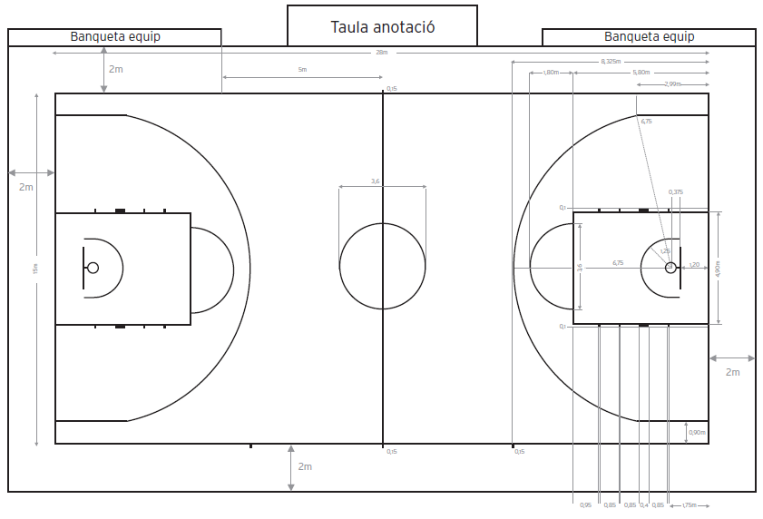

Línia de Fons

Àrea Restringida Semi Cercle de no càrrega

Cercle central

Línia central

Línia de Fons Línia de servei Línia de 3 punts

Línia lateral

Reglamentació de mides de pistes de l’FCBQ (enllaç)

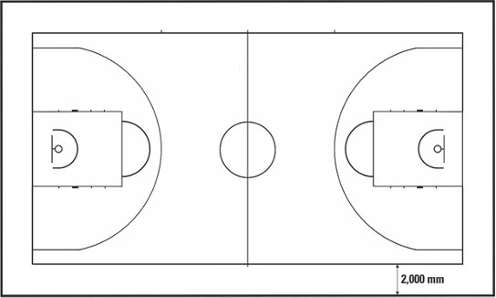

#### 2.5.3 Línies de tir lliure, àrees restringides i posicions de rebot per tirs lliures.

La línia de tirs lliures es marcarà parallela a cada línia de fons. Aquesta línia tindrà la vora exterior a 5.80 m de la vora interior de la línia de fons i tindrà una llargada de 3.60 m. El seu punt central es situarà sobre la línia imaginària que uneix el punt mitjà de les 2 línies de fons. Les àrees restringides són les àrees rectangulars marcades en el terreny de joc, limitades per les línies de fons, la prolongació de la línia de tir lliure i les línies que surten de les línies de fons, les seves parts exteriors seran a 2.45 m des del punt mitjà de les línies de fons i acabaran en la part de la vora exterior de la prolongació de la línia de tir lliure. Aquestes línies, sense tenir en compte les línies de fons, són part de l’àrea restringida. Les posicions de rebot per a tirs lliures, reservats per als jugadors durant els tirs lliures, es traçaran tal com es mostra la Figura 2.

#### 2.5.4 Àrea de cistella de 3 punts

L’àrea de cistella de 3 punts d’un equip (Figures 1 i 3), serà tota la pista de joc, excepte l’àrea més propera a la cistella de l’equip adversari, que inclou i està limitada per:

- Les 2 línies paralleles que surten perpendicularment a la línia de  fons, amb la vora

exterior a 0.90 m de la vora interior de les línies laterals.

- Un arc de 6.75 m de radi mesurat des del punt en el terra sota del centre exacte de

la cistella de l’adversari fins a la vora exterior de l’arc. La distància des del punt a terra a la vora interior del punt mitjà de la línia de fons serà de 1.575 m. L’arc s’uneix a les línies paralleles. La línia de 3 punts no és part de l’àrea de cistella de 3 punts. Terreny de joc 15 x 28 m. Superfície 19 x 32 m.

Línia limítrof exterior

Annex a l’article 2.5.3 Per les competicions de l’FCBQ
Article 4.1.2 de les Disposicions Generals per als Campionats organitzats per l’FCBQ.-
La zona restringida rectangular és l’oficial per a tots els Campionats, si bé
s’homologarà l’antiga zona trapezoïdal, excepte en les Competicions definides com
Nivell 1 i 2 segons el punt 4.1. de les Disposicions Generals per als Campionats
organitzats per l’FCBQ.

#### 2.5.5 Àrea de banqueta d’equip

Les àrees de banqueta d’equip es traçaran fora de la pista de joc, i estaran limitades per 2 línies tal i com es veu en la Figura 1. Hi haurà 16 seients disponibles a cada àrea de banqueta per l’entrenador, substituts, jugadors eliminats i acompanyants d’equip incloent els ajudants d’entrenador. Qualsevol altra persona haurà d’estar situada com a mínim a 2 m darrere de les banquetes de l’equip.

#### 2.5.6 Línies de servei

Les 4 línies de servei, dues a cada banda, de 0,15 m de longitud es marcaran fora del terreny de joc en la línia lateral davant de la taula d’auxiliars, amb la vora exterior de les línies a 8,325 m des de la vora interior de la línia de fons més propera.

#### 2.5.7 Àrees de semicercle de no càrrega

Les línies del semicercle de no càrrega hauran d’estar marcades en el terreny de joc, i seran limitades per:

- Un semicercle amb un radi de 1.30 m, mesurat des del punt en el terra sota del

centre exacte de la cistella fins a la vora exterior del semicercle. El semicercle s’uneix a:

- Les 2 línies paralleles i perpendiculars a la línia de fons, la vora exterior a 1.30 m

des del punt en el terra sota del centre exacte de la cistella, 0.375 m de llarg i finalitza a 1.20 m de la vora interior de la línia de fons. Les àrees del semicercle de no càrrega es completen amb línies imaginàries que uneixen els extrems de les línies paralleles directament sota de les vores interiors dels taulers. Les línies del semicercle de no càrrega, formen part de les àrees de semicercle de no càrrega.

Annex Art. 2.5.4. Per les competicions de l’FCBQ excepte en les Competicions
definides com Nivell 1 i 2 segons el punt 4.1. de les Disposicions Generals per
als Campionats organitzats per l’FCBQ.
Article 4.1.2 de les Disposicions Generals per als Campionats organitzats per
l’FCBQ.- L’àrea de tres punts d’un equip (Figura 1 i 3), serà tota la pista de joc, excepte
l’àrea més propera a la cistella de l’equip adversari, que inclou i està limitada per:
Dues línies paralleles que surten perpendicularment a la línia de fons, amb la vora
exterior a 6.25 m del lloc directament perpendicular al mateix punt mig  de la cistella
de l’adversari. La distancia d’aquest punt fins la vora interior del punt mitjà de la
línia de fons serà de 1.575 m.
Un semicercle amb un radi de 6.25 m mesurant fins la vora exterior de la
circumferència des del punt mitjà (de la cistella), i que acaben trobant-se amb les
dues línies parallels.
Annex Art. 2.5.7. Per les competicions de l’FCBQ (excepte en les Competicions
definides com Nivell 1 i 2 segons el punt 4.1. de les Disposicions Generals per
als Campionats organitzats per l’FCBQ.)
Article 4.1.2 de les Disposicions Generals per als Campionats organitzats per
l’FCBQ.-  Els partits corresponents als campionats de Copa Catalunya, Primera
Catalana, Segona Catalana i Campionats Preferents, Interterritorials i de Primer Any
(Infantil, Cadet, Júnior i Sots 21) tant masculins com femenins, serà d’aplicació l’actual
Reglament FIBA. Per a la resta de competicions, no serà d’aplicació ni la línia de 6.75,
ni el semicercle de càrrega, ni la línia de servei lateral, contemplades en l’article 2. Sí
que és l’aplicació la norma de 14” establerta en l’article 29. La zona restringida
rectangular és l’oficial per a tots els Campionats, si bé s’homologarà l’antiga zona

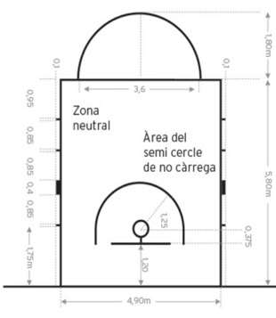

### 2.6 Posició de la taula d’auxiliars i de les cadires de substituts

La taula de l’anotador i les seves cadires han de collocar-se sobre una plataforma. El comentarista o els encarregats de les estadístiques (si hi fossin) poden asseure’s al costat o darrera de la taula dels anotadors.

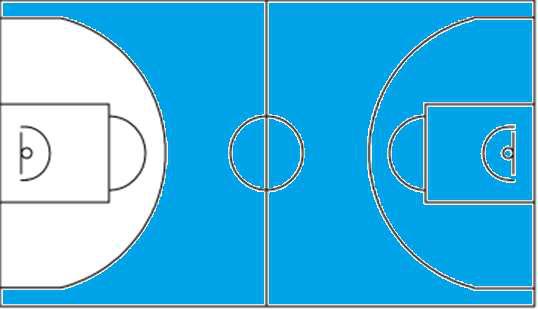

1. Operador del rellotge de llançament 2. Cronometrador x.   Seients dels substituts

Àrea de Banqueta Àrea de Banqueta Pista de joc 3. Comissari si n’hi ha 4. Anotador 5. Ajudant d'Anotador Direcció de joc. Àrea de cistella de 2 punts

Àrea de cistella de 3 punts Cistella contrària

*Figura 3 : Àrea*

Restringida

trapezoidal, excepte en els Campionats a que s’ha fet referència anteriorment.

## Art. 3 Equipament

Serà obligatori el següent equipament:

- Cistelles, formades per:

- Taulers - Cistelles compostes per anelles (abatibles) i xarxes - Estructures de suport del tauler que incloguin les proteccions.

- Pilotes de basquetbol.

- Rellotge de partit.

- Marcador.

- Rellotge de llançament

- Cronòmetre o un aparell (visible) apropiat que controli els temps morts que no sigui

el rellotge de joc.

- 2 senyals acústics independents, molt potents i clarament diferents entre si, per:

- Operador del rellotge de llançament, - Cronometrador.

- Acta de joc.

- Indicadors de faltes de jugadors/entrenadors.

- Indicadors de faltes d’equip.

- Fletxa de possessió alterna.

- Pista de joc.

- Terreny de joc.

- Enllumenat adequat.

Per a una descripció més detallada de l’equipament de basquetbol, vegeu l’apèndix d’equipament de Basquetbol.

Annex  Art. 3. Per les competicions de l’FCBQ
Article 4.1. Disposicions Generals per als Campionats organitzats per
l’FCBQ.- L’acta oficial del partit per les competicions d’àmbit català serà l’aprovada
per l’Assemblea General de l’FCBQ.

# Regla 3 ELS EQUIPS

## Art. 4 Els equips

### 4.1 Definició

#### 4.1.1

Un membre d’un equip és apte per jugar quan està autoritzat per jugar amb un equip d’acord amb la normativa de l’organitzador de la competició, incloent-hi la que regula els límits d’edat.

#### 4.1.2

Un membre d’un equip està facultat per jugar quan és inscrit a l’acta del partit abans que comenci el partit i mentre no sigui desqualificat o cometi 5 faltes.

#### 4.1.3

Durant el temps de joc, un membre d’un equip és:

- Jugador quan es troba a la pista de joc i està facultat per jugar,

- Un substitut quan no es troba a la pista de joc però està facultat per jugar,

- Un jugador eliminat per haver comès 5 faltes personals i ja no està facultat per

jugar.

#### 4.1.4

Durant un interval de joc, tots els membres d’un equip facultats per jugar són considerats jugadors.

### 4.2 Regla

#### 4.2.1

Cada equip està format per:

- Un màxim de 12 membres de l’equip facultats per jugar, incloent-hi un capità

- Un entrenador.

- Un màxim de 8 acompanyants d’equip, incloent ajudants d’entrenador que poden

seure a la banqueta de l’equip. En el cas que un equip tingui ajudants d’entrenador, el primer ajudant d’entrenador s’inscriurà a l’acta de joc.

#### 4.2.2

Durant el temps de joc, hi ha d’haver 5 membres de cada equip a la pista de joc i podran ser substituïts.

#### 4.2.3 Durant el temps de joc un substitut esdevé jugador i un jugador esdevé substitut

quan:

- L’àrbitre fa el senyal autoritzant l’entrada del substitut al terreny de joc.

- Durant un temps mort un substitut demana la substitució al cronometrador.

Durant un interval del partit entre quarts i pròrrogues, un jugador esdevé un substitut quan finalitza el respectiu interval.

### 4.3 Uniformes

#### 4.3.1

L'uniforme de tots els membres de l’equip es compon de:

- Samarretes d’un mateix color dominant per la part davantera i del darrere, com els

pantalons. Si les samarretes tenen mànigues han d'acabar per sobre del colze. Les samarretes de màniga llarga no estan permeses. Tots els jugadors han de dur la samarreta per dins els pantalons. El mallot d’una sola peça està autoritzat.

- No es permès portar samarretes de màniga, independentment del seu estil, per

sota de la samarreta de joc.

- Pantalons curts del mateix color dominant que les samarretes per davant i per

darrere. Els pantalons curts han de finalitzar per sobre dels genolls.

- Mitjons del mateix color dominant per a tots els membres de l'equip. Els mitjons

han de ser visibles.

#### 4.3.2

Cada membre d’equip haurà de portar una samarreta numerada pel davant i pel darrere. Les xifres han de ser plenes, d’un color sòlid que contrasti amb el de la samarreta.

Els números han de ser clarament visibles i:

- Els de l’esquena han de tenir una alçada mínima de 16 cm.

- Els del davant han de tenir una alçada mínima de 8 cm.

- Els números han de tenir una amplada mínima de 2 cm.

- Els equips només poden utilitzar els números 0 i 00 i des de l’1 al 99.

- Els jugadors d’un mateix equip no poden portar números idèntics.

- Qualsevol publicitat o logotip haurà d’estar com a mínim a 4 cm dels números.

#### 4.3.3

Els equips han de tenir un mínim de 2 jocs de samarretes i:

- L’equip que apareix en primer lloc al programa (equip local), portarà samarretes de

color clar (preferiblement blanc).

- L’equip que apareix en segon lloc al programa (equip visitant), portarà samarretes

de color fosc.

- Però, si els 2 equips es posen d’acord, poden intercanviar els colors de les

samarretes.

### 4.4 Altre equipament

#### 4.4.1

Tot l’equipament utilitzat pels jugadors serà adequat per al joc. Qualsevol equipament dissenyat per a augmentar l’alçada o l’abast d’un jugador o que li donés una avantatge deslleial no està permès.

#### 4.4.2

Els jugadors no portaran equipament (objectes) que puguin provocar lesions als altres jugadors.

- No és permès utilitzar:

- Protecció als dits, mans, canells, colzes o avantbraços, cascos, ortopèdies o reforçaments fets amb cuir, plàstic, plàstic flexible (tou), metall ni cap altre material dur, encara que estiguin coberts per un enconxat tou.

- Qualsevol objecte que pugui tallar o causar abrasió. (Les ungles han de ser tallades curtes).

- Accessoris en els cabells i joies.

Annex  Art. 4.3.3. Per les competicions de l’FCBQ
Articles 162 i 163 del Reglament Jurisdiccional de l’FCBQ.- Per les competicions
d’àmbit català s’aplicarà, en referència als uniformes de joc, els articles 162/163 del
reglament jurisdiccional de l’FCBQ.
Article 162:  En el cas que, a parer dels àrbitres, el color dels uniformes de joc
d'ambdós equips puguin ocasionar confusions, caldrà canviar la samarreta de
l'equip visitant que, per si de cas, caldrà que es desplaci sempre amb l'oportú
recanvi d'uniforme
Article. 163:  Quan una competició es celebri en concentració es considerarà com
a equip visitant, als efectes de canvi de samarreta, l'equip que figuri en segon lloc
en el programa oficial.

- Està permèsportar:

- Proteccions de la part superior dels braços, cuixes o part inferior de les cames, sempre que el material estigui suficientment encoixinat.

- Peces de roba de compressió per cames i braços, incloent samarretes interiors o escalfadors interiors.

- Cobertura pel cap. La cobertura pel cap no pot amagar cap part de la cara total o parcialment (ulls, nas, llavis, etc.) i no pot ser perillosa pel jugador que la faci servir o pels altres jugadors. La cobertura per al cap no pot tenir elements d'obertura/tancament al voltant de la cara o del coll i no pot tenir cap part que sobresurti de la seva superfície.

- Genolleres, turmelleres i proteccions per les espatlles.

- Màscares facials tot i que siguin d’un material dur.

- Protector per la boca transparent (incolor).

- Ulleres, sempre que no representin un perill per als altres jugadors.

- Canelleres i bandes pel cap de material tèxtil i una amplada màxima de 10 cm.

- Esparadrap (taping) de braços, espatlles, cames, etc.

Tots els jugadors d’un equip han de dur totes les seves peces de roba de compressió per cames i braços, incloent les samarretes interiors o escalfadors interiors, cobertures pel cap, canelleres, bandes pel cap i esparadraps / embenatges del mateix color sòlid.

#### 4.4.3

Durant el partit un jugador pot portar sabates de qualsevol combinació de colors. No s'admeten llums intermitents, materials reflectants ni altres adornaments.

#### 4.4.4

Durant el partit, un jugador no podrà portar cap nom, marca, logotip o qualsevol altre identificació comercial, promocional o benèfica en el seu cos, cabell o qualsevol altra part del cos.

#### 4.4.5

Qualsevol altre indumentària no mencionada de manera explícita en aquest article haurà de ser aprovada per la Comissió Tècnica de FIBA.

## Art. 5 Jugadors: lesions i assistència

### 5.1

Els àrbitres poden aturar el partit en cas de lesió d’un o més jugadors.

### 5.2

Si la pilota és viva en el moment de la lesió, l’àrbitre s’abstindrà de fer sonar el xiulet fins que l’equip que controla la pilota la llanci a cistella, perdi el control d’aquesta, la retingui sense jugar-la o la pilota esdevingui morta, a menys que cap dels dos equips quedi en desavantatge. Si és necessari protegir un jugador lesionat, els àrbitres poden aturar el joc immediatament.

### 5.3

Si un jugador lesionat no pot continuar jugant immediatament (aproximadament en 15 segons), o si rep tractament o qualsevol assistència dels entrenadors, membres o acompanyants del seu propi equip, haurà de ser substituït excepte si en tal cas el seu equip queda amb menys de 5 jugadors a pista.

### 5.4

Els entrenadors, entrenadors ajudants, substituts, jugadors eliminats i acompanyants d’equip poden entrar a la pista de joc, només amb el permís d’un dels àrbitres, per atendre un jugador lesionat abans que se’l substitueixi.

### 5.5

Quan la pilota ha esdevingut morta, un metge pot entrar a la pista de joc, sense l’autorització d’un dels àrbitres si, al seu parer, el jugador lesionat requereix atenció mèdica immediata.

### 5.6

Durant el partit, qualsevol jugador que sagni o que presenti una ferida oberta,  haurà d’abandonar la pista de joc i ser substituït. El jugador només podrà tornar al terreny de joc quan deixi de sagnar i l’àrea afectada o la ferida oberta hagi estat coberta completament i de manera segura.

### 5.7

Si el jugador lesionat o qualsevol jugador que sagni o presenti una ferida oberta, es recupera durant un temps mort sollicitat per qualsevol equip, abans que soni el senyal del cronometrador comunicant la substitució, aquest podrà continuar jugant.

### 5.8

Qualsevol jugador que hagi estat designat pel preparador per començar el partit o que rebi tractament entre llançaments de tirs lliures,  podrà ser substituït en cas de lesió. En aquest cas, els adversaris tindran dret a realitzar el mateix número de substitucions, si així ho desitgessin.

## Art. 6 El capità: drets i obligacions

### 6.1

El capità (CAP) és un jugador designat per l’entrenador per representar l’equip en la pista de joc. El capità pot dirigir-se als àrbitres de manera cortès per obtenir informació només quan la pilota estigui morta i el rellotge de partit aturat.

### 6.2

El capità, en acabar el partit, notificarà abans de quinze minuts després de la finalització del partit a l’àrbitre principal si l’equip vol signar l’acta per apellar el resultat del partit, i signarà l’acta a l’espai corresponent on indica “Signatura dels capitans en cas d’apellació”.

## Art. 7 L’entrenador i primer ajudant d’entrenador: drets i obligacions

### 7.1

Almenys 40 minuts abans de l’hora fixada per a l’inici del partit, l’entrenador o el representant de l’equip proporcionarà a l’anotador una llista amb els noms i números corresponents dels membres de l’equip aptes per jugar. Així mateix també facilitarà el nom del capità, l’entrenador i el primer ajudant d’entrenador. Tots els membres d’un equip inscrits a l’acta estan facultats per jugar, fins i tot si es presenten una vegada s’ha iniciat el partit.

Annex a l’article 6.2: Per les competicions de l’FCBQ
Sense perjudici de les accions que els equips puguin dur a terme presentant
allegacions davant el Comitè de Competició, en temps i forma establert en el
Reglament Jurisdiccional de l’FCBQ, aquest procediment no existeix a les
competicions d’àmbit català i cap equip pot signar sota protesta.

### 7.2

Almenys 10 minuts abans de l’hora fixada per a l'inici del partit, els dos entrenadors confirmaran l'acord pel que fa als noms i números dels membres dels equips i el nom dels entrenadors i dels primers ajudants d’entrenador inscrits, quan firmin l’acta del partit. Al mateix temps, han d’assenyalar els 5 jugadors que jugaran en l'inici del partit. L’entrenador de l’equip "A" serà el primer a facilitar aquesta informació.

### 7.3

Els entrenadors, entrenadors ajudants, substituts, jugadors eliminats i acompanyants dels equips són les úniques persones autoritzades a seure i restar dins l’àrea de banquetes de l’equip. Durant el temps de joc tots els substituts, jugadors eliminats i acompanyants d’equip romandran asseguts a la banqueta.

### 7.4

L’entrenador o el primer ajudant d’entrenador poden apropar-se als auxiliars de taula durant el partit per a obtenir informació estadística només quan la pilota estigui morta i el rellotge de partit aturat.

### 7.5

L’entrenador es podrà dirigir als àrbitres durant el partit de manera cortès per obtenir informació, només quan la pilota estigui morta i el rellotge de joc aturat.

### 7.6

L’entrenador o el primer ajudant d’entrenador, però només un d’ells al mateix temps, podrà romandre dempeus durant el partit. Podran dirigir-se verbalment als jugadors durant el partit sempre i quan romanguin dins de les seves àrees de banqueta d’equip. El primer ajudant d’entrenador no s’adreçarà als àrbitres.

### 7.7

Si hi ha un el primer ajudant d’entrenador, el seu nom serà inscrit en l’acta del partit abans que comenci el partit (no és necessari que signi). Ell realitzarà les funcions de l’entrenador només si aquest, per alguna raó, no pot continuar realitzant-les.

### 7.8

L’entrenador informarà a un dels àrbitres del número del jugador que actuarà com a capità a la pista, quan el capità abandoni el terreny de joc.

### 7.9

El capità actuarà com a jugador-entrenador si no hi ha entrenador o bé aquest no pot continuar assumint les seves funcions, o no hi ha primer ajudant d’entrenador inscrit en l’acta del partit (o bé aquest no pot continuar assumint les seves funcions). Si el capità ha de deixar la pista de joc, podrà continuar fent el paper d’entrenador. Tanmateix, si ha de deixar la pista de joc a causa d’una falta desqualificant, o bé si no pot complir les funcions d’entrenador perquè té una lesió, el substitut de capità haurà d’actuar com jugador entrenador.

### 7.10

L’entrenador indicarà el llançador dels tirs lliures de l’equip per a tots els casos en què les regles no ho determinin.

Annex a l’article 7.1: Per les competicions de l’FCBQ
A les competicions d’àmbit català cada entrenador o representant proporcionarà a
l’anotador una llista amb els noms i números corresponents dels membres de l’equip
aptes per jugar almenys 20 minuts abans de l’hora fixada per a l’inici del partit.
Annex a les interpretacions 7.3 i 7.4  per les competicions de l’FCBQ
Article 165.- Per a poder actuar un jugador o jugadora, o un entrenador o entrenadora
en un partit caldrà necessàriament que, abans del seu començament, s’inscrigui amb
el seu equip a l'acta oficial de joc. Un cop signada la relació de jugadores o jugadors
inscrits per l'entrenador o entrenadora o, en el seu defecte, pel capità o capitana del
respectiu equip, no se'n podrà afegir ni treure'n cap.

# Regla 4 REGLAMENTACIÓ DEL JOC

## Art. 8 Temps de joc, tempteig empatat i pròrrogues

### 8.1

El partit es compon de 4 quarts de 10 minuts cadascun.

### 8.2

Hi haurà un interval de joc de 20 minuts abans del començament del partit.

### 8.3

Hi haurà intervals de joc de 2 minuts entre el primer i el segon quart (primera part) i entre el tercer i el quart quart (segona part) així com abans de qualsevol pròrroga.

### 8.4

Hi haurà un interval de mitja part de 15 minuts.

### 8.5

Un interval de joc comença:

- 20 minuts abans de l’hora fixada per l’inici del partit.

- Quan el senyal del rellotge de partit sona al final del quart o de la pròrroga.

### 8.6

Un interval de joc finalitza:

- Al principi del primer quart quan la pilota deixa la(les) mà(mans) de l’àrbitre principal

en el llançament del salt entre dos en el cercle central.

- Al principi de la resta de quarts i pròrrogues quan la pilota està a disposició del

jugador que efectuarà el servei de banda.

### 8.7

Si hi ha un empat al final del quart quart el joc s’ha de continuar amb tantes pròrrogues de 5 minuts cadascuna, com siguin necessàries per desfer l’empat. Si en les sèries a 2 partits (anada i tornada) la suma dels punts d'ambdós partits (tempteig total) dona empat al final del segon encontre, aquest continuarà amb tantes pròrrogues de 5 minuts cadascuna, com siguin necessaris per desfer l'empat.

### 8.8

Si es comet una falta prop del final d'un quart o de la pròrroga, l'àrbitre determinarà el temps de joc restant. Al rellotge de joc es mostrarà un mínim de 0.1 segons.

### 8.9

Si es comet una falta durant un interval de joc, qualsevol eventual tir(s) lliure(s) serà(n) administrat(s) abans de l’inici del següent quart o pròrroga.

## Art. 9 Començament i final d’un quart o del partit.

### 9.1

El primer quart comença quan la pilota deixa la(les) ma(mans) de l’àrbitre principal en el llançament del salt entre dos al cercle central.

### 9.2

La resta de quarts i pròrrogues comencen quan la pilota és a disposició del jugador que efectuarà el servei de banda.

### 9.3

El partit no podrà començar si un equip no té en la pista de joc 5 jugadors preparats per a jugar.

### 9.4

En tots els partits, el primer equip nomenat en el programa (equip local), tindrà la seva banqueta i la seva mitja pista d’escalfament a l’esquerra de la taula dels anotadors, de cara al terreny de joc. Però si els 2 equips estan d’acord, poden intercanviar les banquetes d’equip i/o les cistelles de la primera part.

### 9.5

Els equips intercanviaran les cistelles a la segona meitat.

Annex  Art. 8.3 i 8.4. Per les competicions de l’FCBQ
Segons l’acord de l’Assemblea de l’FCBQ del 30 de juliol del 2012
a)
Per les competicions d’àmbit català, la modificació del temps de joc és la
següent: els intervals entre el primer i el segon període, entre el tercer i quart
període i abans de qualsevol període extra seran d’un minut.
b)
L’ interval de la mitja part serà de deu minuts.

### 9.6

En totes les pròrrogues, els equips continuaran atacant a les mateixes cistelles en que ho feien al quart quart.

### 9.7

Un quart, pròrroga o partit acabaran quan el senyal del rellotge de joc soni per a la fi del quart o de la pròrroga. Quan el taulell estigui equipat amb illuminació de color vermell al voltant del seu perímetre, la illuminació prevaldrà sobre el senyal sonor del rellotge de partit.

## Art. 10 Condició de la pilota

### 10.1

La pilota pot ser tant viva com morta.

### 10.2

La pilota passa a ser viva quan:

- Durant el salt entre dos, la pilota deixa la(les) ma(mans) de l’àrbitre principal.

- Durant un tir lliure, la pilota és a disposició del llançador.

- Durant un servei, la pilota és a disposició del jugador que l’ha d’efectuar.

### 10.3

La pilota esdevé morta quan:

- Qualsevol llançament de camp o tir lliure són reeixits.

- Un àrbitre fa sonar el xiulet mentre la pilota és viva.

- Es veu clarament que la pilota no entrarà a la cistella en un tir lliure que ha de ser

seguit per : - Més tir(s) lliure(s). - D’una altra penalització (tir(s) lliure(s) i/o possessió).

- El senyal del rellotge de partit sona al final d’un quart o d’una pròrroga.

- El senyal del rellotge de llançament sona mentre un equip té el control de la pilota.

- La pilota en un llançament a cistella és enlaire i és tocada per un jugador de

qualsevol equip després que: - Un àrbitre fa sonar el xiulet. - El senyal del rellotge del partit sona indicant la fi d’un quart o pròrroga. - Sona el senyal del rellotge de llançament.

### 10.4

La pilota no esdevé morta i els punts han de ser concedits si s’han obtingut quan:

- La pilota és enlaire a causa d’un llançament de camp a cistella i:

- Un àrbitre fa sonar el xiulet - Sona el senyal del rellotge de partit indicant la fi d’un quart o pròrroga - Sona el senyal del rellotge de llançament.

- La pilota és enlaire a causa d’un tir lliure i l’àrbitre fa sonar el xiulet per indicar una

infracció no comesa pel llançador.

- Un jugador que es troba en acció de tir té el control de la pilota, i finalitza el seu tir

amb una acció contínua que va iniciar abans que es sancionés una falta a qualsevol jugador rival, o a qualsevol persona autoritzada a seure a la banqueta de l’equip rival. Aquesta norma no s’aplica, i la cistella no comptarà si després de que un àrbitre faci sonar el xiulet es fa una acció de tir completament nova.

## Art. 11 Posició del jugador i de l’àrbitre

### 11.1

La posició d’un jugador ve determinada pel lloc on toca a terra. Mentre està enlairat, es considera que manté el mateix estatus que tenia quan va tocar el terra per última vegada. Això inclou les línies de banda, la línia de mig camp, la línia de 3 punts, la línia de tirs lliures, les línies que delimiten l'àrea restringida i les línies que delimiten l’àrea de semicercle de no càrrega.

### 11.2

La posició d’un àrbitre es determina de la mateixa manera que la d’un jugador. Si la pilota toca un àrbitre, es considera que aquesta toca a terra al lloc on es troba l’àrbitre.

## Art. 12 Salt entre dos i alternança de possessió

### 12.1 Definició de salt entre dos

#### 12.1.1

Un salt entre dos té lloc quan un àrbitre llança la pilota entre 2 adversaris qualsevols.

#### 12.1.2

Es produeix una retencióde pilota quan un o més jugadors d’equips contraris tenen una mà o les dues mans amb fermesa sobre la pilota de tal manera que cap d’ells pot aconseguir-ne la possessió sense emprar una brusquedat excessiva.

### 12.2 Procediment de salt entre dos

#### 12.2.1

Els dos saltadors han d’estar amb els peus dins del semicercle més proper a la seva pròpia cistella, amb un peu prop de la línia central.

#### 12.2.2

Els jugadors d’un mateix equip no poden ocupar posicions adjacents entorn del cercle si un dels adversaris manifesta el desig d’intercalar-s’hi.

#### 12.2.3

L’àrbitre llançarà la pilota amunt verticalment entre els 2 adversaris a una altura tal que cap dels dos saltadors no la pugui arribar a tocar saltant.

#### 12.2.4

La pilota ha de ser picada amb la(les) mà(mans) per almenys un dels saltadors després d’haver assolit el punt més alt.

#### 12.2.5

Cap dels saltadors deixarà la posició de salt fins que la pilota hagi estat tocada legalment.

#### 12.2.6

Cap dels saltadors pot agafar o tocar la pilota més de dues vegades fins que aquesta hagi estat tocada per un dels jugadors que no hagin saltat, o bé hagi tocat el terra.

#### 12.2.7

Si la pilota no és tocada com a mínim per un dels saltadors, es repetirà el salt entre dos.

#### 12.2.8

Cap part del cos dels jugadors que no fan el salt podrà estar ni a sobre ni trepitjant la línia del cercle (cilindre) abans que la pilota hagi estat tocada legalment. Una infracció de l’Art. 12.2.1, 12.2.4, 12.2.5, 12.2.6 i 12.2.8 és una violació.

### 12.3 Sanció

La pilota s’adjudica als adversaris per realitzar un servei des del punt més proper d’on s’ha comès la infracció, excepte directament des de darrere del tauler.

### 12.4 Situacions de salt entre dos.

Es produeix una situació de salt entre dos quan:

- Es sanciona una retenció de pilota.

- La pilota surt fora de banda i els àrbitres dubten sobre qui ha estat l’últim a tocar-la

o no s’hi posen d’acord.

- Ambdós equips cometen violació durant l’últim tir lliure no reeixit.

- Una pilota viva queda retinguda entre l’anella i el tauler excepte:

- Entre tirs lliures,

- Després de l’últim o únic tir lliure seguit d’un servei des de la línia de servei a la pista davantera de l’equip, enfront a la taula d’auxiliars.

- La pilota esdevé morta quan cap dels equips té el control de la pilota ni dret a tenir-

lo.

- Després de compensar penalitzacions d’igual sanció contra ambdós equips, si no

queda cap sanció de falta per administrar i cap equip té control de la pilota o dret a ella abans de la primera falta o violació.

- Per començar qualsevol quart o pròrroga que no sigui el primer quart.

### 12.5 Definició d’alternança de possessió

El procés d’alternança de possessió és una manera de fer que la pilota esdevingui viva mitjançant un servei en lloc de fer ús d’un salt entre dos.

### 12.6 Procediment d’alternança de possessió

#### 12.6.1

En totes les situacions de salt, els equips s’aniran alternant la possessió de la pilota per realitzar un servei des del punt més proper on s’ha produït la situació de salt, excepte directament darrera del tauler.

#### 12.6.2

L’equip que no obtingui el control de la pilota viva després del salt entre dos inicial tindrà dret al primer servei de possessió alterna.

#### 12.6.3 L’equip que disposés del dret a la propera possessió alterna al final d’un quart o

pròrroga, començarà el següent quart o pròrroga amb un servei de banda des de la prolongació de la línia central, en front de la taula d’auxiliars, a menys s’hagi d’administrar una penalització de tirs lliures i servei.

#### 12.6.4 S’indicarà l’equip que disposa del dret a la possessió alterna mitjançant una fletxa de

possessió alterna que assenyali la direcció de la cistella de l’equip contrari. La direcció de la fletxa d’alternança de possessió es canviarà tot just finalitzat el servei de possessió alterna.

#### 12.6.5

Una violació comesa per un equip durant el seu servei de banda de la possessió d’alterna produirà la pèrdua del servei de possessió alterna. Llavors, es canviarà immediatament la direcció de la fletxa d’alternança de possessió, i es girarà indicant a l’equip no infractor com a mereixedor de la propera possessió d’alternança en la següent situació de salt entre dos. El joc es reprendrà amb possessió de pilota per a l’equip no infractor per realitzar un servei de banda des del mateix punt del servei original.

#### 12.6.6 Una falta comesa per qualsevol dels dos equips:

- Abans de l’inici d’un quart que no sigui el primer quart o d’una pròrroga o

- Durant el servei d’alternança de possessió,

no implica la pèrdua del dret d’alternança per a l’equip que té dret al servei.

## Art. 13 Com es juga la pilota

### 13.1 Definició

Durant el partit, la pilota es jugarà només amb la(les) mà(mans) i es podrà passar, llançar, donar un cop de dits, fer rodar o botar en qualsevol direcció, mantenint-se dins les restriccions d’aquestes regles.

### 13.2 Regla

Cap jugador no pot córrer amb la pilota, tocar-la o bloquejar-la intencionadament amb el peuo qualsevol part de la cama, o colpejar-la amb el puny. D’altra banda, contactar o tocar la pilota amb qualsevol part de la cama de forma accidental no constitueix una violació. Una infracció de l’Art. 13.2 és una violació.

### 13.3 Sanció

La pilota s’adjudica als adversaris per realitzar un servei des del punt més proper d’on s’ha comès la infracció, excepte directament des de darrere del tauler

## Art. 14 Control de la pilota

### 14.1 Definició

#### 14.1.1

El control d’un equip comença quan un jugador d’aquest equip té el control d’una pilota viva perquè la sosté o la bota o perquè la té a la seva disposició.

#### 14.1.2

El control de la pilota per un equip continua quan:

- Un jugador del mateix equip té control de la pilota viva.

- La pilota es passada entre membres del mateix equip.

#### 14.1.3

El control de la pilota per un equip finalitza quan:

- Un adversari pren el control.

- La pilota esdevé morta.

- La pilota deixa d’estar en contacte amb la (les) mà(mans) del  llançador en un tir a

cistella o en un tir lliure.

## Art. 15 Jugador en acció de tir

### 15.1 Definició

#### 15.1.1

Un tir a cistella o un tir lliure és produeix quan un jugador sosté la pilota amb la(les) mà(mans) i després la llança enlaire cap a la cistella dels seus adversaris. Un cop de dits és l’acció de tir en què la pilota es dirigida amb la(les) mà(mans) cap a la cistella de l’equip contrari. Una esmaixada és l’acció de tir en què la pilota s’introdueix cap a baix, amb una o dues mans, perquè entri a la cistella de l’equip contrari. El cop de dits i l’esmaixada es consideren tirs a cistella. Un moviment continu en una penetració cap a cistella o en altres tirs en moviment és una acció d'un jugador que agafa la pilota mentre avança o en finalitzar el driblatge i després continua amb el moviment de tir, generalment cap amunt.

#### 15.1.2

L’acció de tir en un llançament a cistella:

- Comença quan el jugador inicia el moviment de la pilota cap a dalt en direcció a la

cistella dels oponents.

- Finalitza quan la pilota ha deixat la(les) mà(mans) del jugador, o si s’intenta realitzar

una nova acció de tir, i en el cas d’un llançament en suspensió finalitzarà quan ambdós peus tornen a tocar el terra.

#### 15.1.3

L’acció de tir durant el moviment continu en una penetració a cistella, o uns altres tirs en moviment:

- Comença quan la pilota descansa a la mà o a les mans del jugador després de

finalitzar un driblatge o d’agafar-la enlaire i el jugador inicia el moviment previ a deixar anar la pilota en un llançament a cistella.

- Finalitza quan la pilota ha deixat la(les) mà(mans) del jugador o si realitza una acció

de tir totalment nova, i en el cas d’un tirador enlairat, ambdós peus han retornat al terra.

#### 15.1.4

No existeix cap relació entre el nombre de passes legals realitzades i l’acció de tir.

#### 15.1.5

Durant l’acció de tir un jugador podria ser agafat pel(s) braç(os) per un adversari impedint-li encistellar. En aquest cas, no serà imprescindible que la pilota abandoni la(les) mà(mans) del jugador.

#### 15.1.6

Quan un jugador està en acció de tir i després d'haver rebut una falta passa la pilota, no es considerarà que aquest jugador ha estat en acció de tir.

## Art. 16 Encistellada: quan es marca i el seu valor

### 16.1 Definició

#### 16.1.1

Una cistella és reeixidaquan una pilota viva entra en la cistella per la part superior, i s’hi queda o bé hi passa completament a través.

#### 16.1.2

Una pilota es considera que està dins la cistella quan fins i tot la part més mínima del seu volum és dins de la cistella i per sota del nivell de l’anella.

### 16.2 Regla

#### 16.2.1

Es concedeixuna cistella a l’equip que ataca a la cistella adversària en la qual la pilota ha entrat de la següent forma:

- Un llançament de tir lliure val 1 punt.

- Una cistellada llançada des de l’àrea de 2 punts val 2 punts.

- Una cistellada llançada des de l’àrea de 3 punts val 3 punts.

Si després que la pilota hagi tocat l’anella en l’últim tir lliure, un jugador atacant o defensor toca la pilota legalment abans que entri a cistella, la cistella valdrà 2 punts.

#### 16.2.2

Si un jugador encistella accidentalment un llançament de camp en la seva pròpia cistella, aquesta valdrà 2 punts, i s’anotarà com si l’hagués realitzat el capità en pista de l’equip contrari.

#### 16.2.3

Si un jugador encistella deliberadament en la seva pròpia cistella, es produeix una violació i el bàsquet no serà vàlid.

#### 16.2.4

Si un jugador provoca que tota la pilota traspassi la cistella per sota es produeix una violació.

#### 16.2.5

El rellotge de joc ha d'indicar 0.3 (3 dècimes de segon) o més per a que un jugador pugui obtenir el control de la pilota després d’un servei de banda o en un rebot després de l'últim tir lliure i llançar a cistella. Si el rellotge indica 0.2 o 0.1, l'únic tipus de llançament vàlid serà un cop de dits o una esmaixada directa de la pilota, sempre que la(es) mà(ns) del jugador no continuïn en contacte amb la pilota quan el rellotge de partit mostri 0.0.

## Art. 17 Servei

### 17.1 Definició

#### 17.1.1

Es produeix un servei quan el jugador que l’efectua passa la pilota a la pista des de fora de banda.

#### 17.1.2

Un servei.

- Comença quan la pilota està a disposició del jugador que ha d’efectuar el servei.

- Finalitza quan:

- La pilota toca o és legalment tocada per qualsevol jugador al terreny de joc.

- L’equip que efectua el servei comet una violació.

- Una pilota queda enganxada entre la cistella i el tauler durant un servei.

### 17.2 Procediment

Un àrbitre ha de lliurar o posar la pilota a disposició del jugador que ha d’efectuar el servei. L’àrbitre també podrà llançar la pilota o fer una passada picada cap al jugador a condició que:

- L’àrbitre no es trobi a més de 4 m. del jugador encarregat de fer el servei.

- El jugador que efectuï el servei es trobi en el lloc correcte tal i com hagi designat

l’àrbitre.

#### 17.2.2

El jugador efectuarà un servei des del punt més proper on s’ha comès la infracció o des del punt on l’àrbitre ha aturat el joc, excepte directamentdes de darrere del tauler.

#### 17.2.3

A l’inici de qualsevol quart que no sigui el primer o de totes les pròrrogues, el servei s’administrarà des de la prolongació de la línia central, davant de la taula d’anotadors.

El jugador que efectua el servei collocarà un peu a cada costat de la prolongació de la línia central i tindrà dret a passar la pilota a un company situat a qualsevol lloc de la pista de joc.

#### 17.2.4

Quan el rellotge de partit mostri 2:00 minuts o menys en el quart quart o en la pròrroga, després d’un temps mort concedit a l’equip que té dret a la possessió de la pilota en la seva pista defensiva, l’entrenador d’aquest equip tindrà el dret de decidir si el servei posterior es realitzarà des de la línia de servei a la pista davantera, o des del lloc més proper a on estava la pilota quan es va aturar el joc a la seva pista del darrere.

Si l'entrenador decideix reprendre el joc amb un servei de pista davantera i el servei de banda original era a la pista de darrere des de

la línia de fons després d'aconseguir una cistella o un últim tir lliure, l'entrenador decidirà si el servei es farà des de la línia de servei del costat de la taula o des de la del costat oposat.

la línia de banda o la línia de fons després d'una falta o violació, s'haurà de realitzar el servei a la pista davantera des de la línia de servei del mateix costat de la pista (costat de la taula o costat oposat) on es feia el servei original.

#### 17.2.5

A continuació d’una falta personal comesa per un jugador de l’equip amb control d’una pilota viva, o de l’equip amb dret a la pilota, el joc es reprendrà amb un servei des del lloc més proper a on es va cometre la infracció.

#### 17.2.6

Després d’una falta tècnica, el joc es reprendrà amb un servei des del lloc més proper a on estava la pilota quan es va sancionar la falta tècnica, llevat que s'indiqui el contrari en aquestes regles.

#### 17.2.7

Després d’una falta antiesportiva o desqualificant, el joc es reprendrà amb un servei des de la línia de servei de la pista davantera de l’equip, enfront a la taula d’auxiliars, llevat que s'indiqui el contrari en aquestes regles.

#### 17.2.8

Després d’una baralla, el joc es reprendrà tal i com s’indica a l’Art.39.

#### 17.2.9

Sempre que la pilota entra a cistella, però el llançament de camp o el tir lliure no sigui vàlid, el joc es reprendrà amb un servei des de la prolongació de la línia de tirs lliures.

#### 17.2.10 Després d’una cistella de camp vàlida o de l’últim tir lliure convertit:

- Qualsevol jugador de l’equip que ha rebut la cistella, efectuarà el servei des de

qualsevol lloc darrere de la línia de fons. Això també és aplicable quan un àrbitre entrega la pilota o la posa a la seva disposició al jugador que efectua un servei després d’un temps mort o qualsevol altra interrupció del joc posterior a una cistella o un últim tir lliure convertit.

- El jugador que efectua el servei es pot moure lateralment o cap enrere i pot passar

la pilota a d’altres companys damunt o darrere la línia divisòria de fons, però els 5 segons per posar la pilota en joc es compten des del moment en què la pilota està a disposició del primer jugador situat darrere de la línia.

### 17.3 Regla

#### 17.3.1

El jugador que efectua el servei no pot:

- Trigar més de 5 segons a deixar anar la pilota.

- Trepitjar al terreny de joc abans de deixar anar la pilota de la(es) seva(es) mà(ns).

- Fer que la pilota toqui fora de la pista de joc després de que s’hagi realitzat el servei.

- Tocar la pilota en la pista de joc abans no la toqui un altre jugador.

- Fer que la pilota entri directament a cistella.

- Moure’s des del punt designat per realitzar el servei més enllà de les línies limítrofes

lateralment en un o ambdós sentits, excedint una distància total d’1 m. abans de deixar anar la pilota. D’altra banda, es permet moure’s cap enrere perpendicularment a la línia, sempre que les circumstàncies ho permetin.

#### 17.3.2 Durant el servei, qualsevol altre jugador(s) no podrà:

- Tenir cap part del seu cos que sobrepassi la línia que delimita el camp de joc abans

que la pilota hagi franquejat aquesta línia.

- Estar a menys d’1 m del jugador que efectua el servei, quan no existeixi una

distància mínima de 2 m entre la línia limítrof i qualsevol obstacle.

#### 17.3.3 Quan el rellotge de partit mostri 2:00 minuts o menys en el quart període o en la

pròrroga, i s’hagi d’administrar un servei, l’àrbitre farà servir el senyal de “creuament illegal de la línia limítrof” com un avís abans d’administrar el servei.

Si després un jugador defensiu:

- Mou qualsevol part del cos per sobre de la línia limítrof per interferir el servei, o

- Es troba a menys d’1m. del jugador que realitza el servei, quan el jugador que

realitza el servei disposa de menys de 2 metres de distància,

Es considerarà una violació i comportarà una falta tècnica.

Una infracció de l’ Art. 17.3 és una violació.

### 17.4 Sanció

La pilota s’atorgarà a l’equip contrari per a un servei des del lloc del servei original.

## Art. 18 Temps mort

### 18.1 Definició

Un temps mort és una interrupció del partit demanada per l’entrenador o el primer ajudant d’entrenador.

### 18.2 Regla

#### 18.2.1

Tots els temps morts tindran una durada d’1 minut.

#### 18.2.2

Es pot concedir un temps mort durant una oportunitat de temps mort.

#### 18.2.3

Una oportunitat de temps mort comença:

- Per ambdós equips, quan una pilota esdevé morta, el rellotge de partit està aturat

i l’àrbitre ha finalitzat la comunicació amb la taula d’auxiliars.

- Per ambdós equips, quan la pilota queda morta després de l’últim tir lliure reeixit.

- Per a l’equip que no ha encistellat, després d’un tir de camp encistellat.

#### 18.2.4

Una oportunitat de temps mort acaba quan la pilota es troba a disposició d’un jugador per efectuar un servei de banda o pel primer tir lliure.

#### 18.2.5

Cada equip tindrà a la seva disposició:

- 2 temps morts durant la primera part,

- 3 temps morts durant la segona part, amb un màxim de 2 d’aquests temps morts

quan el rellotge de partit mostri 2:00 minuts o menys del quart quart.

- 1 temps mort durant cadascuna de les pròrrogues.

#### 18.2.6

Els temps morts que no s’hagin utilitzat no podran acumular-se per a la següent part o pròrroga.

#### 18.2.7

El temps mort es concedirà a l’entrenador que primer ho demani, llevat que el temps mort es concedeixi després d’un bàsquet de l’adversari i sense que s’hagi sancionat cap infracció.

#### 18.2.8

No es concedirà temps mort a l’equip que ha encistellat quan el rellotge de partit s’hagi aturat després d’una  cistella de camp i mostri 2:00 minuts o menys del quart quart o de qualsevol pròrroga, a no ser que l’àrbitre hagi aturat el joc.

### 18.3 Procediment

#### 18.3.1

Només l’entrenador o el primer ajudant d’entrenador tene el dret de demanar un temps mort. L’entrenador ha d’establir un contacte visual amb la taula d’auxiliars o anar a la taula d’auxiliars i demanar clarament un temps mort, tot fent amb les mans el senyal convencional corresponent.

#### 18.3.2

Una petició de temps mort només es pot cancellar abans que el cronometrador faci sonar el senyal comunicant aquesta sollicitud.

#### 18.3.3

El període de temps mort:

- Comença quan l’àrbitre fa sonar el xiulet i realitza el senyal de temps mort.

- Acaba quan l’àrbitre fa sonar el seu xiulet i ordena als equips el retorn a pista.

#### 18.3.4

Tan aviat com comenci una oportunitat de temps mort, el cronometrador ha d’indicar als àrbitres que un equip ha demanat un temps mort fent sonar el senyal.

Si s’aconsegueix un tir de camp contra l’equip que havia demanat el temps mort, el cronometrador aturarà immediatament el cronòmetre de joc i farà sonar el senyal.

#### 18.3.5

Durant els temps morts i durant els intervals de joc previs a l’inici del segon i del quart quart  o de cada pròrroga, els jugadors poden abandonar la pista de joc i seure a la banqueta d’equip i qualsevol persona autoritzada a seure a la banqueta de l’equip  pot entrar dins la pista sempre que es mantingui a prop de la seva àrea de banqueta d’equip.

#### 18.3.6

Si qualsevol dels dos equips realitza la sollicitud de temps mort, després que la pilota es trobi a disposició del llançador pel primer tir lliure, es concedirà el temps mort a qualsevol dels dos equips si:

- L’últim tir lliure és convertit.

- L’últim tir lliure, si no és convertit, va seguit d’un servei de banda.

- Quan es sanciona una falta entre els tirs lliures. En aquest cas es completarà(n)

el(s)  tir(s) lliure(s) i es concedirà el temps mort abans de l’administració de la nova penalització, excepte que s’indiqui el contrari en aquestes regles.

- Quan es sanciona una falta abans que la pilota esdevingui viva després de l’últim

llançament lliure. En aquest cas es concedeix el temps mort abans que s’administri la nova penalització.

- Quan es sanciona una violació abans que la pilota estigui viva després de l’últim

llançament lliure. En aquest cas es concedirà el temps mort abans que s’administri el servei de banda. En el cas de diverses sèries consecutives de tirs lliures i/o possessió de pilota originada per la penalització de més d’1 falta, cada sèrie serà considerada per separat.

## Art. 19 Substitució

### 19.1 Definició

Una substitució és una interrupció del joc feta a petició d’un substitut per convertir-se en jugador.

### 19.2 Regla

#### 19.2.1

Un equip pot canviar un o diversos jugadors durant una oportunitat de substitució.

#### 19.2.2 Una oportunitat de substitució comença:

Per ambdós equips, quan una pilota esdevé morta, el cronòmetre de joc és aturat i l’àrbitre ha finalitzat la comunicació amb la taula d’auxiliars. Per ambdós equips, quan la pilota queda morta després de l’últim tir lliure convertit. Per l’equip que rep la cistella, si s’aconsegueix una cistella de camp quan el rellotge de partit mostra 2:00 minuts o menys del quart quart o de qualsevol pròrroga.

#### 19.2.3

Una oportunitat de substitució acaba quan la pilota és a disposició d’un jugador per un servei de banda o per un primer tir lliure.

#### 19.2.4

Un jugador que ha estat substituït i un suplent que s’ha convertit en jugador no poden tornar a incorporar-se al partit ni abandonar-lo, respectivament, sense que una pilota hagi esdevingut morta una altra vegada, després que s’hagi engegat el rellotge del partit a no ser que: L’equip quedi reduït a menys de 5 jugadors en la pista de joc. El jugador que té dret a llançar tirs lliures com a conseqüència de la correcció d’una errada estigui a la banqueta de l’equip després d’haver estat legalment substituït.

#### 19.2.5

No es permetrà cap substitució a l’equip que ha anotat quan el rellotge de partit s’hagi aturat després d’una cistella de camp, i el rellotge del partit mostri 2:00 o menys del quart quart o de qualsevol pròrroga, a no ser que un àrbitre hagi aturat el partit.

#### 19.2.6

Si el jugador rep tractament o assistència, haurà de ser substituït excepte si el seu equip es quedés amb menys de 5 jugadors al terreny de joc.

### 19.3 Procediment

#### 19.3.1

Només el substitut té el dret a demanar un canvi. El substitut (ni l’entrenador ni el primer ajudant d’entrenador), s’ha de presentar personalment a la taula d’auxiliars i demanar clarament la substitució, realitzant el senyal convencional correcte amb les mans, o seient a la cadira de substituts, preparat per jugar immediatament.

#### 19.3.2

Una petició de substitució només pot ser anullada abans no soni el senyal del cronometrador.

#### 19.3.3

Tant bon punt hi hagi una oportunitat de substitució, el cronometrador indicarà als àrbitres que s’ha fet una petició de substitució fent sonar el senyal.

#### 19.3.4

El substitut romandrà fora dels límits de la pista fins que l’àrbitre faci sonar el xiulet, faci el senyal de substitució i li permeti a entrar al terreny de joc.

#### 19.3.5 El jugador substituït pot anar directament a la seva banqueta d’equip, sense informar

ni al cronometrador ni l’àrbitre.

#### 19.3.6

Les substitucions s’han d’efectuar tan ràpidament com sigui possible. Un jugador que ha comès la seva 5a falta o que ha estat desqualificat, ha de ser substituït immediatament (trigant no més de 30 segons). Si es produeix un retard, se li podrà carregar un temps mort a l’equip infractor. Si a l’equip no li resten temps morts, es pot sancionar l’entrenador amb una falta tècnica de tipus ‘B’ per retardar el joc.

#### 19.3.7 Si una substitució es demana durant un temps mort d’equip o un interval de joc que

no sigui l’interval entre la primera i la segona part, el substitut haurà d’informar al cronometrador abans d’entrar al terreny de joc.

#### 19.3.8

Si el llançador de tirs lliures ha de ser substituït perquè: Està lesionat, o Ha comès 5 faltes, o Ha estat desqualificat, El tir o tirs lliures hauran de ser llançats pel substitut, el qual no podrà tornar a ser substituït fins que hagi jugat en la següent fase del partit amb el rellotge engegat.

#### 19.3.9

Si qualsevol equip sollicita una substitució després que la pilota es trobi a disposició del llançador per al primer tir lliure, es concedirà la substitució si:

- L’últim tir lliure és convertit.

- L’últim tir lliure, si no és convertit ,va seguit d’un servei de banda.

- Quan es sanciona una falta entre els tirs lliures. En aquest cas es completarà(n)

el(s)  tir(s) lliure(s) i es concedirà la substitució abans de l’administració de la nova penalització, excepte que s’indiqui el contrari en aquestes regles.

- Es sanciona una falta abans que la pilota esdevingui viva després del darrer tir

lliure. En aquest cas la substitució s’efectuarà abans d’administrar la nova penalització.

- Si s’assenyala una violació abans que la pilota esdevingui viva després del darrer

tir lliure, en aquest cas, es concedirà la substitució abans d’administrar el servei. En el cas de sèries consecutives de tirs lliures o serveis originats per la penalització de més d’1 falta, cada sèrie es considerarà per separat.

## Art. 20 Partit perdut per incompareixença

### 20.1 Regla

Un equip perdrà un partit per incompareixença si:

- L’equip no és present o no pot presentar 5 jugadors preparats per a jugar, 15 minuts

després de l’hora programada per començar el partit.

- Els seus actes impedeixen que es jugui el partit.

- Es nega a jugar després d’haver-ne rebut l’ordre per part de l’àrbitre principal.

### 20.2 Sanció

#### 20.2.1 S’adjudica el partit als adversaris i el tempteig serà de 20 a 0. A més, l’equip que no

ha comparegut rebrà 0 punts a la classificació.

#### 20.2.2

En les sèries a 2 partits (anada i tornada) en que es sumen els punts (tempteig agregat) i pels play-offs al millor de 3 partits, l’equip que no comparegui en el primer, segon o tercer partit, perdrà tota la sèrie per incompareixença. Aquesta restricció no s’aplica als play-offs (al millor de 5 o de 7 partits)

#### 20.2.3

Si en un torneig l'equip perd un segon partit per incompareixença l'equip serà desqualificat del torneig i els resultats de tots els partits jugats per aquest equip seran declarats nuls.

## Art. 21 Partit perdut per inferioritat

### 20.1 Regla

Un equip perdrà el partit per inferioritat si, durant el joc, el nombre de jugadors que té aquest equip en la pista de joc és inferior a 2.

### 21.2 Sanció

#### 21.2.1

Si l’equip al qual s’adjudica el partit té el marcador a favor quan s’atura el joc, es donarà per bona aquesta puntuació. Si l’equip al qual s’adjudica el partit no es troba per davant al marcador, la puntuació serà de 2 a 0 a favor seu. L’equip que ha perdut per inferioritat rebrà 1 punt a la classificació.

#### 21.2.2

Per a les series de 2 partits (anada i tornada) en que es sumen els punts (tempteig total), l’equip que perdi per inferioritat el primer o el segon partit perdrà la sèrie per "inferioritat".

Annex  Art. 20 per les competicions de l’FCBQ segons el seu Reglament Jurisdiccional.
Article 115.- Quan en una eliminatòria, un equip se'l sancioni per qualsevol causa amb la pèrdua
del partit, serà l'altre equip qui es classificarà en l'eliminatòria: i, per tant, si el partit on es va produir
la infracció és el primer de l'eliminatòria, ja no caldrà disputar el segon partit.
El que disposa el paràgraf anterior no serà aplicable quan es tracti d'eliminatòries pel sistema de
"play-off".
Article 145.- Si d'acord amb el que disposa aquest Reglament un partit s'hagués de donar per
perdut a l'equip infractor, el resultat final serà, en el cas d'haver estat suspès abans del seu
començament, de "2-0" a favor de l'altre equip; i, si va ser suspès després d'haver-se iniciat el joc,
el que assenyalés l'acta oficial en el moment de la suspensió, si ja l'anava perdent l'equip infractor,
o de "2-0" a favor de l'altre equip, si l'anava guanyant aquell equip infractor.
Annex  Art. 21 per les competicions de l’FCBQ segons el seu Reglament Jurisdiccional.
Article 114.- Quan en un partit corresponent a una eliminatòria un equip arribi a trobar-se amb un
sol jugador i, en conseqüència, l'àrbitre el suspengui per aquest motiu abans de finalitzar el temps
reglamentari de joc, l'equip que s'ha quedat sense jugadors perdrà l'eliminatòria, independentment
del resultat de l'altre partit, per tant si el partit on això ocorre és el primer, ja no caldrà jugar el
segon.
El que disposa el paràgraf anterior no serà aplicable quan es tracti d'eliminatòries pel sistema de
"Play Off".

# Regla 5 VIOLACIONS

## Art. 22 Violacions

### 21.1 Definició

Una violació és una infracció de les regles.

### 22.2 Sanció

La pilota s’adjudica als adversaris per realitzar un servei des del punt més proper d’on s’ha comès la infracció, excepte directament des de darrere del tauler, a no ser que s’especifiqui el contrari en aquestes regles.

## Art. 23 Jugador fora del terreny de joc i pilota fora del terreny de joc

### 23.1 Definició

#### 23.1.1

Un jugador està fora del terreny de joc quan una part qualsevol del cos està en contacte amb el terra o qualsevol altre objecte, que no sigui un jugador, que estigui en, per sobre o fora de les línies limítrofes.

#### 23.1.2

La pilota està fora de la pista de joc quan toca:

- Un jugador o qualsevol altra persona que sigui fora de la pista de joc.

- El terra o qualsevol altre objecte situat en, per sobre o fora de la línia que delimita

la pista de joc.

- Els suports o la cara posterior dels taulers, o qualsevol objecte que es trobi situat

per sobre de la pista de joc.

### 23.2 Regla

#### 23.2.1

El responsable que una pilota vagi fora de banda és l’últim jugador que l’ha tocada o que ha estat tocat per la pilota abans que aquesta no surti fora de la pista de joc, fins i tot si abans de sortir-ne la pilota ha tocat qualsevol altre element que no sigui un jugador.

#### 23.2.2

Si la pilota surt dels límits de la pista per haver tocat o estat tocada per un jugador que està sobre o fora de les línies limítrofes, aquest jugador és responsable que la pilota surti del terreny de joc.

#### 23.2.3

Si un(s) jugador(s) surt(en) fora de banda o retorna(en) a la seva pista del darrere durant una situació de pilota retinguda, es donarà una situació de salt entre dos.

## Art. 24 Driblatge

### 24.1 Definició

#### 24.1.1

Un driblatge és el moviment d'una pilota viva causat per un jugador que controla la pilota i la llança, la colpeja, la fa rodar o la bota al terra.

#### 24.1.2

Un driblatge comença quan un jugador després d’obtenir el control d’una pilota viva al terreny de joc, la llança, la colpeja, la fa rodar o la bota al terra, i la torna a tocar abans no sigui tocada per un altre jugador. Durant un driblatge el jugador no pot collocar cap part de la mà(ns) sota de la pilota i portar-la d’una part a una altra o fer que la pilota s’aturi i després efectuar un nou driblatge. Durant un driblatge, es pot llançar la pilota a l’aire, a condició que toqui al terra o a un altre jugador abans que el qui l’ha tirat torni a tocar-la amb la mà. El nombre de passes que un jugador pot fer quan la pilota no està en contacte amb la mà és illimitat.

El driblatge acaba en l’instant en què el jugador toca la pilota simultàniament amb totes dues mans o permet que la pilota resti en una o les dues mans.

#### 24.1.3

Es considera un 'fumble' quan un jugador perd accidentalment el control d’una pilota viva al terreny de joc i el torna a recuperar.

#### 24.1.4 No són driblatges les accions següents:

- Els llançaments successius a cistella.

- Cometre un 'fumble' a l’ inici o al final d’un driblatge.

- El fet d’intentar obtenir el control de la pilota colpejant-la per allunyar-la dels altres

jugadors.

- Treure-li la pilota d’un cop al jugador que la controla.

- El fet d’interceptar una passada i establir el control de la pilota.

- Passar-se la pilota d’una mà a l’altra, permetent que resti en una o ambdues mans

abans no toqui el terra, sempre que no es cometi una violació de la regla d’avançament.

- Llançar la pilota contra el tauler i recuperar-ne el control.

### 24.2 Regla

Un jugador no pot tornar a driblar per segona vegada després que hagi acabat el primer, llevat que entre els 2 driblatges:

- Hagi perdut el control de la pilota viva al terreny de joc a causa d’un tir a cistella.

- La pilota sigui tocada per un adversari.

- En una passada o 'fumble' la pilota toqui o sigui tocada per un altre jugador.

## Art. 25 Avançament illegal

### 25.1 Definició

#### 25.1.1

Avançament illegal és moure illegalment un o tots dos peus en qualsevol direcció sobrepassant els límits definits per aquest article mentre es sosté una pilota viva  dins del terreny de joc.

#### 25.1.2

Un pivot és el moviment legal en el qual un jugador que té agafada una pilota viva a la pista dona un o més passos en qualsevol direcció amb el mateix peu, mentre l’altre, anomenat peu de pivot, es manté fix en el punt de contacte amb el terra.

### 25.2 Regla

#### 25.2.1 Establiment del peu de pivot per un jugador que agafa una pilota viva en la pista

de joc: Un jugador que agafa la pilota quan es troba estàtic amb els dos peus a terra: - Quan aixequi un peu, l’altre esdevindrà el peu de pivot. - Per a començar un driblatge, el peu de pivot no es podrà aixecar abans que la pilota surti de la(es) seva(es) mà(ns). - Per a passar o llançar a cistella, el jugador pot aixecar el peu de pivot, però cap dels dos peus no podrà tornar al terra fins que la pilota hagi sortit de la(es) seva(es) mà(ns). Un jugador que agafa la pilota estant en moviment, o després de completar un driblatge, pot fer dues passes per tal d’aturar-se, passar la pilota o llançar a cistella: - Després de rebre la pilota, un jugador haurà de deixar-la anar per iniciar un driblatge abans del seu segon pas. - El primer pas té lloc quan un o els dos peus toquen el terra després d’haver obtingut el control de la pilota. - El segon pas té lloc després del primer pas quan l’altre peu toca el terra o els dos peus toquen el terra simultàniament.

- Si el jugador s’atura en el primer pas amb els dos peus a terra o bé els dos peus toquen el terra simultàniament, pot pivotar utilitzant qualsevol peu com a peu de pivot. Si després salta amb els dos peus, cap peu no podrà tornar al terra fins que la pilota hagi sortit de les seves mans.

- Si un jugador aterra sobre un peu, només pot pivotar amb aquest peu.

- Si un jugador salta sobre un peu en el seu primer pas, pot aterrar sobre els dos peus simultàniament pel seu segon pas. En aquesta situació, el jugador no podrà pivotar amb cap peu. Si aixeca un o ambdós peus, no podrà tornar a posar cap peu a terra fins que la pilota hagi sortit de la(es) seva(es) mà(ns).

- Si els dos peus estan enlairats i el jugador aterra amb els dos peus a la vegada, en el moment en el que un peu s’aixequi del terra l’altre esdevindrà el peu de pivot.

- Un jugador no pot tocar el terra de manera consecutiva amb el mateix peu o amb els dos peus després de finalitzar el driblatge o d’obtenir el control de la pilota.

#### 25.2.2

Jugador estirat, assegut o que cau al terra:

Es considera legal quan un jugador que té la pilota agafada, cau i llisca pel terra, o que mentre es troba estirat o assegut al terra obté el control de la pilota.

Serà una violació si el jugador rodola o s’intenta aixecar amb la pilota controlada.

## Art. 26 3 segons

### 26.1 Regla

#### 26.1.1

Un jugador no ha de romandre més de 3 segons consecutius a l’àrea restringida dels adversaris, mentre el seu equip té el controld’una pilota viva a la pista davantera i el cronòmetre de joc està engegat.

#### 26.1.2

Es permetrà que un jugador:

- Intenti abandonar l’àrea restringida.

- Estigui dins l’àrea restringida quan ell, o un company d’equip, està fent l’acció de

tir, i la pilota surt o acaba de sortir de la(les) mà(mans) per un llançament a cistella.

- Faci un driblatge cap a l'interior d’aquesta àrea per llançar a cistella, havent estat

menys de 3 segons consecutius dintre de l’àrea restringida.

#### 26.1.3

Per establir-se fora de l’àrea restringida, el jugador ha de posar els dos peus a terra fora de l’àrea restringida.

## Art. 27 Jugador estretament marcat

### 27.1 Definició

Un jugador que té agafada una pilota viva al terreny de joc, està estretament marcat quan un adversari estableix de forma activa una posició legal de defensa a no més d’ 1 m. de distància.

### 27.2 Regla

Un jugador estretament marcat haurà de fer una passada, driblar o tirar a cistella en un termini de 5 segons.

## Art. 28 8 segons

### 28.1 Regla

#### 28.1.1

Quan: Un jugador a la seva pista de darrere obtingui el control d’una pilota viva, o En un servei la pilota toqui o sigui legalment tocada per qualsevol jugador a la pista del darrere i l’equip del jugador que ha efectuat el servei manté el control de la pilota a la seva pista del darrere, aquest equip haurà de fer que la pilota passi a la pista davantera en menys de 8 segons.

#### 28.1.2

L’equip ha passat la pilota a pista davantera quan: La pilota, que no és controlada per cap jugador, toca la pista davantera. La pilota toca o és legalment tocada per un jugador atacant que té ambdós peus completament en contacte amb la pista davantera. La pilota toca o és legalment tocada per un defensor que té alguna part del cos en contacte amb la pista del darrere. La pilota toca a un àrbitre que té part del cos en contacte amb la pista davantera de l’equip amb control de la pilota. Durant un driblatge des de la pista del darrere cap a pista del davant, la pilota i ambdós peus del jugador que realitza el driblatge es troben completament en contacte amb la pista davantera.

#### 28.1.3

El compte de 8 segons continuarà amb el temps que restava, quan l’equip que prèviament tenia control de la pilota faci un servei de banda a la pista de darrere com a resultat de: Haver sortit la pilota fora del terreny de joc. Haver-se lesionat un jugador del mateix equip. Una falta tècnica comesa per aquell equip. Una situació de salt entre dos. Una falta doble. La cancellació de penalitzacions iguals en contra d’ambdós equips.

## Art. 29 24 segons

### 29.1 Regla

#### 29.1.1

Quan:

- Un jugador pren el control d’una pilota viva en el terreny de joc,

- En un servei, la pilota toca o és legalment tocada per algun jugador a la pista de

joc i l’equip del jugador que efectuat el servei manté el control de la pilota, aquest equip ha de llançar a cistella dins dels 24 segons següents. Perquè es consideri un llançament a cistella dins dels 24 segons següents:

- La pilota ha de deixar la(les) mà(mans) del llançador abans que soni el senyal del

rellotge de llançament, i

- Després que la pilota hagi deixat la(les) mà(mans) del llançador, la pilota ha de

tocar l’anella o entrar dins de la cistella.

#### 29.1.2

Quan es produeix un llançament de camp a prop de finalitzar el compte de 24 segons i sona el senyal del rellotge de llançament mentre la pilota és a l’aire:

- Si la pilota entra a la cistella, no tindrà lloc una violació, s’ignorarà el senyal i el

bàsquet serà vàlid.

- Si la pilota toca l’anella però no entra dins de la cistella, no hi haurà violació,

s’ignorarà el senyal i el joc continuarà.

- Si la pilota no toca l’anella, tindrà lloc una violació. No obstant això, si l’equip contrari

obtingués un control de la pilota immediat i clar, en aquest cas s’ignorarà el senyal i el joc continuarà. Quan el tauler estigui equipat amb una llum groga al llarg del perímetre superior, la senyal lluminosa prevaldrà sobre el senyal acústic del rellotge de llançament. S’han d’aplicar totes les restriccions relacionades amb la interposició i la interferència.

### 29.2 Procediment

#### 29.2.1

Després d’un salt entre dos per iniciar el primer quart o després del servei des de la línia central per l’inici de qualsevol altre període o de qualsevol pròrroga, si un jugador obté el control d’una pilota viva al terreny de joc, independentment de si ho fa a la pista del darrere o del davant, el rellotge de llançament es reiniciarà amb 24 segons.

#### 29.2.2

El rellotge de llançament es reiniciarà sempre que el joc sigui aturat per un àrbitre:

- Per una falta o violació (no perquè la pilota ha sortit fora del terreny de joc) comesa

per l’equip que no té el control de la pilota,

- Per qualsevol raó atribuïble a l’equip que no té el control de la pilota,

- Per qualsevol raó vàlida no atribuïble a cap dels equips.

En aquestes situacions, la possessió de la pilota es concedirà al mateix equip que tenia el control de la pilota prèviament. Si el servei és administrat a la seva pista:

- Del darrere, el rellotge de llançament s’haurà de tornar a 24 segons.

- Davantera, el rellotge de llançament s’ajustarà de la següent manera:

- Si el rellotge de llançament mostra 14 segons o més en el moment en què es va aturar el partit, no es reiniciarà el rellotge de llançament i el joc es reprendrà amb el temps que restava quan es va aturar el partit. - Si el rellotge de llançament mostra 13 segons o menys en el moment en què el partit s’ha aturat, el rellotge de llançament es reiniciarà a 14 segons. Malgrat tot, si el partit és aturat per un àrbitre per qualsevol raó no imputable a qualsevol dels equips o el fet de reiniciar el rellotge de llançament deixaria en desavantatge a l’equip contrari, el compte del rellotge de llançament continuarà amb el temps que restava quan es va aturar el partit.

#### 29.2.3

El rellotge de llançament es reiniciarà sempre que es concedeixi un servei a l’equip adversari, després que un àrbitre hagi aturat el joc a causa d’una falta o una violació (també la de pilota fora de banda) comesa per l’equip amb control de pilota. El rellotge de llançament també serà reiniciat quan el servei de banda com a conseqüència del procés de possessió alterna correspongui al nou equip atacant. Si el servei s’administra des de la seva pista:

- Del darrere, el rellotge de llançament s’haurà de reiniciar a 24 segons.

- Davantera, el rellotge de llançament s’haurà de reiniciar a 14 segons.

#### 29.2.4

Sempre que el partit sigui aturat per un àrbitre causa d'una falta tècnica comesa per l'equip que controla la pilota, el partit es reprendrà amb un servei des del lloc més proper a on es va aturar el partit. El rellotge de llançament no es reiniciarà sinó que continuarà des del temps on va ser aturat.

#### 29.2.5

Quan el rellotge de partit mostri 2:00 minuts o menys temps restant del quart quart o de qualsevol pròrroga, i es concedeixi un temps mort a l’equip que disposarà d’un servei de banda a la seva pista del darrere, l’entrenador d’aquest equip tindrà el dret de decidir si aquest servei s’administrarà des de la línia de servei a la pista davantera, o des del lloc de la pista del darrere més proper a on es trobava la pilota quan el joc es va aturar.

Després del temps mort, el partit es reprendrà de la següent forma:

- Si  el servei és conseqüència d’un fora de banda, i es realitza des de:

- La pista del darrere de l’equip, el rellotge de llançament continuarà mostrant el temps que restava quan es va aturar el joc. - La pista davantera de l’equip: Si el rellotge de llançament mostrava 13 segons o menys, continuarà amb el temps que restava quan es va aturar el joc. Si el rellotge de llançament mostrava 14 segons o més, es reiniciarà a 14 segons.

- Si  el servei és conseqüència d’un falta o violació (no perquè la pilota hagi sortit fora

de banda), i es realitza des de: - La pista del darrere de l’equip, el rellotge es reiniciarà a 24 segons. - La pista davantera de l’equip, el rellotge es reiniciarà a 14 segons.

- Si  el temps mort és concedit a l’equip que ha obtingut un nou control de pilota, i

realitza un servei des de: - La pista del darrere de l’equip, el rellotge es reiniciarà a 24 segons. - La pista davantera de l’equip, el rellotge es reiniciarà a 14 segons.

#### 29.2.6

Quan un equip disposa d’un servei des de la línia de servei a la pista davantera, enfront de la taula d’auxiliars, que forma part de la penalització d’una falta antiesportiva o desqualificant, el rellotge de llançament es reiniciarà a 14 segons.

#### 29.2.7

Després que la pilota toqui l’anella de la cistella dels contraris, el rellotge de llançament es reiniciarà amb:

- 24 segons, si l’equip contrari obté el control de la pilota o,

- 14 segons, si l’equip que obté el control de la pilota és el mateix equip que tenia el

control de la pilota abans que la pilota toqués l’anella.

#### 29.2.8

Si el senyal del rellotge de llançament sona per error mentre un equip té el control o cap d’ells té control de la pilota, s’ignorarà el senyal, i el joc continuarà. Malgrat tot, si es causa un desavantatge a l’equip que té control de la pilota, el joc s’aturarà, es corregirà el temps en el rellotge de llançament i es retornarà la possessió de la pilota a aquest equip.

## Art. 30 Retorn de la pilota a la pista de darrere

### 30.1 Definició

#### 30.1.1

Un equip té el control de la pilota viva a la seva pista davantera quan:

- Un jugador d’aquell equip està tocant la pista davantera amb els dos peus mentre

sosté, agafa o bota la pilota a la pista davantera, o

- La pilota és passada entre jugadors del mateix equip a la pista davantera.

#### 30.1.2

Un equip que controla una pilota viva a la seva pista davantera ha provocat que la pilota hagi estat retornada illegalment a la pista del darrere quan un jugador d’aquest equip és l’últim en tocar la pilota en la seva pista davantera i, després, la pilota és tocada per primer cop per un jugador d’aquest equip:

- Que té part del cos en contacte amb la seva pista del darrere, o

- Després que la pilota hagi tocat la pista del darrere d’aquest equip.

Aquesta restricció s’aplica a totes les situacions de la pista davantera d’un equip, inclosos els serveis de banda. No obstant això, no s’aplica a un jugador que salta des de la pista davantera, aconsegueix un nou control de pilota pel seu equip mentre es troba en l’aire i després aterra amb la pilota a la pista del darrere del seu equip.

### 30.2 Regla

Un equip que té control d’una pilota viva a la seva pista davantera, no pot fer que aquesta retorni illegalment a la seva pista de darrere.

### 30.3 Sanció

La pilota es concedeix a l’equip contrari per realitzar un servei de banda des de la seva pista davantera en el lloc més proper a la infracció, excepte directament darrere del tauler.

## Art. 31 Interposició i interferència

### 31.1 Definició

#### 31.1.1

Un llançament de camp o un tir lliure :

- Comença quan la pilota surt de la(es) mà(ns) del jugador que està en acció de tir.

- Finalitza quan la pilota:

- Entra directament a cistella per sobre, s’hi queda o hi passa a través de la cistella completament. - Ja no té cap possibilitat d’entrar a cistella. - Toca l’anella. - Toca el terra. - Esdevé morta.

### 31.2 Regla

#### 31.2.1

Una interposició té lloc en un tir de camp quan un jugador toca la pilota mentre està completament per sobre el nivell de l’anella i: Es troba en la seva trajectòria descendent cap a cistella, o Després que hagi tocat el tauler.

#### 31.2.2

Es produeix una interposició en untir lliure, quan un jugador toca la pilota mentre aquesta està en la seva trajectòria cap a la cistella i abans que toqui l’anella.

#### 31.2.3

Les restriccions d’interposició s’apliquen fins que la pilota: Ja no té possibilitat d’entrar a cistella. Ha tocat l’anella.

#### 31.2.4

Es produeix una interferència quan: Després d’un llançament a cistella o de l’últim tir lliure un jugador toca la cistella o el tauler mentre la pilota està en contacte amb l’anella. Després d'un tir lliure seguit per un(s) altre(s) tir(s) lliure(s), un jugador toca la pilota, la cistella o el tauler mentre encara hi ha possibilitat que la pilota entri a la cistella. Un jugador introdueix la mà per sota de la cistella i toca la pilota. Un jugador defensor toca la pilota o la cistella mentre la pilota està dins de la cistella, evitant així que la pilota passi a través de la cistella. Un jugador fa que la cistella vibri o agafa la cistella (anella o xarxa) de manera que provoca que la pilota boti de manera antinatural o que canviï de direcció, impedint que la pilota entri a la cistella o provocant que entri en la cistella. Un jugador agafa l’anella i juga la pilota.

#### 31.2.5

Quan: Un àrbitre ha fet sonar el xiulet mentre la pilota estava: - A les mans d'un jugador que es trobava en acció de tir, o - Enlairada en un tir a cistella o en l’últim o únic tir lliure, o El senyal del rellotge de joc ha sonat per indicar la fi d’un quart o pròrroga, Cap jugador podrà tocar la pilota després que hagi tocat l’anella, quan encara té possibilitat d’entrar a la cistella. S’aplicaran totes les restriccions relacionades amb les interposicions i interferències.

### 31.3 Sanció

#### 31.3.1

Si la violació és comesa per un jugador de l’equip atacant , no es concedirà cap punt. Es concedirà la pilota a l’equip contrari per realitzar un servei des de la prolongació de la línia de tirs lliures, a menys que s’especifiqui el contrari en aquestes regles.

#### 31.3.2

Si la violació és comesa per un jugador de l’equip defensor, es concedirà a  l’equip atacant:

1 punt si el llançament fos un tir lliure.

2 punts si la pilota s’hagués llançat des de l’àrea de cistella de 2 punts.

3 punts si la pilota s’hagués llançat des de l’àrea de cistella de 3 punts.

La concessió dels punts serà com si la pilota hagués entrat a cistella.

#### 31.3.3

Si la interposició la comet un jugador defensor durant l’últim o únic tir lliure es concedirà 1 punt a l’equip atacant, seguit d’una falta tècnica assenyalada contra el jugador defensor.

# Regla 6 FALTES

## Art. 32 Faltes

### 32.1 Definició

#### 32.1.1

Una falta és una infracció de les regles que implica un contacte personal illegal amb un adversari o un comportament antiesportiu.

#### 32.1.2

El nombre de faltes que es poden xiular contra un equip és illimitat. Independentment de la sanció, cada falta serà carregada, anotada a l’acta contra l’equip infractor i sancionada d’acord amb el que s’indica en aquest reglament.

#### 32.1.3

Si es sanciona una falta després que la pilota hagi quedat morta quan

- el senyal del rellotge de partit sona per indicar el final d’un període o pròrroga,

- es sanciona una infracció,

la falta s’ignorarà a menys que es tracti d’una falta tècnica, antiesportiva o desqualificant.

## Art. 33 Contactes: principis generals

### 33.1 Principi del cilindre

El principi del cilindre es defineix com l’espai dintre d’un cilindre imaginari ocupat per un jugador a la pista. Les dimensions del cilindre i la distància entre els seus peus serà proporcional a l’alçada i dimensions del jugador. Inclou l’espai per sobre del jugador i està delimitat per els límits del cilindre del jugador defensiu o del jugador atacant sense pilota, que són:

- Per la part del davant pels palmells de les mans.

- Per la part de darrere per les natges, i

- Pels costats per les parts exteriors de braços i cames.

Les mans i els braços dels jugadors poden estar estesos davant del tors de manera que no ocupin una posició més ampla que la que ocupen els peus i els genolls amb els braços doblegats pels colzes de manera que els avantbraços i les mans estiguin aixecades en una posició legal de defensa.

El jugador defensor no pot envair el cilindre del jugador atacant que té la pilota provocant un contacte illegal mentre el jugador atacant intenta jugar amb normalitat dins del cilindre. Els límits del cilindre del jugador atacant que té la pilota són:

Per la part del davant els peus, els genolls i els braços doblegats agafant la pilota per sobre dels malucs.

Per la part de darrere per les natges, i

Pels costats per les parts exteriors de colzes i cames separats a l’amplada de les espatlles

El jugador atacant que té la pilota disposarà de l’espai suficient per poder jugar amb normalitat dins del cilindre. Jugar amb normalitat inclou iniciar un driblatge, pivotar, llançar a cistella o passar la pilota.

El jugador atacant no pot treure les cames o braços fora del cilindre provocant un contacte illegal amb el jugador defensiu per obtenir un espai addicional.

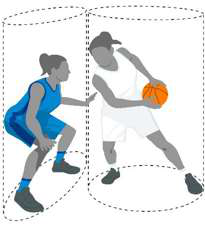

### 33.2 Principi de verticalitat

Durant el partit els jugadors tenen dret a ocupar qualsevol posició (cilindre) que no estigui ocupat per un adversari sobre el terreny de joc.

Aquest principi protegeix l’espai que ocupa el jugador al terra i l’espai per sobre seu quan salta verticalment des de aquest lloc.

Tan bon punt el jugador deixa la posició vertical (cilindre) i té lloc un contacte amb el cos amb un adversari que ha establert la seva pròpia posició vertical (cilindre), el jugador que ha deixat el cilindre és el responsable del contacte.

No es pot sancionar un defensor per saltar verticalment (dins del cilindre) o tenir les mans i els braços estesos per sobre i dins del propi cilindre.

El jugador atacant, tant si toca a terra com si està enlairat no ha de provocar un contacte amb el defensor que es troba en posició legal de defensa:

- Fent servir els braços per crear-se més espai (empenyent).

- Separant les cames o braços per provocar un contacte durant o just després d’un

llançament a cistella.

### 33.3 Posició legal de defensa

Un defensor estableix una posició legal de defensa quan:

- Encara l'adversari, i

- Té els dos peus a terra.

Aquesta posició legal de defensa s’allarga verticalment per sobre (dins del cilindre), des del terra fins el sostre. El jugador defensor pot aixecar els braços i les mans sobre el cap o saltar verticalment però ha de mantenir-los en posició vertical dins del cilindre imaginari.

### 33.4 Defensa d’un jugador que controla la pilota

Quan es tracta de defensar un jugador que controla (la té a la mà o la dribla) la pilota no es tenen en consideració els elements de temps i de distància.

Un jugador que té la pilota ha d'esperar que el defensin i ha d’estar preparat per aturar- se o canviar de direcció sempre que un adversari prengui una posició inicial legal de defensa davant d’ell, fins i tot si això es produeix en una fracció de segon.

El jugador defensor ha d'establir una posició legal de defensa sense provocar cap contacte físic previ amb el cos abans d'establir la seva posició defensiva.

Quan un defensor ha pres una posició inicial de defensa legal, es pot desplaçar per marcar l’adversari, però no pot estendre els braços, les espatlles, els malucs o les cames per impedir que el sobrepassi al jugador amb pilota. Quan un àrbitre ha de jutjar una situació de càrrega / bloqueig d'un jugador que té la pilota, ha de seguir els següents principis:

- El defensor ha d’establir una posició legal de defensa inicial posant-se de cara al

jugador que té la pilota i amb els dos peus a terra.

- El defensor pot romandre immòbil, saltar verticalment o moure's lateralment o

enrere per mantenir la seva posició legal de defensa inicial.

- Quan es mou per mantenir la posició inicial de defensa pot aixecar un peu o tots

dos peus del terra durant un instant, sempre que el moviment sigui lateral o cap enrere, però mai cap al jugador que té la pilota.

- El contacte haurà de ser en el tors, aleshores es considerarà que el defensor ha

estat el primer de collocar-se en la posició.

- Havent pres una posició de defensa legal, el defensor es pot girar a l'interior del

cilindre per evitar lesionar-se. Si es compleixen aquests punts, aleshores el culpable de la falta és el jugador que té la pilota.

### 33.5 Defensa a un jugador que no controla la pilota

Un jugador que no tingui el control de la pilota té el dret de moure's lliurement per la pista de joc i de prendre qualsevol posició que no estigui ocupada prèviament per un altre jugador. A l’hora de defensar un jugador que no té el control de la pilota, tenen aplicació els elements de temps i de distància. Això vol dir que el jugador defensor no pot prendre una posició tan propera i/o amb tanta rapidesa en la trajectòria d'un adversari en moviment que aquest darrer no tingui prou temps o distància per aturar-se o canviar de direcció. La distància és directament proporcional a la velocitat de l'adversari, però mai menys d’ 1 passa normal. Si un defensor no té en compte els elements de temps i de distància en prendre una posició inicial legal de defensa i té lloc un contacte físic amb un adversari, ell és el responsable del contacte. Quan un defensor ha pres una posició inicial legal de defensa, pot desplaçar-se per defensar a l’adversari. Però no pot provocar un contacte amb un adversari per impedir que el sobrepassi interposant els braços, les espatlles, els malucs o les cames en la seva trajectòria. Pot, girar-se dintre del cilindre, per evitar una lesió.

### 33.6 Jugador que és enlaire

Un jugador que salti enlaire des d'un lloc qualsevol de la pista té el dret de tornar a caure en el mateix lloc. Té el dret de caure en un altre lloc del camp sempre que la trajectòria i el lloc on vagi a caure no estiguin ocupats per un(s) adversari(s) en el moment de saltar. Si un jugador salta però al moment de caure, a causa de l'empenta que duia provoca un contacte amb un adversari que ha pres una posició legal de defensa més enllà del lloc de caiguda, el responsable del contacte és el jugador que ha saltat. Un jugador no té dret a posar-se en la trajectòria d'un adversari després que aquest hagi efectuat un salt.

Collocar-se sota un jugador que està enlaire i causar un contacte és habitualment una falta antiesportiva i pot, en alguns casos, ser una falta desqualificant.

### 33.7 Pantalla. Legal i illegal

Hi ha pantalla quan un jugador prova de retardar o impedir a un adversari que no controla la pilota, d'aconseguir una posició desitjada en la pista de joc.

Una pantalla és legal quan el jugador que la fa a un adversari:

Està immòbil (dins el seu cilindre) quan es produeix el contacte.

Té tots dos peus a terra quan es produeix el contacte.

Una pantalla és illegal quan el jugador que la fa a un adversari:

S'està movent quan es produeix el contacte.

No ha deixat la distància necessària en establir una pantalla fora del camp de visió d'un adversari immòbil quan es produeix el contacte.

No ha respectat els elements de temps i de distància d'un adversari en moviment quan ha tingut lloc el contacte.

Si la pantalla és dins el camp de visió (frontal o lateral) d'un adversari immòbil, se li pot acostar tant com vulgui mentre no provoqui un contacte.

Si la pantalla s’estableix fora del camp de visió d'un adversari immòbil, el jugador que fa la pantalla ha de permetre l'adversari de fer 1 passa normal vers la pantalla sense que es produeixi un contacte.

Si l'adversari està en moviment s'apliquen les nocions de temps i de distància. El jugador que fa la pantalla ha de deixar espai suficient com perquè l'adversari que rebrà la pantalla pugui evitar-la, aturant-se o canviant de direcció.

La distància requerida no ha de ser mai inferior a 1 passa normal ni superior a 2 passes normals.

Un jugador a qui s'ha fet una pantalla legal és el responsable de qualsevol contacte amb el jugador que li ha fet la pantalla.

### 33.8 Carregar

Carregarés un contacte personal illegal, amb o sense pilota, provocat per empentar o moure el tors d’un contrari.

### 33.9 Bloqueig

Un bloqueig és el contacte personal illegal que impedeix l’avançament d’un adversari amb o sense pilota.

Un jugador que intenta efectuar una pantalla comet una falta per bloqueig si el contacte es produeix mentre es mou, i el seu adversari és estàtic o allunyant-se d’ell.

Un jugador que, prescindint de la pilota, es posa de cara a un adversari i canvia de posició quan aquest també ho fa, serà el responsable principal de qualsevol contacte que es produeixi, llevat que hi intervinguin altres factors.

L'expressió "llevat que hi intervinguin altres factors" fa referència a actes deliberats com empentar, carregar o retenir per part del jugador a qui es fa la pantalla.

És legal que un jugador estengui el braç(os) o el colze(s) fora del cilindre quan guanya una posició en el camp, però el braç(os) o el colze(s) han d’estar dins del cilindre si un adversari intenta de passar. Si el braç(os) i el(s) colze(s) estan fora del cilindre i es produeix un contacte, aquest serà per bloquejar o agafar.

### 33.10 Àrees de semicercle de no càrrega

Les àrees de semicercle de no càrrega es dibuixen en el terreny de joc als efectes de designar una àrea específica per a la interpretació de situacions de càrrega / bloqueig sota la cistella. En qualsevol jugada de penetració dins l’àrea de semicercle de no càrrega, qualsevol contacte provocat per un jugador atacant enlairat sobre un jugador defensiu dins de l’àrea de semicercle de no càrrega no serà sancionat com a falta d’atac, excepte si el jugador atacant fa ús illegal de mans, braços, cames o cos. Aquesta regla s’aplica quan: El jugador atacant té el control de la pilota mentre és a l'aire, i El jugador atacant intenta un tir de camp o passa la pilota, i El jugador defensiu té un o ambdós peus en contacte amb l'àrea del semicercle de no càrrega.

### 33.11 Contactar un adversari amb la(les) mà(mans) i/o el(s) braç(os)

Tocar un adversari amb la mà o mans, no és per si mateix, necessàriament una falta. Els àrbitres han de decidir si el jugador que ha provocat el contacte, n'ha obtingut un avantatge. Si el contacte provocat per un jugador ha minvat d'alguna manera la llibertat de moviment d'un adversari, aquesta mena de contacte és una falta. Es produeix ús illegal de la(les) mà(mans) o del(s) braç(os) estés(os) quan el jugador defensor està en posició de defensa i la seva mà(mans) es posa a sobre i resta en contacte amb un adversari amb pilota o sense per impedir el seu progrés. La reiteració de tocar o "picar" un adversari, amb pilota o sense, és una falta ja que podria conduir a una escalada de la duresa del joc. Es considera una falta d’un jugador atacant que porta la pilota: Enganxar o envoltar un defensor amb el colze o el braç a fi d'obtenir-ne un avantatge. Empentar un defensor a fi d'impedir-li de jugar o intentar de jugar la pilota, o crear més espai entre ell i el defensor. Utilitzar en un driblatge l'avantbraç estès a fi d'evitar que un adversari guanyi el control de la pilota. Es considera una falta d’un jugador atacant sense pilota quan empenti per: Alliberar-se'n per rebre la pilota. Privar un adversari de jugar o intentar jugar la pilota. Crear més espai.

### 33.12 Joc de pivot

El principi de la verticalitat (principi del cilindre) s'aplicarà també al joc de pivot.

Tant el jugador atacant en posició de pivot com el defensor han de respectar els drets de verticalitat (cilindres) respectius.

Annex  Art. 33.10. Per les competicions de l’FCBQ (excepte en les Competicions
definides com Nivell 1 i 2 segons el punt 4.1. de les Disposicions Generals per
als Campionats organitzats per l’FCBQ).
A les competicions d’àmbit català (excepte en les Competicions definides com Nivell
1 i 2 segons el punt 4.1. de les Disposicions Generals per als Campionats organitzats
per l’FCBQ), la regla del semicercle de no càrrega no serà aplicada.

És una falta d’un atacant o defensor en posició de pivot per 'empentar el seu adversari amb les espatlles o els malucs per fer-lo fora de la seva posició, o interferir la llibertat de moviment de l’oponent valent-se dels braços o colzes estesos, espatlles, cames, genolls, o altres parts del cos.

### 33.13 Defensa illegal per l’esquena

Defensa illegal per l’esquena és un contacte personal provocat per un defensor des de darrere amb un adversari. El simple fet que el defensor s'esforci a disputar una pilota no justifica un contacte amb l'adversari des de darrere.

### 33.14 Agafar

Agafar és un contacte personal illegal amb un adversari a qui es redueix la llibertat de moviment. Aquest contacte (per agafar) pot fer-se amb qualsevol part del cos.

### 33.15 Empentar

Empentar és un contacte personal illegal amb qualsevol part del cos que es produeix quan un jugador desplaça o intenta desplaçar un adversari per força, tingui o no aquest la pilota.

### 33.16 Simular rebre una falta

Simular és qualsevol acció d'un jugador per fer veure que ha rebut una falta o realitzar moviments teatrals exagerats per tal de crear una opinió sobre haver rebut una falta i, per tant, obtenint un avantatge.

## Art. 34 Falta personal

### 34.1 Definició

#### 34.1.1

Una falta personal és un contacte illegal d’un jugador que implica un contacte illegal amb un adversari, ja sigui la pilota viva o morta.

Un jugador no ha d’agafar, blocar, retenir, empentar, fer la traveta, carregar a un adversari ni impedir-li que avanci estenent la mà(mans), els braços, colzes, espatlles, els malucs, les cames, els genolls, els peus o bé doblegant el cos de forma “anormal” (fora del seu cilindre) ni realitzarà accions brusques o violentes.

#### 34.1.2

Una falta de servei és una falta personal comesa, quan el rellotge del partit indica 2:00 minuts o menys en el 4t quart i en cada pròrroga, per part d’un jugador defensor sobre un oponent al terreny de joc quan la pilota està encara en mans de l'àrbitre o a disposició d’un jugador per efectuar un servei.

### 34.2 Sanció

S’anotarà una falta personal a l’infractor.

#### 34.2.1

Si la falta es comet sobre un jugador que no està en acció de tir:

El joc es reprendrà amb un servei des de fora de la pista de joc per part de l’equip no infractor des del punt més pròxim d'on s'ha comès la infracció.

Si l'equip infractor està en situació de penalització per faltes d’equip, aleshores s'aplicarà l'Art. 41.

#### 34.2.2 Si la falta es comet sobre un jugador que està en acció de tir, aquell jugador disposarà

del següent nombre de tirs lliures:

Si encistella des del terreny de joc, aquest bàsquet serà vàlid i a més es concedirà 1 llançament lliure.

En cas de tir fallat realitzat des de l’àrea de 2 punts, es concediran 2 tirs lliures.

En cas de tir fallat realitzat des de l’àrea de 3 punts, es concediran 3 tirs lliures.

#### 34.2.3

Si es comet una falta de servei:

El jugador que ha patit aquesta falta rebrà 1 tir lliure, independentment de si l’equip infractor es troba en situació de penalització de faltes d’equip. El joc es reprendrà amb  servei per part de l'equip no infractor al lloc més proper a la infracció.

## Art. 35 Doble falta

### 35.1 Definició

#### 35.1.1

Una doble faltaés una situació en què 2 adversaris cometen faltes personals, antiesportives o desqualificants, l'un contra l'altre, aproximadament al mateix temps.

#### 35.1.2

Per tal que 2 faltes siguin considerades com una doble falta, s’han de complir les següents condicions:

Ambdues faltes són faltes de jugador.

Ambdues faltes impliquen contacte físic.

Ambdues faltes es produeixen entre 2 rivals que es fan falta entre ells.

Ambdues faltes són 2 faltes personals o qualsevol combinació de faltes antiesportives o desqualificants.

### 35.2 Sanció

S'anotarà una falta personal, antiesportiva o desqualificant en el compte de cada jugador infractor. No es concedirà cap llançament lliure i el joc es reprendrà de la següent manera: Si, aproximadament al mateix temps que es produeix la doble falta: S'aconsegueix una cistella, o es converteix l’últim tir lliure, es concedirà la pilota a l’equip que l’ha rebut per realitzar un servei des de qualsevol lloc darrere de la línia de fons de la seva pista. Un equip tenia control de la pilota o tenia dret a la possessió d’aquesta, el servei es concedirà a aquest equip per a un servei des del lloc més proper on s’hagués comès la infracció. Cap dels equips no tenia el control de la pilota ni el dret a la possessió, es produeix una situació de salt.

## Art. 36 Falta tècnica

### 36.1 Regles de conducta

#### 36.1.1

El desenvolupament normal del joc exigeix la total i lleial collaboració dels jugadors, entrenadors, segons entrenadors, substituts, jugadors exclosos i acompanyats amb els àrbitres, auxiliars de taula i comissaris, si n’hi hagués.

#### 36.1.2 Els dos equips tenen el dret a esforçar-se al màxim per assegurar-se la victòria, a

condició tanmateix, de fer-ho amb un esperit d'esportivitat i joc net.

#### 36.1.3

Es considerarà una falta tècnica qualsevol falta de cooperació o desobediència deliberada o reiterada a l’esperit i propòsit d’aquesta regla.

#### 36.1.4

Els àrbitres poden prevenir les faltes tècniques advertint els membres dels equips o no sancionant infraccions tècniques menors, ja que aquestes es poden produir sense intenció i no tenen un efecte directe dins el joc, llevat que es produeixi una repetició de la mateixa mena després d’haver efectuat ja un avís.

#### 36.1.5

Si es descobreix una infracció quan la pilota ja està viva, el joc s’aturarà i es sancionarà la falta tècnica. La penalització s’aplicarà com si la falta tècnica s'hagués produït en el moment de ser assenyalada. Tot el que hagi passat en l’interval entre el moment de la infracció i l’aturada del partit serà vàlid.

### 36.2 Definició

#### 36.2.1

Una falta tècnica és una falta per la conducta d’un jugador que no implica contacte, que inclou però no es limita a:

- Mostrar-se indiferent als advertiments dels àrbitres.

- Tractar o comunicar-se de forma irrespectuosa amb els àrbitres, comissari, oficials

de taula, rivals o persones autoritzades a romandre a la banqueta d’equip.

- Usar un llenguatge o realitzar gestos susceptibles d'ofendre o d'incitar els

espectadors.

- Burlar-se o provocar a un oponent

- Molestar un adversari o impedir-li la visió del joc movent les mans davant dels ulls

de l’adversari.

- Moviment excessiu dels colzes.

- Retardar el joc deliberadament tocant la pilota després que aquesta travessi la

cistella o també per evitar que un servei es realitzi amb rapidesa.

- Simular haver rebut una falta.

- Agafar-se de l’anella de manera que suporti tot el pes del jugador, a menys que

l’agafi momentàniament després d’una esmaixada o que intenti evitar lesionar-se o lesionar a un altre jugador.

- Quan un jugador defensor realitzi una interposició durant l’últim tir lliure. Es

concedirà 1 punt per l’equip atacant, i seguidament es sancionarà amb una falta tècnica al jugador defensor.

#### 36.2.2

Una falta tècnica de qualsevol persona autoritzada a seure a la banqueta de l’equip es comet pel fet de dirigir-se o tocar irrespectuosament els àrbitres, comissari, oficials de taula o adversaris, o per una infracció de caràcter de conducta o administrativa.

#### 36.2.3

Un jugador serà desqualificat per la resta del partit (GD) quan sigui sancionat amb 2 faltes tècniques, o 2 faltes antiesportives, o amb 1 falta antiesportiva i 1 tècnica.

#### 36.2.4 L’entrenador serà desqualificat per la resta del partit (GD) quan sigui sancionat amb:

2 faltes tècniques (‘C’) com a resultat del seu comportament personal antiesportiu 3 faltes tècniques, totes (‘B’) o una d’elles (‘C’) com a conseqüència del comportament antiesportiu d’altres persones autoritzades a seure a la banqueta de l’equip.

#### 36.2.5 Si un jugador o entrenador és desqualificat degut als articles 36.2.3 o 36.2.4  aquesta

falta tècnica serà l’única que es penalitzarà, i no s’administraran penalitzacions addicionals per la desqualificació.

### 36.3 Sanció

#### 36.3.1 Si es comet una falta tècnica:

Per part d’un jugador, se li anotarà una falta tècnica com a falta de jugador i comptarà per a les faltes d’equip. Per part de qualsevol persona autoritzada a seure a la banqueta de l’equip s’anotarà una falta tècnica a l’entrenador i no comptarà per les faltes d’equip.

#### 36.3.2

Es concedirà 1 tir lliure als adversaris. El joc es reprendrà de la següent forma: El tir lliure s’administrarà immediatament. Després del tir lliure, el servei de banda serà administrat per l’equip que tenia el control de la pilota o el dret a disposar de la pilota en el moment en que es va sancionar la falta tècnica, des del lloc més proper a on es trobava la pilota en el moment en que el joc es va aturar. El tir lliure també s'administrarà immediatament, independentment de l’ordre que s’hagi establert per administrar possibles penalitzacions d’altres faltes, fins i tot si s’ha començat a administrar una penalització. Després del tir lliure corresponent a la falta tècnica, el joc es reprendrà per part de l’equip que en tenia el control o el dret a disposar de la pilota, des del lloc més proper a on es trobava la pilota en el moment en que el joc es va aturar. Si s’ha aconseguit una cistella, o el darrer tir lliure ha estat convertit, el joc es reprendrà amb un servei des de qualsevol lloc de la línia de fons. Si cap equip tenia el control, ni el dret a disposar de la pilota, es tracta d’una situació de salt entre dos. Amb una situació de salt entre dos al cercle central a l’inici del primer quart.

## Art. 37 Falta antiesportiva

### 37.1 Definició

#### 37.1.1

Una falta antiesportiva és una falta amb contacte comesa per un jugador que és:

Un contacte amb un oponent no fent un esforç legítim de jugar directament la pilota segons l’esperit i la intenció de les regles.

Un contacte excessiu o dur causat per un jugador que fa un esforç per jugar la pilota o sobre un oponent. Un contacte innecessari per part d’un defensor que tracta d’aturar la progressió d’un equip en transició. Això s’aplica fins que el jugador atacant inicia l’acció de llançament. Un contacte illegal provocat pel jugador defensor pel darrere o lateralment sobre un oponent que progressa cap a la cistella del rival sense que hi hagi cap altre jugador defensor entre el jugador atacant i la cistella i - El jugador que progressa té el control de la pilota, o - Intenta obtenir el control de la pilota, o - S’ha passat la pilota a aquest jugador que progressa

Això s’aplica fins que el jugador atacant inicia l’acció de tir.

#### 37.1.2

Els àrbitres han de valorar les faltes antiesportives de forma consistent durant tot el partit i jutjar només l’acció.

### 37.2 Sanció

#### 37.2.1

S'anotarà una falta antiesportiva a l’infractor:

#### 37.2.2 Es concediran tir(s) lliure(s) al jugador que ha rebut la falta, seguits de:

Un servei de banda des de la línia de servei de la pista davantera, enfront la taula d’auxiliars.

Un salt entre dos en el cercle central per començar el primer quart.

El nombre de tirs lliures concedits serà el següent:

Si la falta ha estat comesa sobre un jugador que no estava en acció de tir: 2 llançaments lliures.

Si la falta ha estat comesa sobre un jugador en acció de tir: si l'encistella, el bàsquet serà vàlid i a més se li concedirà 1 llançament lliure.

Si la falta ha estat comesa contra un jugador en acció de tir que no ha reeixit, 2 o 3 llançaments lliures.

#### 37.2.3 Un jugador serà desqualificat pel que resta de partit quan se li carreguin 2 faltes

antiesportives, o 2 faltes tècniques, o amb 1 falta tècnica i 1 antiesportiva.

#### 37.2.4

Si un jugador és desqualificat per l’article 37.2.3, aquesta falta antiesportiva serà l’única que es penalitzarà, i no s’administrarà cap penalització addicional per la falta desqualificant.

## Art. 38 Falta desqualificant

### 38.1 Definició

#### 38.1.1

Una falta desqualificant és qualsevol acció antiesportiva flagrant comesa per jugadors, substituts, entrenadors, entrenadors ajudants, jugadors eliminats i acompanyants d’equip.

#### 38.1.2

Un entrenador que ha rebut una falta desqualificant serà substituït pel primer ajudant d’entrenador inscrit en l'acta del partit. Si no hi ha cap primer ajudant d’entrenador inscrit a l’acta, serà substituït pel capità (CAP).

### 38.2 Violència

#### 38.2.1

Actes de violència contraris a l'esperit esportiu i al 'fair-play' es poden arribar a produir durant el joc. Aquests actes han de ser immediatament tallats pels àrbitres, i, si cal, per les forces de manteniment de l’ordre públic.

#### 38.2.2

Cada vegada que es produeixin actes de caràcter violent en els que es vegin implicats jugadors a la pista de joc o a les seves proximitats, els àrbitres han de prendre les mesures necessàries per a tallar-les.

#### 38.2.3

Tota persona, entre les mencionades, responsable d’una agressió flagrant contra adversaris o àrbitres ha de ser desqualificada del joc. Tot seguit l’àrbitre haurà d'informar de l'incident a l'organisme responsable de la competició.

#### 38.2.4

Les forces d'ordre públic no poden entrar en la pista de joc a no ser que siguin requerides pels àrbitres. Amb tot, si els espectadors envaeixen la pista de joc amb la intenció manifesta de cometre actes de violència, les forces d'ordre públic han d'intervenir immediatament per protegir jugadors i àrbitres.

#### 38.2.5

Totes les àrees al costat de la pista de joc i els seus voltants, incloent les entrades i sortides, corredors, vestuaris, etc. resten sota la jurisdicció dels organitzadors i de les forces responsables de mantenir l'ordre públic.

#### 38.2.6

Els àrbitres no poden permetre cap acció física duta a terme per jugadors o per qualsevol persona autoritzada a seure a la banqueta de l’equip que pugui comportar malmetre qualsevol equipament relacionat amb el joc.

Quan els àrbitres observin un comportament d’aquesta naturalesa, advertiran immediatament l’entrenador de l’equip infractor.

Si aquesta conducta es reprodueix, es sancionarà immediatament amb una falta tècnica, o fins i tot amb una falta desqualificant a la(les) persona(es) implicada(es).

38.3.       Sanció

#### 38.3.1

S'anotarà una falta desqualificant a l’infractor.

#### 38.3.2

Sempre que es desqualifiqui a l’infractor d’acord als respectius articles d’aquestes regles, haurà d'anar als vestidors de l’equip i romandre-hi durant tot el partit o haurà abandonar les installacions.

#### 38.3.3

Es concediran tir(s) lliure(s):

A qualsevol adversari, designat per l’entrenador, en el cas de faltes sense contacte.

Al jugador que va rebre la falta, en el cas de faltes amb contacte.

Seguits de:

Un servei de banda des de la línia de servei a la pista davantera, enfront la taula d’auxiliars.

Un salt entre dos en el cercle central per començar el primer quart.

#### 38.3.4

El nombre de tirs lliures concedits serà el següent:

Si es tracta d’una falta sense contacte: 2 tirs lliures.

Si la falta és comesa sobre el jugador que no està en acció de tir: 2 tirs lliures

Si la falta és comesa sobre un jugador en acció de tir: si el tir es convertit la cistella serà vàlida i es concedirà 1 tir lliure addicional.

Si la falta és comesa sobre un jugador en acció de tir i aquest no és convertit: 2 o 3 tirs lliures

Si es desqualifica a l’entrenador: 2 tirs lliures.

Si es desqualifica al primer ajudant d’entrenador, un substitut, jugador eliminat o a un acompanyant de l’equip, es carregarà una falta tècnica a l’entrenador: 2 tirs lliures.

A més, si la desqualificació del primer ajudant d’entrenador, del substitut, del jugador eliminat o d’un acompanyant d’equip per abandonar l’àrea de banqueta és per participar activament en una baralla:

- Per cadascuna de les faltes desqualificants del primer ajudant d’entrenador, substituts o jugadors eliminats: 2 tirs lliures. Totes les faltes desqualificants seran carregades al jugador infractor.

- Per cada falta desqualificant d’un acompanyant de l’equip: 2 tirs lliures. Totes les faltes desqualificants es carregaran a l’entrenador.

Totes les penalitzacions de tirs lliures s’administraran, excepte aquelles penalitzacions iguals entre adversaris que seran cancellades.

## Art. 39 Baralles

### 39.1 Definició

Una baralla és una acció física mútua entre 2 o més adversaris (jugadors, substituts, entrenadors, ajudants d’entrenador, jugadors exclosos i acompanyants d’equip).

Aquest article concerneix només als substituts, entrenadors, primers ajudants d’entrenador, jugadors exclosos i acompanyants d’equip que abandonen els límits de l’àrea de banqueta d'equip durant una baralla o durant una situació que pot portar a una baralla.

### 39.2 Regla

#### 39.2.1

Qualsevol substitut, jugador exclòs o acompanyant d’equip que surti dels límits de la banqueta d'equip durant una baralla o durant qualsevol situació que pugui portar a una baralla, serà desqualificat.

#### 39.2.2

Només l'entrenador i el primer ajudant d’entrenador està(n) autoritzat(s) a sortir dels límits de la banqueta d'equip durant una baralla o durant tota situació que pugui conduir a una baralla a fi de prestar ajuda als àrbitres per mantenir o restablir l'ordre. En aquest cas no serà(n) desqualificat(s).

#### 39.2.3

Si l'entrenador i el primer ajudant d’entrenador surt(en) dels límits de la banqueta d'equip i noajuda(en) o ho intenta(en) a mantenir o restablir l'ordre, serà(n) desqualificat(s).

### 39.3 Sanció

#### 39.3.1

Independentment del nombre de persones desqualificades per sortir dels límits de la banqueta, es carregarà una única falta tècnica a l’entrenador anotada com “B”.

#### 39.3.2

Si persones d’ambdós equips són desqualificades segons aquest article i no hi ha altres sancions de faltes per administrar, el partit es reprendrà de la següent manera:

Si aproximadament al mateix temps d’aturar-se el joc a causa de la baralla:

S’anota una cistella o l’últim tir lliure, la pilota haurà de ser concedida a l’equip que ha rebut la cistella per realitzar un servei des de qualsevol posició darrera de la seva línia de fons.

Un equip tenia el control de la pilota o el dret d’aquesta, es concedirà la pilota perquè aquest equip realitzi un servei des del punt més proper a on estava la pilota en el moment en que es va iniciar la baralla.

Cap equip tenia el control de la pilota ni el dret de tenir-la, es produeix una situació de salt entre dos.

#### 39.3.3

Totes les faltes desqualificants seran enregistrades tal com es descriu a l’apartat B.8.3 i no comptaran com a faltes d’equip.

#### 39.3.4

Totes les possibles penalitzacions de faltes comeses per jugadors a la pista de joc durant una baralla, o durant qualsevol situació que pot derivar en una baralla s’administraran d’acord amb l’Art. 42.

#### 39.3.5

Totes les possibles penalitzacions corresponents a faltes desqualificants de primer ajudant d’entrenador, substituts, jugadors exclosos o acompanyants d’equip, que hagin participat de forma activa en una baralla, o en qualsevol situació que va provocar la baralla, es penalitzaran d’acord amb l’Art.38.3.4, sisè punt.

# Regla 7 DISPOSICIONS GENERALS

## Art. 40 Límit de faltes d’un jugador/entrenador i desqualificacions del partit

### 40.1

Un jugador que ha comès 5 faltes, n'ha de ser informat per un dels àrbitres i ha d’abandonar la pista immediatament.

### 40.2

Un jugador-entrenador que ha comès 5 faltes com a jugador és un jugador eliminat però pot continuar com a entrenador.

### 40.3

Les faltes comeses per un jugador que prèviament havia comès la seva 5a falta es consideren faltes de jugador eliminat i es carregaran i anotaran a l’acta a l’entrenador (‘B’).

### 40.4

Un jugador que ha comès dues faltes tècniques o 2 faltes antiesportives o 1 falta antiesportiva i 1 falta tècnica haurà de ser informat de la seva desqualificació del partit pel cronometrador qui aixecarà l’indicador de desqualificat del partit (GD).

### 40.5

Un entrenador que ha comès 2 faltes tècniques (‘C’) a causa de la seva conducta personal antiesportiva o 3 faltes tècniques, algunes d’elles (‘B’) o una d’elles (‘C’) haurà de ser informat de la seva desqualificació del partit pel cronometrador qui aixecarà l’indicador de desqualificat del partit (GD).

### 40.6

Qualsevol jugador, substitut, entrenador, ajudant, jugador eliminat, o acompanyant d’equip desqualificat ha d’abandonar el partit immediatament (trigant no més de 30 segons) i haurà de dirigir-se al vestidor de l’equip pel que resti de partit o bé abandonar les installacions.

## Art. 41 Faltes d’equip: sanció

### 41.1 Definició

#### 41.1.1

Una falta d’equip és una falta personal, tècnica, antiesportiva o desqualificant comesa per un jugador. Un equip es troba en situació de faltes d’equipdesprés de cometre 4 faltes en un quart.

#### 41.1.2

Totes les faltes dels membres de l'equip comeses durant un interval de joc es consideraran que formen part del següent quart o pròrroga.

#### 41.1.3

Totes les faltes d’equip comeses en qualsevol pròrroga es consideraran com si s’haguessin comès durant el quart quart.

### 41.2 Regla

#### 41.2.1

Quan un equip es troba en la situació de penalització per faltes d’equip, totes les faltes personals comeses a continuació sobre un jugador que no es troba en acció de tir seran sancionades amb 2 tirs lliures, en comptes de donar la possessió a l’equip per a fer un servei. Els tirs lliures els llançarà el jugador sobre el qual es va cometre la falta.

#### 41.2.2

En cas que una falta sigui comesa per un jugador mentre el seu equip té el control de la pilota o bé si l’equip tenia el dret de la pilota per fer un servei, la falta personal es sancionarà amb un servei per l’equip contrari.

## Art. 42 Situacions especials

### 42.1 Definició

Durant el període de temps on el rellotge està aturat després d’una infracció, poden ocórrer situacions especials quan es comet(en), o s’ha(n) comès amb anterioritat, infracció(ns) addicional(s).

### 42.2 Procediment

#### 42.2.1

S’anotaran totes les faltes i s’identificaran les sancions.

#### 42.2.2

Es determinarà l’ordre segons el qual s’han comès totes les infraccions.

#### 42.2.3

Totes les sancions contra ambdós equips que siguin iguals i totes les sancions degudes a faltes dobles seran cancellades en l’ordre en què van ser assenyalades. Un cop  les penalitzacions s’han anotat i cancellat es considerarà que mai no han ocorregut.

#### 42.2.4

Si es sanciona una falta tècnica, la seva penalització serà la primera en administrar- se, independentment que ja s’hagi determinat l’ordre de les penalitzacions, o fins i tot si ja s’ha iniciat l’administració d’aquestes penalitzacions. Si es sanciona una falta tècnica a l'entrenador per la desqualificació del primer ajudant d’entrenador, la d'un substitut, un jugador eliminat o un membre de la banqueta, aquesta penalització serà la primera en administrar-se. S'administrarà en l'ordre en que s'hagin produït totes les faltes i violacions, excepte si aquestes han estat cancellades.

#### 42.2.5

El dret a la possessió de pilota com a part de l’última penalització administrada anullarà qualsevol dret anterior a la possessió de la pilota.

#### 42.2.6

Una vegada la pilota estigui viva pel primer tir lliure o el servei de banda d’una penalització, la sanció ja no podrà ser utilitzada per cancellar sancions pendents.

#### 42.2.7

Totes les sancions pendents s’administraran segons l’ordre en què s’hagin comès.

#### 42.2.8

Si, després de la cancellació de sancions iguals contra ambdós equips, no n’hi ha cap sanció més per administrar, el partit es reprendrà de la següent manera: Si aproximadament al mateix temps que la primera infracció: S’encistella un tir de camp o l’últim tir lliure, es concedirà la pilota a l’equip que l’ha rebut perquè realitzi un servei des de qualsevol posició darrere de la línia de fons d’aquest equip. Un equip tenia el control de la pilota o el seu dret, se li concedirà la pilota perquè realitzi un servei des del punt més proper on s’ha comès la primera infracció. Cap equip tenia el control de la pilota ni el seu dret, es produeix una situació de salt entre dos.

## Art. 43 Llançaments lliures

### 43.1 Definició

#### 43.1.1

Un llançament lliure és una oportunitat donada a un jugador per marcar 1 punt amb un tir a cistella sense oposició des d'una posició darrere de la línia de llançaments lliures i dins del semicercle.

#### 43.1.2

Una sèrie de tirs lliures són tots els tirs lliures i el possible servei de banda posterior que es produeixen com a resultat d’una sanció per una única falta. 43.2        Regla

#### 43.2.1

Quan s’assenyala una falta personal, antiesportiva o desqualificant amb contacte, els tir(s) lliure(s) es concediran de la següent manera: El jugador objecte de la falta serà el que el(s) llenci. Si hi ha una petició per substituir-lo, cal que llanci el(s) tir(s) lliure(s) abans de ser substituït. Si ha d’abandonar el partit per lesió, per haver comès la seva 5a falta o per haver estat desqualificat, el substitut llançarà el(s) tir(s) lliure(s). Si no es disposa de cap substitut, el(s) llançarà qualsevol company d’equip designat per l’entrenador.

#### 43.2.2

Quan s’assenyala una falta tècnica o una falta desqualificant sense contacte, qualsevol jugador de l’equip adversari designat per l’entrenador podrà llançar el(s) tir(s) lliure(s).

#### 43.2.3

El llançador dels tirs lliures: Ocuparà una posició darrere de la línia de tirs lliures dins del semicercle. Podrà utilitzar qualsevol mètode per efectuar els llançaments però haurà de fer que la pilota entri a la cistella per la seva part superior o toqui l’anella. Deixarà anar la pilota abans de 5 segons des que l’àrbitre la posa a la seva disposició. No trepitjarà la línia de tirs lliures ni entrarà a l’àrea restringida fins que la pilota hagi entrat a la cistella o hagi tocat l’anella. No fintarà el tir lliure.

#### 43.2.4

Els jugadors situats en el passadís de tirs lliures tenen dret a ocupar posicions alternes en aquest passadís. Cada posició es considera que té 1 metre de profunditat (esquema 6). Durant els tirs lliures aquests jugadors: No ocuparan posicions del passadís de tirs lliures a les que no tinguin dret. No entraran en l’àrea restringida, en l’àrea neutral, ni abandonaran la seva posició de rebot del tir lliure fins que la pilota hagi abandonat la(es) mà(ns) del llançador. No distrauran el llançador del tir lliure amb les seves accions.

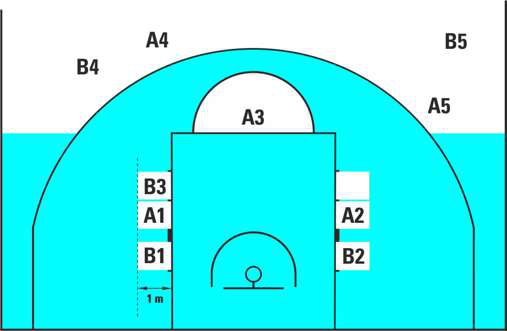

#### 43.2.5

Els jugadors que no estiguin situats en el passadís de tirs lliures romandran per darrere de la prolongació de la línia de tirs lliures i de la línia de llançament de 3 punts fins que el tir lliure finalitzi.

#### 43.2.6

Durant un o diversos tirs lliures que siguin seguits d’una(es) altra(es) sèrie(es) de tirs lliures o d’un servei, tots els jugadors romandran per darrere de la prolongació de la línia de tirs lliures i de la línia de llançament de 3 punts. Una infracció dels articles Art. 43.2.3, 43.2.4, 43.2.5 or 43.2.6 és una violació.

### 43.3 Sanció

#### 43.3.1

Si el tir lliure és encistellat i la(es) violació(ns) és comesa pel llançador dels tirs lliures el punt no serà vàlid. Es concedirà als adversaris un servei des de la prolongació de la línia de tirs lliures, a no ser que quedin per administrar un o més tirs lliures o un servei de banda que forma part de la sanció.

#### 43.3.2

Si es converteix un tir lliure i la(es) violació(ns) la(es) comet(en) qualsevol jugador que no sigui el llançador: El punt serà vàlid. La violació o violacions s’ignoraran. Si es tracta de l’últim o únic tir lliure, la pilota es concedirà als adversaris perquè realitzin un servei des de qualsevol lloc darrera de la línia de fons d’aquest equip.

#### 43.3.3

Si no es converteix el tir lliure i comet la violació:

El tirador o un company del seu equip durant l’últim tir lliure, es concedirà als adversaris un servei des de la prolongació de la línia de tirs lliures llevat que el mateix equip tingui el dret a una possessió posterior.

Un adversari del tirador, se li concedirà a aquest un nou tir lliure.

Ambdós equips en l’últim tir lliure, el joc es reprendrà amb una situació de salt.

## Art. 44 Errors rectificables

### 44.1 Errors rectificables – Procediments generals

44.1.1 Un àrbitre pot aturar el partit immediatament si detecta un error corregible, excepte si deixa qualsevol equip en desavantatge. 44.1.2 Qualsevol falta comesa, temps transcorregut i activitat addicional que hagi ocorregut després de l’error i abans de ser detectat continuarà considerant-se vàlida. 44.1.3 Després de la correcció de l’error, el joc continuarà des del lloc més proper on es va aturar el partit per corregir l’error. La pilota es concedirà a l’equip que en tenia dret en el moment en el que el partit es va aturar per corregir l’error.

### 44.2 Errors rectificables de categoria 1 – Definició

Els següents errors de categoria 1 poden ser corregits pels àrbitres i s’aplica incorrectament una regla. Concedir un o diversos llançament(s) lliure(s) no merescut(s). No concedir un llançament(s) lliure(s) merescut(s). Permetre a un jugador, a qui no correspon, d'intentar un(s) llançament(s) lliure(s). Indicar a un jugador, a qui no correspon, d'intentar un(s) llançament(s) lliure(s). Concedir o anullar punt(s) per error. Comunicar incorrectament faltes a un jugador, entrenador o equip. Errades en l’anotació, incloent: - Oblidar anotar punts o fer-ho per error. - Oblidar anotar faltes a jugadors, entrenadors i equips o bé fer-ho per error. - Oblidar anotar temps morts a un equip o bé fer-ho per error. Errades del rellotge de joc, incloent mal funcionament, en les posades en marxa o aturades del rellotge o en indicar el temps correcte de joc al rellotge.

### 44.3 Errors rectificables de categoria 1 – Procediments generals

44.3.1 Per poder ser rectificables, els àrbitres, comissari, si n’hi ha, o auxiliars de taula els han de descobrir de la següent manera: Si l’error es comet abans de que el rellotge de joc mostri 2:00 minuts o menys en el 4t quart, l’error pot ser corregit abans de que restin 2:00 minuts o menys en el rellotge de joc. Si l’error es comet abans de que el rellotge de joc mostri 2:00 o menys en el 4t quart, però els àrbitres no aturen el partit per primer cop fins que resten menys de 2:00 en el rellotge de joc, l’error es podrà corregir fins que la pilota esdevingui viva de nou. Si l’error es comet després que el rellotge de joc mostri menys de 2:00 minuts en el 4t quart o en una pròrroga, l’error es podrà corregir abans de que la pilota estigui viva de nou després de que els àrbitres haguessin aturat per primer cop el partit per qualsevol raó després de l’error. 44.3.2 Els errors no seran corregibles un cop la pilota esdevingui morta quan soni el senyal del rellotge de joc indicant el final del partit a menys que l’error hagi passat després de la darrera vegada que els àrbitres han aturat el partit per qualsevol raó vàlida abans del so del senyal del rellotge de joc indicant el final del partit. En aquest cas, l’error es podrà corregir de manera immediata després del final del partit i els equips hauran de romandre a la pista o a les seves zones de banqueta. 44.3.3 Un cop s’hagi identificat un error que es pot corregir, i: Si el membre de l’equip involucrat en la correcció de l’error es troba a la banqueta després d’haver estat substituït legalment, aquest membre de l’equip ha de tornar a entrar a la pista per participar en la correcció de l’error, en aquest moment torna a ser jugador. Després de completar la correcció, el jugador podrà seguir jugant, excepte si s’ha tornat a sollicitar una substitució reglamentària; en aquest cas el jugador haurà d’abandonar la pista de joc. Si el jugador ha eliminat, desqualificat, no pot continuar jugant a causa d’una lesió o no pot ser identificat, l’entrenador haurà de designar el membre d’equip que participarà en la correcció de l’error.

### 44.4 Errors corregibles de categoria 1 - Procediments especials

44.4.1 Concedir tir(s) lliure(s) no merescuts:

Es cancellaran el(s) tir(s) lliure(s) llançats com a resultat d’un error i el partit es reprendrà de la següent manera:

Si el rellotge del partit no s’ha posat en marxa després de l’error, es concedirà un servei des de la línia de banda a l’alçada de la prolongació de la línia de tirs lliures a l’equip al que se li han cancellat els tirs lliures.

Si el rellotge del partit s’ha posat en marxa després de l’error, el joc continuarà des del lloc més proper on es va aturar per corregir l’error.

44.4.2     No concedir un o diversos tirs lliures als qui en tenien dret:

Si la possessió de la pilota no ha canviat des que s’ha comès l’error, el joc es reprendrà després de la correcció de l’error com després d’un tir lliure normal.

Si el mateix equip aconsegueix una cistella després que se li ha concedit per error un servei, s’ignorarà l’error.

Si el rellotge de joc s’ha posat en marxa, i hi ha hagut un canvi de possessió després de la correcció de l’error, el joc continuarà des del lloc més proper on es va aturar per corregir l’error.

44.4.3       Permetre al jugador equivocat llançar tir(s) lliure(s):

Es cancellaran els tirs lliures, així com la possessió de la pilota si forma part de la penalització. Es concedirà la pilota als adversaris perquè efectuïn un servei des de l’alçada de la prolongació de la línia de tirs lliures, excepte si el partit ha continuat i es va aturar per corregir l’error, en aquest cas el partit es reprendrà des del lloc més proper on es va aturar per corregir l’error.

44.4.4       Indicar al jugador equivocat que ha llançar tir(s) lliure(s):

Es cancellaran els tirs lliures intentats i es permetrà al jugador correcte llançar de nou els tirs lliures. El joc continuarà com després de qualsevol darrer tir lliure, excepte si el joc havia continuat i va ser aturat per la correcció de l’error, en aquest cas el joc continuarà des del lloc més proper on es va aturar per corregir l’error.

44.4.5       Concedir o cancellar punts per error:

Es cancellaran o es concediran els punts. Es corregirà l’acta de joc. El joc continuarà des del lloc més proper on es va aturar per corregir l’error.

44.4.6       Comunicar erròniament una falta d’un jugador, entrenador o equip:

Es corregirà l’acta. Qualsevol jugador o entrenador eliminat o desqualificat per error tornarà al partit. Qualsevol jugador o entrenador que hagués de ser eliminat o desqualificat, serà eliminat o desqualificat.

44.4.7       Errades d’anotació a l’acta

- Anotar per error o no anotar punts.

- Anotar per error o no anotar faltes a un jugador, entrenador o equip.

- Anotar o no anotar per error un temps mort:

L’acta es corregirà i s’aplicarà qualsevol acció resultant de la correcció, tal com eliminar o incorporar de nou al partit un jugador.

44.4.8 Errades del rellotge de joc, incloent mals funcionaments, en posar en marxa o aturar el rellotge de joc de manera correcta o errors en posar el temps correcte en el rellotge de joc:

El rellotge de joc es corregirà afegint o restant tant temps com sigui necessari per corregir l’error.

### 44.5 Errors rectificables de categoria 2 – Definició

Els següents errors de categoria 2 poden ser corregits pels àrbitres i s’aplica incorrectament una regla: Errors del rellotge de llançament, incloent mals funcionaments, en posar en marxa o aturar de manera correcta el rellotge de llançament o en posar el temps correcte en el rellotge de llançament.

### 44.6 Errors rectificables de categoria 2 – Procediments generals

44.6.1 Per poder ser rectificables, els àrbitres, comissari, si n’hi ha, o auxiliars de taula els han de descobrir: Quan la pilota està viva immediatament després de l’error i els àrbitres aturen el joc per corregir l’error, o Quan els àrbitres han aturat el partit per primer cop o per qualsevol raó, i l’equip que tenia el control de la pilota o el seu dret en el moment de l’error continua sent el mateix,

El rellotge de llançament es corregirà per a que mostri el temps correcte. 44.6.2 Els errors en el rellotge de llançament ja no seran corregibles després:

- D’un canvi de possessió d’una pilota viva després de l’error.

- L’equip amb control de la pilota encistella legalment,

- La pilota esdevé morta quan el rellotge de joc sona indicant el final del partit.

# Regla 8 ÀRBITRES, AUXILIARS DE TAULA, COMISSARIS: DEURES I OBLIGACIONS

## Art. 45 Els àrbitres, auxiliars de taula i comissari

### 45.1

Els àrbitres seran un àrbitre principal i 1 o 2 àrbitres auxiliars. Estaran assistits pels auxiliars de taula i un comissari, si hi és present.

### 45.2

Els auxiliars de taula seran un anotador, un ajudant d’anotador, un cronometrador i un operador del rellotge de llançament.

### 45.3

El comissari s’haurà d'asseure entre l'anotador i el cronometrador. La seva funció principal serà supervisar la feina dels auxiliars de taula i assistir l'àrbitre principal i  els àrbitre(s) auxiliar(s) per aconseguir un correcte desenvolupament del partit.

### 45.4

Els àrbitres designats per a un partit no han de tenir cap vinculació amb cap dels equips representats a la pista de joc.

### 45.5 Els àrbitres, els auxiliars de taula i el comissari han de dirigir el joc conforme al

reglament i no tenen autoritat per canviar cap d’aquestes regles.

### 45.6

L'uniforme dels àrbitres està compost per una samarreta d’àrbitre, pantaló llarg negre, sabatilles de basquetbol negres i mitjons negres.

### 45.7

Els àrbitres i els auxiliars de taula estaran uniformats.

## Art. 46 Àrbitre principal: deures i obligacions

L'àrbitre principal ha de:

### 46.1

Verificar i aprovar tot l'equipament que s'utilitzarà durant el joc.

### 46.2

Designar quin serà el rellotge oficial del partit, el rellotge de llançament, el cronòmetre i identificarà els auxiliars de taula

### 46.3

Triarà la pilota de joc entre les 2 pilotes utilitzades que, com a mínim, proporcionarà l’equip local. En cas que cap d’aquestes pilotes sigui adequada com a pilota de joc, escollirà la pilota de millor qualitat disponible.

### 46.4

No permetrà que els jugadors portin al damunt objectes que puguin causar lesions a altres jugadors.

### 46.5

Administrarà el salt entre dos inicial del primer quart i el servei d’alternança a l’inici de la resta de quarts i pròrrogues.

### 46.6

Té el poder d'aturar el joc quan les condicions ho justifiquin.

### 46.7

També té l’autoritat per determinar si un equip ha de perdre el partit per incompareixença.

### 46.8

Ha de repassar acuradament l'acta del partit al final del temps de joc, o en qualsevol moment en què ho cregui necessari.

### 46.9

Aprovarà i signarà l’acta al final del temps de joc finalitzantd’aquesta manera la vinculaciódels àrbitres amb el partit. L’autoritat dels àrbitres començarà quan entrin al terreny de joc 20 minuts abans de l’hora programada per a l’inici del partit i finalitzarà, quan soni el senyal del rellotge al final del partit i els àrbitres donin la seva aprovació.

### 46.10

Farà constar en el revers de l’acta, en el vestuari, abans de signar-la: Qualsevol incompareixença o falta desqualificant,

Qualsevol conducta antiesportiva dels jugadors, entrenadors, segons entrenadors, o acompanyants de l’equip, que es produeixi abans dels 20 minuts previs a l’inici del partit o entre el final del temps de joc i l’aprovació i la signatura de l’acta. En aquest cas, l’àrbitre principal (o el comissari, si és present) haurà d’enviar un informe detallat als organitzadors de la competició.

### 46.11

La seva decisió serà definitiva quan sigui necessari o quan els àrbitres no estiguin d'acord. Per prendre la decisió final podrà consultar l’àrbitre auxiliar(s), al comissari, si n’hi ha, i/o als auxiliars de taula.

### 46.12

En aquells partits on estigui autoritzat la utilització del Sistema de Repetició Instantani (IRS) es farà servir segons s’explica a l’apèndix F del Reglament FIBA.

### 46.13

Després de rebre l’avís del cronometrador, farà sonar el xiulet abans del primer i del tercer quart quan restin 3 minuts i 1,5 minuts per iniciar el període. L’àrbitre principal també farà sonar el xiulet quan restin 30 segons per iniciar el segon i quart quart i qualsevol pròrroga.

### 46.14 Tindrà autoritat per prendre decisions sobre qualsevol aspecte que no es

contempli expressament en aquesta regla.

## Art. 47 Àrbitres: drets i obligacions

### 47.1

Els àrbitres tenen poder de decisió per les infraccions comeses contra les regles, sigui en la pista de joc, o fora dels límits d'aquesta incloent les àrees properes a la taula d’auxiliars, les banquetes d’equip i les zones immediatament darrere de les línies limítrofes.

### 47.2

Els àrbitres faran sonar el xiulet quan es cometi una infracció de les regles, quan finalitzi un quart o pròrroga o quan ho considerin necessari per aturar el joc. No faran sonar el xiulet després d’un llançament convertit, un tir vàlid o quan la pilota esdevingui viva.

### 47.3

Per determinar si un contacte o violació han de ser sancionats , per cada cas, els àrbitres hauran de tenir en consideració i sospesar els següents principis fonamentals: L’esperit i la intenció de les regles i la necessitat de mantenir la integritat del joc. Consistència en l’aplicació del concepte “avantatge - desavantatge”. Els àrbitres no han d’interrompre inútilment la fluïdesa del joc amb la finalitat de sancionar un contacte personal incidental que mai comporta un avantatge per al jugador responsable o que no posa l’adversari que ha patit el contacte en una posició de desavantatge. Consistència a aplicar el sentit comú en cada partit, fixant-se en les capacitats dels jugadors implicats, la seva actitud i la seva conducta durant el joc. Consistència en el manteniment d’un equilibri entre el control del joc i la fluïdesa del joc i “sentir” allò que els jugadors intenten desenvolupar i sancionat allò que el joc requereix.

Modificació de l’Art. 46.10. Per les competicions de l’FCBQ
Farà constar en un informe, en el vestuari, abans de signar-la:
Qualsevol incompareixença o falta desqualificant, a excepció que la desqualificant hagi estat
per l’acumulació de dues faltes antiesportives o d’una falta tècnica més una falta
antiesportiva.
Qualsevol conducta antiesportiva dels jugadors, entrenadors, segons entrenadors, o
acompanyants de l’equip, que es produeixi abans dels 20 minuts previs a l’inici del partit o entre
el final del temps de joc i l’aprovació i la signatura de l’acta.
En aquest cas, l’àrbitre principal (o el comissari, si és present) haurà d’enviar un informe detallat
als organitzadors de la competició.

### 47.4

Si es constata una protesta per part d'un dels equips, l'àrbitre principal (o el comissari, si n’hi hagués) haurà de lliurar un informe de l'incident a l’organitzador de la competició.

### 47.5

Si un àrbitre es lesiona o per qualsevol altra raó no pot continuar exercint els seus deures en el termini de 5 minuts després de l'incident, es reprendrà el joc. L'altre o altres àrbitre/s continuaran sols fins al final del partit, a no ser que hi hagués la possibilitat de substituir l'àrbitre lesionant per un àrbitre qualificat. Després de consultar al comissari, si n'hi ha, l’àrbitre o àrbitres restants decidirà(n) sobre la possible substitució.

### 47.6

En tots els partits internacionals, si fos necessària una comunicació verbal per aclarir una decisió, aquesta es farà en anglès.

### 47.7

Cada àrbitre té autoritat per prendre decisions dins dels límits dels seus deures, però no té autoritat per a ignorar o qüestionar les decisions adoptades pel(s) altre/s àrbitre(s).

### 47.8

La implementació i interpretació de les Regles Oficials del Joc per part dels àrbitres, independentment de si s’ha pres o no una decisió explícita, són definitives i no es poden discutir ni ignorar, excepte en els casos que una protesta sigui acceptada pels òrgans competents.

## Art. 48 L'anotador i l'ajudant d'anotador: deures

### 48.1

L’anotador haurà d’utilitzar l’acta del partit i guardarà un registre de: Els equips amb la Inscripció dels noms i números dels jugadors que entren a jugar al començament del partit i el de tots els substituts que participaran en el partit. Quan es comet una infracció referent al 5 inicial, les substitucions o nombre de jugador, avisarà l’àrbitre més proper immediatament. El tempteig arrossegat, anotant els llançaments i els tirs lliures aconseguits. Les faltes assenyalades a cada jugador. Així mateix, ha d'enregistrar les faltes tècniques atribuïdes a cada primer entrenador i advertir immediatament l'àrbitre principal quan un entrenador hagi de ser desqualificat. Igualment haurà de notificar als àrbitres immediatament quan un jugador hagi comès 2 faltes antiesportives o  2 faltes tècniques, o 1 falta tècnica i 1 antiesportiva i hagi de ser desqualificat. Els temps morts. Comunicarà a l’entrenador, mitjançant un àrbitre, quan l’entrenador no disposi de més temps morts en cada quart o pròrroga. La següent posició d’alternança, movent la fletxa de possessió alterna. L’anotador canviarà la direcció de la fletxa quan finalitzi la primera part, ja que els equips intercanviaran les cistelles durant la segona part. Petició de revisió (challenge) per part de l’entrenador principal acceptada  pels àrbitres. Haurà d’informar els àrbitres quan un entrenador demani de manera incorrecta una segona revisió (challenge).

### 48.2

L'ajudant d'anotador s'ha d'ocupar del marcador i d’ajudar l'anotador i al cronometrador. En cas de divergència entre el marcador i l'acta oficial, i que no pugui ser solucionada, serà sempre l'acta oficial que tindrà prioritat i, en conseqüència es rectificarà el marcador.

### 48.3

Si es descobreix un error d’anotació a l’acta: Durant el partit, el cronometrador esperarà a la primera pilota morta abans de fer sonar el senyal. L’anotador consultarà a l’àrbitre principal i corregirà els errors en l’acta quan l’error sigui identificat dins dels límits definits en l’article 44 (Errors corregibles).

Si l’error no és identificat dins dels límits definits a l’article 44 (Error corregible), l’error ja no és corregible. L’àrbitre principal o el comissari, si n’hi ha, enviaran un informe detallat als organitzadors de la competició.

## Art. 49 El cronometrador: deures

### 49.1

El cronometrador disposarà d’un rellotge de partit i un cronòmetre i: Mesurarà el temps de joc, temps morts i intervals de joc. S’assegurarà que el senyal soni de manera potent i automàtica al final del temps de joc d’un quart o pròrroga. Emprarà qualsevol mitjà possible per avisar als àrbitres de manera immediata si el senyal no sona o no és escoltat. Indicarà el nombre de faltes comeses per cada jugador aixecant l’indicador amb el número de faltes comeses per aquest jugador de forma visible per ambdós entrenadors. Indicarà que un jugador o entrenador ha estat desqualificat del partit, aixecant l’indicador GD. Advertirà immediatament a un àrbitre quan un jugador cometi la 5a  falta. Situarà els indicadors de faltes d’equip sobre la taula, en l'extrem més proper a la banqueta de l'equip. L’indicador de faltes d’equip mostrarà el número de faltes sancionades en cada moment i serà completament vermell, sense mostrar cap número, una vegada la pilota estigui viva després de la quarta falta d’equip en cada quart. Efectuarà les substitucions. Efectuarà els temps morts. Notificarà als àrbitres en la següent oportunitat de temps mort quan un equip hagi sollicitat un temps mort. Farà sonar el senyal només quan la pilota sigui morta i abans que la pilota torni a estar viva. Aquest senyal acústic mai atura ni el rellotge de partit ni el joc i mai provoca que la pilota esdevingui morta.

### 49.2

El cronometrador mesurarà el temps de joc de la següent manera: El rellotge de joc s'engegarà: - Durant un salt entre dos, quan la pilota és colpejada legalment per un saltador. - Després de l’últim tir lliure no encistellat si la pilota continua en joc, quan la pilota toca o es tocada per un jugador en la pista de joc. - En un servei de fora de la banda, si la pilota toca  o és tocada de forma legal per un jugador en la pista de joc. El rellotge de joc s'ha d'aturar quan: - S'acaba el temps al final d'un quart o pròrroga, si el propi rellotge no ho fa automàticament. - Un àrbitre fa sonar el xiulet quan la pilota és viva. - S'anota un tir de camp contra l'equip que hagi demanat un temps mort. - Una cistella és reeixida quan el rellotge del partit mostra 2:00 minuts o menys del quart quart o de qualsevol pròrroga. - Sona el senyal del rellotge de llançament mentre un equip té el control de la pilota. - Sona el senyal del rellotge de llançament mentre un equip té el control de la pilota i un àrbitre sanciona una violació.

### 49.3

El cronometrador mesurarà els temps morts de la següent manera: Iniciarà el rellotge de joc immediatament després que l’àrbitre faci sonar el xiulet i faci el senyal de temps mort. Farà sonar el senyal quan hagin transcorregut 50 segons del temps mort. Farà sonar el senyal quan finalitza el temps mort.

### 49.4

El cronometrador també controlarà els intervals del joc de la següent manera: Iniciarà el rellotge de joc tan bon punt finalitzi el quart o la pròrroga. Informarà als àrbitres abans del primer i tercer quart quan restin 3 minuts i 1.5 minuts pel seu inici. Farà sonar el senyal abans del segon i quart quart i cada pròrroga quan manquin 30 segons pel seu inici. Farà sonar el senyal i al mateix temps aturarà el rellotge de joc tan bon punt finalitzi un interval de joc.

## Art. 50 Operador del rellotge de llançament: deures

L’operador del rellotge de llançament  tindrà un rellotge de llançament que serà utilitzat de la següent manera:

### 50.1

Engegarà o reprendrà el compte quan: Un equip obtingui el control d'una pilota viva en el terreny de joc. Després d’això, el simple toc de la pilota per part d’un adversari no inicia un nou període de llançament si, el mateix equip manté el control de la pilota. En un servei de banda, la pilota toca o és tocada legalment per qualsevol jugador en el terreny de joc.

### 50.2

Aturarà, però no reiniciarà, amb el temps que resti visible, quan es concedeixi un servei  al mateix equip que prèviament tenia al control de la pilota, com a conseqüència de: Una pilota ha sortir fora de banda Un jugador del mateix equip s’ha lesionat. Una falta tècnica comesa per aquell equip. Una situació de salt (excepte si la pilota queda enganxada entre l’anella i el tauler). Una falta doble. La cancellació de penalitzacions iguals d’ambdós equips. Aturarà, però no reiniciarà, amb el temps que resti visible, quan es concedeixi un servei a la pista davantera al mateix equip que prèviament tenia al control de la pilota, a conseqüència d’una falta o violació i el rellotge de llançament indicava 14 o més segons.

### 50.3

Aturarà i reiniciarà a 24 segons, sense mostrar cap xifra, quan: La pilota entri legalment a la cistella La pilota toca l’anella dels adversaris i sigui controlada per l’equip que no tenia el control de la pilota abans que toqués l’anella. Es concedeix a aquell equip un servei a la pista del darrere: - Com a resultat d’una falta o violació (no perquè la pilota surti fora de banda). - Com a resultat d’una situació de salt, on el servei correspon a l’equip que no tenia prèviament el control de la pilota.

- Perquè el joc s’hagi aturat per una causa no atribuïble a l’equip que controla la pilota. - Perquè el joc s’hagi aturat per una causa no atribuïble a cap dels dos equips, a menys que deixi als adversaris en desavantatge. Es concedeixi(n) tir(s) lliure(s).

### 50.4

S’aturarà i tornarà a 14 segons, amb 14 segons visibles,quan:

Es concedeixi un servei a la pista davantera al mateix equip que prèviament tenia el control de la pilota i el rellotge de llançament mostri 13 segons o menys:

- Com a resultat d’una falta o violació (no perquè la pilota surti fora de banda).

- El joc s’hagi aturat per una causa no atribuïble a l’equip que controla la pilota.

- El joc s’hagi aturat per una causa no atribuïble a cap dels dos equips, a menys que deixi els adversaris en desavantatge.

L’equip que prèviament no tenia el control de la pilota disposi d’un servei de banda a la pista davantera com a resultat de:

- Falta personal o violació (inclosa per pilota fora de banda).

- Situació de salt entre dos.

Un equip disposarà d’un servei des de la línia de servei a la seva pista davantera, enfront a la taula d’auxiliars, com a resultat d’una falta antiesportiva o desqualificant.

Després de que la pilota hagi tocat l’anella en un tir no reeixit (inclòs el cas en que la pilota resta enganxada entre l’anella i el tauler), l’últim tir lliure no reeixit, o mentre s’efectua una passada, i l’equip que torna a obtenir el control de la pilota sigui el mateix equip que la controlava abans que toqués l’anella.

El rellotge de partit mostra 2:00 minuts o menys del quart quart o de cada pròrroga, i després d’un temps mort sollicitat per l’equip que té dret a realitzar un servei des de la seva pista del darrere, l’entrenador decideix que el joc es reprendrà amb un servei des de la línia de servei de la pista davantera d’aquest equip, i el rellotge de llançament mostrava 14 segons o més en el moment en que es va aturar el joc.

### 50.5

S’apagarà, després de que la pilota esdevingui morta i el rellotge de joc s’hagi aturat, durant qualsevol quart o pròrroga, i hi hagi un nou control de la pilota per qualsevol equip i restin menys de 14 segons en el rellotge del partit.

El rellotge de llançament no atura el rellotge del partit ni el joc i no causa que la pilota esdevingui morta, a menys que un equip tingui el control de la pilota.

# ANNEX A - SENYALS OFICIALS

A.1. Els senyals dels àrbitres illustrades en aquestes regles són els únics senyals oficials vàlids.

A.2. Mentre s’assenyala a la taula d’anotadors, es recomana encaridament donar suport verbalment (en el cas de partits internacionals caldrà fer-ho en anglès)

A.3. És important que els auxiliars de taula estiguin familiaritzats amb aquestes senyals.

## Senyals relacionades amb el temps

ATURAR EL RELLOTGE ATURAR EL RELLOTGE PER FALTA POSAR EN MARXA EL RELLOTGE

Palma oberta Un puny tancat Tallar amb la mà

## Anotació

1PUNT 2 PUNTS 3 PUNTS

1 dit, realitzant un moviment del canell cap a baix 2 dits, realitzant un moviment de canell cap a baix 3 dits estesos cap a munt Un braç: Intent Ambdós braços: Cistella reeixida

## Substitució i Temps mort

SUBSTITUCIÓ AUTORITZAR L’ENTRADA TEMPS MORT CARREGAT TEMPS MORT DE TELEVISIÓ

Creuar  els avantbraços Dirigir la palma oberta cap el cos Formar una T, mostrant el dit índex Obrir els braços amb els punys tancats

## Informatives

ANULAR CISTELLA, CANCELLAR JUGADA COMPTE VISIBLE

Moure els braços fent el gest de tisora, una vegada a l’alçada del pit Comptar mentre es mou la palma oberta de la mà

COMUNICACIÓ REINICI DEL RELLOTGE DE LLANÇAMENT DIRECCIÓ DE JOC I/O FORA DE BANDA SITUACIÓ DE PILOTA RETINGUDA/SALT

Dit polze cap a dalt Aixecar el braç i rotar la mà amb el dit índex aixecat Senyalar la direcció de joc, amb el braç parallel a la línia lateral Dits polzes cap a dalt, i després assenyalar la direcció de joc segons la fletxa d’alternança

## Violacions

AVANÇAMENT ILLEGAL DRIBLATGE ILLEGAL: DOBLE DRIBLATGE DRIBLATGE ILLEGAL: ACOMPANYAR LA PILOTA (PALMING)

Rotar els punys Pujar i baixar els palmells de les mans Mitja rotació amb la palma de la mà.

3 SEGONS 5 SEGONS 8 SEGONS 24 SEGONS

Braç estès, mostrant tres dits Mostrar 5 dits Mostrar 8 dits Tocar l’espatlla amb els dits

PILOTA RETORNADA A LA PISTA DEL DARRERE PEU INTENCIONAT INTERPOSICIÓ / INTERFERÈNCIA

Fer rotar l’avantbraç dibuixant un semicercle davant el cos Assenyalar el peu amb el dit índex Rotar el dit índex sobre un cercel fet amb l’altre mà

## Números dels jugadors

NÚMEROS 00 i 0

Les dues mans mostrant el número 0 Mà dreta mostrant el número 0

NÚM. 1 -5 NÚM. 6 - 10 NÚM. 11 - 15

Mà dreta mostra el número de l’1 al 5 Mà dreta mostra el número 5, i la mà esquerra mostra el número de l’1 al 5 Mà dreta amb el puny tancat, mà esquerra mostra el número de l’1 al 5

NÚM. 16 NÚM. 24

Primer, la mà amb la palma cap a l’àrbitre mostra el número 1 corresponent a la desena, després les mans obertes cap a la taula d’auxiliars mostren el número 6 de la unitat. Primer, la mà amb la palma cap a l’àrbitre mostra el número 2 corresponent a la desena, després les mans obertes cap a la taula d’auxiliars mostren el número 4 de la unitat.

NÚM. 40 NÚM. 62

Primer, la mà amb la palma cap a l’àrbitre mostra el número 4 corresponent a la desena, després les mans obertes cap a la taula d’auxiliars mostren el número 0 de la unitat. Primer, les mans amb les palmes cap a l’àrbitre mostra el número 6 corresponent a la desena, després les mans obertes cap a la taula d’auxiliars mostren el número 2 de la unitat.

NÚM. 78 NÚM. 99

Primer, les mans amb les palmes cap a l’àrbitre mostra el número 7 corresponent a la desena, després les mans obertes cap a la taula d’auxiliars mostren el número 8 de la unitat. Primer, les mans amb les palmes cap a l’àrbitre mostra el número 9 corresponent a la desena, després les mans obertes cap a la taula d’auxiliars mostren el número 9 de la unitat.

## Tipus de falta

AGAFAR BLOQUEIG (DEFENSA) PANTALLA ILLEGAL (ATAC) EMPENTAR O CARREGAR SENSE PILOTA TACTAR

Agafar el canell cap avall Dues mans a la cintura Imitar l’acció d’empentar Agafar-se la palma de la mà i moure endavant

ÚS ILLEGAL DE MANS CÀRREGA AMB PILOTA CONTACTE ILLEGALS SOBRE LA MÀ HOOKING

Colpejar el canell Colpejar la palma de la mà oberta, amb el puny tancat Colpejar l’avantbraç amb la palma de l’altra mà Moure l’avantbraç cap enrere

CILINDRE ILLEGAL BALANCEIG EXCESSIU DELS COLZES COP AL CAP FALTA DE L’EQUIP AMB CONTROL DE PILOTA

Moure els dos braços amb les palmes obertes amunt i avall Balancejar el colze cap enrere Imitar el contacte al cap Apuntar amb el puny tancat en direcció a la cistella de l’equip infractor

FALTA EN ACCIÓ DE TIR

Aixecar el braç amb el puny tancat, i després indicar amb els dits el número de tirs lliures Aixecar el braç amb el puny tancat, i després assenyalar el terra FALTA SENSE ACCIÓ DE TIR

Moure ambdós braços cap al costat amb els palmells oberts PASSAR DESPRÉS DE FALTA

## Faltes especials

DOBLE FALTA FALTA TÈCNICA FALTA ANTIESPORTIVA FALTA DESQUALIFICANT

Creuar els punys tancats per sobre del cap Formar una T amb els palmes de les mans Agafar-se el canell (amb el puny tancat) per sobre del cap Aixecar els dos braços amb els punys tancats

SIMULAR UNA FALTA CREUAMENT ILLEGAL DE LA LÍNIA LIMÍTROF

Baixar la part inferior del braç dos cops Baixar el braç en parallel a la línia limítrof als 2 darrers minuts del quart període o de la pròrroga

## IRS – Sistema de revisió instantània

SOLLICITUD DE REVISIÓ SOLLICITUD DE CHALLENGE DE L’ENTRENADOR

Rotar la mà horitzontalment amb el dit índex estès Dibuixar un rectangle a l’aire

Repetir
dues
vegades

## Comunicació a taula de l’administració de tirs lliures

DESPRÉS DE FALTA SENSE TIR(S) LLLIURES(S) DESPRÉS DE FALTA DE L’EQUIP AMB CONTROL DE PILOTA

Assenyalar la direcció de joc, amb el braç parallel a la línia lateral Amb el puny tancat assenyalar la direcció de joc, amb el braç parallel a la línia lateral

1 TIR LLIURE 2 TIRS LLIURES 3 TIRS LLIURES

1 dit aixecat 2 dits aixecats 3 dits aixecats

## Administració de tirs lliures – àrbitre actiu (cap)

1 TIR LLIURE 2 TIRS LLIURES 3 TIRS LLIURES

1 dit horitzontal, amb el braç parallel al terra 2 dits horitzontals, amb el braç parallel al terra 3 dits horitzontals, amb el braç parallel al terra

*Figura 7: Senyals oficials dels àrbitres*

## Administració de tirs lliures – arbitres passiu (cua)

1 TIR LLIURE 2 TIRS LLIURES 3 TIRS LLIURES

Dit índex aixecat Els dos braços aixecats, amb els dits junts Els dos braços aixecats, mostrant tres dits a cada mà

# ANNEX B – L’ACTA OFICIAL DE JOC

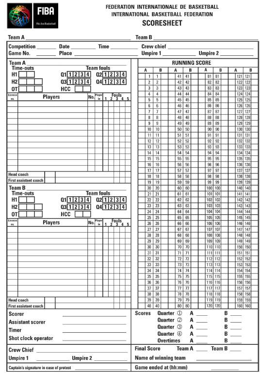

B.1. L’acta de joc mostrada a la Figura 8 és l’aprovada per la Comissió Tècnica de la FIBA.

B.2. Consta d’1 original i 3 còpies, cadascuna de paper d’un color diferent. L’original en paper de color blanc, serà per la FIBA. La primera còpia, en paper de color blau, serà per l’organitzador de la competició, la segon còpia en paper de color rosa, per l’equip guanyador i la darrera còpia, en paper de color groc, per l’equip perdedor.

Nota:

1. L’anotador farà servir bolígrafs de dos colors diferents, VERMELL pel primer i tercer quarts i BLAU O NEGRE pel segon i quart quarts. Totes les pròrrogues s’enregistraran en color BLAU O NEGRE (el mateix color en que es va fer el segon i quart quarts).

2. L’acta es podrà preparar i confeccionar de forma electrònica.

B.3. Almenys 40 minuts abans de l’hora prevista per l’inici del partit, l’anotador prepararà l’acta de la següent forma:

B.3.1. Inscriurà el nom dels 2 equips a l’encapçalament de l’acta. L’equip A sempre serà l’equip local (home), o en el cas de tornejos o partits disputats en pista neutral, el citat en primer lloc al calendari. L’altre equip serà l’equip B.

B.3.2. Posteriorment reflectirà:

El nom de la competició.

El número del partit.

La data, hora i la població on es juga el partit.

El nom de l’àrbitre principal (crew chief) i els àrbitres auxiliars amb les seves nacionalitats (codi COI).

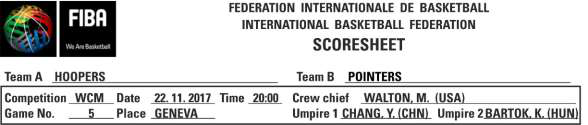

B.3.3. L’equip A ocuparà la part superior de l’acta, i l’equip B la part inferior.

B.3.3.1. A la primera columna, l’anotador inscriurà el número de llicència (els tres darreres dígits) de cada jugador, entrenador i primer ajudant d’entrenador. En el cas de tornejos, el número de llicència s’indicarà únicament al primer partit jugat per cada equip.

B.3.3.2. A la segona columna, l’anotador inscriurà el nom de cada jugador i les inicials, seguint l’ordre del número de les samarretes, en lletra d’IMPREMTA, fent servir el llistat de jugadors i números facilitat per l’entrenador o el primer ajudant d’entrenador. El capità de l’equip s’indicarà posant (CAP) immediatament després del nom.

B.3.3.3. Si l’equip presenta menys de 12 jugadors, l’anotador traçarà una línia per sobre dels espais corresponents al número de llicència, nom i dorsal de jugador a la línia inferior a la del darrer jugador inscrit. En el cas que hi hagi menys d’11 jugadors, la línia horitzontal es traçarà fins arribar a la secció de faltes personals, des d’on continuarà en diagonal fins al final de la zona de faltes de jugadors.

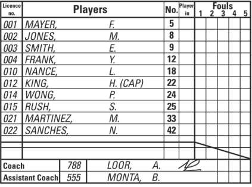

B.3.4. A la part inferior de la secció de cada equip, l’anotador inscriurà (en LLETRA D’IMPREMTA) els noms de cada entrenador i del primer ajudant d’entrenador B.3.5. A la part inferior de l’acta, l’anotador inscriurà (en LLETRA D’IMPREMTA) el seu nom, el de l’ajudant d’anotador, el cronometrador i l’operador del rellotge de llançament. B.4. Al menys 10 minuts abans de l’hora prevista per l’inici del partit, cada entrenador: B.4.1. Confirmarà el seu acord amb els noms i els corresponents dorsals de l’equip. B.4.2. Confirmarà els noms de l’entrenador i del primer ajudant d’entrenador. Si no hi ha entrenador ni primer ajudant d’entrenador, el capità actuarà com a jugador- entrenador i s’anotarà indicant (CAP) després del nom.

B.4.3. Indicarà els jugadors del 5 inicial marcant amb una petita ‘x’ a la columna ‘Entrada’ al costat del dorsal del jugador. B.4.4. Signarà l’acta de joc. L’entrenador de l’equip A serà el primer en facilitar aquesta informació. B.5. A l’inici del partit, l’anotador encerclarà la ‘x’ dels jugadors del cinc inicial de cada equip. B.6. Durant el partit, l’anotador escriurà una petita ‘x’ (sense encerclar) a la columna ‘Entrada’, quan un substitut entri a pista per primera vegada. B.7. Temps morts B.7.1. Els temps morts concedits s’anotaran a l’acta enregistrant el minut de joc del quart o de la pròrroga a l’espai a les caixes H1 per la primera mitja part, H2 per la segona mitja part i OT per fins a tres pròrrogues. B.7.2. Al final de cada meitat i de la pròrroga, les caselles no utilitzades s’anullaran amb 2 línies horitzontals paralleles. Si l’equip no ha demanat el seu primer temps mort abans que el rellotge mostri 2:00 minuts del quart quart, l’anotador marcarà amb dos línies horitzontals el quadre corresponent al primer temps mort de la segona part.

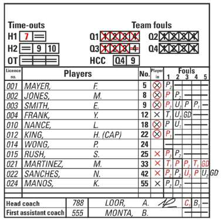

B.8. Personals B.8.1. Les faltes de jugadors poden ser personals, tècniques, antiesportives o desqualificants i s’anotaran a cada jugador. B.8.2. Les faltes comeses pels entrenadors, primers ajudants d’entrenador, substituts, jugadors exclosos i acompanyants de l’equip podran ser tècniques o desqualificants i s’anotaran a l’entrenador de l’equip. Les faltes desqualificants en situacions de baralla, comeses per persones inscrites a l’acta s’anotaran a aquestes persones. B.8.3. Les faltes s’anotaran de la següent forma: B.8.3.1. Una falta personal s’indicarà anotant una ‘P’. B.8.3.2. Una falta tècnica sancionada a un jugador s’indicarà anotant una ‘T’. Una segona falta tècnica s’indicarà també amb una ‘T’, seguida per l’anotació ‘GD’ al següent espai per indicar la desqualificació del partit. B.8.3.3. Una falta tècnica sancionada a l’entrenador pel seu comportament personal, s’indicarà anotant una ‘C’. Una segona tècnica pel mateix motiu també s’indicarà anotant ‘C’, seguida de ‘GD’ al següent espai. B.8.3.4. Una falta tècnica sancionada a l’entrenador per qualsevol altre motiu, s’indicarà anotant una ‘B’. Una tercera falta tècnica (una d’elles pot ser una ‘C’) s’indicarà anotant una ‘B’ o una ‘C’, seguida de ‘GD’ al següent espai. B.8.3.5. Una falta antiesportiva sancionada a un jugador s’indicarà anotant una ‘U’. Una segona falta antiesportiva s’indicarà anotant una ‘U’, seguida de ‘GD’ al següent espai. B.8.3.6. Una falta tècnica sancionada a un jugador que prèviament havia estat sancionat amb una falta antiesportiva, o una falta antiesportiva sancionada a un jugador que prèviament havia estat sancionat amb una falta tècnica, s’indicaran anotant una ‘U’ o una ‘T’ seguides de ‘GD’ al següent espai.

B.8.3.7. Un jugador-entrenador serà desqualificat quan cometi:

- Una falta tècnica com a entrenador tipus ‘C’ i una falta antiesportiva o tècnica

com a jugador, o

- Una falta tècnica com a entrenador tipus ‘B’, una falta tècnica com a entrenador

tipus ‘C’ i una falta antiesportiva o tècnica com a jugador, o

- Dues faltes tècniques com a entrenador tipus ‘B’ i una falta antiesportiva o

tècnica com a jugador. Després de la darrera anotació de falta tècnica o antiesportiva, s’haurà d’anotar ‘GD’ en el següent espai. B.8.3.8 Una falta desqualificant s’indicarà anotant una ‘D’. B.8.3.9 Qualsevol falta que comporti llançaments de tir(s) lliure(s) s’indicarà afegint el corresponent número de tirs lliures (1, 2 o 3) sota la ‘P’, ‘T’, ‘C’, ‘B’, ‘U’ o ‘D’. B.8.3.10 Totes les faltes contra els dos equips, que comportin penalitzacions amb la mateixa sanció, es cancellaran d’acord a l’Art. 42 i s’indicaran anotant una petita ‘c’ sota la ‘P’, ‘T’, ‘C’, ‘B’, ‘U’ o ‘D’. B.8.3.11 Una falta desqualificant sancionada contra un primer ajudant d’entrenador, substitut, jugador exclòs o acompanyant d’equip, incloses les faltes sancionades per abandonar la banqueta en situacions de baralles, s’indicaran com una falta a l’entrenador anotada ‘B2’. B.8.3.12 Si durant una baralla es desqualifica a un entrenador, un primer ajudant d’entrenador, substitut o jugador exclòs s’omplirà de  ‘F’, els espais restants després d’haver anotat ‘D2’ o ‘D’. B.8.3.13 Exemples de faltes desqualificants a l’entrenador, primer ajudant d’entrenador, substituts, jugadors exclosos o acompanyants: Una falta desqualificant a l’entrenador s’anotarà com es mostra a continuació:

Una falta desqualificant al primer ajudant d’entrenador s’anotarà com es mostra a continuació:

Una falta desqualificant d’un substitut s’anotarà com es mostra a continuació:

addicionalment s’anotarà:

Una falta desqualificant d’un jugador exclòs després de la seva cinquena falta, s’anotarà com es mostra a continuació:

addicionalment s’anotarà:

Una falta desqualificant d’un acompanyant de l’equip, s’anotarà com es mostra a continuació:

B.8.3.14 Exemples de faltes desqualificants per abandonar la banqueta durant una situació de baralla, sancionades a l’entrenador,  primer ajudant d’entrenador, jugadors substituts, exclosos o acompanyants de l’equip: Independentment del número de persones desqualificades per abandonar l’àrea de banqueta de l’equip, s’anotarà una única falta tècnica  ‘B2’ o ‘D2’. a l’entrenador. Una falta desqualificant a l’entrenador i al primer ajudant d’entrenador s’anotarà com es mostra a continuació: Si només es desqualifica a l’entrenador:

Si només es desqualifica al primer ajudant d’entrenador

Si ambdós entrenadors, l’entrenador i el primer ajudant d’entrenador, són desqualificats:

Una falta desqualificant d’un substitut s’anotarà com es mostra a continuació: Si el substitut té menys de 4 faltes, una ‘F’ s’anotarà a l’espai restant de faltes personals:

addicionalment s’anotarà:

Si es tracta de la cinquena falta del substitut, s’anotarà una ‘F’ al darrer espai de falta personal:

addicionalment s’anotarà:

Una falta desqualificant d’un jugador exclòs s’anotarà com es mostra a continuació: Com el jugador exclòs no disposa d’espais de faltes personals lliures, s’anotarà una ‘D’ seguida d’una  ‘F’ a la columna al costat de la darrera falta.

addicionalment s’anotarà

Una falta desqualificant a un acompanyant de l’equip s’anotarà a l’entrenador com es mostra a continuació:

Cada falta desqualificant d’un acompanyant d’equip es carregarà a l’entrenador de l’equip, i s’anotarà com  B   però no es tindran en compte per l’acumulació de faltes tècniques per desqualificar l’entrenador.

B.8.3.15 Exemples de faltes desqualificants per participar activament en una situació de baralla, sancionades a l’entrenador, primer ajudant d’entrenador, jugadors substituts, exclosos o acompanyants de l’equip: Independentment del número de persones desqualificades per abandonar l’àrea de banqueta de l’equip, s’anotarà una única falta tècnica  ‘B2’ o ‘D2’. a l’entrenador. Si l’entrenador participa activament en una baralla, serà sancionat amb una falta desqualificant que s’anotarà com ‘D2’, com única falta. Una falta desqualificant a l’entrenador o al segon entrenador s’anotarà com es mostra a continuació: Si només es desqualifica a l’entrenador:

Si només es desqualifica al primer ajudant d’entrenador

Si ambdós entrenadors, l’entrenador i el primer ajudant d’entrenador, són desqualificats:

Una falta desqualificant a un substitut s’anotarà com s’indica a continuació: Si el substitut té menys de 4 faltes, s’anotarà una ‘D2’, i s’ompliran amb ‘F’ la resta d’espais buits:

addicionalment s’anotarà

Si es tracta de la cinquena falta del substitut, s’anotarà una ‘D2’, seguida d’una ‘F’ a la columna que hi ha després del darrer espai per anotar les faltes.

addicionalment s’anotarà

Una falta desqualificant a un jugador exclòs s’anotarà com es mostra a continuació:

addicionalment s’anotarà

Una falta desqualificant a un acompanyant de l’equip, s’anotarà com es mostra a continuació:

Una falta desqualificant a dos acompanyants de l’equip, s’anotarà com es mostra a continuació:

Cada falta desqualificant d’un acompanyant d’equip es carregarà a l’entrenador de l’equip, i s’anotarà com B2 però no es tindran en compte per l’acumulació de faltes

tècniques per desqualificar l’entrenador. Nota: Les faltes tècniques o desqualificants per l’aplicació de l’Art.39 no comptaran com a faltes d’equip. B.8.4 Al final del segon quart, l’anotador traçarà una línia gruixuda  horitzontal per separar les faltes anotades d’aquelles que no s’han fet servir. Al final del partit, l’anotador inutilitzarà els espais restants traçant una línia fina horitzontal. B.9 Faltes d’equip B.9.1 Per cada quart, es disposen de 4 espais a l’acta de joc (immediatament sota el nom de l’equip i per sobre dels noms dels jugadors) per anotar les faltes d’equip. B.9.2 Quan un jugador cometi una falta personal, tècnica, antiesportiva o desqualificant, l’anotador anotarà una falta contra l’equip d’aquell jugador, posant una ‘X’ gran als espais destinats per aquesta qüestió. B.9.3 Al final de cada quart, l’anotador inutilitzarà els espais que no s’hagin fet servir amb 2 línies horitzontals paralleles.

B.10. Tempteig arrossegat

B.10.1. L’anotador portarà un registres cronològic dels punts anotats per cada equip.

B.10.2. L’acta de joc té 4 columnes pel tempteig arrossegat. B.10.3. Cada columnes està dividida en 4 columnes. Les 2 de la part esquerra corresponen a l’equip A, les 2 de la part dreta corresponen a l’equip B. A les columnes centrals consta el tempteig arrossegat (160 punts) de cada equip.

L’anotador:

- En primer lloc, traçarà una línia diagonal (/ en cas que

l’anotador sigui dretà o \ en cas que sigui esquerrà) per totes les cistelles de camp i un punt gruixut (    ) per tots els tirs lliures, sobre el nou tempteig total acumulat per l’equip que acaba d’anotar.

- Llavors, a l’espai en blanc al mateix costat del nou total

de punts (al costat del / o \ o      ) anotar el número del jugador que ha encistellat el tir de camp o el tir lliure.

B.11. Tempteig arrossegat: instruccions addicionals

B.11.1. Un intent de tres punts s’anotarà posant un cercle al voltant del número del jugador que ha aconseguit la cistella.

B.11.2. Un llançament de camp anotat de forma accidental a la pròpia cistellas’inscriurà com si hagués estat encistellada pel capità en pista de l’equip contrari.

B.11.3. Els punts anotats quan la pilota no hagi entrat per la cistella (Art.31) s’anotaran com si haguessin estat encistellats pel jugador que va intentar realitzar el llançament a cistella.

B.11.4. Al final de cada quart o pròrroga, l’anotador dibuixarà un cercle (      ) al voltant del número del darrer punt anotat per cada equip, seguit d’una fina línia horitzontal per sota d’aquests punts i del número del jugador que els hagi anotat.

B.11.5. A l’inici de cada quart o pròrroga l’anotador continuarà mantenint un registre cronològic dels punts anotats des del lloc on es va aturar el partit.

B.11.6. Sempre que sigui possible, l’anotador comprovarà visualment al marcador que el resultat coincideixi. En cas de discrepància, si el seu resultat és correcte, prendrà les mesures necessàries per que el marcador es corregeixi immediatament. En cas de dubte o si un dels equips no està d’acord amb la correcció, informarà a l’àrbitre principal tan aviat com la pilota estigui morta i el rellotge del partit aturat.

B.11.7. Els àrbitres podran corregir qualsevol errada d’anotació referent al tempteig, número de faltes o número de temps morts, sota les condicions indicades en aquestes regles. L’àrbitre principal serà l’encarregat de signar les correccions. Altres correccions hauran de ser recollides en un informe al dors de l’acta de joc.

*Figura 12:*

Tempteig arrossegat

B.12. Tempteig arrossegat: final del partit

B.12.1. Al final de cada quart i de la darrera pròrroga, l’anotador inscriurà el tempteig de cadascun dels equips obtinguts en aquest quart i el del total de les a l’apartat corresponent de la part inferior de l’acta.

B.12.2. Immediatament al final del partit, l’anotador enregistrarà el temps a la columna del ‘Partit finalitzat a les (hh:mm)’.

B.12.3. Al final del partit l’anotador dibuixarà dues línies fines horitzontals sota el tempteig final i sota els números dels jugadors que van anotar la darrera cistella de cada equip. També traçarà una línia diagonal a la cantonada inferior de la columna per tal d’inutilitzar els punts no utilitzats de cada equip.

B.12.4. Al final del partit l’anotador anotarà el resultat final i el nom de l’equip guanyador.

B.12.5. Tots els auxiliars de taula signaran al costat dels seus noms.

B.12.6. Després que el(s) àrbitre(s) auxiliar(s) hagin signat l’acta, l’àrbitre principal serà el darrer a donar l’aprovació i signar l’acta de joc. Amb aquesta signatura finalitzarà la relació administrativa dels àrbitres amb el partit.

Nota: En el cas que el capità (CAP) signi l’acta sota protesta (fent servir l’espai ‘Signatura del Capità en cas de protesta’), els auxiliars de taula i els àrbitres romandran a disposició de l’àrbitre principal, fins que aquest els autoritzi a marxar.

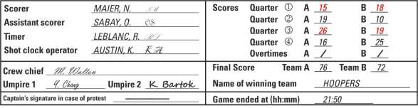

B.13. Sollicitud de Challenge de l’entrenador

B.13.1 En aquells partits on s’utilitzi el Sistema de Repetició Instantani cada equips disposarà d’1 opció de revisió per part del primer entrenador (HCC). Si es concedeix, l’HCC s’anotarà a l’acta sota el nom de cada equip, a la caixa anomenada HCC. Al primer quadre s’anotarà el quart o  pròrroga (Q1, Q2, Q3, Q4  o OT), i  al segon quadre el minut de joc del període o de la pròrroga.

B.13.2 Al final del partit, l’anotador inutilitzarà les caselles de HCC no utilitzades amb dues línies horitzontals paralleles.

*Figura 14: Final*

del partit

ANNEX B                  L’ACTA OFICIAL DE JOC (COMPETICIONS FCBQ)

Figura 8 b: Acta oficial de joc FCBQ FIBA i Full d’Informe
Figura 8 c: Acta oficial de joc FCBQ Minibàsquet i Passarella

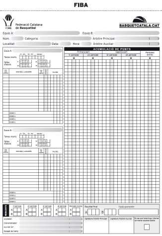

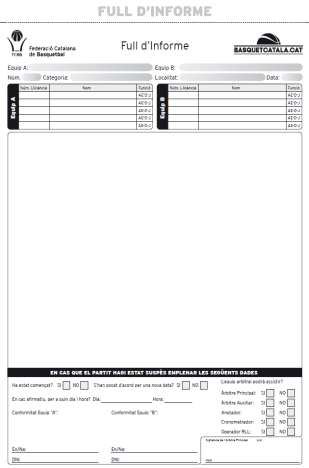

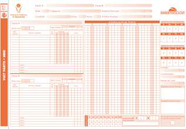

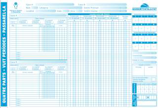

B.1.
L’acta de joc mostrada a les Figures 8b i 8c són les aprovades per les competicions
organitzades per l’FCBQ.
Les Bases de Competició regularan l’aplicació de l’Acta Digital als diferents
campionats organitzats per l’FCBQ.
B.2.
Consta d’1 original i 2 còpies. L’original en paper de color blanc, serà per l’àrbitre
principal, que s’encarregarà de fer arribar una còpia digital de l’acta a l’FCBQ. La
primera còpia serà per l’equip guanyador i la segona còpia per l’equip perdedor.
Nota:
3. L’anotador farà servir bolígrafs de dos colors diferents, VERMELL pel primer i
tercer quarts i BLAU O NEGRE pel segon i quart quarts. Totes les pròrrogues
s’enregistraran en color BLAU O NEGRE (el mateix color en que es va fer el
segon i quart quarts).
4. Les Bases de Competició de cada categoria determinaran la possibilitat de fer
servir un programa per confeccionar l’acta digitalment.
B.3.
Almenys 20 minuts abans de l’hora prevista per l’inici del partit, l’anotador
preparà l’acta de la següent forma:
B.3.1.
Inscriurà el nom dels 2 equips a l’encapçalament de l’acta. L’equip A sempre serà
l’equip local i en el cas de tornejos o partits disputats en pista neutral, el citat en
primer lloc al calendari. L’altre equip serà l’equip B.
B.3.2.
Posteriorment reflectirà:
El número del partit
El nom de la categoria
La localitat data, hora i on es juga el partit.
El nom de l’Àrbitre principal i l’(els) àrbitre(s) principal(s) amb el seu número
de llicència complet (3, 4 o 5 xifres)
Figura 9b: Capçalera de l’acta
B.3.3.
L’equip A ocuparà la part superior de l’acta, i l’equip B la part inferior.
B.3.3.1.
A la primera columna, l’anotador inscriurà el número de llicència (els quatre caràcters
en el cas de la BQ Llicència o els tres darreres dígits en el cas d’altres formats de
llicència) de cada jugador, entrenador, segon entrenador i acompanyants que estiguin
inscrits a l’acta.

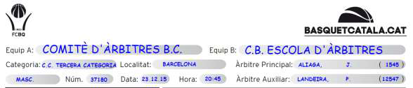

B.3.3.2.
A la segona columna, l’anotador inscriurà el nom de cada jugador i les inicials, seguint
l’ordre del número de les samarretes, en lletra d’IMPREMTA, fent servir el llistat de
jugadors i números facilitat per l’entrenador o el representant de cada equip. El capità
de l’equip s’indicarà posant (CAP) immediatament abans del seu nom.
B.3.3.3.
Si l’equip presenta menys de 12 jugadors, l’anotador traçarà una línia per sobre dels
espais corresponents al número de llicència, nom i dorsal de jugador a la línia inferior
a la del darrer jugador inscrit. En el cas que hi hagi menys d’11 jugadors, la línia
horitzontal es traçarà fins arribar a la secció de faltes personals, des d’on continuarà
en diagonal fins al final de la zona de faltes de jugadors.
Figura 10b: Inscripció d’equips (abans del partit)
B.3.4.
A la part inferior de cada secció, l’anotador inscriurà (en LLETRA D’IMPREMTA) els
noms de cada entrenador i segon entrenador. En el cas que hi hagi menys de 4 inscrits
a la zona de banqueta, es tancarà de la mateixa forma que la zona de jugadors.
B.3.5.
A la part inferior de l’acta, l’anotador inscriurà (en LLETRA D’IMPREMTA) el seu nom,
el del cronometrador, l’operador del rellotge de llançament i el del delegat de camp.
B.4.
Al menys 10 minuts abans de l’hora prevista per l’inici del partit, cada entrenador:
B.4.1.
Confirmarà el seu acord amb els noms i els corresponents dorsals del seu equip.
B.4.2.
Confirmarà els noms de l’entrenador i de l’ajudant d’entrenador. Si no hi ha entrenador
i ajudant d’entrenador, el capità actuarà com a jugador-entrenador i s’anotarà indicant
(CAP) després del seu nom.
B.4.3.
Indicarà els jugadors del 5 inicial marcant amb una petita ‘x’ a la columna ‘Entrada’ al
costat del dorsal del jugador.
B.4.4.
Signarà l’acta de joc.
L’entrenador de l’equip A serà el primer en facilitar aquesta informació.

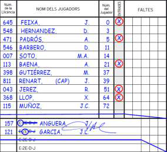

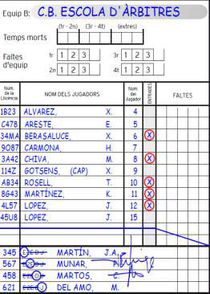

B.5.
A l’inici del partit, l’anotador encerclarà la ‘x’ de cada jugador del cinc inicial.
B.6.
Durant el partit, l’anotador escriurà una petita ‘x’ (sense encerclar) a la columna
‘Entrada’, quan un substitut entri a pista per primera vegada.
B.7.
Temps morts
B.7.1.
Els temps morts concedits s’anotaran a l’acta enregistrant el minut de joc del quart o
de la pròrroga a l’espai indicat sota el nom de cada equip.
B.7.2.
Al final de cada meitat i de la pròrroga, les caselles no utilitzades s’anullaran amb 2
línies horitzontals paralleles. Si l’equip no ha demanat el seu primer temps mort abans
que el rellotge mostri 2:00 minuts del quart quart, l’anotador marcarà amb dos línies
horitzontals el quadre corresponent al primer temps mort de la segona part.
Figura 11b: Inscripció d’equips (després del partit)
B.8.
Personals
B.8.1.
Les faltes de jugadors poden ser personals, tècniques, antiesportives o
desqualificants i s’anotaran a cada jugador.
B.8.2.
Les faltes comeses pels entrenadors, segons entrenadors, substituts, jugadors
exclosos i acompanyants de l’equip podran ser tècniques o desqualificants i
s’anotaran a l’entrenador de l’equip.

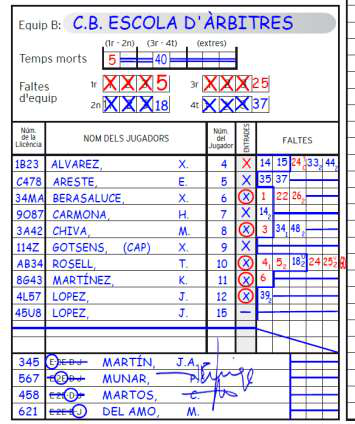

8 C

Minut en que s’ha comés la falta. Tipus de falta.

1

Tirs lliures concedits.

(En cas que la falta no comporti tirs lliures, no es posarà res)

B.8.3.
Les faltes s’anotaran de la següent forma:
B.8.3.1.
Una falta personal s’indicarà anotant el minut en que va tenir lloc.
B.8.3.2.
Una falta tècnica sancionada a un jugador s’indicarà anotant el minut en que va tenir
lloc amb una ‘T’ com a superíndex ‘8T’. Una segona falta tècnica s’anotarà de la
mateixa forma ‘8T’, seguida per l’anotació ‘GD’ al següent espai per indicar la
desqualificació del partit.
B.8.3.3.
Una falta tècnica sancionada a l’entrenador pel seu comportament personal s’indicarà
anotant el minut en que va tenir lloc amb una ‘C’ com a superíndex ‘8C’. Una segona
falta tècnica s’anotarà de la mateixa forma ‘8C’, seguida per l’anotació ‘GD’ al següent
espai per indicar la desqualificació del partit.
B.8.3.4.
Una falta tècnica sancionada a l’entrenador per qualsevol altre motiu, s’indicarà
anotant el minut en que va tenir lloc amb una ‘B’ com a superíndex ‘8B’. Una tercera
falta tècnica (una d’elles pot ser una de tipus ‘C’) s’indicarà anotant una ‘8C’ o ‘8B’,
seguida de ‘GD’ al següent espai.
B.8.3.5.
Una falta antiesportiva sancionada a un jugador s’indicarà anotant el minut en que va
tenir lloc amb una ‘U’ com a superíndex ‘8U’. Una segona falta antiesportiva s’anotarà
de la mateixa forma ‘8U’, seguida de ‘GD’ al següent espai.
B.8.3.6.
Una falta tècnica sancionada a un jugador que prèviament havia estat sancionat amb
una falta antiesportiva, o una falta antiesportiva sancionada a un jugador que
prèviament havia estat sancionat amb una falta tècnica, s’indicaran anotant una ‘8u’o
una ‘‘8T’’ seguides de ‘GD’ al següent espai.
B.8.3.7.
Una falta desqualificant s’indicarà anotant una anotant el minut en que va tenir lloc
amb una ‘D’ com a superíndex ‘8D’.
B.8.3.8.
Qualsevol falta que comporti llançaments de tir(s) lliure(s) s’indicarà afegint el
corresponent número de tirs lliures (1, 2 o 3) sota el minut en que va ser xiulada.
B.8.3.9.
Totes les faltes contra els dos equips, que comportin penalitzacions de la mateixa
gravetat, es cancellaran d’acord a l’Art. 42 i s’indicaran anotant una petita ‘c’ en el lloc
destinat al número dels tirs lliures.

B.8.3.10. Una falta desqualificant sancionada contra un segon entrenador, substitut, jugador
exclòs o acompanyant d’equip, incloses les faltes sancionades per abandonar la
banqueta en situacions de baralles, s’indicaran com una falta a l’entrenador anotada
‘8    ’.
B.8.3.11. Si durant una baralla es desqualifica a un entrenador, segon entrenador, substitut o
jugador exclòs s’omplirà de  ‘F’, els espais restants després d’haver anotat la falta
desqualificant.
B.8.3.12. Exemples de faltes desqualificants a l’entrenador, segon entrenador, substituts,
jugadors exclosos o acompanyants:
Una falta desqualificant a l’entrenador s’anotarà com es mostra a continuació:
Una falta desqualificant al segon entrenador s’anotarà com es mostra a continuació:
Una falta desqualificant d’un substitut s’anotarà com es mostra a continuació:
addicionalment s’anotarà:
Una falta desqualificant d’un jugador exclòs després de la seva cinquena falta,
s’anotarà com es mostra a continuació:
addicionalment s’anotarà:
Una falta desqualificant d’un acompanyant de l’equip, s’anotarà com es mostra a
continuació:
2
B

B.8.3.13. Exemples de faltes desqualificants per abandonar la banqueta durant una
situació de baralla, sancionades a l’entrenador,  el segon entrenador, jugadors
substituts, exclosos o acompanyants de l’equip:
Independentment del número de persones desqualificades per abandonar l’àrea de
banqueta de l’equip, s’anotarà una única falta de tipus ‘B2’ o ‘D2’ a l’entrenador.
Una falta desqualificant a l’entrenador o al segon entrenador s’anotaran com es
mostra a continuació:
Si només es desqualifica a l’entrenador:
Si només es desqualifica al segon entrenador
Si es desqualifiquen els dos entrenadors:
Una falta desqualificant d’un substitut s’anotarà com es mostra a continuació:
Si el substitut té menys de 4 faltes, una ‘F’ s’anotarà a l’espai restant de faltes
personals:
addicionalment s’anotarà:
Si es tracta de la cinquena falta del substitut, s’anotarà una ‘F’ al darrer espai de falta
personal:
addicionalment s’anotarà:

Una falta desqualificant d’un jugador exclòs s’anotarà com es mostra a continuació:
Com el jugador exclòs no té espais de faltes personals lliures, s’anotarà una ‘F’ a la
columna al costat de la darrera falta.
addicionalment s’anotarà:
Una falta desqualificant a un acompanyant de l’equip, s’anotarà com es mostra a
continuació:
Cada falta desqualificant d’un acompanyant d’equip es carregarà a l’entrenador de
l’equip, i s’anotarà com 42 però no es tindran en compte per l’acumulació de faltes
tècniques per desqualificar l’entrenador.
B.8.3.14. Exemples de faltes desqualificants per participar activament en una situació de
baralla, sancionades a l’entrenador,  el segon entrenador, jugadors substituts,
exclosos o acompanyants de l’equip:
Independentment del número de persones desqualificades per abandonar l’àrea de
banqueta de l’equip, s’anotarà una única falta tècnica  ‘B2’ o ‘D2’. a l’entrenador.
Si l’entrenador participa activament en una baralla, serà sancionat amb una falta
desqualificant que s’anotarà com ‘D2’, com única falta.
Una falta desqualificant a l’entrenador o al segon entrenador s’anotaran com es
mostra a continuació:
Si només es desqualifica a l’entrenador:
Si només es desqualifica al segon entrenador:
Si ambdós entrenadors, l’entrenador i el segon entrenador, són desqualificats:
B

Una falta desqualificant a un substitut s’anotarà com s’indica a continuació:
Si el substitut té menys de 4 faltes, s’anotarà una ‘D2’, i s’ompliran amb ‘F’ la resta
d’espais buits:
addicionalment s’anotarà
Si es tracta de la cinquena falta del substitut, s’anotarà una ‘D2’, seguida d’una ‘F’ a la
columna que hi ha després del darrer espai per anotar les faltes.
addicionalment s’anotarà
Una falta desqualificant a un jugador exclòs s’anotarà com es mostra a continuació:
addicionalment s’anotarà
Una falta desqualificant a un acompanyant de l’equip, s’anotarà com es mostra a
continuació:

Una falta desqualificant a dos acompanyants de l’equip, s’anotarà com es mostra a
continuació:
Cada falta desqualificant d’un acompanyant d’equip es carregarà a l’entrenador de
l’equip, i s’anotarà com B2 però no es tindran en compte per l’acumulació de faltes
tècniques per desqualificar l’entrenador.
Nota:
Les faltes tècniques o desqualificants per l’aplicació de l’Art.39 no comptaran
com a faltes d’equip.
B.8.4.
Al final del segon quart i al final del partit, l’anotador traçarà una línia gruixuda
horitzontal per separar les faltes anotades d’aquelles que no s’han fet servir.
Al final del partit, l’anotador inutilitzarà els espais restants traçant una línia fina
horitzontal.
B.9.
Faltes d’equip
B.9.1.
Per cada quart, es disposen de 4 espais a l’acta de joc (immediatament sota el nom
de l’equip i per sobre dels noms dels jugadors) per anotar les faltes d’equip.
B.9.2.
Les tres primeres faltes comeses per jugadors a pista, ja siguin personals, tècniques,
antiesportives o desqualificants, s’indicaran anotant una ‘X’ gran als espais destinats
per aquesta qüestió. En el cas de la 4a falta d’equip en aquell període s’anotarà el
minut en que es va sancionar.
B.10.
Tempteig arrossegat
B.10.1.
L’Anotador portarà un resum acumulat cronològic dels punts
aconseguits per ambdós equips en les quatre columnes
habilitades per això. En una mateixa fila no han d’aparèixer
anotacions d’ambdós equips, ni podrà quedar cap casella en
blanc.
B.10.2.
Cada columna es divideix en cinc espais verticals.
B.10.3.
A cada bloc,  la columna central, que està ombrejada i
encapçalada per la lletra “M”, està reservada per al minut de joc,
en ella s’ha d’inscriure el minut de joc en què es produeix una
cistella de dos/ tres punts o llançaments lliures. La numeració serà
del minut “1” al “40”.  En el cas dels períodes extres els minuts
continuaran a partir del “40”. Només s’inscriu el minut la primera
vegada en què es produeix una anotació en aquell minut.
Figura 12b:
Tempteig
arrossegat

B.11.
Tempteig arrossegat: instruccions addicionals
L’Anotador diferenciarà la mida dels dorsals dels jugadors, tempteig i minut de joc
de la següent forma:
El dorsal del jugador que encistella i el minut de joc es faran en una mida
més petita.
El tempteig acumulat es farà en mida més gran.
En l’encapçalament dels blocs, s’ha d’inscriure el sentit d’atac dels equips. Per a tots
els partits, l’equip anomenat en primer lloc (local) tindrà la banqueta i la pròpia cistella
a l’esquerra de la taula pels Auxiliars (estant asseguts a la taula) així que s’haurà
d’escriure “B - A”. Ara bé, si els equips es posen d’acord, es poden intercanviar
banquetes i cistelles i llavors caldrà notar “A - B”.
A la segona part (3r i 4rt període) s’ha d’intercanviar la direcció de joc, mentre que
totes les pròrrogues tenen el mateix sentit que la segona part.
Per a cada una de les dues columnes encapçalades per “A” i “B”, s’ha d’anotar, a la
columna de l’esquerra, el número del jugador i, a la columna de la dreta, el resultat
acumulat.
En una fila només es pot anotar una cistella.
En cas de tirs lliures, s’ocuparan tantes files com
llançaments s’hagin de fer.
En cas de no poder emplenar l’última fila d’un període,
degut a que la posterior anotació  comporta un parèntesi
de dos o tres tirs lliures, s’ha d’anullar cada casella
d’aquesta fila, tret de la corresponent al minut, amb una
petita línia horitzontal.
El dorsal del jugador que
encistella i el minut de joc
es faran en una mida més
petita.
El tempteig arrossegat
es farà en mida més
gran.

B.11.1.
Anotació de les Cistelles
Cistella d'1 punt:
Com a conseqüència d’un tir lliure, es dibuixa un
parèntesi que agafi el número de tirs lliures que es
llencin i s’anota el número del jugador a la fila del primer
llançament.
Si el tir lliure és aconseguit, s’anota el punt que
correspon i, en cas contrari, s’anota una petita línia
horitzontal.
Cistella de 2 punts:
S’anota el número del jugador que ha aconseguit la
cistella i la xifra del punt que correspon.
Cistella de 3 punts:
S’anota  el número del jugador que ha aconseguit la
cistella dins d’un cercle i a continuació  la xifra de la
puntuació acumulada que corresponguin.
Cistella amb tir lliure addicional:
En cas que hi hagi un únic tir lliure com a conseqüència
d’una falta amb cistella convertida de dos o tres punts,
NO es tornarà a posar el número del jugador davant del
parèntesi.
Únicament en el cas que el llançador del tir lliure
addicional no pugui llançar-lo (lesió, desqualificant, etc.)
s’indicarà el número del llançador al costat del parèntesi del tir lliure.
Autocistella:
-
Si es produeix per error, aquesta s’anotarà al capità en pista de l’equip que
ha aconseguit els punts (es recomana preguntar abans del partit pel segon
capità, o  confirmar amb el delegat de l’equip a qui anotar la cistella quan es
produeixi).
-
Si es produeix de forma intencionada, recordeu que és tracta d’una violació
i la cistella serà anullada.

Tancament 2n període Inici 3r període

1ª període extra Tancament final de període Tancament períodes extra

Tancament entre períodes extra

2ª període extra

B.11.2.
Inici d’un quart
Els punts aconseguits per un jugador quan la cistella no és reeixida (un jugador
toca l’anella o el tauler durant un llançament, una interposició, ect.) es
registraran com si els hagués anotat el jugador que va realitzar el llançament.
Al començament de cada
període,
l’Anotador
continuarà portant el registre
cronològic dels punts anotats
encapçalant
la
columna
següent, tenint en compte
que entre el 2n i 3r període
els
equips
canviaran
la
direcció del joc.
B.11.3.
Tancament de la puntuació acumulada a períodes i períodes extres
Per fer el tancament dels  períodes, s’utilitzaran tres files de caselles en cada
columna. En la primera es farà una línia horitzontal a mitja casella, en la segona
es posarà el resultat i en la tercera una doble línia horitzontal, també a mitja
casella.
A l’inici de cada període (i primer període extra si és necessari), s’encapçalarà el
resultat anterior i es farà una línia horitzontal a la mateixa casella del resultat.
Si fos necessari un segon període extra, es tancarà el primer període amb una
línia horitzontal gruixuda i es seguirà a continuació a la mateixa columna.

A tots els efectes es considera que els períodes extres són una continuació del
quart període. Per aquest motiu els equips continuaran atacant a la mateixa
cistella, i no la intercanviaran a les successives pròrrogues. El minut de joc serà
del 41 al 45 pel primer període extra, del 46 al 50 pel segon, etc. i les anotacions
de tots els períodes extres es realitzaran en color blau.
B.11.2.
Altres aspectes
Sempre que resulti possible, l’Anotador comprovarà que el tempteig de l’acta i
del marcador coincideixen. Si existeix alguna anomalia i el seu tempteig és
correcte, adoptarà d’immediat les mesures necessàries per tal que es
corregeixi el marcador. En cas de dubte o si algun dels equips presenten
objeccions a l’esmentada correcció, informarà a l’Àrbitre principal tan aviat com
la pilota quedi morta i s’aturi el rellotge de partit.
Els auxiliars de taula podran corregir qualsevol errada d’anotació referent al
tempteig, número de faltes o número de temps morts, sota les condicions
indicades en aquestes regles. L’àrbitre principal serà l’encarregat de decidir si
creu convenient realitzar un informe per explicar les correccions, en el cas que,
segons el seu paret, aquestes no quedin suficientment clares a l’acta.
B.12.
Peu de l’acta
B.12.1.
Al final de cada quart i de la darrera pròrroga, l’anotador inscriurà el tempteig de
cadascun dels equips obtinguts en aquest quart i el del total de les a l’apartat
corresponent de la part inferior de l’acta.
B.12.2.
Al final del partit l’anotador tancarà les columnes corresponents al tempteig
arrossegat tal i com ho fa al final de cada període.
B.12.3.
Al final del partit l’anotador inscriurà el resultat final i el nom de l’equip guanyador.
B.12.4.
L’anotador inscriurà el seu nom, el de l’ajudant d’anotador, el cronometrador i
l’operador del rellotge de llançament, en lletra d’impremta, a l’acta del partit, fent
constar el seu número de llicència complert (ja sigui de 3, 4 o 5 dígits). Posteriorment,
tots els auxiliars signaran a prop dels seus noms.
B.12.5.
Després que el(s) àrbitre(s) auxiliar(s) hagin signat l’acta, l’àrbitre principal serà el
darrer a donar l’aprovació i signar l’acta de joc. Amb aquesta signatura finalitzarà
la relació administrativa dels auxiliars amb el partit.
Figura 14b: Peu de l’acta

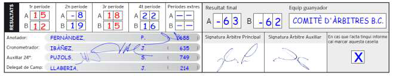

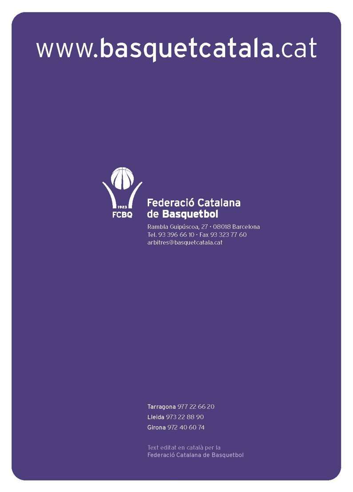
